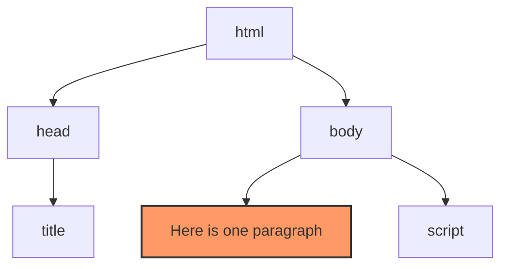

# JavaScript 4 - Document Object Model (DOM) and events

## BOM - Browser Object Model

The Browser Object Model is a collection of features that handle e.g. browser window and communication between them. BOM is not a standard, so there are small differences between different browsers.

### [window](https://developer.mozilla.org/en-US/docs/Web/API/Window)

Window interface means the browser window and is supported in all browsers. All global JavaScript objects, functions, and variables are automatically members of the window interface. E.g:

```javascript
window.document.querySelector('.button')
```

is the same as:

```javascript
document.querySelector('.button')
```

That is, most commands can be typed without the word `window`.

#### [alert](https://developer.mozilla.org/en-US/docs/Web/API/Window/alert)

The `alert()` function opens a pop-up window with text and an OK button. This can be used to give the user a notification, for example, if an operation succeeds or fails. The program will be paused until the user presses the OK button.

```javascript
alert('Some text');
```

#### [confirm](https://developer.mozilla.org/en-US/docs/Web/API/Window/confirm)

The `confirm()` function opens a pop-up window with text and two buttons: OK and Cancel. This allows the user to be asked to accept or reject an action.

```javascript
const answer = confirm('Some question');

// printing the response to the console
console.log(answer);
```

The response of the function is a boolean value which is stored in the `answer` variable: "OK" => `true` and "Cancel" => `false`.

#### [prompt](https://developer.mozilla.org/en-US/docs/Web/API/Window/prompt)

The `prompt()` function opens a pop-up window with a title and a text field for the user to type.

```javascript
const answer = prompt('Title', 'Initial content for the text field');

// printing the response to the console
console.log(answer);
```

Value of `answer` is a string in which the user's answer is stored. If the text field is empty, the value becomes _null_. The second paramater is optional. It automatically appears in the text field.

### [location-interface](https://developer.mozilla.org/en-US/docs/Web/API/location)

The `location` interface tells you the address information of the document. It is usually used to redirect the browser:

```javascript
location.href = 'http://metropolia.fi'; 
```

## DOM - Document Object Model

The Document Object Model is a tree-like description of an HTML document.


*w3schools.com*

Image abowe is a an illustration of the following HTML code:

```html
<html>
    <head>
        <title>My title</title>
    </head>
    <body>
        <h1>My header</h1>
        <a href="#">My link</a>
    </body>
</html>
```

The HTML DOM is a standard that defines how HTML elements are selected, edited, added, and deleted. All elements are treated as objects and each element, attribute and element content (e.g. text) is called a 'node'.

```html
<html>
    <head>
        <title>Example</title>
    </head>
    <body>
        <p> Here is one paragraph </p>
        <script>
            const paragraph = document.querySelector ('p'); // selects the first p-element from the document
            console.log (paragraph.innerText); // prints the text inside the p-element to the console
        </script>
    </body>
</html>
```  

The p-element selected in the example above is stored as an element object (or element node) in a variable called 'paragraph'. The 'paragraph' object can then be manipulated using the properties and methods of the [Document](https://developer.mozilla.org/en-US/docs/Web/API/Document) interface.




### Parent/child

Because the DOM describes the document as a tree-like structure, the terms parent, child, and sibling are used in this context. For example, in the figure above, the h1 element is the child of the body element and the sibling of the a-element. Correspondingly, the body element is the parent of both the h1 and a elements.

### [Document](https://developer.mozilla.org/en-US/docs/Web/API/Document)-interface

The `document` interface represents a web page, it contains all the other objects in the document. To select any HTML element from a document, you must start from the document interface. For example, `document.getElementByID('logo')`

#### Key Functions and Features

```javascript
document.querySelector('#logo') // retrieves a single element from a document using the css selector. In this case with a certain id
document.querySelectorAll('.button') // retrieves elements from a document using the css class selector.
document.getElementById('logo') // retrieves an element with a specific id from the document
document.createElement('p') // creates a new p-element, but it is not yet added to the document

// commands can also be aligned to the selected element:
element.getElementsByTagName("p") // retrieves all p-elements from the selected element
element.appendChild(child) // add child node to element
element.removeChild(child) // removes the child node from the element

element.innerHTML // The HTML code contained in the element
element.innerText // The text contained in the element
```

### Examples

1. Select the element in the document with the id 'news' and save the element node as 'u'. Then select all p-elements from the element node 'u' and save the element list as 'p':

    ```javascript
    const u = document.getElementById('news');
    const p = u.getElementsByTagName('p');
    
    // the same can also be written without an intermediate variable
    const p = document.getElementById('news').getElementsByTagName('p');
 
    // or with a single command using the CSS selector
    const p = document.querySelectorAll('#news p');
    ```

2. Select the 2nd item (i.e. `<li>`) in the list `<ul>`:

    ```html
    <ul>
      <li>First Item</li>
      <li>Second Item</li>
      <li>Third Item</li>
    </ul>
    ```

    ```javascript
    const second = document.getElementsByTagName('li')[1];  // getElementsByTagname returns an array. The indexes in an array start at zero, so 1 means the second <li> element.
    const second = document.querySelectorAll('li')[1];      // the same with querySelectorAll-function
    ```

3. Iterate all `<li>` elements using the forEach function and make the text bold. ([forEach](https://developer.mozilla.org/en-US/docs/Web/JavaScript/Reference/Global_Objects/Array/forEach) is a modern alternative to for...of)

    ```javascript
    const bullets = document.querySelectorAll('li');
    
    for (let bullet of bullets) {
        bullet.innerHTML = `<b>${bullet.innerHTML}</b>`;
    }
    
    
    // alternative syntax using array.forEach()
    /*
    bullets.forEach(function (bullet) {
      bullet.innerHTML = `<b>${bullet.innerHTML}</b>`;
    })
    */
    ```

4. List of all p-elements that have "bulletin" class:

    ```javascript
    const x = document.querySelectorAll('p.bulletin');
    ```

5. Change the content of an element:

   ```html
   <p id="date"><span class="blue">Monday</span></p>
   
   <script>
   document.getElementById('date').innerHTML = '<span class="red">Tuesday</span>';
   </script>
   ```

6. Change the value of an attribute:

   ```html
   
   
   <script>
   document.getElementById('logo').src = 'laurea.png';                 // the attribute name is used as the property
   document.getElementById('logo').setAttribute('src', 'laurea.png');  // or setAttribute() function for older browsers
   </script>
   ```

7. Adding HTML to a document:
    1. using the innerHTML feature:

       ```html
       <div id="example"></div>
       
       <script>
       const div = document.querySelector('#example');  // get element whose id is 'example'
       const html =                                     // to make a multiline string, note the backtick around the string
               `<p>
                   Here is some of text with a picture.
                   
                </p>`;
       div.innerHTML = html;  // sets the string 'html' to the HTML content of the selected element
       </script>
       ```

    1. Same with DOM functions

        ```html
        <div id="example"></div>
        
        <script>
        const div = document.querySelector('#example'); // get element whose id is 'example'

        const i = document.createElement('img');        // create img element
        i.src = 'https://via.placeholder.com/320';      // set src attribute
        i.alt = 'Cat';                                  // set alt attribute
        
        const t = document.createTextNode('Here is some of text with a picture.');  // create text node

        const p = document.createElement('p');          // create p element
        p.appendChild(t);                               // add text to p element
        p.appendChild(i);                               // add image to p element

        div.appendChild(p);                             // add p element to the selected element from the HTML document
                                                        // at this point new HTML will appear in the document.
        </script>
        ```

### CSS handling

JavaScript can also be used to customize the appearance of elements. The alternatives in this case are to either change the values of the style attribute or the class attributes, as is normally the case in HTML documents.

Editing the Style attribute i.e. inline method:

```html
<p style="background-color: #ccc; padding: 1rem;" id="paragraph">Some text</p>

<script>
document.querySelector('#paragraph').style = "color: #eee; background-color: #222; padding: 3rem;";
</script>
```
Edit the Class attribute:
```css
/* external css-file */
.red {
    color: #f00;
}

.blue {
    color: #00f;
}
```

```html
<p class="red" id="paragraph">Some text</p>

<script>
// Toggle red on or off
document.querySelector('#paragraph').classList.toggle('red');
// Replace red with blue
document.querySelector('#paragraph').classList.replace('red', 'blue');
</script>
```

For more methods for handling class attributes, see [classList documentation](https://developer.mozilla.org/en-US/docs/Web/API/Element/classList).

## Events

Because JavaScript is used to add interactivity to a website, there is a need for some way to respond to actions and events performed by the user or on the system. This method is called [event handling.](https://developer.mozilla.org/en-US/docs/Learn/JavaScript/Building_blocks/Events)

For example, if a user clicks a button, we can respond by displaying an information box:

```html
<button>Click me</button>
<script>
const button = document.querySelector('button');
button.addEventListener('click', function(evt){
  alert('Element ' + evt.currentTarget.tagName + ' was clicked');
});
</script>
``` 

In the code above, the first parameter 'click' of the `addEventListener` method is an **event**, and the second parameter is the function to be called when a 'click' occurs. The second parameter can also be a reference to a function:

```html
<button>Click me</button>
<script>
const button = document.querySelector('button');

function popup(evt){
  alert('Element ' + evt.currentTarget.tagName + ' was clicked');
}

button.addEventListener('click', popup);
</script>
``` 

Note that the `popup` function in `addEventListener` is missing parentheses. This is because the `popup` function is used as an event handler and is not called immediately, but only when a 'click' occurs. If it had parentheses, the function would be started immediately. 

The event handler is called a **callback function** which means a function that is passed as an argument to another function and is called when a certain event occurs. Callback functions are used in many places in JavaScript, not just in event handling. This concept is called "asynchronous programming" and is a fundamental part of JavaScript. [Read more about callback functions](https://developer.mozilla.org/en-US/docs/Learn_web_development/Extensions/Async_JS/Introducing#callbacks).

The event handler receives an [event object](https://developer.mozilla.org/en-US/docs/Web/API/Event) (evt) that contains information about the event, such as the type of event and its target. For example, `evt.currentTarget` returns the element that is the target of the event.
In the example code above, this item is the `<button>` element.

[Study this list of events](https://developer.mozilla.org/en-US/docs/Web/Events). Most important at this point are the [mouse related events](https://developer.mozilla.org/en-US/docs/Web/API/Element#mouse_events).

### Syntax

Three different syntaxes can be used in event handling.

#### Old (90s)

Inline syntax where the event handler is specified in the HTML code. **This method should be avoided**. Admittedly, some frameworks and libraries, such as Angular and React, use a syntax like this, but they are special cases.

```html
<button onclick="popup()">Click me</button>
<script>
function popup(evt){
  alert('Element' + evt.currentTarget + ' was clicked');
}
</script> 
```

### Traditional (2000s)

[Onevent properties](https://developer.mozilla.org/en-US/docs/Web/Events/Event_handlers#using_onevent_properties) are a handy way to do transaction processing. They are recommended for use only in the simplest applications but in general, **they are not recommended for use in modern web development**.

```html
<button>Click me</button>
<script>
const button = document.querySelector('button');

function popup(evt){
  alert('Element' + evt.currentTarget + ' was clicked');
}

button.onclick = popup;
</script>
```

### Modern (present)

Just like we used in the first event examples, the [addEventListener](https://developer.mozilla.org/en-US/docs/Web/API/EventTarget/addEventListener) function method is recommended for most applications. It can be used to add more than one event handler to the same event, or the event can be canceled at different stages of the application as needed using the [removeEventListener](https://developer.mozilla.org/en-US/docs/Web/API/EventTarget/removeEventListener) function.
Such a function may be required, for example, when you want the first click of a button to perform function A and the second click to perform function B:

```html
<button>Click me</button>
<script>
    const button = document.querySelector('button');

function A(evt){
  alert('This is function A');
  button.removeEventListener('click', A);
  button.addEventListener('click', B);
}

function B(evt){
  alert('This is function B');
}

button.addEventListener('click', A);
</script>
```

## Reading input values using HTML forms

[HTML forms](https://developer.mozilla.org/en-US/docs/Web/HTML/Reference/Elements/form) are used to collect user input. They provide a more sophisticated way to collect user input than just using `prompt()` function. Forms can contain various types of input elements, such as text fields, checkboxes, radio buttons, and submit buttons:

```html
<form action="#"> <!-- action attribute specifies where to send the form data when the form is submitted. In this case, it is set to "#" which means that the form will not be sent anywhere. -->

    <!-- Text input -->
    <label for="name">Name:</label><br>
    <input type="text" id="name" name="name"><br><br>

    <!-- Email input -->
    <label for="email">Email:</label><br>
    <input type="email" id="email" name="email"><br><br>

    <!-- Password input -->
    <label for="password">Password:</label><br>
    <input type="password" id="password" name="password"><br><br>

    <!-- Number input -->
    <label for="age">Age:</label><br>
    <input type="number" id="age" name="age"><br><br>

    <!-- Date input -->
    <label for="date">Date:</label><br>
    <input type="date" id="date" name="date"><br><br>

    <!-- Radio buttons -->
    <p>Gender:</p>
    <input type="radio" id="male" name="gender" value="male">
    <label for="male">Male</label><br>
    <input type="radio" id="female" name="gender" value="female">
    <label for="female">Female</label><br><br>

    <!-- Checkbox -->
    <input type="checkbox" id="subscribe" name="subscribe">
    <label for="subscribe">Subscribe to newsletter</label><br><br>

    <!-- Dropdown -->
    <label for="country">Country:</label><br>
    <select id="country" name="country">
      <option value="fi">Finland</option>
      <option value="pl">Poland</option>
      <option value="es">Spain</option>
    </select><br><br>

    <!-- Textarea -->
    <label for="message">Message:</label><br>
    <textarea id="message" name="message" rows="4" cols="30"></textarea><br><br>

    <!-- Submit button -->
    <input type="submit" value="Send">
</form>
```

The form elements can be selected, read, and manipulated with JavaScript just like any other HTML element. In this course, we will use forms only to read text input and use it in our JavaScript code. 

### Stopping default action of an event

Some elements, such as `<a>` or `<form>`, have default actions for events. For example, clicking on an `<a>` element will take you to the address specified by the `href` attribute, or the` <form> `element will open the address specified in the `action` attribute when sent. In some cases, you want to interrupt these default actions.

For example, HTML forms work by having a user fill out a form, after which they press a submit button. At this point, the browser sends the information to the address specified in the action attribute (i.e., sends an HTTP request) and at the same time opens that address in a browser window (i.e., receives an HTTP response). Modern web applications want to prevent this from happening, so you don't want to go to a new page every time you submit a form. An example is sending messages on Facebook. To stop an element's standard event, use the [preventDefault](https://developer.mozilla.org/en-US/docs/Web/API/Event/preventDefault) function:

```html
<form>
  <div>
    <input name="fName" type="text" placeholder="first name">
  </div>
  <div>
    <input name="lName" type="text" placeholder="last name">
  </div>
  <div>
    <input name="submit" type="submit" value="Send">
  </div>
</form>
<p></p>

<script>
// select the elements
const form = document.querySelector('form');
const fname = document.querySelector('input[name=fName]');
const lname = document.querySelector('input[name=lName]');
const p = document.querySelector('p');

// When the form is submitted...
form.addEventListener('submit', function(evt) {
    // ... prevent the default action.
    evt.preventDefault();
    // Here you can check, for example, whether the fields on the form have been filled in correctly,
    // after which it could be sent using the fetch method, for example
    // However, for now, let's print the user input as an example.
    p.innerText = `Your name is ${fname.value} ${lname.value}`;
});
</script>
```

---

<!-- add mermaid support for gh pages -->
<script type="module">
    Array.from(document.getElementsByClassName("language-mermaid")).forEach(element => {
      element.classList.add("mermaid");
    });
    import mermaid from 'https://cdn.jsdelivr.net/npm/mermaid@11/dist/mermaid.esm.min.mjs';
    mermaid.initialize({startOnLoad: true});
</script>
