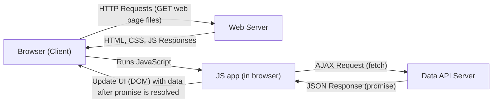
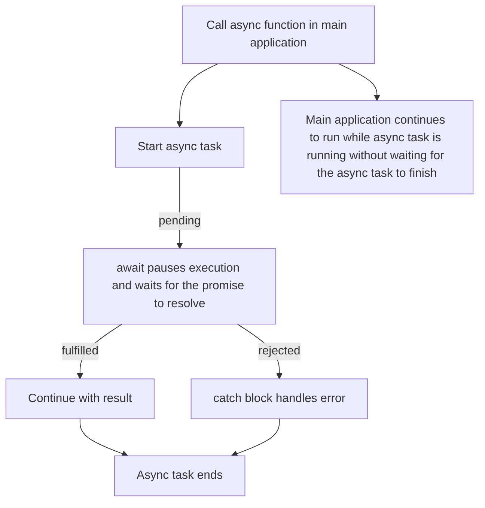

# JavaScript 5 - Asynchronous programming, AJAX and Open application programming interfaces

## Asynchronous JavaScript

In previous JavaScript lessons, we have been writing mostly synchronous code. This means that the code is executed line by line, and the next line of code is not executed until the previous line has finished executing. With _events_ we used _callback_ functions that are called when the event occurs, not immediately when the code is executed. This is an example of asynchronous programming. Asynchronous programming allows us to write code that can run in the background while other code is still running normally.

Other example of asynchronous programming are timers. With [`setTimeout`](https://www.geeksforgeeks.org/javascript/settimeout-in-javascript/) and [`setInterval`](https://www.geeksforgeeks.org/javascript/javascript-setinterval-method/) functions we can schedule code to run after a certain amount of time has passed. This allows us to run code at regular intervals. Callback functions are used with timers as well. The callback function is called when the timer expires:

```javascript
setTimeout(function() {
  console.log("This message is printed once after 2.5 seconds");
}, 2500);

setInterval(function() {
  console.log("This message is printed every 5 seconds");
}, 5000);
```

Because the execution environment of JavaScript is single-threaded, time-consuming operations cannot be waited synchronously, i.e., so that a single thread waits for the execution of the call, in which case the program does nothing else and is unresponsive. This would be a bad user experience. For this reason, in JavaScript, many things, such as network requests and file processing, are done asynchronously.

## AJAX - Asynchronous JavaScript and XML

Ajax is a technique for making asynchronous network requests from a web page. This allows us to retrieve data from a server without having to reload the page. This is done using the [`fetch`](https://developer.mozilla.org/en-US/docs/Web/API/Fetch_API/Using_Fetch) function, which is a modern way to make network requests in JavaScript. The `fetch` function returns a promise, which is an object that represents the eventual completion (or failure) of an asynchronous operation and its resulting value.



Tradionally, [XML](https://www.w3schools.com/xml/xml_whatis.asp) was used as the data format for AJAX requests, but nowadays JSON is more commonly used.

[JSON](https://www.w3schools.com/whatis/whatis_json.asp) is a lightweight data format that is easy to read and write, and it is supported by most programming languages. JSON stands for JavaScript Object Notation, and it is a way to represent data as a JavaScript object. For example, the following JSON data represents a person:

```json
{
  "name": "John Doe",
  "age": 30,
  "email": "john.doe@example.com"
}
```

Promises are a way to handle asynchronous operations in JavaScript. A promise can be in one of three states: pending, fulfilled, or rejected. When a promise is fulfilled, it means that the asynchronous operation has completed successfully and the promise has a value. When a promise is rejected, it means that the asynchronous operation has failed and the promise has a reason for the failure.



For example, we can fetch data from a server like this by using an asynchronous function:

```javascript
async function fetchData() {
  try {
    const response = await fetch('https://api.tvmaze.com/search/shows?q=emmerdale');
    if (!response.ok) { // Check if the response is successful (status code 200-299)
      throw new Error('HTTP error! status: ' + response.status);
    }
    const data = await response.json();
    console.log('Fetched data:', data);
    return data; // This will return a promise that resolves to the data
  } catch (error) {
    console.error('Error fetching data:', error);
  }
}
fetchData();
console.log('This message is printed before the data is fetched');
```

Function makes an http request to the specified URL which in this case is `https://api.tvmaze.com/search/shows?q=emmerdale`. It gets data about TV shows that match the search term "emmerdale" from open TV show database API called [TVMaze](https://www.tvmaze.com/api). Read more about APIs [below](#application-programming-interface-api).

The `await` keyword is used to wait for the promise returned by `fetch` to be resolved. Once the promise is resolved, we can access the response and read it as JSON format. The `response.json()` method is used to parse the response as JSON, and it also returns a promise. We use `await` again to wait for the JSON conversion to complete before logging the data to the console as a JavaScript object.

This example also demonstrates the use of `try...catch` block to handle errors that may occur during the asynchronous operation. If the fetch request fails, the error will be caught and logged to the console. If the network request is successful but the response status code indicates an error (e.g., 404 or 500), we `throw` an error to be caught in the catch block.

If asynchronous function returns a value, it is wrapped in a promise. This means that we can use `await` to wait for the value to be returned from the asynchronous function (this example uses previously defined `fetchData()`):

```javascript
async function main() {
  const data = await fetchData(); // Wait for the promise returned by fetchData to resolve
  console.log('Data from fetchData function:', data);
}
main();
```

There is also another (traditional) way to handle promises without using the modern `async/await` syntax. We can use the `then` method of the promise to handle the resolved value and the `catch` method to handle any errors:

```javascript
fetch('https://api.tvmaze.com/search/shows?q=emmerdale')
  .then(response => response.json()) // Parse the response as JSON
  .then(data => {
    console.log('Fetched data:', data); // Log the fetched data
  })
  .catch(error => {
    console.error('Error fetching data:', error); // Handle any errors that occur during the fetch
  });
```

The `async/await` syntax is preferred for its readability and ease of use, especially when dealing with multiple asynchronous operations.

---

## Application Programming Interface (API)

Application programming interface is a definition according to which different programs can make requests and exchange information, i.e. talk to each other. The API is kind of an interpreter between two different systems. For example, the JavaScript [Geolocation API](https://developer.mozilla.org/en-US/docs/Web/API/Geolocation/Using_geolocation) retrieves device location information from the operating system and translates it into a format suitable for JavaScript.

### Open APIs

The open application programming interface is a kind of data warehouse that can be read over the Internet. The open application programming interface can be a data-only interface that can only read data (e.g. [OpenWeatherMap](https://openweathermap.org/current)) or a functional interface that can also be used to store and edit data (e.g. [X API](https://docs.x.com/x-api/)). Open APIs are often used to provide data for web applications by using HTTP requests, but they can also be used for other purposes, such as machine learning and data analysis.

- [List of open application programming interfaces](https://rapidapi.com/hub)
- [List of Finnish open application programming interfaces](https://www.avoindata.fi/en)

Open application programming interfaces are plentiful and most of them are well documented today. Many of the interfaces require some form of registration before they can be used. In addition, they can be tested before implementation.

A very handy tool for testing is [Postman](https://www.postman.com/downloads/). It allows interfaces on the Internet to be tested without writing a single line of code.

Learn more about open APIs by [watching this video](https://www.youtube.com/watch?v=dStT9v5y6Tc).

### An example application that uses the OpenChargeMap interface

- [Source code](https://github.com/ilkkamtk/sahkoauto)
- [Link to the app](https://users.metropolia.fi/~ilkkamtk/sahkoauto/)

### Some examples of using APIs

- [Link](api-examples/README.md)

# AJAX - Asynchronous JavaScript and XML

## A typical AJAX application
Because the Ajax application dynamically modifies Web pages without the user having to navigate from one page to another, the operation of the Web application can be made to resemble that of standard desktop programs, such as Google Docs. Facebook is also a good example of an AJAX app.

### A = Asynchronous
Because the execution environment of JavaScript is single-threaded, time-consuming operations cannot be waited synchronously, i.e., so that a single thread waits for the execution of the call, in which case the program does nothing else.
For this reason, in JavaScript, many things, such as AJAX calls and file processing, are done asynchronously.

#### Asynchronous AJAX-request
```javascript
    'use strict';
    console.log('the script starts');

    function synchronousFunction() {
      let number = 1;
      for(let i = 1; i < 100000; i++){
        number += i;
        console.log('synchronousFunction running');
      }
      console.log('regular function complete', number);
    }

    async function asynchronousFunction() {                 // asynchronous function is defined by the async keyword
        console.log('asynchronous download begins');
        try {                                               // error handling: try/catch/finally
            const response = await fetch('http://127.0.0.1:3000/airport/00A');    // starting data download, fetch returns a promise which contains an object of type 'response'
            const jsonData = await response.json();          // retrieving the data retrieved from the response object using the json() function
            console.log(jsonData.ICAO, jsonData.Name);    // log the result to the console
        } catch (error) {
            console.log(error.message);
        } finally {                                         // finally = this is executed anyway, whether the execution was successful or not
            console.log('asynchronous load complete');
        }
    }

    synchronousFunction();
    asynchronousFunction();

    console.log('the script ends');
```
##### Task: Try the script above. Use the URL of assignment 2 of Python module 13 ([Finnish](https://github.com/vesavvo/Python_Ohjelmistoteema/blob/main/Teht%C3%A4v%C3%A4t.md#13-taustapalvelun-ja-rajapinnan-rakentaminen) or [English](https://github.com/vesavvo/Python_Ohjelmistoteema/blob/main/English/Exercises.md#13-setting-up-a-backend-service-with-an-interface)).
   - First install Flask-CORS extension to your Python app. 
   - Example: https://gist.github.com/ilkkamtk/26ba4289a3b1bb26b3ff002570c79ec5
   - The code above should log to the console:
   ```text
    the script starts
    regular function complete 49999999990067860000
    asynchronous download begins
    the script ends
    00A Total Rf Heliport
    asynchronous download complete
   ```
   - Also look at the Network tab in the developer tools and reload the page. You will notice that the loading of URL will not begin until the standard function has finished executing.

#### Here is the same example, but this time the airport code is entered by using a form.
```html
<form id="airport-form">
    <input name="icao" type="text" placeholder="Enter airport icao code">
    <input name="submit" type="submit" value="Send">
</form>

<script>
'use strict';

// When the form is submitted...
const airportForm = document.querySelector('#airport-form')
airportForm.addEventListener('submit', async function(evt) {
    // ... prevent the default action.
    evt.preventDefault();
    // get value of input element
    const code = document.querySelector('input[name=icao]').value;
    try {                                               // error handling: try/catch/finally
        const response = await fetch(`http://127.0.0.1:3000/airport/${code}`);    // starting data download, fetch returns a promise which contains an object of type 'response'
        const jsonData = await response.json();          // retrieving the data retrieved from the response object using the json() function
        console.log(jsonData.ICAO, jsonData.Name);    // log the result to the console
    } catch (error) {
        console.log(error.message);
    }
});
</script>
```

## J = JavaScript
In AJAX, JavaScript is used to display downloaded data in an HTML document.

## X = XML, eXtensible Markup Language
XML is a markup language, like HTML. It is intended for storing and transferring data. A typical XML document looks like this:
```xml
<?xml version="1.0" encoding="UTF-8"?>
<images>
    <picture>
        <name> Sleeping cat </name>
        <description> In this picture, the cat is sleeping. </description>
        <address> http://placecats.com/321/241 </address>
    </picture>
    <picture>
        <name> Lying cat </name>
        <Description> In this picture, the cat is lying. </Description>
        <address> http://placecats.com/421/251 </address>
    </picture>
</images>
```
Around the mid-2000s, when AJAX functionality was added to JavaScript, XML was a natural alternative to use for data transfer.
Creating XML documents on a server, and especially reading / parsing them on the client end with JavaScript, is reasonably cumbersome compared to current technologies.

## [JSON](http://json.org), JavaScript Object Notation
JSON, or JavaScript Object Notation, is a popular markup language commonly used for communication between browsers and servers, and especially in Ajax applications. Today, Ajax applications mostly use JSON instead of XML. Although JSON uses JavaScript data structures to represent data, it is still compatible with other languages. Using JSON in both server and browser programming is usually much simpler than XML. E.g:

```json
[
  {
    "name": "Sleeping cat",
    "description": "In this picture the cat is sleeping.",
    "address": "http://placecats.com/321/241"
  },
  {
    "name": "Sleeping cat",
    "description": "In this picture the cat is lying.",
    "address": "http://placecats.com/421/251"
  }
]
```
The example above describes an array (square brackets []) that contains two objects (braces {}). In this example, the data of the second picture is retrieved and displayed in an HTML document:
```html
<figure>
    
    <figcaption></figcaption>
</figure>

<script>
        // simplified example without error handling
        async function showPics() {
            const response = await fetch('pics.json');              // starts the download.
            const images = await response.json();                     // convert the loaded text JSON into a JavaScript object / array
            
            const name = images[1].name;     // the 'name' property of the second object in the 'images' array
            const description = images[1].description; // 'description' property of the second object object in the 'images' array
            const address = images[1].address; // 'address' property of the second object object in the 'images' array
    
            document.querySelector('img').src = address;
            document.querySelector('img').alt = name;
            document.querySelector('figcaption').innerText = description;
            
        }

        showPics(); // call function to start download
</script>
```


## [promise](https://developer.mozilla.org/en-US/docs/Web/JavaScript/Reference/Global_Objects/Promise)
A promise is an object that may produce a single value some time in the future: either a resolved value, or a reason that it's not resolved (e.g., a network error occurred). A promise may be in one of 3 possible states: fulfilled, rejected, or pending.


In newer versions of JavaScript, promise is increasingly used instead of [callback functions](extras.md#callback-functions-and-callback-hell). A promise is an object that ‘promises’ to return value.
The advantages of the promise are e.g. simpler syntax and easier error handling. For example, to submit a form using the fetch method:
```html
<form>
  <div>
    <input name="fName" type="text" placeholder="first name">
  </div>
  <div>
    <input name="lName" type="text" placeholder="last name">
  </div>
  <div>
    <input name="submit" type="submit" value="Send">
  </div>
</form>
<script>
// When the form is submitted...
document.addEventListener('submit', async function(evt) {
    // ... prevent the default action.
    evt.preventDefault();
    // create an object 'data' to which user input from the form is added and the http method is set to POST
    const data = {
        body: JSON.stringify({
            fname: document.querySelector('input[name=fName]').value,
            lname: document.querySelector('input[name=lName]').value
        }),
        method: 'POST',
        headers: {
              'Content-type': 'application/json',
        },
    }
    // send the data
   try {
      const response = await fetch('/someAddressWhereDataIsSent', data);  // Send data to server and receive a server response
      if (!response.ok) throw new Error('Invalid input!');         // If an error occurs, an error message is thrown
      const json = await response.json();                                 // convert the loaded text JSON to a JavaScript object / array
      console.log('result', json);                                        // print the result to the console
   } catch (e) {
      console.log('error', e);
   }
});
</script>
```
`fetch()` and `json()` functions both return a promise. Hence, you need use the await keyword to wait for the promise to be fulfilled. In this case that means that the data has been loaded.


## [Fetch API](https://developer.mozilla.org/en-US/docs/Web/API/Fetch_API/Using_Fetch)
Fetch is a promise-based way to make Ajax applications. Compared to the original [XMLHTTPRequest object](https://developer.mozilla.org/en-US/docs/Web/API/XMLHttpRequest), Fetch is more powerful, more flexible, and simpler in larger applications because it does not have to deal with so-called callback hell and handling errors is easier. 

The ES8 version of JavaScript introduced the syntax of [async / await](https://developer.mozilla.org/en-US/docs/Web/JavaScript/Reference/Statements/async_function) to simplify the use of promises and especially error handling. With Async / await syntax, functions that return a promise are handled in much the same way as any other function. The difference is that the function that returns the promise must be written inside another asynchronous (async) function. In addition, await is written in front of the function call. Here's the above example using async / await syntax, but now with [try...catch](https://developer.mozilla.org/en-US/docs/Web/JavaScript/Reference/Statements/try...catch) error handling.
```html
<figure>
    
    <figcaption></figcaption>
</figure>

<script>   
    async function showPics() {  
        try{
           const response = await fetch('pics.json');              // The download is started.
           if (!response.ok) throw new Error('Invalid input!'); // If an error occurs, an error message is thrown
           const images = await response.json();                     // convert the loaded text JSON to a JavaScript object / array
           const name = images[1].name;     // the 'name' property of the second object in the 'images' array
           const description = images[1].description; // 'description' property of the second object object in the 'images' array
           const address = images[1].address; // 'address' property of the second object object in the 'images' array

           document.querySelector('img').src = address;
           document.querySelector('img').alt = name;
           document.querySelector('figcaption').innerText = description;
        } catch (error) {                                          // catch the thrown error message
          console.log(error.message)
        }                  
     }

    showPics();
</script>
```
