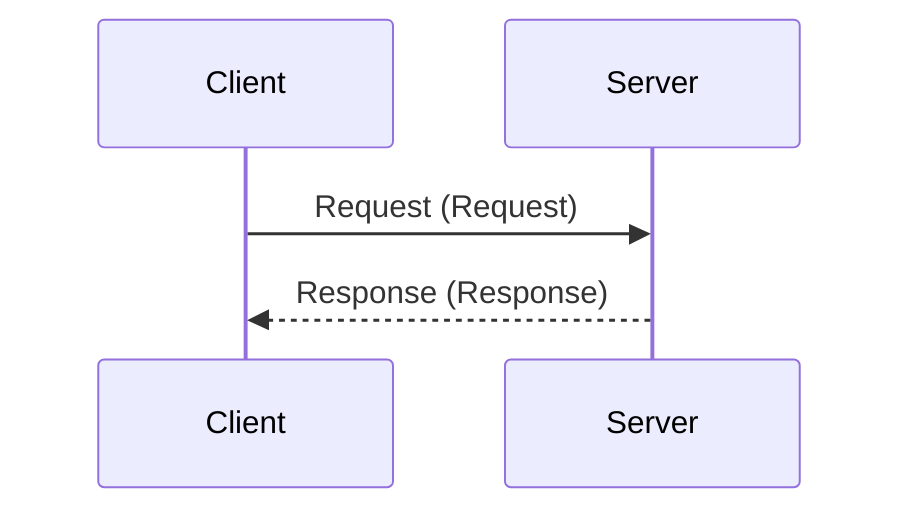
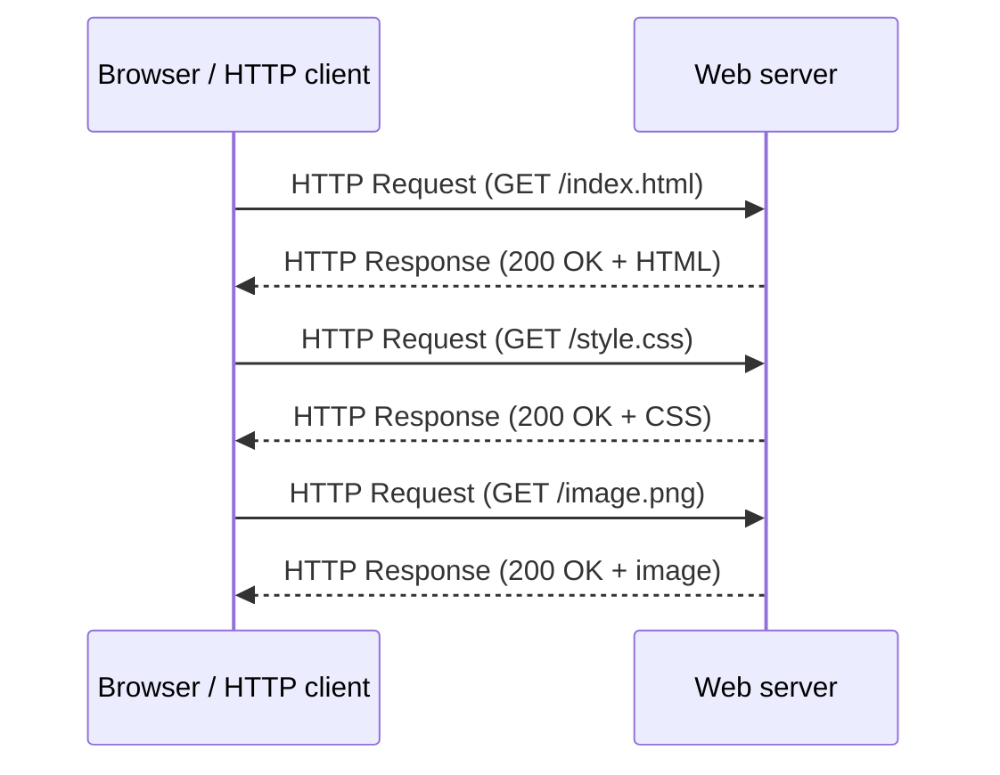
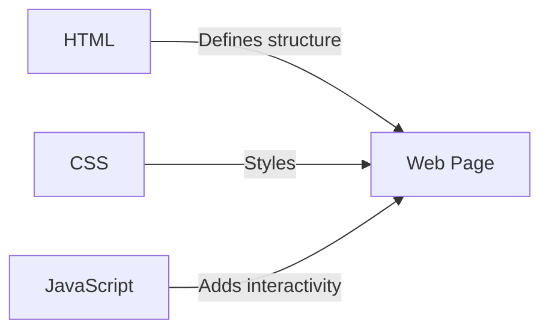
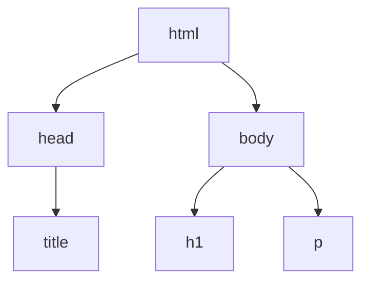

# Introduction to Web technologies

## Data transfer in Internet

Let us first examine what happens when computers connected to the Internet communicate with each other. This provides us the foundations for understanding and implementing cross-device communication.

Data communication in the Internet is based on client-server model. A computer that is connected to the Internet, waiting for other computers to connect to it, is called a server. In practice, a computer becomes a server when in runs a dedicated server application that instructs the computer to wait for upcoming connections.

Informally, when we talk about servers, we may mean:

- a computer connected to the Internet that acts as a server, or
- a server application that runs in a server computer.

In accordance with the client-server model, the computer that initiates a connection to the server machine (and the server application therein) first sends a request. The server handles the request and provides a response:



- **Clients** are the typical web user's internet-connected devices (for example, your computer connected to your Wi-Fi, or your phone connected to your mobile network) and web-accessing software available on those devices (usually a web browser like Firefox or Chrome).
- **Servers** are computers that store webpages, sites, or apps. When a client wants to access a webpage, a copy of the webpage code is downloaded from the server to the client machine, where it is rendered by the browser and displayed to the user.

Can you think of other everyday examples of network clients we use?

Web development includes also the development of server applications, but in this course we will focus on the client side development for the web browser. The client side is what the user interacts with and sees in their web browser.

## World Wide Web (WWW)

The retrieval of web pages follows the client-server model. As you write a web address into the browser's address bar (or click a link on a web page), a request is sent to the web server. The web server then sends an HTML file describing the web page as a response. If the web page requires additional resources (such as images or stylesheets), new requests are generated, and the requested resources are received as responses:



HTML, CSS and JavaScript are the core technologies of the World Wide Web. They are used to create and design web pages and web applications.



**Read & study**: [How browsers load websites](https://developer.mozilla.org/en-US/docs/Learn_web_development/Getting_started/Web_standards/How_browsers_load_websites).

---

### Hypertext Transfer Protocol (HTTP)

HTTP is the protocol used for communication between clients and servers on the web. It is a request-response protocol, which means that the client sends a request to the server, and the server responds with a response. HTTP is a stateless protocol, which means that each request is independent of the previous requests. HTTP is also a text-based protocol, which means that the requests and responses are sent as plain text.

You can see all the details of the HTTP communication between the client and the server in the browser's developer tools (usually accessible with F12 or right-click -> Inspect). The Network tab shows all the requests and responses, and you can click on each request to see the details of the request and response headers, as well as the request body and response body.

#### HTTP request example

```http
POST /index.html HTTP/1.1
Host: example.com
User-Agent: Mozilla/5.0 (Windows NT 10.0; Win64; x64) AppleWebKit/537.36 (KHTML, like Gecko) Chrome/91.0.4472.124 Safari/537.36
Accept: text/html,application/xhtml+xml
Accept-Language: en-US,en;q=0.9
Content-Type: application/json

{"username": "frank", "password": "12345"}
```

- **POST**: The HTTP method used to send data to the server.
- **/index.html**: The path of the resource we want to retrieve.
- **HTTP/1.1**: The version of the HTTP protocol being used.
- **Host: example.com**: The hostname of the server where the resource is located.
- **User-Agent**: The user agent string identifying the client.
- **Accept**: The types of content the client can understand.
- **Accept-Language**: The preferred languages for the response.
- **Content-Type**: Tell what kind of data is in the body.
- **Body**: for sending data with POST and PUT methods

Request methods are used to indicate the desired action to be performed on the identified resource. The most common HTTP methods are:

- **GET**: Retrieve data from the server (e.g. html files, css files, javascript files, image files, etc.).
  - This is the method we are mostly using when we access web pages.
- **POST**: Send data to the server to create a new resource (e.g., submitting a form).
- **PUT**: Update an existing resource on the server.
- **DELETE**: Remove a resource from the server.

#### HTTP response example

```response
HTTP/1.1 200 OK
Server: Apache/2.4.41 (Unix)
Content-Type: text/html
Content-Length: 1234
Date: Sat, 10 Jun 2023 15:30:00 GMT

<!DOCTYPE html>
<html>
<head>
  <title>Example Website</title>
</head>
<body>
  <h1>Welcome to the Example Website!</h1>
  <p>This is the content of the index.html file.</p>
</body>
</html>
```

- **HTTP/1.1 200 OK**: Successful response with status code 200 and message OK.
- **Server: Apache/2.4.41 (Unix)**: Server software and version.
- **Content-Type: text/html**: Content type of the response is HTML.
- **Content-Length: 1234**: Length of the response content in bytes.
- **Date: Sat, 10 Jun 2023 15:30:00 GMT**: Date and time of response generation.
- **Response Body**: The body of the HTTP response comes after two line brakes and contains the actual content being sent back to the client.

---

[More about HTTP](https://developer.mozilla.org/en-US/docs/Web/HTTP/Overview)

---

### Hypertext Markup Language (HTML)

This is just a very brief introduction to HTML. It's covered in more detail in the self-study material for the first weeks.

#### What is HTML?

- HTML stands for HyperText Markup Language.
- It is based on XML (eXtensible Markup Language) which is a markup language that defines a set of rules for encoding documents in a format that is both human-readable and machine-readable.
- It is the building block of the World Wide Web.
- Hypertext is text displayed on a computer or other electronic device that contains references to other text that is immediately accessible to the user.
- Hypertext can contain tables, lists, forms, images, and other presentation elements.
- HTML is an easy-to-use and flexible form for sharing information over the Internet.

#### What can you do with HTML?

- Publish documents online with text, images, lists, spreadsheets, and more.
- Access online resources such as images, videos, or other HTML documents through hyperlinks.
- Create forms to collect user input, such as name, email address, comments, etc.
- Include images, videos, sound clips, applications, and other HTML documents directly in the HTML document.
- Create an offline version of your website that works without the Internet (Progressive Web App).
- Save the information to the user's web browser and access it later.

#### Example HTML Document

```html
<!DOCTYPE html>
<html>
  <head>
    <title>Page Title</title>
  </head>
  <body>
    <h1>This is a Heading</h1>
    <p>This is a paragraph.</p>
  </body>
</html>
```

- File extension for HTML files is `.html` or `.htm`. The main file of a website is usually named `index.html`.
- The first line `<!DOCTYPE html>` is the document type definition (DTD).
- HTML consists of HTML elements that consist of tags and content.
- Tags consist of a keyword surrounded by angle brackets. E.g `<html>`, `<head>`, `<body>`, `<title>`, `<p>`, and so on.
- The `<head>` element gathers elements that provide information about the document.
- The `<body>` element contains the actual content of the document.

Browser generates a DOM (Document Object Model) tree based on the HTML document. The DOM is a programming interface for HTML and XML documents. It represents the page so that programs can change the document structure, style, and content dynamically. The DOM is an object-oriented representation of the web page, which can be modified with a scripting language such as JavaScript.

For example, the above HTML document would generate the following DOM tree:



We will study the DOM in more detail in the next weeks when we learn JavaScript.

#### HTML Attributes

- Attributes contain additional information that you don't want to appear in the actual content.
- Attribute structure: Attribute name followed by = The attribute value wrapped in quotation marks.

##### Example: HTML Links

- HTML links are hyperlinks.
- You can click on a link and jump to another document or another place in the same document.
- When you move the mouse over a link, the mouse arrow will turn into a little hand.
- Links are defined with the `<a>` tag.
- The `href` attribute specifies the URL of the page the link goes to.
- The content of the link element is "Visit W3Schools.com!" which is what the user sees and clicks on.

```html
<a href="https://www.w3schools.com">Visit W3Schools.com!</a>
```

#### Empty HTML Elements

- Some elements are not supposed to have any content. They are called ‘empty’ elements.
- For example `` element for displaying images contains two attributes but no content and no closing tag (`</img>`)
  - The `` tag is used to embed an image in an HTML page.
  - Images are not technically inserted into a web page; images are linked to web pages. The `` tag creates a holding space for the referenced image.
  - The `` tag has two required attributes: `src` and `alt`.
  - The `src` attribute specifies the path to the image.
  - The `alt` attribute specifies an alternate text for the image, if the image for some reason cannot be displayed.
  - ``is an empty element, which means that it contains attributes only and has no closing tag.
  - Example:

    ```html
    
    ```

#### Special Characters

- Some characters like `<`, `>`, `&`, and `"` are used in HTML syntax.
- To include the special characters to your document content, you may use [HTML Entities](https://www.w3schools.com/html/html_entities.asp) like: `&lt;`, `&gt;`, `&amp;`, and `&quot;`.

#### Metadata in HTML

- The `<head>` element may contain metadata about the document.
- Metadata is data about the HTML document. Metadata is not displayed.
- Metadata is used by browsers (how to display content), search engines (keywords), and other web services.
- You can use the `<meta>` tag to specify metadata.
  - For example Facebook uses the `<meta>` tag to specify the title, description, and image for a page:

  ```html
  <meta property="og:title" content="The Rock" />
  <meta
    property="og:description"
    content="The Rock is a 1996 action film that primarily takes place on Alcatraz Island, and the San Francisco Bay area. It was directed by Michael Bay, produced by Don Simpson and Jerry Bruckheimer."
  />
  <meta
    property="og:image"
    content="http://ia.media-imdb.com/images/rock.jpg"
  />
  ```

#### HTML Tables

- The `<table>` tag defines an HTML table.
- Each table row is defined with a `<tr>` tag. Each table header is defined with a `<th>` tag. Each table data/cell is defined with a `<td>` tag.
- By default, the text in `<th>` elements are bold and centered.
- By default, the text in `<td>` elements are regular and left-aligned.
- Example:

```html
<table style="width:100%">
  <tr>
    <th>Firstname</th>
    <th>Lastname</th>
    <th>Age</th>
  </tr>
  <tr>
    <td>Jill</td>
    <td>Smith</td>
    <td>50</td>
  </tr>
  <tr>
    <td>Eve</td>
    <td>Jackson</td>
    <td>94</td>
  </tr>
</table>
```

Creates following table:

<table style="width:100%">
  <tr>
    <th>Firstname</th>
    <th>Lastname</th>
    <th>Age</th>
  </tr>
  <tr>
    <td>Jill</td>
    <td>Smith</td>
    <td>50</td>
  </tr>
  <tr>
    <td>Eve</td>
    <td>Jackson</td>
    <td>94</td>
  </tr>
</table>

---

#### HTML Lists

- HTML lists are used to present list of information in well-formed and semantic way.
- There are three different types of lists in HTML:
  - Unordered list: A list of items in which the order does not explicitly matter.
  - Ordered list: A list of items in which the order does explicitly matter.
  - Description list: A list of items in which a term is followed by a definition.
  - Example:

```html
<ul>
  <li>Coffee</li>
  <li>Tea</li>
  <li>Milk</li>
</ul>
<ol>
  <li>Coffee</li>
  <li>Tea</li>
  <li>Milk</li>
</ol>
<dl>
  <dt>Coffee</dt>
  <dd>- black hot drink</dd>
  <dt>Milk</dt>
  <dd>- white cold drink</dd>
</dl>
```

Creates following lists:

<ul>
  <li>Coffee</li>
  <li>Tea</li>
  <li>Milk</li>
</ul>
<ol>
  <li>Coffee</li>
  <li>Tea</li>
  <li>Milk</li>
</ol>
<dl>
  <dt>Coffee</dt>
  <dd>- black hot drink</dd>
  <dt>Milk</dt>
  <dd>- white cold drink</dd>
</dl>

---

#### Validation

- HTML validation is the process of ensuring that the HTML code is error-free.
- It checks the code for syntax errors, and it checks the code for compliance with the standards set by the W3 Consortium.
- You can validate your HTML code using the W3C Markup Validation Service: <https://validator.w3.org/>

---

### Cascading Style Sheets (CSS)

This is just a very brief introduction to CSS. It's covered in more detail in the self-study material for the first weeks.

#### What is CSS?

- CSS stands for Cascading Style Sheets.
- While HTML is used to define the structure and semantics of the content, CSS is used to style the content and layout.
- CSS is designed to separate presentation and content.
- With CSS, you can change fonts, colors, sizes, spacing, add multiple columns, animations, transitions, and more.
- Cascading refers to the procedure that determines which style will apply to a certain section.
- Style refers to the look of a certain element.
- Sheets refer to a set of rules to determine how the webpage will look.

#### Inserting CSS into HTML

- **External style sheet**: Styles are specified in an external CSS file. This is the most common practice. You can define the look of an entire website with a single CSS file. Insert into the `<head>` part of the HTML document: `<link rel="stylesheet" type="text/css" href="mystyle.css">`.
- **Internal style sheet**: Apply specific styles to a single HTML document. Insert into the `<head>` part of the HTML document:

  ```html
  <style>
    body {
      background-color: linen;
    }
    h1 {
      color: maroon;
      margin-left: 40px;
    }
  </style>
  ```

- **Inline styles**: Styles are defined directly in an HTML element: `<h1 style="color:blue;margin-left:30px;">This is a heading</h1>`.

#### Ruleset

- A ruleset (or rule) consists of a selector and a declaration, which is a combination of a property and property value:

  ```css
  selector {
    property: value;
  }
  ```

  ```css
  h1 {
    color: blue;
    font-size: 12px;
  }
  ```

#### CSS Selectors

- Selectors are patterns used to select the elements you want to style.
- CSS selectors can be divided into five categories: Simple selectors, Combinator selectors, Pseudo-class selectors, Pseudo-elements selectors, and Attribute selectors.
- **Simple selectors** select elements based on tag name, id, or class:

  ```css
  /* Selects all <p> elements */
  p {
    color: red;
  }
  /* Selects the element with id="intro" */
  #intro {
    font-size: 20px;
  }
  /* Selects all elements with class="center" */
  .center {
    text-align: center;
  }
  ```

- A CSS selector can contain more than one simple selector. They are called c**ombinator selectors**. They are used to select elements based on the relationship between them. The relationship is defined by a combinator, which is a character that separates the simple selectors. Types include descendant selector (space), child selector (>), adjacent sibling selector (+), and general sibling selector (~):

  ```css
  /* Selects all <p> elements inside <div> elements */
  div p {
    color: red;
  }
  /* Selects all <p> elements where the parent is a <div> element */
  div > p {
    color: red;
  }
  /* Selects all <p> elements that are placed immediately after <div> elements */
  div + p {
    color: red;
  }
  /* Selects all <p> elements that are siblings of <div> elements */
  div ~ p {
    color: red;
  }
  ```

- The **attribute selector** is used to select elements with a specified attribute. Presence and value selectors enable the selection of an element based on the presence of an attribute or the value of the attribute. Substring matching selectors allow for advanced matching of substrings inside the value of the attribute:

  ```css
  /* Selects all elements with a target attribute */
  [target] {
    background-color: yellow;
  }
  /* Selects all elements with a target="_blank" attribute */
  [target="_blank"] {
    background-color: yellow;
  }
  /* Selects all elements with a target attribute value containing "w3schools" */
  [target*="w3schools"] {
    background-color: yellow;
  }
  ```

#### Pseudo-classes and Pseudo-elements

- A pseudo-class is used to define a special state of an element. It can be used to style an element when a user mouses over it, style visited and unvisited links differently, or style an element when it gets focus.
- A CSS pseudo-element is used to style specified parts of an element. It can be used to style the first letter or line of an element, or insert content before or after the content of an element:

  ```css
  /* Selects any <a> element that is being hovered */
  a:hover {
    color: yellow;
  }
  /* Selects any <a> element that has been visited */
  a:visited {
    color: purple;
  }
  /* Selects the first letter of every <p> element */
  p::first-letter {
    color: #ff0000;
    font-size: xx-large;
  }
  /* Selects the first line of every <p> element */
  p::first-line {
    color: #ff0000;
    font-variant: small-caps;
  }
  ```

---

### JavaScript (JS)

JavaScript is the third main technology of the web. It is a programming language that allows you to create dynamic and interactive web pages. With JavaScript, you can manipulate the HTML and CSS of a web page, handle user interactions, and communicate with servers.

We will learn JavaScript in more detail in the next weeks, but for now, just remember that it is the language that makes web pages interactive and dynamic.

---

## Exercise

1. Create a simple HTML document. Requirements:
   - The document should have a title.
   - The document should have a heading.
   - The document should have a paragraph.
   - The document should have a link.
   - The document should have an image.
   - The document should have a table.
   - The document should have a list.
1. Create a simple CSS file for the previous HTML exercise. Requirements:
   - Use external style sheet.
   - Play and experiment with different styles, some ideas:
     - Change the background color of the page.
     - Change the font of the text.
     - Add hover effect to the link. Also don't use default color in the link and remove underline.
     - Add border and rounded corners to the image.
     - Every second row in the table should have a different background color.
     - The list should not have default bullet points.

---

<!-- add mermaid support for gh pages -->
<script type="module">
    Array.from(document.getElementsByClassName("language-mermaid")).forEach(element => {
      element.classList.add("mermaid");
    });
    import mermaid from 'https://cdn.jsdelivr.net/npm/mermaid@11/dist/mermaid.esm.min.mjs';
    mermaid.initialize({startOnLoad: true});
</script>
