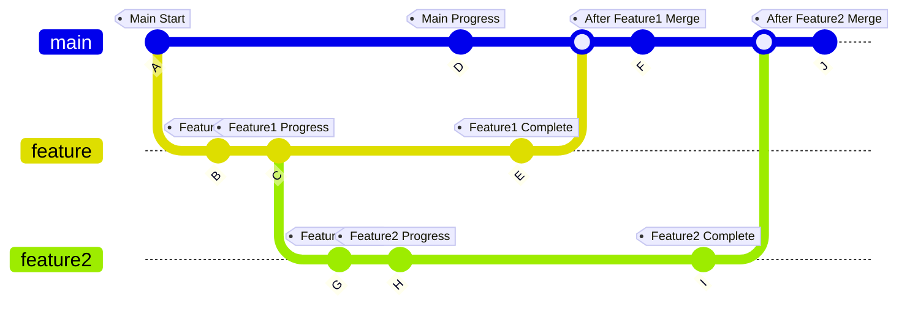
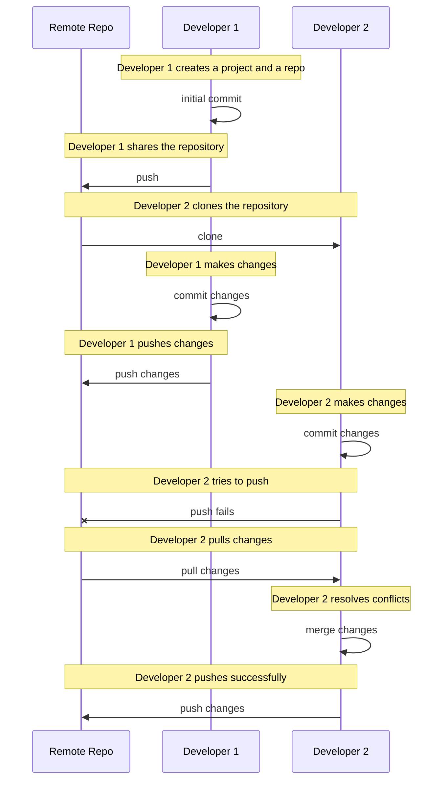

# Git instructions and best practices for team project works

Recap: [Software 1 - Version Control and Git](https://metropolia-sw.github.io/sw1-python/en/02a_version_control_and_git.html)

When working in a team, the power of Git (and version control in general) becomes even more apparent. It allows multiple developers to work on the same project simultaneously without overwriting each other's changes. Here are some best practices and instructions for using Git in a team environment.

Every team member should have their own local copy (clone) of the repository. This allows them to work independently and commit changes without affecting others. When a team member is ready to share their changes, they can push them to the remote repository. In our case, we are using GitHub as the remote repository, which provides a centralized location for the team to collaborate and manage the project.

## Branching

Basically, a branch is a separate line of development in a Git repository. It allows developers to work on new features or bug fixes without affecting the main codebase. In a team setting, it's common to have a main branch often called `main` (or `master` back in the day) and create separate branches for each feature or task.

Branching can be (and often is) used on developer's computer locally. It allows a developer to work on a new feature or bug fix without affecting the main codebase until the changes are ready to be merged to the main code.



Each branch represent a separate timeline of code development for a specific feature or task. Developers can switch between branches to work on different features without interfering with the main codebase. Once a feature is complete and tested, it can be merged back into the main branch.

Some examples of git commands and functionalities used when working with branches:

```sh
git branch  # List local branches in repo
git branch --all   # List all branches
git branch new-feature  # Create a new branch named 'new-feature'
git checkout new-feature  # Switch to the 'new-feature' branch
git checkout -b bug-fix  # Create and switch to a new branch named 'bug-fix'
git branch -d bug-fix  # Delete the 'bug-fix' branch (if it's fully merged)
git branch -D bug-fix  # Force delete the 'bug-fix' branch (if not fully merged)
git branch -m new-name  # Rename the current branch to 'new-name'
git log new-feature  # Show commit history for the 'new-feature' branch
git diff new-feature main  # Compare changes between 'new-feature' and 'main' branches
```

### Creating a new branch

To create a new branch in Git, you can use the `git branch` command followed by the name of the new branch. For example, to create a new branch named `feature`, you would run:

```sh
git branch feature
```

### Merging changes

Merging is the process of combining changes from one branch into another. This is typically done when a feature or bug fix is complete and needs to be incorporated into another development branch or into the `main` branch.

1. Merge changes in another branch into the current branch: `git merge <OTHER-BRANCH>`.
2. If the branch you're merging into has not diverged from the source branch, Git performs a fast-forward merge. In this case, no actual merge commit is created; the branch pointer simply moves forward to the latest commit on the source branch. (No need to create commit manually.)
3. If there are changes in both the source and target branches that cannot be resolved automatically (i.e., there are conflicting changes to the same lines of code), Git performs a three-way merge. It creates a merge commit that represents the combination of the changes from both branches. You may need to [resolve any conflicts](#resolving-conflicts) manually before finalizing the merge.
4. If you encounter issues during a merge and want to abort the merge process, you can use: `git merge --abort`
5. Finally, after resolving conflicts and completing the merge, you need to commit the merge changes to finalize the process: `git commit -m "Merge branch 'source-branch' into 'target-branch'"`

There is also a command `git rebase` to integrate changes but we will not cover it this time. It is a more advanced topic and can be useful in certain scenarios, but it can also be more complex and potentially dangerous if not used correctly. For now, we will focus on the basics of merging.

### Resolving conflicts

1. Identify Conflicts
   - When you attempt to merge or rebase a branch with conflicting changes, Git will notify you of the conflict in the terminal.
2. Open the conflicted file in a code editor
   - Git will mark the conflicting sections like this:

     ```plaintext
     <<<<<<< HEAD
     // Your changes
     =======
     // Their changes
     >>>>>>> branch-name
     ```

   - The `<<<<<<< HEAD` marker indicates the start of your changes.
   - The `=======` marker separates your changes from the changes in the other branch.
   - The `>>>>>>> branch-name` marker indicates the end of their changes.
   - Many editors and IDEs provide tools for doing this more easily

3. Resolve the conflict by editing the conflicting file:
   - Review the file and choose which changes/lines to keep and/or how to combine them.
   - Use editor's conflict resolution tools if available.
   - Or remove conflict markers and any extra spacing or lines used for markers manually.
4. Save the file with your changes.
5. If there are conflicts in multiple files, repeat the conflict resolution process for each file.
6. Add and Commit updated files
   - After resolving all conflicts, add the files to the staging area using `git add <list of files or .>`.
   - Commit the changes using `git commit -m "commit message"`. Git will create a new merge commit.
7. Test Your Changes
   - After resolving conflicts, it's important to test your code to ensure that the changes are correct and functional.

Remember that conflicts are a natural part of collaborative development. Good communication with your team is essential to coordinate changes and minimize conflicts. Additionally, using version control best practices, such as keeping branches up to date and using feature branches, can help reduce the frequency of conflicts.

---

## Git Workflow in team work

### Remote repositories and hosting services for shared collaboration

When working in a team, it's common to use a remote repository hosting service to facilitate collaboration. These services provide a centralized location for the team to share code, track issues, and manage project workflows.

#### [GitHub](https://github.com)

- **GitHub != Git**: Git is the application, GitHub is a company and a web service utilizing Git and providing a lot more than just version tracking.
- Commercial service providing a remote git repository server, project management tools, wiki, issue tracker, webpage hosting, etc.
- Wide user community
- **Fork**: Create a new Github project, clone the git repository of an existing project and add the cloned repo to the new project
- Almost _de facto_ hosting service for Open Source projects at the moment
- Repositories (projects) are public by default, private repos are accessible only for invited collaborators
  - Note: collaborators have always the write access to the repository
- **Pull request**: A request to merge changes from one project branch into another

#### Other remote repository service providers

- [Bitbucket](https://bitbucket.org) is another popular git repo hosting service providing free private repos for small teams
- [GitLab](https://about.gitlab.com/install/) provides a commercial service or free open source community edition to installed on one's own server

### Working with remote repositories

- `git clone <URI>`: clone an existing repository (create a new local copy of the repo)
- `git remote`: manage linking with remote repositories
- `git push`: upload the changes in local branch (new commits) to chosen remote repository
- `git pull`: download the changes in remote branch (get new changes and commits) from remote repo
- `git fetch`: retrieves changes from a remote repository, but it does not automatically merge those changes into your local working branch

`git pull`, `git push`, and `git fetch` are essential Git commands for interacting with remote repositories. They allow you to synchronize your local repository with a remote repository, exchange changes with collaborators, and keep your codebase up to date.

In Visual Studio Code, you can use the built-in Git features to perform these operations through the Source Control panel. You can also use the command line interface (CLI) to execute these commands directly in your terminal. **Sync** is a convenient way to perform both `git pull` and `git push` in one step, but it's important to understand the underlying commands and their implications.

When syncing with a remote repository, merging may be required if there are changes in the remote branch that conflict with your local changes. In such cases, you will need to resolve the conflicts before completing the sync operation.

#### Git pull

The `git pull` command is used to fetch changes from a remote repository and merge them into your current branch. It's a combination of `git fetch` and `git merge`.

```bash
# <remote> is the name of the remote repository (e.g., origin is the default remote name).
# <branch> is the branch from the remote repository that you want to pull and merge into your current branch.
git pull <remote> <branch>

# Example
git pull origin main
```

#### Git push

The `git push` command is used to send your local commits to a remote repository. It updates the remote repository with your changes.

```bash
# <remote> is the name of the remote repository.
# <branch> is the branch you want to push.
git push <remote> <branch>

# Example
git push origin feature-branch
```

If there is changes in the remote branch, you need to pull the changes and resolve possible conflicts before pushing your local branch.

#### Git fetch

The `git fetch` command retrieves changes from a remote repository and stores them locally. Unlike git pull, it doesn't automatically merge the changes into your current branch. It's useful for inspecting changes before merging.

```sh
git fetch <remote>

# Examples
git fetch origin  # fetches the latest changes from the origin remote repository but doesn't merge them into your current branch
git fetch --all  # fetches all branches from all remotes
```

#### Example workflow

Following sequence diagram illustrates a typical simple workflow when two developers or more are working on the same project using Git:



1. Both Developer 1 and Developer 2 are working with same project (remote repository) on their local machines.
2. Developer 1 makes some changes locally, commits them, and then pushes these changes back to the remote repository.
3. Meanwhile, Developer 2 also makes changes. However, when Developer 2 attempts to push these changes, the operation fails because the remote repository has updates that Developer 2 doesn't have.
4. Developer 2 then pulls the latest changes from the remote repository. This step might involve merging changes and resolving conflicts.
5. After successfully integrating the new changes, Developer 2 pushes their changes to the remote repository.

---

## Getting started in Practice

The aim of this exercise is to get familiar with using Git in a team environment.

Each team member should be able to work on their own branch, make changes, and then merge those changes into the main branch. Merging to the main branch could be done by one team member or by all team members together, but it requires some coordination and communication to avoid conflicts and ensure that everyone is aware of the changes being made.

1. Create a shared repo for your project team in Github
   - One of the team members creates the repo and adds other team members as collaborators
2. Each team member should clone the repo to their local machine using `git clone <repo-URL>` or VSCode git tools.
3. Each team member should create a new branch for their work using `git branch <branch-name>` and switch to it using `git checkout <branch-name>` (or use VSCode git tools).
4. Each team member should test making changes and adding files to the project in their branch, committing them, and pushing their own branch to Github.
5. With the team, try merging all the changes created by individual team members to the same main branch in Github together.
   - This needs some coordination and communication between team members to avoid/merge conflicts and ensure that everyone is aware of the changes being made.
6. Each team member should pull the latest changes from the main branch to their local branch and have the same codebase in their local machine as the main branch in Github.

After this exercise each team member should be able to push their changes to the remote repository and sync with the latest changes from other team members. Team should have a common understanding or agreement on how to work with Git in a team environment, including branching strategies, commit messages, and conflict resolution.

Submit your team's Github link to Oma assignment as instructed.

---

## Tips

- Use `git status` frequently to check the state of your working directory and staging area. It helps you understand what changes have been made, which files are staged for commit, and if there are any untracked files.
- A good convention would be to include files and folders relevant to each other to a single commit, instead of adding all changes. This will make it easier to understand the changes made in the commit.
- When creating new commits, it is important to write clear and descriptive commit messages. This will make it easier to understand the changes that were made, and why they were made.
- Use `git log` to view the commit history and understand the changes that have been made to the repository.
- Use `git diff` to see the differences between your working directory and the staging area, or between different commits.

---

---

<!-- add mermaid support for gh pages. Just ignore this when displayed on github. -->
<script type="module">
    Array.from(document.getElementsByClassName("language-mermaid")).forEach(element => {
      element.classList.add("mermaid");
    });
    import mermaid from 'https://cdn.jsdelivr.net/npm/mermaid@11/dist/mermaid.esm.min.mjs';
    mermaid.initialize({ startOnLoad: true });
</script>
