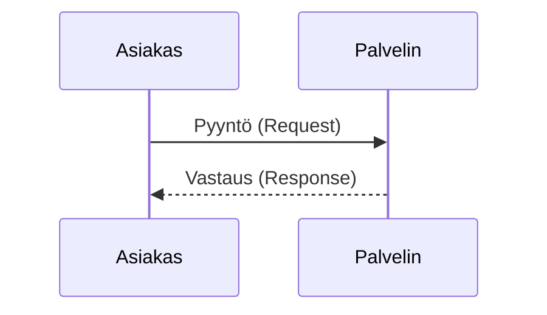
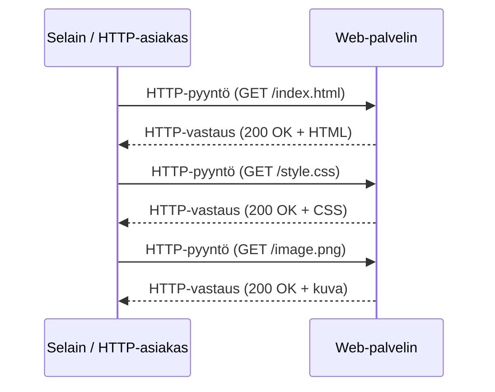
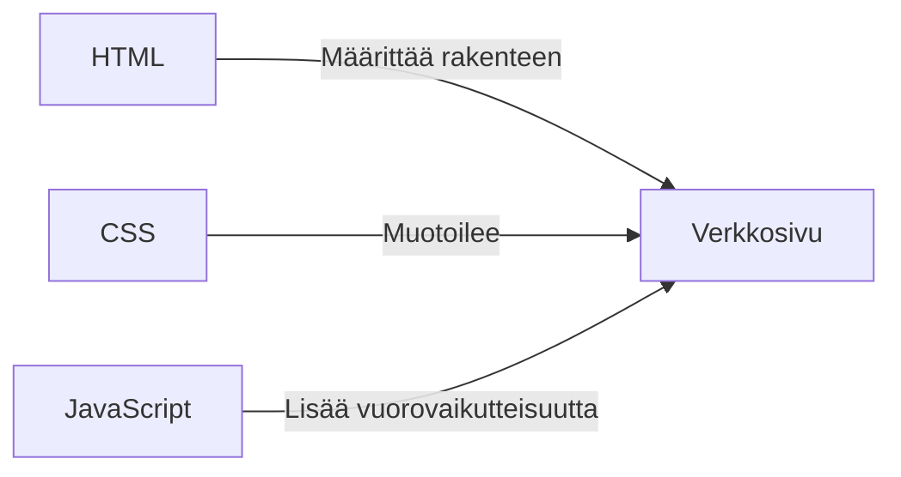
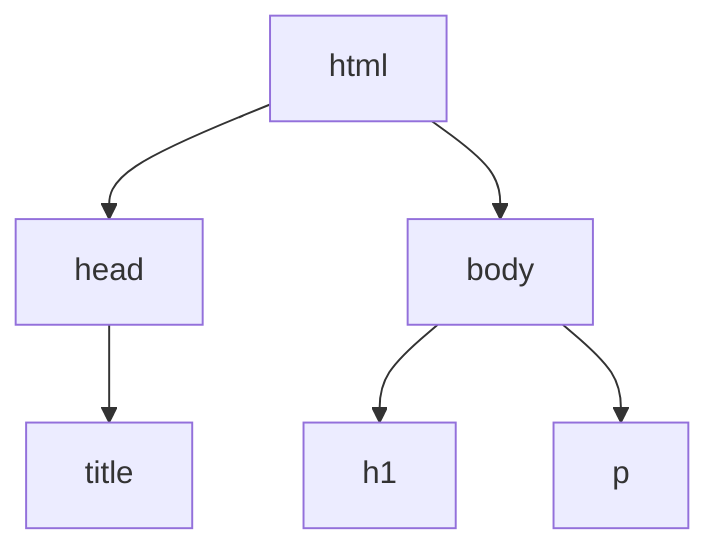

# Johdanto web-teknologioihin

## Tiedonsiirto internetissä

Tarkastellaan ensin, mitä tapahtuu, kun internetiin kytketyt tietokoneet viestivät keskenään. Tämä auttaa ymmärtämään, miten laitteet siirtävät tietoa ja miten voit itse toteuttaa tiedonsiirtoa.

Tiedonsiirto internetissä perustuu asiakas–palvelin-malliin (_client-server model_). Internetiin kytkettyä tietokonetta, joka odottaa muiden tietokoneiden yhteydenottoja, kutsutaan palvelimeksi (_server_). Käytännössä tietokoneesta tulee palvelin, kun siinä on käynnissä palvelinsovellus, joka odottaa saapuvia yhteyksiä.

Arkikielessä palvelimesta puhuttaessa voidaan tarkoittaa

- internetiin kytkettyä tietokonetta, joka toimii palvelimena, tai
- palvelinsovellusta, jota suoritetaan palvelintietokoneessa.

Asiakas–palvelin-mallissa asiakas (_client_) avaa yhteyden palvelimeen ja siinä toimivaan palvelinsovellukseen. Asiakas lähettää ensin pyynnön (_request_). Palvelin käsittelee pyynnön ja lähettää vastauksen (_response_):



- **Asiakkaat** ovat tavallisen verkonkäyttäjän internetiin kytkettyjä laitteita (esimerkiksi Wi-Fi-verkkoon kytketty tietokoneesi tai mobiiliverkkoon kytketty puhelimesi) sekä näissä laitteissa toimivia verkkoa käyttäviä ohjelmia eli asiakasohjelmia. Tavallisin asiakasohjelma on selain (_browser_), kuten Firefox tai Chrome.
- **Palvelimet** ovat tietokoneita, joille on tallennettu verkkosivuja (_web page_), verkkosivustoja (_website_) tai sovelluksia. Kun asiakas avaa verkkosivun, sivun koodista ladataan kopio palvelimelta asiakkaan laitteelle. Selain muodostaa koodista sivun ja näyttää sen käyttäjälle.

Keksitkö muita arkipäiväisiä esimerkkejä asiakasohjelmista, joita käytät verkossa?

Web-kehitykseen kuuluu myös palvelinsovellusten eli taustapalvelujen (_backend_) kehittäminen. Tällä kurssilla keskitymme kuitenkin selaimessa toimivaan käyttöliittymään (_frontend_). Käyttöliittymä on se osa sovellusta, jonka käyttäjä näkee selaimessaan ja jota hän käyttää.

## World Wide Web (WWW)

Verkkosivujen hakeminen noudattaa asiakas–palvelin-mallia. Kun kirjoitat verkko-osoitteen selaimen osoiteriville (tai napsautat verkkosivulla olevaa linkkiä), selain lähettää pyynnön web-palvelimelle. Web-palvelin lähettää vastauksena HTML-tiedoston, joka kuvaa verkkosivun. Jos sivu tarvitsee lisää resursseja (kuten kuvia tai tyylitiedostoja), selain lähettää niistä uudet pyynnöt ja saa resurssit vastauksina:



HTML, CSS ja JavaScript ovat World Wide Webin keskeiset teknologiat. Niillä tehdään verkkosivuja ja verkkosovelluksia (_web application_).



**Lue ja opiskele**: [How browsers load websites](https://developer.mozilla.org/en-US/docs/Learn_web_development/Getting_started/Web_standards/How_browsers_load_websites).

---

### Hypertext Transfer Protocol (HTTP)

HTTP on protokolla eli sovittu viestintätapa, jolla asiakkaat ja palvelimet viestivät verkossa. Se on pyyntö–vastaus-protokolla: asiakas lähettää palvelimelle pyynnön, ja palvelin vastaa siihen. HTTP on tilaton (_stateless_) protokolla, eli palvelin käsittelee jokaisen pyynnön erikseen eikä muista aiempia pyyntöjä. HTTP/1.1-versiossa pyynnöt ja vastaukset ovat ihmisen luettavissa olevaa tekstiä. Uudemmat versiot (HTTP/2 ja HTTP/3) siirtävät samat tiedot binäärimuodossa, mutta viestien rakenne on sama.

Näet asiakkaan ja palvelimen välisen HTTP-liikenteen yksityiskohdat selaimen kehittäjätyökaluista (_developer tools_). Saat ne yleensä auki F12-näppäimellä tai napsauttamalla sivua hiiren oikealla painikkeella ja valitsemalla Inspect (Tarkasta). Network-välilehti näyttää kaikki pyynnöt ja vastaukset. Kun napsautat yksittäistä pyyntöä, näet pyynnön ja vastauksen otsakkeet (_headers_) sekä pyynnön ja vastauksen rungon (_body_).

#### Esimerkki HTTP-pyynnöstä

```http
POST /index.html HTTP/1.1
Host: example.com
User-Agent: Mozilla/5.0 (Windows NT 10.0; Win64; x64) AppleWebKit/537.36 (KHTML, like Gecko) Chrome/91.0.4472.124 Safari/537.36
Accept: text/html,application/xhtml+xml
Accept-Language: en-US,en;q=0.9
Content-Type: application/json

{"username": "frank", "password": "12345"}
```

- **POST**: HTTP-metodi, jolla lähetetään tietoa palvelimelle.
- **/index.html**: Haettavan resurssin polku.
- **HTTP/1.1**: Käytettävän HTTP-protokollan versio.
- **Host: example.com**: Sen palvelimen nimi (_host name_), jolla resurssi sijaitsee.
- **User-Agent**: Merkkijono, joka kertoo, mikä asiakasohjelma (esim. selain ja sen versio) pyynnön lähetti.
- **Accept**: Sisältötyypit, joita asiakas ymmärtää.
- **Accept-Language**: Vastaukselle toivotut kielet.
- **Content-Type**: Kertoo, millaista dataa rungossa on (tässä JSON-muotoista).
- **Body** (runko): Esimerkiksi POST- ja PUT-pyynnöissä palvelimelle lähetettävä data. Runko alkaa otsakkeita seuraavan tyhjän rivin jälkeen.

Pyyntömetodi kertoo, mitä resurssille halutaan tehdä. Yleisimmät HTTP-metodit ovat:

- **GET**: Hakee resurssin palvelimelta (esim. HTML-, CSS-, JavaScript- ja kuvatiedostoja).
  - Selain käyttää tätä metodia, kun avaat verkkosivun.
- **POST**: Lähettää palvelimelle dataa uuden resurssin luomiseksi (esim. lomakkeen lähettäminen).
- **PUT**: Päivittää palvelimella olemassa olevan resurssin.
- **DELETE**: Poistaa resurssin palvelimelta.

#### Esimerkki HTTP-vastauksesta

```response
HTTP/1.1 200 OK
Server: Apache/2.4.41 (Unix)
Content-Type: text/html
Content-Length: 1234
Date: Sat, 10 Jun 2023 15:30:00 GMT

<!DOCTYPE html>
<html>
<head>
  <title>Example Website</title>
</head>
<body>
  <h1>Welcome to the Example Website!</h1>
  <p>This is the content of the index.html file.</p>
</body>
</html>
```

- **HTTP/1.1 200 OK**: Tilarivi. Tilakoodi (_status code_) 200 ja sen selite OK kertovat, että pyyntö onnistui.
- **Server: Apache/2.4.41 (Unix)**: Palvelinohjelmisto ja sen versio.
- **Content-Type: text/html**: Vastauksen sisältötyyppi on HTML.
- **Content-Length: 1234**: Vastauksen rungon pituus tavuina.
- **Date: Sat, 10 Jun 2023 15:30:00 GMT**: Vastauksen muodostamisen päivämäärä ja kellonaika.
- **Vastauksen runko** (_response body_): Runko alkaa otsakkeita seuraavan tyhjän rivin jälkeen. Se sisältää varsinaisen sisällön, jonka palvelin lähettää asiakkaalle.

---

[Lisää HTTP:stä](https://developer.mozilla.org/en-US/docs/Web/HTTP/Overview)

---

### Hypertext Markup Language (HTML)

Tämä on vain hyvin lyhyt johdanto HTML:ään. Sitä käsitellään tarkemmin ensimmäisten viikkojen itseopiskelumateriaalissa.

#### Mitä HTML on?

- HTML on lyhenne sanoista HyperText Markup Language. Se on merkintäkieli (_markup language_) eikä ohjelmointikieli: HTML:llä ei kirjoiteta ohjelmia, vaan kuvataan verkkosivun rakenne ja sisältö.
- HTML-koodi kertoo selaimelle, mitä sivun osat ovat. Selain näyttää sivun tämän kuvauksen perusteella.
- HTML on sukua XML:lle (eXtensible Markup Language). XML on merkintäkieli, joka määrittelee säännöt dokumenttien tallentamiseen muodossa, jota sekä ihminen että kone pystyvät lukemaan. HTML ei kuitenkaan ole XML:ää, ja sen syntaksisäännöt ovat XML:ää sallivammat.
- HTML on World Wide Webin perusrakennuspalikka.
- Hyperteksti on tietokoneella tai muulla elektronisella laitteella näytettävää tekstiä, joka sisältää viittauksia (linkkejä) muihin teksteihin. Käyttäjä pääsee linkin kautta suoraan viitattuun tekstiin.
- Hyperteksti voi sisältää taulukoita, listoja, lomakkeita, kuvia ja muita esityselementtejä.
- HTML on helppokäyttöinen ja joustava muoto tiedon jakamiseen internetissä.

#### Mitä HTML:llä voi tehdä?

- Julkaista verkossa dokumentteja, joissa on tekstiä, kuvia, listoja, taulukoita ja muuta.
- Linkittää hyperlinkeillä verkossa oleviin resursseihin, kuten kuviin, videoihin tai muihin HTML-dokumentteihin.
- Luoda lomakkeita (_form_), joilla kerätään käyttäjän syötettä, kuten nimi, sähköpostiosoite tai kommentteja.
- Upottaa kuvia, videoita, äänileikkeitä, sovelluksia ja muita HTML-dokumentteja suoraan HTML-dokumenttiin.
- Luoda verkkosivustostasi offline-version, joka toimii ilman internetyhteyttä (Progressive Web App). Tähän tarvitaan HTML:n lisäksi JavaScriptiä.
- Tallentaa tietoa käyttäjän selaimeen ja käyttää sitä myöhemmin (tämäkin tehdään JavaScriptillä).

#### Esimerkki HTML-dokumentista

```html
<!DOCTYPE html>
<html>
  <head>
    <title>Sivun otsikko</title>
  </head>
  <body>
    <h1>Tämä on otsikko</h1>
    <p>Tämä on kappale.</p>
  </body>
</html>
```

- HTML-tiedostojen tiedostopääte on `.html` tai `.htm`, yleisemmin `.html`. Verkkosivuston päätiedoston nimi on yleensä `index.html`.
- Ensimmäinen rivi `<!DOCTYPE html>` on dokumenttityypin ilmoitus (_document type declaration_). Se kertoo selaimelle, että dokumentti on nykyaikaista HTML:ää.
- HTML-dokumentti koostuu HTML-elementeistä (_element_). Elementti koostuu yleensä alkutagista, sisällöstä ja lopputagista, esim. `<p>Tämä on kappale.</p>`. `<p>` on alkutagi, `Tämä on kappale.` on sisältö ja `</p>` on lopputagi.
- Tagi (_tag_) on kulmasulkeiden sisään kirjoitettu elementin nimi, esim. `<html>`, `<head>`, `<body>`, `<title>` tai `<p>`. Lopputagissa nimen edessä on kauttaviiva, esim. `</p>`.
- `<head>`-elementti sisältää dokumenttia koskevia tietoja, kuten sivun otsikon (`<title>`), joka näkyy selaimen välilehdessä.
- `<body>`-elementti sisältää dokumentin varsinaisen sisällön, joka näkyy sivulla.

Selain muodostaa HTML-dokumentin perusteella DOM-puun. DOM (_Document Object Model_, dokumenttioliomalli) on HTML- ja XML-dokumenttien rajapinta (_API_), jonka kautta ohjelmakoodi voi lukea ja muuttaa sivun rakennetta, tyyliä ja sisältöä sivun ollessa auki. DOM esittää verkkosivun olioina (_object_), joita voi muokata esimerkiksi JavaScriptillä.

Esimerkiksi yllä oleva HTML-dokumentti tuottaisi seuraavan DOM-puun:



Tutustumme DOMiin tarkemmin tulevilla viikoilla, kun opettelemme JavaScriptiä.

#### HTML-attribuutit

- Attribuutit (_attribute_) antavat elementille lisätietoa, joka ei näy sivulla sisältönä.
- Attribuutit kirjoitetaan alkutagiin. Attribuutin rakenne on: nimi, yhtäsuuruusmerkki `=` ja lainausmerkkeihin kirjoitettu arvo, esim. `href="https://www.w3schools.com"`.

##### Esimerkki: HTML-linkit

- HTML-linkit ovat hyperlinkkejä.
- Napsauttamalla linkkiä voit siirtyä toiseen dokumenttiin tai toiseen kohtaan samassa dokumentissa.
- Kun viet hiiren linkin päälle, hiiren osoitin muuttuu pieneksi kädeksi.
- Linkki tehdään `<a>`-elementillä.
- `href`-attribuutti määrittää sen sivun URL-osoitteen, johon linkki vie. `href` on lyhenne sanoista _hypertext reference_.
- Alla olevassa esimerkissä linkkielementin sisältö on teksti ”Siirry W3Schools.comiin!”. Käyttäjä näkee tämän tekstin ja napsauttaa sitä.

```html
<a href="https://www.w3schools.com">Siirry W3Schools.comiin!</a>
```

#### Tyhjät HTML-elementit

- Joillakin elementeillä ei ole tarkoitus olla lainkaan sisältöä. Niitä kutsutaan tyhjiksi (_empty_) elementeiksi.
- Esimerkiksi kuvien näyttämiseen käytettävällä ``-elementillä on kaksi attribuuttia, mutta ei sisältöä eikä lopputagia (`</img>`).
  - ``-elementillä upotetaan kuva HTML-sivulle.
  - Teknisesti kuvaa ei tallenneta HTML-dokumentin sisään, vaan sivu viittaa erilliseen kuvatiedostoon. ``-elementti varaa sivulta paikan, johon selain lataa ja näyttää kuvan.
  - ``-elementillä on kaksi pakollista attribuuttia: `src` ja `alt`.
  - `src`-attribuutti määrittää kuvatiedoston polun tai URL-osoitteen.
  - `alt`-attribuutti määrittää kuvalle vaihtoehtoisen tekstin. Teksti näytetään, jos kuvaa ei voida näyttää, ja ruudunlukuohjelma lukee sen näkövammaiselle käyttäjälle.
  - `` on tyhjä elementti, eli sillä on vain attribuutteja eikä sillä ole lopputagia.
  - Esimerkki:

    ```html
    
    ```

#### Erikoismerkit

- Joillakin merkeillä, kuten `<`, `>`, `&` ja `"`, on HTML:ssä erityismerkitys. Esimerkiksi `<` aloittaa tagin.
- Jos haluat näyttää näitä merkkejä sivun tekstissä, käytä niiden sijaan [HTML-entiteettejä](https://www.w3schools.com/html/html_entities.asp), kuten `&lt;`, `&gt;`, `&amp;` ja `&quot;`.

#### Metatiedot HTML:ssä

- `<head>`-elementti voi sisältää dokumenttia koskevia metatietoja (_metadata_).
- Metatiedot ovat tietoa HTML-dokumentista. Metatietoja ei näytetä sivulla.
- Metatietoja käyttävät selaimet (miten sisältö näytetään), hakukoneet (avainsanat) ja muut verkkopalvelut.
- Metatiedot määritellään `<meta>`-elementeillä.
  - Esimerkiksi Facebook lukee `<meta>`-elementeistä sivun otsikon, kuvauksen ja kuvan, kun sivun linkki jaetaan palvelussa:

  ```html
  <meta property="og:title" content="The Rock" />
  <meta
    property="og:description"
    content="The Rock is a 1996 action film that primarily takes place on Alcatraz Island, and the San Francisco Bay area. It was directed by Michael Bay, produced by Don Simpson and Jerry Bruckheimer."
  />
  <meta
    property="og:image"
    content="http://ia.media-imdb.com/images/rock.jpg"
  />
  ```

#### HTML-taulukot

- `<table>`-elementti määrittelee HTML-taulukon.
- Jokainen taulukon rivi määritellään `<tr>`-elementillä, jokainen otsikkosolu `<th>`-elementillä ja jokainen datasolu `<td>`-elementillä.
- Oletuksena `<th>`-elementtien teksti on lihavoitu ja keskitetty.
- Oletuksena `<td>`-elementtien teksti on tavallista ja tasattu vasemmalle.
- Esimerkki:

```html
<table style="width:100%">
  <tr>
    <th>Etunimi</th>
    <th>Sukunimi</th>
    <th>Ikä</th>
  </tr>
  <tr>
    <td>Jill</td>
    <td>Smith</td>
    <td>50</td>
  </tr>
  <tr>
    <td>Eve</td>
    <td>Jackson</td>
    <td>94</td>
  </tr>
</table>
```

Tuottaa seuraavan taulukon:

<table style="width:100%">
  <tr>
    <th>Etunimi</th>
    <th>Sukunimi</th>
    <th>Ikä</th>
  </tr>
  <tr>
    <td>Jill</td>
    <td>Smith</td>
    <td>50</td>
  </tr>
  <tr>
    <td>Eve</td>
    <td>Jackson</td>
    <td>94</td>
  </tr>
</table>

---

#### HTML-listat

- HTML-listoilla esitetään luettelomuotoista tietoa selkeästi ja semanttisesti eli niin, että merkintä kertoo, mitä sisältö on (tässä lista).
- HTML:ssä on kolmenlaisia listoja:
  - Järjestämätön lista (_unordered list_): luettelo, jossa kohtien järjestyksellä ei ole erityistä merkitystä.
  - Järjestetty lista (_ordered list_): luettelo, jossa kohtien järjestyksellä on merkitystä.
  - Määritelmälista (_description list_): luettelo, jossa termiä seuraa sen määritelmä.
  - Esimerkki:

```html
<ul>
  <li>Kahvi</li>
  <li>Tee</li>
  <li>Maito</li>
</ul>
<ol>
  <li>Kahvi</li>
  <li>Tee</li>
  <li>Maito</li>
</ol>
<dl>
  <dt>Kahvi</dt>
  <dd>- musta kuuma juoma</dd>
  <dt>Maito</dt>
  <dd>- valkoinen kylmä juoma</dd>
</dl>
```

Tuottaa seuraavat listat:

<ul>
  <li>Kahvi</li>
  <li>Tee</li>
  <li>Maito</li>
</ul>
<ol>
  <li>Kahvi</li>
  <li>Tee</li>
  <li>Maito</li>
</ol>
<dl>
  <dt>Kahvi</dt>
  <dd>- musta kuuma juoma</dd>
  <dt>Maito</dt>
  <dd>- valkoinen kylmä juoma</dd>
</dl>

---

#### Validointi

- HTML-validoinnilla tarkistetaan, että HTML-koodi on kirjoitettu oikein.
- Validointi etsii koodista syntaksivirheitä ja tarkistaa, että koodi noudattaa HTML-standardia.
- Voit validoida HTML-koodisi W3C:n (World Wide Web Consortium) Markup Validation Service -palvelulla: <https://validator.w3.org/>

---

### Cascading Style Sheets (CSS)

Tämä on vain hyvin lyhyt johdanto CSS:ään. Sitä käsitellään tarkemmin ensimmäisten viikkojen itseopiskelumateriaalissa.

#### Mitä CSS on?

- CSS on lyhenne sanoista Cascading Style Sheets (porrastetut tyylisivut).
- HTML:llä määritellään sisällön rakenne ja merkitys, kun taas CSS:llä muotoillaan sisällön ulkoasu ja asettelu.
- CSS on suunniteltu erottamaan esitystapa ja sisältö toisistaan.
- CSS:llä voit muuttaa fontteja, värejä, kokoja ja välistyksiä sekä lisätä palstoja, animaatioita, siirtymiä ja paljon muuta.
- Cascading (porrastus) tarkoittaa sääntöjä, joilla selain ratkaisee, mikä tyyli elementtiin lopulta tulee, kun siihen kohdistuu useita keskenään ristiriitaisia tyylisääntöjä.
- Style (tyyli) tarkoittaa elementin ulkoasua.
- Sheets (sivut) tarkoittaa tyylisääntöjen joukkoa, joka määrittää verkkosivun ulkoasun.

#### CSS:n liittäminen HTML-dokumenttiin

- **Ulkoinen tyylitiedosto** (_external style sheet_): Tyylit määritellään erillisessä CSS-tiedostossa. Tämä on yleisin tapa. Yhdellä CSS-tiedostolla voit määrittää koko verkkosivuston ulkoasun. Lisää HTML-dokumentin `<head>`-elementtiin: `<link rel="stylesheet" type="text/css" href="mystyle.css">`.
- **Sisäinen tyylimäärittely** (_internal style sheet_): Tyylit kirjoitetaan `<style>`-elementtiin, ja ne koskevat vain kyseistä HTML-dokumenttia. Lisää HTML-dokumentin `<head>`-elementtiin:

  ```html
  <style>
    body {
      background-color: linen;
    }
    h1 {
      color: maroon;
      margin-left: 40px;
    }
  </style>
  ```

- **Elementin omat tyylit** (_inline styles_): Tyylit määritellään suoraan HTML-elementin `style`-attribuutissa, ja ne koskevat vain tätä elementtiä: `<h1 style="color:blue;margin-left:30px;">Tämä on otsikko</h1>`.

#### Sääntö

- Tyylisääntö (_rule_ tai _ruleset_) koostuu valitsimesta (_selector_) ja aaltosulkeiden sisällä olevista määrittelyistä (_declaration_). Määrittely on ominaisuuden (_property_) ja sen arvon (_value_) pari, joka päättyy puolipisteeseen:

  ```css
  selector {
    property: value;
  }
  ```

  ```css
  h1 {
    color: blue;
    font-size: 12px;
  }
  ```

#### CSS-valitsimet

- Valitsin (_selector_) määrittää, mihin HTML-elementteihin tyylisääntö kohdistuu.
- CSS-valitsimet voidaan jakaa viiteen ryhmään: yksinkertaiset valitsimet, yhdistelmävalitsimet, pseudoluokkavalitsimet, pseudoelementtivalitsimet ja attribuuttivalitsimet.
- **Yksinkertaiset valitsimet** valitsevat elementtejä elementin nimen, `id`-attribuutin tai `class`-attribuutin (luokan) perusteella:

  ```css
  /* Valitsee kaikki <p>-elementit */
  p {
    color: red;
  }
  /* Valitsee elementin, jolla on id="intro" */
  #intro {
    font-size: 20px;
  }
  /* Valitsee kaikki elementit, joilla on class="center" */
  .center {
    text-align: center;
  }
  ```

- CSS-valitsin voi sisältää useamman kuin yhden yksinkertaisen valitsimen. Tällaisia kutsutaan **yhdistelmävalitsimiksi** (_combinator selectors_). Niillä valitaan elementtejä sen perusteella, miten ne sijoittuvat HTML-dokumentissa suhteessa toisiinsa. Suhteen määrittää yhdistin (_combinator_) eli merkki, joka erottaa yksinkertaiset valitsimet toisistaan. Yhdistelmävalitsimia on neljä:
  - jälkeläisvalitsin (_descendant combinator_), merkkinä välilyönti
  - lapsivalitsin (_child combinator_), merkkinä `>`
  - viereisen sisaruksen valitsin (_next-sibling combinator_), merkkinä `+`
  - yleinen sisarusvalitsin (_subsequent-sibling combinator_), merkkinä `~`.

  Sisaruksia (_siblings_) ovat elementit, joilla on sama vanhempi (_parent_) eli sama ympäröivä elementti:

  ```css
  /* Valitsee kaikki <p>-elementit, jotka ovat <div>-elementin sisällä millä tahansa tasolla */
  div p {
    color: red;
  }
  /* Valitsee kaikki <p>-elementit, joiden vanhempi (suora ympäröivä elementti) on <div> */
  div > p {
    color: red;
  }
  /* Valitsee jokaisen <p>-elementin, joka tulee heti <div>-sisaruksensa jälkeen */
  div + p {
    color: red;
  }
  /* Valitsee kaikki <p>-elementit, jotka tulevat jossain kohtaa <div>-sisaruksensa jälkeen */
  div ~ p {
    color: red;
  }
  ```

- **Attribuuttivalitsimella** (_attribute selector_) valitaan elementit attribuuttien perusteella. Elementin voi valita sen mukaan, onko sillä tietty attribuutti tai onko attribuutilla tietty arvo. Voit myös valita elementit sen mukaan, sisältääkö attribuutin arvo tietyn merkkijonon:

  ```css
  /* Valitsee kaikki elementit, joilla on target-attribuutti */
  [target] {
    background-color: yellow;
  }
  /* Valitsee kaikki elementit, joilla on attribuutti target="_blank" */
  [target="_blank"] {
    background-color: yellow;
  }
  /* Valitsee kaikki elementit, joiden target-attribuutin arvo sisältää merkkijonon "w3schools" */
  [target*="w3schools"] {
    background-color: yellow;
  }
  ```

#### Pseudoluokat ja pseudoelementit

- Pseudoluokalla (_pseudo-class_) valitaan elementti sen tilan perusteella. Sillä voit esimerkiksi muotoilla elementin, kun käyttäjä vie hiiren sen päälle, muotoilla linkit eri tavoin sen mukaan, onko käyttäjä jo käynyt niiden osoitteessa tai muotoilla elementin, kun se saa kohdistuksen (_focus_) eli on valittuna näppäimistön syötettä varten.
- Pseudoelementillä (_pseudo-element_) muotoillaan elementin tiettyä osaa. Sillä voit esimerkiksi muotoilla elementin ensimmäisen kirjaimen tai rivin tai lisätä sisältöä elementin sisällön alkuun tai loppuun:

  ```css
  /* Valitsee jokaisen <a>-elementin, jonka päällä hiiri on */
  a:hover {
    color: yellow;
  }
  /* Valitsee jokaisen <a>-elementin, jonka osoitteessa käyttäjä on jo käynyt */
  a:visited {
    color: purple;
  }
  /* Valitsee jokaisen <p>-elementin ensimmäisen kirjaimen */
  p::first-letter {
    color: #ff0000;
    font-size: xx-large;
  }
  /* Valitsee jokaisen <p>-elementin ensimmäisen rivin */
  p::first-line {
    color: #ff0000;
    font-variant: small-caps;
  }
  ```

---

### JavaScript (JS)

JavaScript on webin kolmas keskeinen teknologia. Se on ohjelmointikieli, jolla voit tehdä verkkosivuista dynaamisia (sisältö voi muuttua sivun ollessa auki) ja vuorovaikutteisia. JavaScriptillä voit muuttaa sivun HTML-rakennetta ja tyylejä, reagoida käyttäjän toimintoihin, kuten napsautuksiin, ja viestiä palvelimien kanssa.

Opettelemme JavaScriptiä tarkemmin tulevilla viikoilla. Toistaiseksi riittää, että muistat sen olevan kieli, joka tekee verkkosivuista vuorovaikutteisia ja dynaamisia.

---

## Tehtävä

1. Luo yksinkertainen HTML-dokumentti. Vaatimukset:
   - Dokumentilla on otsikko (`<title>`), joka näkyy selaimen välilehdessä.
   - Sivulla on näkyvä otsikko (esim. `<h1>`).
   - Dokumentissa on kappale.
   - Dokumentissa on linkki.
   - Dokumentissa on kuva.
   - Dokumentissa on taulukko.
   - Dokumentissa on lista.
1. Luo yksinkertainen CSS-tiedosto edellisen tehtävän HTML-dokumentille. Vaatimukset:
   - Käytä ulkoista tyylitiedostoa.
   - Kokeile rohkeasti erilaisia tyylejä. Muutamia ideoita:
     - Vaihda sivun taustaväri.
     - Vaihda tekstin fontti.
     - Muuta linkin tyyliä, kun hiiri viedään sen päälle (`:hover`-pseudoluokka). Vaihda myös linkin oletusväri ja poista alleviivaus.
     - Lisää kuvaan reunus ja pyöristetyt kulmat.
     - Anna taulukon joka toiselle riville eri taustaväri.
     - Poista listasta oletusluettelomerkit.

---

<!-- add mermaid support for gh pages -->
<script type="module">
    Array.from(document.getElementsByClassName("language-mermaid")).forEach(element => {
      element.classList.add("mermaid");
    });
    import mermaid from 'https://cdn.jsdelivr.net/npm/mermaid@11/dist/mermaid.esm.min.mjs';
    mermaid.initialize({startOnLoad: true});
</script>
