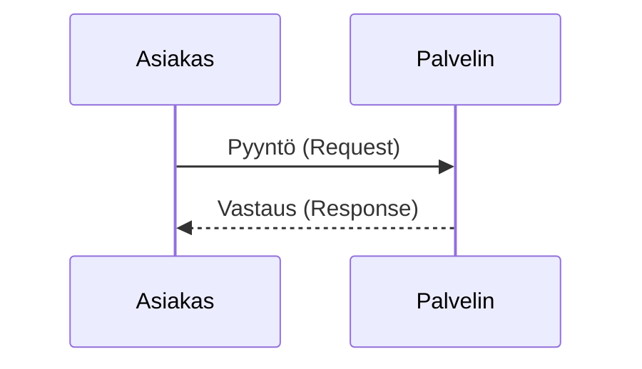
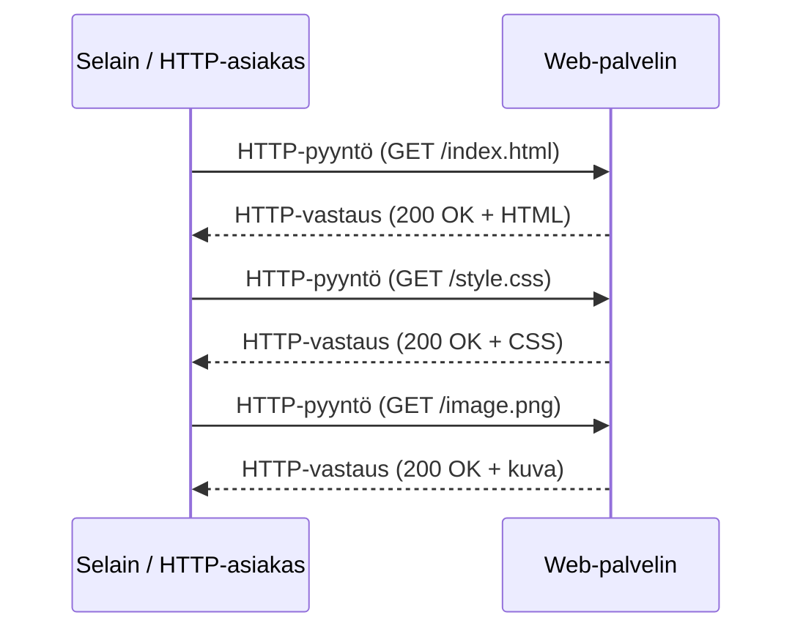
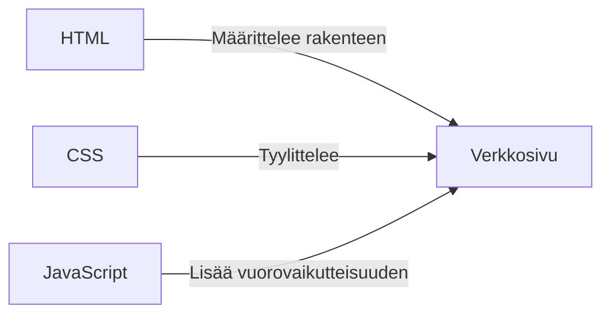
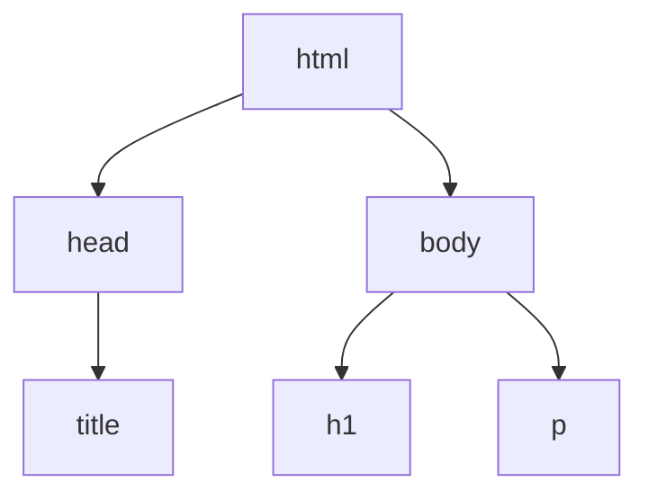

# Johdanto web-teknologioihin

## Tiedonsiirto Internetissä

Tarkastellaan ensin, mitä tapahtuu, kun Internetiin yhdistetyt tietokoneet kommunikoivat keskenään. Tämä antaa meille perustan laitteiden välisen viestinnän ymmärtämiselle ja toteuttamiselle.

Tiedonsiirto Internetissä perustuu asiakas-palvelinmalliin. Tietokonetta, joka on yhteydessä Internetiin ja odottaa muiden tietokoneiden muodostavan siihen yhteyden, kutsutaan palvelimeksi. Käytännössä tietokoneesta tulee palvelin, kun siinä suoritetaan erillinen palvelinsovellus, joka ohjeistaa tietokonetta odottamaan tulevia yhteyksiä.

Epämuodollisesti palvelimista puhuttaessa voimme tarkoittaa:

- Internetiin yhdistettyä tietokonetta, joka toimii palvelimena, tai
- palvelinsovellusta, joka suoritetaan palvelintietokoneessa.

Asiakas-palvelinmallin mukaisesti palvelinkoneeseen (ja siinä olevaan palvelinsovellukseen) yhteyden muodostava tietokone lähettää ensin pyynnön. Palvelin käsittelee pyynnön ja lähettää vastauksen:



- **Asiakkaat** ovat tyypillisiä web-käyttäjän Internetiin yhdistettyjä laitteita (esimerkiksi Wi-Fi-verkkoon yhdistetty tietokoneesi tai mobiiliverkkoon yhdistetty puhelimesi) sekä näissä laitteissa käytettävissä olevia webiä käyttäviä ohjelmistoja (yleensä web-selain, kuten Firefox tai Chrome).
- **Palvelimet** ovat tietokoneita, jotka tallentavat verkkosivuja, sivustoja tai sovelluksia. Kun asiakas haluaa käyttää verkkosivua, kopio verkkosivun koodista ladataan palvelimelta asiakaskoneelle, jossa selain muodostaa siitä näkymän ja näyttää sen käyttäjälle.

Keksitkö muita arkielämän esimerkkejä käyttämistämme verkkoyhteyden asiakkaista?

Web-kehitykseen kuuluu myös palvelinsovellusten kehittäminen, mutta tällä kurssilla keskitymme web-selaimessa tapahtuvaan asiakaspuolen kehitykseen. Asiakaspuoli on se osa, jonka kanssa käyttäjä toimii ja jonka käyttäjä näkee web-selaimessaan.

## World Wide Web (WWW)

Verkkosivujen hakeminen noudattaa asiakas-palvelinmallia. Kun kirjoitat web-osoitteen selaimen osoiteriville (tai napsautat verkkosivulla olevaa linkkiä), palvelimelle lähetetään pyyntö. Web-palvelin lähettää vastauksena HTML-tiedoston, joka kuvaa verkkosivun. Jos verkkosivu tarvitsee muita resursseja (kuten kuvia tai tyylitiedostoja), luodaan uusia pyyntöjä ja pyydetyt resurssit vastaanotetaan vastauksina:



HTML, CSS ja JavaScript ovat World Wide Webin keskeisiä teknologioita. Niitä käytetään verkkosivujen ja web-sovellusten luomiseen ja suunnitteluun.



**Lue ja tutustu**: [How browsers load websites](https://developer.mozilla.org/en-US/docs/Learn_web_development/Getting_started/Web_standards/How_browsers_load_websites).

---

### Hypertext Transfer Protocol (HTTP)

HTTP on protokolla, jota käytetään asiakkaiden ja palvelinten väliseen viestintään webissä. Se on pyyntö-vastausprotokolla, mikä tarkoittaa, että asiakas lähettää palvelimelle pyynnön ja palvelin vastaa vastauksella. HTTP on tilaton protokolla, mikä tarkoittaa, että jokainen pyyntö on riippumaton aiemmista pyynnöistä. HTTP on myös tekstipohjainen protokolla, mikä tarkoittaa, että pyynnöt ja vastaukset lähetetään tavallisena tekstinä.

Voit nähdä kaikki asiakkaan ja palvelimen välisen HTTP-viestinnän yksityiskohdat selaimen kehittäjätyökaluissa (yleensä käytettävissä painamalla F12 tai napsauttamalla hiiren oikealla painikkeella -> Inspect). Network-välilehti näyttää kaikki pyynnöt ja vastaukset, ja voit napsauttaa jokaista pyyntöä nähdäksesi pyynnön ja vastauksen otsakkeiden sekä pyynnön rungon ja vastauksen rungon tiedot.

#### HTTP-pyynnön esimerkki

```http
POST /index.html HTTP/1.1
Host: example.com
User-Agent: Mozilla/5.0 (Windows NT 10.0; Win64; x64) AppleWebKit/537.36 (KHTML, like Gecko) Chrome/91.0.4472.124 Safari/537.36
Accept: text/html,application/xhtml+xml
Accept-Language: en-US,en;q=0.9
Content-Type: application/json

{"username": "frank", "password": "12345"}
```

- **POST**: HTTP-metodi, jota käytetään tietojen lähettämiseen palvelimelle.
- **/index.html**: Sen resurssin polku, jonka haluamme hakea.
- **HTTP/1.1**: Käytettävän HTTP-protokollan versio.
- **Host: example.com**: Sen palvelimen isäntänimi, jossa resurssi sijaitsee.
- **User-Agent**: Asiakkaan yksilöivä käyttäjäagenttimerkkijono.
- **Accept**: Sisältötyypit, joita asiakas ymmärtää.
- **Accept-Language**: Vastauksen ensisijaiset kielet.
- **Content-Type**: Kertoo, minkälaista dataa rungossa on.
- **Body**: tietojen lähettämiseen POST- ja PUT-metodeilla

Pyyntömetodeilla ilmaistaan tunnistetulle resurssille suoritettava haluttu toiminto. Yleisimmät HTTP-metodit ovat:

- **GET**: Hae tietoja palvelimelta (esim. html-tiedostoja, css-tiedostoja, javascript-tiedostoja, kuvatiedostoja jne.).
  - Tätä metodia käytämme pääasiassa, kun käytämme verkkosivuja.
- **POST**: Lähetä tietoja palvelimelle uuden resurssin luomiseksi (esim. lomakkeen lähettäminen).
- **PUT**: Päivitä palvelimella oleva olemassa oleva resurssi.
- **DELETE**: Poista resurssi palvelimelta.

#### HTTP-vastauksen esimerkki

```response
HTTP/1.1 200 OK
Server: Apache/2.4.41 (Unix)
Content-Type: text/html
Content-Length: 1234
Date: Sat, 10 Jun 2023 15:30:00 GMT

<!DOCTYPE html>
<html>
<head>
  <title>Esimerkkisivusto</title>
</head>
<body>
  <h1>Tervetuloa esimerkkisivustolle!</h1>
  <p>Tämä on index.html-tiedoston sisältö.</p>
</body>
</html>
```

- **HTTP/1.1 200 OK**: Onnistunut vastaus, jonka tilakoodi on 200 ja viesti OK.
- **Server: Apache/2.4.41 (Unix)**: Palvelinohjelmisto ja versio.
- **Content-Type: text/html**: Vastauksen sisältötyyppi.
- **Content-Length: 1234**: Vastauksen sisällön pituus tavuina.
- **Date: Sat, 10 Jun 2023 15:30:00 GMT**: Vastauksen muodostamisen päivämäärä ja kellonaika.
- **Response Body**: HTTP-vastauksen runko tulee kahden rivinvaihdon jälkeen ja sisältää asiakkaalle lähetettävän varsinaisen sisällön.

---

[Lisätietoa HTTP:stä](https://developer.mozilla.org/en-US/docs/Web/HTTP/Overview)

---

### Hypertext Markup Language (HTML)

Tämä on vain hyvin lyhyt johdanto HTML:ään. Sitä käsitellään tarkemmin ensimmäisten viikkojen itsenäisen opiskelun materiaalissa.

#### Mikä on HTML?

- HTML on lyhenne sanoista HyperText Markup Language.
- Se perustuu XML:ään (eXtensible Markup Language), joka on merkintäkieli ja määrittelee joukon sääntöjä asiakirjojen koodaamiseen muodossa, joka on sekä ihmisen että koneen luettavissa.
- Se on World Wide Webin rakennuspalikka.
- Hyperteksti on tietokoneella tai muulla elektronisella laitteella näytettävää tekstiä, joka sisältää viittauksia muuhun käyttäjän välittömästi saatavilla olevaan tekstiin.
- Hyperteksti voi sisältää taulukoita, luetteloita, lomakkeita, kuvia ja muita esityselementtejä.
- HTML on helppokäyttöinen ja joustava tapa jakaa tietoa Internetissä.

#### Mitä HTML:llä voi tehdä?

- Julkaista asiakirjoja verkossa tekstin, kuvien, luetteloiden, laskentataulukoiden ja muun sisällön kanssa.
- Käyttää verkkolähteitä, kuten kuvia, videoita tai muita HTML-asiakirjoja hyperlinkkien kautta.
- Luoda lomakkeita käyttäjän syötteiden, kuten nimen, sähköpostiosoitteen, kommenttien jne. keräämiseen.
- Sisällyttää kuvia, videoita, äänileikkeitä, sovelluksia ja muita HTML-asiakirjoja suoraan HTML-asiakirjaan.
- Luoda verkkosivustosta offline-version, joka toimii ilman Internetiä (Progressive Web App).
- Tallentaa tietoja käyttäjän web-selaimeen ja käyttää niitä myöhemmin.

#### HTML-asiakirjan esimerkki

```html
<!DOCTYPE html>
<html>
  <head>
    <title>Sivun otsikko</title>
  </head>
  <body>
    <h1>Tämä on otsikko</h1>
    <p>Tämä on kappale.</p>
  </body>
</html>
```

- HTML-tiedostojen tiedostopääte on `.html` tai `.htm`. Verkkosivuston päätiedoston nimi on yleensä `index.html`.
- Ensimmäinen rivi `<!DOCTYPE html>` on dokumenttityypin määritys (DTD).
- HTML koostuu HTML-elementeistä, jotka koostuvat tageista ja sisällöstä.
- Tagit koostuvat avainsanasta, jota ympäröivät kulmasulkeet. Esim. `<html>`, `<head>`, `<body>`, `<title>`, `<p>` jne.
- `<head>`-elementti kokoaa yhteen elementit, jotka tarjoavat tietoa dokumentista.
- `<body>`-elementti sisältää varsinaisen sisällön.

Selain muodostaa HTML-asiakirjan perusteella DOM-puun (Document Object Model). DOM on HTML- ja XML-asiakirjojen ohjelmointirajapinta. Se esittää sivun siten, että ohjelmat voivat muuttaa dokumentin rakennetta, tyyliä ja sisältöä dynaamisesti. DOM on verkkosivun olio-orientoitunut esitys, jota voidaan muokata komentosarjakielellä, kuten JavaScriptillä.

Esimerkiksi yllä oleva HTML-asiakirja muodostaisi seuraavan DOM-puun:



Tutustumme DOM:iin tarkemmin tulevina viikkoina, kun opimme JavaScriptiä.

#### HTML-attribuutit

- Attribuutit sisältävät lisätietoa, jota et halua näkyviin varsinaiseen sisältöön.
- Attribuutin rakenne: attribuutin nimi, jota seuraa = ja lainausmerkkien sisään kirjoitettu attribuutin arvo.

##### Esimerkki: HTML-linkit

- HTML-linkit ovat hyperlinkkejä.
- Voit napsauttaa linkkiä ja siirtyä toiseen dokumenttiin tai saman dokumentin toiseen kohtaan.
- Kun siirrät hiiren linkin päälle, hiiren osoitin muuttuu pieneksi kädeksi.
- Linkit määritellään `<a>`-tagilla.
- `href`-attribuutti määrittää sen sivun URL-osoitteen, johon linkki johtaa.
- Linkkielementin sisältö on "Visit W3Schools.com!", jonka käyttäjä näkee ja jota hän napsauttaa.

```html
<a href="https://www.w3schools.com">Vieraile W3Schools.comissa!</a>
```

#### Tyhjät HTML-elementit

- Joillakin elementeillä ei ole tarkoitus olla sisältöä. Niitä kutsutaan "tyhjiksi" elementeiksi.
- Esimerkiksi ``-elementti, jota käytetään kuvien näyttämiseen, sisältää kaksi attribuuttia mutta ei sisältöä eikä sulkevaa tagia (`</img>`)
  - ``-tagia käytetään kuvan upottamiseen HTML-sivulle.
  - Kuvia ei teknisesti lisätä verkkosivulle; kuvat linkitetään verkkosivuille. ``-tagi luo paikan viitatulle kuvalle.
  - ``-tagilla on kaksi pakollista attribuuttia: `src` ja `alt`.
  - `src`-attribuutti määrittää kuvan polun.
  - `alt`-attribuutti määrittää kuvalle vaihtoehtoisen tekstin, jos kuvaa ei jostain syystä voida näyttää.
  - `` on tyhjä elementti, mikä tarkoittaa, että se sisältää vain attribuutteja eikä sillä ole sulkevaa tagia.
  - Esimerkki:

    ```html
    
    ```

#### Erikoismerkit

- Joitakin merkkejä, kuten `<`, `>`, `&` ja `"`, käytetään HTML-syntaksissa.
- Voit sisällyttää erikoismerkit dokumentin sisältöön käyttämällä [HTML-entiteettejä](https://www.w3schools.com/html/html_entities.asp), kuten `&lt;`, `&gt;`, `&amp;` ja `&quot;`.

#### Metatiedot HTML:ssä

- `<head>`-elementti voi sisältää dokumentin metatietoja.
- Metatiedot ovat HTML-dokumenttia koskevia tietoja. Metatietoja ei näytetä.
- Selaimet (miten sisältö näytetään), hakukoneet (avainsanat) ja muut verkkopalvelut käyttävät metatietoja.
- Voit määrittää metatietoja `<meta>`-tagilla.
  - Esimerkiksi Facebook käyttää `<meta>`-tagia määrittämään sivun otsikon, kuvauksen ja kuvan:

  ```html
  <meta property="og:title" content="The Rock" />
  <meta
    property="og:description"
    content="The Rock on vuonna 1996 julkaistu toimintaelokuva, joka sijoittuu pääasiassa Alcatrazin saarelle ja San Franciscon lahden alueelle. Sen ohjasi Michael Bay, ja tuottajina toimivat Don Simpson ja Jerry Bruckheimer."
  />
  <meta
    property="og:image"
    content="http://ia.media-imdb.com/images/rock.jpg"
  />
  ```

#### HTML-taulukot

- `<table>`-tagi määrittää HTML-taulukon.
- Jokainen taulukon rivi määritellään `<tr>`-tagilla. Jokainen taulukon otsikko määritellään `<th>`-tagilla. Jokainen taulukon solu määritellään `<td>`-tagilla.
- Oletusarvoisesti `<th>`-elementtien teksti on lihavoitu ja keskitetty.
- Oletusarvoisesti `<td>`-elementtien teksti on normaalia ja tasattu vasemmalle.
- Esimerkki:

```html
<table style="width:100%">
  <tr>
    <th>Etunimi</th>
    <th>Sukunimi</th>
    <th>Ikä</th>
  </tr>
  <tr>
    <td>Jill</td>
    <td>Smith</td>
    <td>50</td>
  </tr>
  <tr>
    <td>Eve</td>
    <td>Jackson</td>
    <td>94</td>
  </tr>
</table>
```

Luo seuraavan taulukon:

<table style="width:100%">
  <tr>
    <th>Etunimi</th>
    <th>Sukunimi</th>
    <th>Ikä</th>
  </tr>
  <tr>
    <td>Jill</td>
    <td>Smith</td>
    <td>50</td>
  </tr>
  <tr>
    <td>Eve</td>
    <td>Jackson</td>
    <td>94</td>
  </tr>
</table>

---

#### HTML-luettelot

- HTML-luetteloita käytetään esittämään tietoja hyvin jäsennellyllä ja semanttisella tavalla.
- HTML:ssä on kolme erilaista luettelotyyppiä:
  - Järjestämätön luettelo: Luettelo kohteista, jossa järjestyksellä ei ole nimenomaisesti merkitystä.
  - Järjestetty luettelo: Luettelo kohteista, jossa järjestyksellä on nimenomaisesti merkitystä.
  - Kuvausluettelo: Luettelo kohteista, jossa termin jälkeen esitetään määritelmä.
  - Esimerkki:

```html
<ul>
  <li>Kahvi</li>
  <li>Tee</li>
  <li>Maito</li>
</ul>
<ol>
  <li>Kahvi</li>
  <li>Tee</li>
  <li>Maito</li>
</ol>
<dl>
  <dt>Kahvi</dt>
  <dd>- musta kuuma juoma</dd>
  <dt>Maito</dt>
  <dd>- valkoinen kylmä juoma</dd>
</dl>
```

Luo seuraavat luettelot:

<ul>
  <li>Kahvi</li>
  <li>Tee</li>
  <li>Maito</li>
</ul>
<ol>
  <li>Kahvi</li>
  <li>Tee</li>
  <li>Maito</li>
</ol>
<dl>
  <dt>Kahvi</dt>
  <dd>- musta kuuma juoma</dd>
  <dt>Maito</dt>
  <dd>- valkoinen kylmä juoma</dd>
</dl>

---

#### Validointi

- HTML-validointi on prosessi, jolla varmistetaan, että HTML-koodissa ei ole virheitä.
- Se tarkistaa koodin syntaksivirheiden varalta ja tarkistaa koodin yhteensopivuuden W3 Consortiumin asettamien standardien kanssa.
- Voit validoida HTML-koodisi W3C Markup Validation Service -palvelulla: <https://validator.w3.org/>

---

### Cascading Style Sheets (CSS)

Tämä on vain hyvin lyhyt johdanto CSS:ään. Sitä käsitellään tarkemmin ensimmäisten viikkojen itsenäisen opiskelun materiaalissa.

#### Mikä on CSS?

- CSS on lyhenne sanoista Cascading Style Sheets.
- HTML:ää käytetään sisällön rakenteen ja semantiikan määrittämiseen, kun taas CSS:ää käytetään sisällön ja asettelun tyylittelyyn.
- CSS on suunniteltu erottamaan esitystapa ja sisältö toisistaan.
- CSS:n avulla voit muuttaa fontteja, värejä, kokoja ja välistyksiä sekä lisätä useita sarakkeita, animaatioita, siirtymiä ja muuta.
- Cascading viittaa menettelyyn, joka määrittää, mitä tyyliä tiettyyn osaan sovelletaan.
- Style viittaa tietyn elementin ulkoasuun.
- Sheets viittaa sääntöjoukkoon, joka määrittää, miltä verkkosivu näyttää.

#### CSS:n lisääminen HTML:ään

- **Ulkoinen tyylitiedosto**: Tyylit määritetään ulkoisessa CSS-tiedostossa. Tämä on yleisin käytäntö. Voit määrittää koko verkkosivuston ulkoasun yhdellä CSS-tiedostolla. Lisää HTML-dokumentin `<head>`-osaan: `<link rel="stylesheet" type="text/css" href="mystyle.css">`.
- **Sisäinen tyylitiedosto**: Käytä tiettyjä tyylejä yhdessä HTML-dokumentissa. Lisää HTML-dokumentin `<head>`-osaan:

  ```html
  <style>
    body {
      background-color: linen;
    }
    h1 {
      color: maroon;
      margin-left: 40px;
    }
  </style>
  ```

- **Rivinsisäiset tyylit**: Tyylit määritetään suoraan HTML-elementissä: `<h1 style="color:blue;margin-left:30px;">Tämä on otsikko</h1>`.

#### Sääntöjoukko

- Sääntöjoukko (tai sääntö) koostuu valitsimesta ja määrityksestä, joka on ominaisuuden ja ominaisuuden arvon yhdistelmä:

  ```css
  selector {
    property: value;
  }
  ```

  ```css
  h1 {
    color: blue;
    font-size: 12px;
  }
  ```

#### CSS-valitsimet

- Valitsimet ovat kuvioita, joita käytetään tyyliteltävien elementtien valitsemiseen.
- CSS-valitsimet voidaan jakaa viiteen luokkaan: yksinkertaiset valitsimet, yhdistelmävalitsimet, näennäisluokkavalitsimet, näennäiselementtivalitsimet ja attribuuttivalitsimet.
- **Yksinkertaiset valitsimet** valitsevat elementtejä tagin nimen, id:n tai luokan perusteella:

  ```css
  /* Valitsee kaikki <p>-elementit */
  p {
    color: red;
  }
  /* Valitsee elementin, jonka id="intro" */
  #intro {
    font-size: 20px;
  }
  /* Valitsee kaikki elementit, joiden class="center" */
  .center {
    text-align: center;
  }
  ```

- CSS-valitsin voi sisältää useamman kuin yhden yksinkertaisen valitsimen. Niitä kutsutaan **yhdistelmävalitsimiksi**. Niitä käytetään elementtien valitsemiseen niiden välisen suhteen perusteella. Suhde määritellään yhdistimellä, joka on yksinkertaiset valitsimet erottava merkki. Tyyppejä ovat jälkeläisvalitsin (välilyönti), lapsivalitsin (>), vierekkäisen sisaruksen valitsin (+) ja yleisen sisaruksen valitsin (~):

  ```css
  /* Valitsee kaikki <div>-elementtien sisällä olevat <p>-elementit */
  div p {
    color: red;
  }
  /* Valitsee kaikki <p>-elementit, joiden vanhempi on <div>-elementti */
  div > p {
    color: red;
  }
  /* Valitsee kaikki <p>-elementit, jotka ovat välittömästi <div>-elementtien jälkeen */
  div + p {
    color: red;
  }
  /* Valitsee kaikki <p>-elementit, jotka ovat <div>-elementtien sisaruksia */
  div ~ p {
    color: red;
  }
  ```

- **Attribuuttivalitsinta** käytetään valitsemaan elementtejä, joilla on määritetty attribuutti. Läsnäolo- ja arvovalitsimet mahdollistavat elementin valitsemisen attribuutin olemassaolon tai attribuutin arvon perusteella. Osajonojen täsmäytysvalitsimet mahdollistavat attribuutin arvon sisällä olevien osajonojen kehittyneemmän täsmäyttämisen:

  ```css
  /* Valitsee kaikki elementit, joilla on target-attribuutti */
  [target] {
    background-color: yellow;
  }
  /* Valitsee kaikki elementit, joilla on target="_blank" -attribuutti */
  [target="_blank"] {
    background-color: yellow;
  }
  /* Valitsee kaikki elementit, joiden target-attribuutin arvo sisältää "w3schools" */
  [target*="w3schools"] {
    background-color: yellow;
  }
  ```

#### Näennäisluokat ja näennäiselementit

- Näennäisluokkaa käytetään määrittämään elementin erityinen tila. Sitä voidaan käyttää elementin tyylittelyyn, kun käyttäjä vie hiiren sen päälle, vierailtujen ja vierailemattomien linkkien tyylittelyyn eri tavoin tai elementin ollessa kohdistettuna.
- CSS-näennäiselementtiä käytetään elementin tiettyjen osien tyylittelyyn. Sitä voidaan käyttää elementin ensimmäisen kirjaimen tai rivin tyylittelyyn tai sisällön lisäämiseen ennen sisältöä tai sen jälkeen:

  ```css
  /* Valitsee minkä tahansa <a>-elementin, jonka päällä hiiri on */
  a:hover {
    color: yellow;
  }
  /* Valitsee minkä tahansa <a>-elementin, jossa on vierailtu */
  a:visited {
    color: purple;
  }
  /* Valitsee jokaisen <p>-elementin ensimmäisen kirjaimen */
  p::first-letter {
    color: #ff0000;
    font-size: xx-large;
  }
  /* Valitsee jokaisen <p>-elementin ensimmäisen rivin */
  p::first-line {
    color: #ff0000;
    font-variant: small-caps;
  }
  ```

---

### JavaScript (JS)

JavaScript on webin kolmas keskeinen teknologia. Se on ohjelmointikieli, jonka avulla voit luoda dynaamisia ja vuorovaikutteisia verkkosivuja. JavaScriptillä voit käsitellä verkkosivun HTML:ää ja CSS:ää, käsitellä käyttäjän toimia ja kommunikoida palvelinten kanssa.

Opimme JavaScriptiä tarkemmin tulevina viikkoina, mutta toistaiseksi muista, että juuri tämä kieli tekee verkkosivuista vuorovaikutteisia ja dynaamisia.

---

## Tehtävä

1. Luo yksinkertainen HTML-dokumentti. Vaatimukset:
   - Dokumentissa tulee olla otsikko.
   - Dokumentissa tulee olla pääotsikko.
   - Dokumentissa tulee olla kappale.
   - Dokumentissa tulee olla linkki.
   - Dokumentissa tulee olla kuva.
   - Dokumentissa tulee olla taulukko.
   - Dokumentissa tulee olla luettelo.
1. Luo yksinkertainen CSS-tiedosto edellistä HTML-tehtävää varten. Vaatimukset:
   - Käytä ulkoista tyylitiedostoa.
   - Kokeile ja testaa erilaisia tyylejä, esimerkiksi:
     - Muuta sivun taustaväriä.
     - Muuta tekstin fonttia.
     - Lisää linkille hover-efekti. Älä myöskään käytä linkissä oletusväriä ja poista alleviivaus.
     - Lisää kuvalle reunus ja pyöristetyt kulmat.
     - Taulukon joka toisella rivillä tulee olla eri taustaväri.
     - Luettelossa ei tule olla oletusarvoisia luettelomerkkejä.

---

<!-- add mermaid support for gh pages -->
<script type="module">
    Array.from(document.getElementsByClassName("language-mermaid")).forEach(element => {
      element.classList.add("mermaid");
    });
    import mermaid from 'https://cdn.jsdelivr.net/npm/mermaid@11/dist/mermaid.esm.min.mjs';
    mermaid.initialize({startOnLoad: true});
</script>
