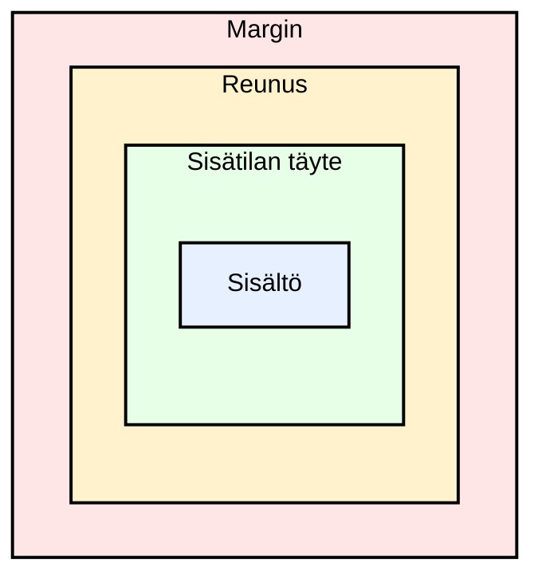

# Johdatus HTML- ja CSS-asetteluihin

## Aiheet

1. CSS Box Model
   - Sisältö, sisätilan täyte, reunus, ulkoinen tyhjä tila
   - Width and height
1. Flexbox: One-dimensional layout
1. Grid: Two-dimensional layout
1. Responsive Basics
   - Why websites must work on different screens
   - Relative sizing
   - Joustavat asettelut
   - Media queries

### Oppimistavoitteet

- explain what the CSS box model is
- use margin, border, padding, and width
- luoda yksinkertaisia asetteluja Flexboxilla
- luoda yksinkertaisia kaksiulotteisia asetteluja Gridillä
- understand the basics of responsive design
- use a simple media query

## Aloitus-HTML

Tätä HTML-koodia käytetään luentoesimerkkien pohjana. Kokeillaksesi esimerkkejä luo tätä luentoa varten uusi hakemisto ja lisää siihen `index.html`-tiedosto, jonka sisältö on seuraava:

```html
<!DOCTYPE html>
<html lang="en">
  <head>
    <meta charset="UTF-8" />
    <meta name="viewport" content="width=device-width, initial-scale=1.0" />
    <title>Layout Basics</title>
    <link rel="stylesheet" href="styles.css" />
  </head>
  <body>
    <h1>Layout Basics</h1>

    <section class="box-demo">
      <h2>Box Model</h2>
      <div class="box">Tämä on laatikko.</div>
      <div class="box">Tämä on toinen laatikko.</div>
    </section>

    <section>
      <h2>Flexbox</h2>
      <div class="flex-container">
        <div class="card">Card 1</div>
        <div class="card">Card 2</div>
        <div class="card">Card 3</div>
      </div>
    </section>

    <section>
      <h2>Grid</h2>
      <div class="grid-container">
        <div class="grid-item">Cell 1</div>
        <div class="grid-item">Cell 2</div>
        <div class="grid-item">Cell 3</div>
        <div class="grid-item">Cell 4</div>
        <div class="grid-item">Cell 5</div>
        <div class="grid-item">Cell 6</div>
      </div>
    </section>
  </body>
</html>
```

Lisää samaan hakemistoon myös tyhjä `styles.css`-tiedosto esimerkkien tyylejä varten.

## Laatikkomalli

**Jokainen HTML-elementti on laatikko!**



- Sisältö: Elementin sisällä oleva varsinainen teksti tai kuva.
- Sisätilan täyte: Elementin sisällä oleva tila sisällön ja reunuksen välissä.
- Reunus: Elementin ympärillä oleva näkyvä viiva.
- Ulkoinen tyhjä tila: Elementin ulkopuolella oleva tila tämän ja muiden elementtien välissä.

Esimerkki: lisää tämä `styles.css`-tiedostoon ja kokeile muuttaa arvoja:

```css
.box {
  width: 200px;
  padding: 20px;
  border: 4px solid black;
  margin: 20px;
  background-color: lightblue;
}
```

Tämä vaikuttaa kaikkiin elementteihin, joilla on luokka `box` (tässä tapauksessa Laatikkomalli-osiossa oleva div). Voit muuttaa arvoja nähdäksesi, miten ne vaikuttavat asetteluun.

Oletusarvoisesti `width` määrittää vain sisältöalueen leveyden. Yllä olevassa esimerkissä laatikon kokonaisleveys on siis: 200px + 20px + 4px + 20px = 244px (sisältö + sisätilan täyte + reunus + ulkoinen tyhjä tila). Jos haluat kokonaisleveydeksi 200px sisältäen sisätilan täytteen ja reunuksen, voit käyttää `box-sizing: border-box;`-määritystä, jolloin leveys sisältää sisätilan täytteen ja reunuksen.

Voit asettaa tämän säännön kaikille elementeille käyttämällä yleisvalitsinta `*`:

```css
* {
  box-sizing: border-box;
}
```

Myös `body`-elementti on laatikko, ja sillä on oletusarvoinen ulkoinen tyhjä tila (selaimen oletus). Voit poistaa sen seuraavasti:

```css
body {
  margin: 0;
}
```

Lisää sitten haluamasi (kaskadoituvat) tyylit, jotta sivusi näyttää paremmalta:

```css
body {
  margin: 0;
  font-family: Arial, sans-serif;
  line-height: 1.5;
  background-color: #f9f9f9;
  color: #333;
  padding: 20px;
}
```

### Erityyppiset laatikot

- Lohkoelementit
  - Alkavat uudelta riviltä
  - Vievät oletusarvoisesti koko leveyden
  - Huomioivat leveyden, korkeuden, ulkoisen tyhjän tilan ja sisätilan täytteen
  - Esimerkkejä: `<div>`, `<p>`, `<section>`
- Tekstin sisäiset elementit
  - Pysyvät samalla rivillä
  - Vievät vain tarvitsemansa leveyden
  - Käyttäytyvät eri tavalla tilan suhteen
  - Esimerkkejä: `<span>`, `<a>`, `<strong>`
  - Huomautus: Tekstin sisäiset elementit ovat laatikoita, mutta ne EIVÄT käyttäydy kuten lohkolaatikot. Tekstin sisäisillä elementeillä:
    - leveys- ja korkeusominaisuudet eivät yleensä vaikuta
    - pystysuuntainen sisätilan täyte ja ulkoinen tyhjä tila eivät vaikuta asetteluun (vaakasuuntainen vaikuttaa)
- Huomautus: jotkin elementit voivat olla sekä lohko- että tekstin sisäisiä elementtejä CSS:n mukaan (esim. `` on oletusarvoisesti tekstin sisäinen, mutta siitä voidaan tehdä lohkoelementti)
- Erikoistapaus: inline-block (aseta: `display: inline-block;`) on yhdistelmä, joka käyttäytyy kuten tekstin sisäinen elementti (pysyy samalla rivillä), mutta huomioi myös leveyden ja korkeuden kuten lohkoelementit.

---

## Flexbox

Flexboxia käytetään kohteiden järjestämiseen yhteen suuntaan:

- either in a row
- or in a column

Se on hyödyllinen esimerkiksi:

- navigation bars
- card rows
- centering content
- spacing items evenly
- aligning items inside a container

### Esimerkki Flexbox-tyylien lisäämisestä HTML-dokumenttiin

Tee ensin Flexbox-säiliö:

```css
.flex-container {
  display: flex;
  gap: 10px;
}
```

Tämä tekee **lapsielementeistä** joustavia ja lisää niiden väliin hieman tilaa. Oletusarvoisesti ne järjestetään riviksi. Jos haluat vaihtaa suunnan sarakkeeksi, voit lisätä: `flex-direction: column;`.

Flexboxilla voit hallita, miten lapsielementit tasataan ja miten niiden välit määritetään. Voit esimerkiksi keskittää kohteet vaakasuunnassa käyttämällä: `justify-content: center;`. Voit tasata kohteet pystysuunnassa keskelle käyttämällä: `align-items: center;`. Kokeile näille ominaisuuksille eri arvoja nähdäksesi, miten ne vaikuttavat asetteluun.

Tyylittele seuraavaksi lapsielementit käyttämällä `card`-luokkaa:

```css
.card {
  padding: 20px;
  background-color: peachpuff;
  border: 1px solid #333;
}
```

Lue lisää Flexboxista: <https://developer.mozilla.org/en-US/docs/Web/CSS/CSS_Flexible_Box_Layout/Basic_Concepts_of_Flexbox>

---

## Grid

Gridiä käytetään kaksiulotteisiin asetteluihin, joissa käytetään sekä rivejä että sarakkeita.

Grid on hyödyllinen esimerkiksi:

- galleries
- koontinäyttöjen asetteluihin
- page sections
- korttiasetteluihin
- larger layout structures

### Esimerkki Grid-tyylien lisäämisestä HTML-dokumenttiin

Lisää seuraavat tyylit tehdäksesi Grid-säiliön:

```css
.grid-container {
  display: grid;
  grid-template-columns: 1fr 1fr;
  gap: 10px;
}
```

- `display: grid` turns the container into a grid
- `grid-template-columns: 1fr 1fr` creates 2 equal columns
- `gap: 10px` adds space between items

Lisää seuraavaksi tyylejä Grid-kohteille:

```css
.grid-item {
  padding: 20px;
  background-color: lightgreen;
  border: 1px solid #333;
}
```

Lue lisää Gridistä: <https://developer.mozilla.org/en-US/docs/Web/CSS/CSS_Grid_Layout/Basic_Concepts_of_Grid_Layout>.

---

## Responsiivisen suunnittelun perusteet

Verkkosivuston tulisi toimia hyvin erilaisilla alustoilla, kuten pöytätietokoneilla, tableteilla ja mobiililaitteilla. Tätä kutsutaan responsiiviseksi suunnitteluksi.

Ihmiset käyttävät verkkosivustoja monen kokoisilla näytöillä. Kannettavalla tietokoneella hyvältä näyttävä asettelu voi hajota puhelimessa. Yleisiä ongelmia, kun sivustoa ei ole suunniteltu responsiivisesti pienemmille näytöille, ovat:

- Sisältö valuu näytön ulkopuolelle
- Text becoming too small to read
- Buttons and links becoming too small to tap
- Layout breaking and elements overlapping
- Images not resizing properly

Mobiilinäytöt ovat nykyään suosituin tapa käyttää verkkoa. Yleinen suunnittelukäytäntö on suunnitella verkkosivustot "mobile-first"-periaatteella, mikä tarkoittaa suunnittelua ensin mobiililaitteille ja sitten asettelun parantamista suuremmille näytöille. Näin varmistetaan, että verkkosivusto on käytettävissä ja näyttää hyvältä mobiililaitteilla, joiden suunnittelu on usein haastavampaa pienemmän näyttökoon vuoksi.

### Responsiivisen suunnittelun perusperiaatteet

1. Käytä joustavia leveyksiä: Vältä kiinteän leveyden antamista kaikelle, esim.:
   - Käytä suhteellisia yksiköitä: Käytä mitoituksessa prosentteja, em-yksiköitä ja rem-yksiköitä pikselien sijaan.
   - Instead of this: `width: 800px;` use: `width: 100%; max-width: 800px;`
1. Käytä Flexboxia tai Gridiä: Nämä työkalut auttavat asetteluja mukautumaan helpommin.
1. Tee kuvista joustavia; tämä estää kuvia valumasta säiliönsä ulkopuolelle:

   ```css
   img {
     max-width: 100%;
     height: auto;
   }
   ```

1. Käytä media-kyselyitä; niiden avulla voit muuttaa tyylejä pienemmille näytöille. Jos näyttö on esimerkiksi 600px leveä tai kapeampi, kortit pinoutuvat pystysuunnassa:

   ```css
   @media (max-width: 600px) {
     .flex-container {
       flex-direction: column;
     }
   }
   ```

   Grid-esimerkki: suurella näytöllä 2 saraketta ja pienellä näytöllä 1 sarake:

   ```css
   .grid-container {
     display: grid;
     grid-template-columns: repeat(2, 1fr);
     gap: 10px;
   }

   @media (max-width: 600px) {
     .grid-container {
       grid-template-columns: 1fr;
     }
   }
   ```

1. Include viewport meta tag in html `head` to make responsive styles to work correctly on mobile devices: `<meta name="viewport" content="width=device-width, initial-scale=1.0">`

### Huomautus CSS-yksiköistä

Yksinkertaiset säännöt aloittelijoille:

- Käytä `px`-yksikköä tarkkoihin mittoihin, kun haluat kiinteän ja täsmällisen hallinnan. Sopii hyvin:
  - reunuksiin
  - small spacing
  - varjoihin
  - fine adjustments
- Käytä suhteellisia yksiköitä (`%`, `rem`, `em`) asetteluun ja tekstiin
  - `%` (percentage, e.g. `width: 100%;`) is based on parent element size and is good for example:
    - asetteluihin
    - säiliöihin
    - kuviin
  - `rem` is based on root font size (e.g. `font-size: 1.2rem;`) and predictable
  - `em` is based on parent element font size and can be more confusing because it stacks

---

<!-- add mermaid support for gh pages -->
<script type="module">
    Array.from(document.getElementsByClassName("language-mermaid")).forEach(element => {
      element.classList.add("mermaid");
    });
    import mermaid from 'https://cdn.jsdelivr.net/npm/mermaid@11/dist/mermaid.esm.min.mjs';
    mermaid.initialize({startOnLoad: true});
</script>
