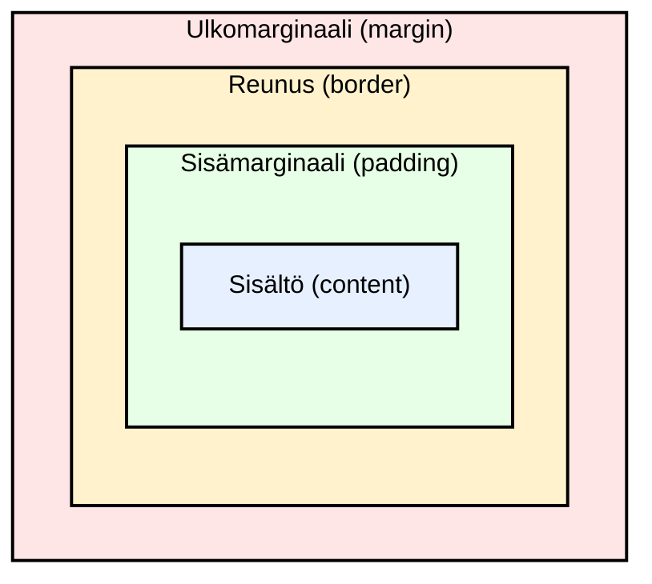

# Johdanto HTML- ja CSS-asetteluihin

## Aiheet

1. CSS-laatikkomalli
   - Sisältö, sisämarginaali, reunus, ulkomarginaali
   - Leveys ja korkeus
1. Flexbox: yksiulotteinen asettelu
1. Grid: kaksiulotteinen asettelu
1. Responsiivisuuden perusteet
   - Miksi verkkosivustojen täytyy toimia erikokoisilla näytöillä
   - Suhteelliset koot
   - Joustavat asettelut
   - Mediakyselyt

### Oppimistavoitteet

- osaat selittää, mikä CSS-laatikkomalli on
- osaat käyttää CSS-ominaisuuksia (_property_) `margin`, `border`, `padding` ja `width`
- osaat luoda yksinkertaisia asetteluja Flexboxilla
- osaat luoda yksinkertaisia kaksiulotteisia asetteluja Gridillä
- ymmärrät responsiivisen suunnittelun perusteet
- osaat käyttää yksinkertaista mediakyselyä (_media query_)

## Lähtö-HTML

Luennon esimerkit perustuvat tähän HTML-koodiin. Jos haluat kokeilla esimerkkejä, luo luentoa varten uusi kansio ja lisää siihen `index.html`-tiedosto, jonka sisältö on seuraava:

```html
<!DOCTYPE html>
<html lang="fi">
  <head>
    <meta charset="UTF-8" />
    <meta name="viewport" content="width=device-width, initial-scale=1.0" />
    <title>Asettelun perusteet</title>
    <link rel="stylesheet" href="styles.css" />
  </head>
  <body>
    <h1>Asettelun perusteet</h1>

    <section class="box-demo">
      <h2>Laatikkomalli</h2>
      <div class="box">Tämä on laatikko.</div>
      <div class="box">Tämä on toinen laatikko.</div>
    </section>

    <section>
      <h2>Flexbox</h2>
      <div class="flex-container">
        <div class="card">Kortti 1</div>
        <div class="card">Kortti 2</div>
        <div class="card">Kortti 3</div>
      </div>
    </section>

    <section>
      <h2>Grid</h2>
      <div class="grid-container">
        <div class="grid-item">Solu 1</div>
        <div class="grid-item">Solu 2</div>
        <div class="grid-item">Solu 3</div>
        <div class="grid-item">Solu 4</div>
        <div class="grid-item">Solu 5</div>
        <div class="grid-item">Solu 6</div>
      </div>
    </section>
  </body>
</html>
```

Lisää samaan kansioon myös tyhjä `styles.css`-tiedosto. Kirjoitat esimerkkien tyylit siihen.

## Laatikkomalli

**Jokainen HTML-elementti on laatikko!**

CSS:n laatikkomalli (_box model_) kuvaa, mistä osista tämä laatikko koostuu:



- Sisältö (_content_): elementin varsinainen sisältö, esimerkiksi teksti tai kuva.
- Sisämarginaali (_padding_): tyhjä tila sisällön ja reunuksen välissä.
- Reunus (_border_): sisämarginaalin ympärille piirrettävä viiva.
- Ulkomarginaali (_margin_): tyhjä tila reunuksen ulkopuolella. Se erottaa elementin muista elementeistä.

Esimerkki: lisää tämä `styles.css`-tiedostoon ja kokeile muuttaa arvoja:

```css
.box {
  width: 200px;
  padding: 20px;
  border: 4px solid black;
  margin: 20px;
  background-color: lightblue;
}
```

Tämä tyylisääntö (_rule_) koskee kaikkia elementtejä, joiden `class`-attribuutissa on luokka `box` (tässä tapauksessa Laatikkomalli-osion `div`-elementtejä). Muuta arvoja ja katso, miten ne vaikuttavat asetteluun.

Oletuksena `width` määrää vain sisältöalueen leveyden. Sisämarginaali ja reunus lisätään molemmille puolille. Yllä olevassa esimerkissä laatikon näkyvä leveys on siis 200px + 2 × 20px + 2 × 4px = 248px (sisältö + sisämarginaalit + reunukset). Ulkomarginaali ei kuulu laatikon leveyteen, mutta se varaa lisäksi 20px tyhjää tilaa laatikon kummallekin puolelle. Jos haluat, että 200px:n leveyteen lasketaan mukaan myös sisämarginaali ja reunus, käytä määrittelyä (_declaration_) `box-sizing: border-box;`.

Voit soveltaa tätä määrittelyä kaikkiin elementteihin yleisvalitsimella (_universal selector_) `*`:

```css
* {
  box-sizing: border-box;
}
```

Myös `body`-elementti on laatikko. Selain antaa sille oletuksena ulkomarginaalin. Voit poistaa sen näin:

```css
body {
  margin: 0;
}
```

Lisää sitten haluamiasi tyylejä, jotta sivusi näyttää paremmalta. Osa `body`-elementin tyyleistä, kuten fontti ja tekstin väri, periytyy myös sen sisällä oleviin elementteihin:

```css
body {
  margin: 0;
  font-family: Arial, sans-serif;
  line-height: 1.5;
  background-color: #f9f9f9;
  color: #333;
  padding: 20px;
}
```

### Erilaiset laatikot

- Lohkoelementit (_block elements_)
  - alkavat uudelta riviltä
  - vievät oletuksena koko käytettävissä olevan leveyden
  - ominaisuudet `width`, `height`, `margin` ja `padding` vaikuttavat niihin normaalisti
  - esimerkkejä: `<div>`, `<p>`, `<section>`
- Rivinsisäiset elementit (_inline elements_)
  - pysyvät samalla rivillä
  - vievät vain tarvitsemansa leveyden
  - sisä- ja ulkomarginaalit toimivat niissä eri tavalla (ks. alla)
  - esimerkkejä: `<span>`, `<a>`, `<strong>`
  - Huom.: rivinsisäiset elementit ovat laatikoita, mutta ne EIVÄT käyttäydy kuten lohkoelementit. Rivinsisäisissä elementeissä:
    - ominaisuudet `width` ja `height` eivät yleensä vaikuta
    - pystysuuntaiset sisä- ja ulkomarginaalit eivät vaikuta asetteluun (vaakasuuntaiset vaikuttavat)
- Huom.: elementin tyyppiä voi muuttaa CSS:n `display`-ominaisuudella (esim. `` on oletuksena rivinsisäinen, mutta määrittely `display: block;` tekee siitä lohkoelementin).
- Erikoistapaus: inline-block (`display: inline-block;`) on välimuoto. Se pysyy rivinsisäisen elementin tavoin samalla rivillä, mutta sille voi lohkoelementin tavoin asettaa leveyden ja korkeuden.

---

## Flexbox

Flexboxilla järjestetään elementtejä yhteen suuntaan:

- joko riviin
- tai sarakkeeseen.

Flexbox sopii esimerkiksi näihin:

- navigointipalkit
- korttirivit
- sisällön keskittäminen
- elementtien sijoittaminen tasavälein
- elementtien tasaaminen säiliön (_container_) eli niitä ympäröivän elementin sisällä.

### Esimerkki Flexbox-tyylien lisäämisestä HTML-dokumenttiin

Tee ensin flex-säiliö:

```css
.flex-container {
  display: flex;
  gap: 10px;
}
```

Nyt säiliön **lapsielementit** (elementit, jotka ovat suoraan säiliön sisällä) asettuvat joustavasti, ja `gap` lisää niiden väliin hieman tilaa. Oletuksena lapsielementit järjestetään riviin. Jos haluat suunnaksi sarakkeen, lisää määrittely `flex-direction: column;`.

Flexboxilla voit määrätä, miten lapsielementit tasataan ja miten niiden väliin jaetaan tilaa. Kun suunta on rivi, määrittely `justify-content: center;` keskittää elementit vaakasuunnassa ja `align-items: center;` pystysuunnassa. Kokeile näille ominaisuuksille eri arvoja ja katso, miten ne vaikuttavat asetteluun.

Muotoile seuraavaksi lapsielementit `card`-luokan avulla:

```css
.card {
  padding: 20px;
  background-color: peachpuff;
  border: 1px solid #333;
}
```

Lue lisää Flexboxista: <https://developer.mozilla.org/en-US/docs/Web/CSS/CSS_Flexible_Box_Layout/Basic_Concepts_of_Flexbox>

---

## Grid

Gridillä (ruudukko) tehdään kaksiulotteisia asetteluja, joissa on sekä rivejä että sarakkeita.

Grid sopii esimerkiksi näihin:

- kuvagalleriat
- hallintapaneelit (_dashboard_)
- sivun osiot
- korttiasettelut
- koko sivun asettelu.

### Esimerkki Grid-tyylien lisäämisestä HTML-dokumenttiin

Tee grid-säiliö lisäämällä seuraavat tyylit:

```css
.grid-container {
  display: grid;
  grid-template-columns: 1fr 1fr;
  gap: 10px;
}
```

- `display: grid` tekee säiliöstä ruudukon
- `grid-template-columns: 1fr 1fr` luo kaksi yhtä leveää saraketta (yksikkö `fr` tarkoittaa osuutta vapaasta tilasta)
- `gap: 10px` lisää tilaa elementtien väliin

Lisää seuraavaksi tyylit ruudukon elementeille:

```css
.grid-item {
  padding: 20px;
  background-color: lightgreen;
  border: 1px solid #333;
}
```

Lue lisää Gridistä: <https://developer.mozilla.org/en-US/docs/Web/CSS/CSS_Grid_Layout/Basic_Concepts_of_Grid_Layout>.

---

## Responsiivisen suunnittelun perusteet

Verkkosivuston pitää toimia hyvin erilaisilla laitteilla, kuten pöytäkoneilla, tableteilla ja puhelimilla. Responsiivinen suunnittelu (_responsive design_) tarkoittaa, että sivun asettelu mukautuu näytön kokoon.

Ihmiset käyttävät verkkosivustoja monenkokoisilla näytöillä. Asettelu, joka näyttää hyvältä kannettavalla tietokoneella, voi hajota puhelimessa. Jos sivustoa ei ole suunniteltu responsiiviseksi, pienillä näytöillä tulee usein seuraavia ongelmia:

- sisältö ei mahdu näytölle, vaan valuu sen reunan yli
- teksti on liian pientä luettavaksi
- painikkeet ja linkit ovat liian pieniä napautettaviksi
- asettelu hajoaa ja elementit menevät päällekkäin
- kuvien koko ei mukaudu näyttöön.

Mobiililaitteet ovat nykyään yleisin tapa käyttää verkkoa. Siksi verkkosivustot suunnitellaan usein ”mobiili ensin” -periaatteella (_mobile first_): sivusto suunnitellaan ensin mobiililaitteille, ja asettelua laajennetaan sen jälkeen suuremmille näytöille. Näin sivusto on varmasti käytettävä ja näyttää hyvältä myös mobiililaitteilla. Pieni näyttö on usein suunnittelun kannalta haastavin.

### Responsiivisuuden perusperiaatteet

1. Käytä joustavia leveyksiä äläkä anna kaikelle kiinteää leveyttä. Esimerkiksi:
   - Käytä kokojen määrittelyyn pikselien sijaan suhteellisia yksiköitä: prosentteja sekä `em`- ja `rem`-yksiköitä (ks. alla).
   - Käytä määrittelyn `width: 800px;` sijaan määrittelyjä `width: 100%; max-width: 800px;`. Silloin elementti kapenee pienellä näytöllä, mutta ei kasva yli 800px:n.
1. Käytä Flexboxia tai Gridiä. Niillä tehdyt asettelut mukautuvat helpommin näytön kokoon.
1. Tee kuvista joustavia, jotta ne eivät valu säiliönsä yli:

   ```css
   img {
     max-width: 100%;
     height: auto;
   }
   ```

1. Käytä mediakyselyjä. Mediakyselyllä voit antaa eri tyylit esimerkiksi pienille näytöille. Seuraavassa esimerkissä kortit asettuvat allekkain, jos selainikkunan leveys on enintään 600px:

   ```css
   @media (max-width: 600px) {
     .flex-container {
       flex-direction: column;
     }
   }
   ```

   Grid-esimerkki, jossa suurella näytöllä on kaksi saraketta ja pienellä yksi:

   ```css
   .grid-container {
     display: grid;
     grid-template-columns: repeat(2, 1fr);
     gap: 10px;
   }

   @media (max-width: 600px) {
     .grid-container {
       grid-template-columns: 1fr;
     }
   }
   ```

1. Lisää HTML-dokumentin `head`-elementtiin viewport-määrittely `meta`-elementtinä. Se kertoo mobiiliselaimelle, että sivu näytetään laitteen todellisella leveydellä. Ilman sitä responsiiviset tyylit eivät toimi oikein mobiililaitteilla: `<meta name="viewport" content="width=device-width, initial-scale=1.0">`

### Huomio CSS-yksiköistä

Yksinkertaiset säännöt aloittelijoille:

- Käytä `px`-yksikköä, kun haluat koon pysyvän kiinteänä ja tarkkana. Se sopii esimerkiksi:
  - reunuksiin
  - pieniin välistyksiin
  - varjoihin
  - hienosäätöön.
- Käytä suhteellisia yksiköitä (`%`, `rem`, `em`) asettelussa ja tekstin koossa.
  - `%` (prosentti, esim. `width: 100%;`) lasketaan yläelementin (eli ympäröivän elementin) koosta, ja se sopii esimerkiksi:
    - asetteluihin
    - säiliöihin
    - kuviin.
  - `rem` lasketaan juurielementin (`html`) fonttikoosta (esim. `font-size: 1.2rem;`), joten sen tuottama koko on helppo ennakoida.
  - `em` lasketaan elementin fonttikoosta, joka yleensä periytyy yläelementiltä. Se voi olla hankalampi, koska sen vaikutus kertautuu sisäkkäisissä elementeissä.

---

<!-- add mermaid support for gh pages -->
<script type="module">
    Array.from(document.getElementsByClassName("language-mermaid")).forEach(element => {
      element.classList.add("mermaid");
    });
    import mermaid from 'https://cdn.jsdelivr.net/npm/mermaid@11/dist/mermaid.esm.min.mjs';
    mermaid.initialize({startOnLoad: true});
</script>
