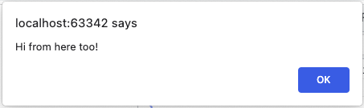
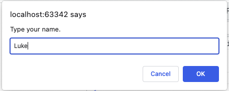

# JavaScript 1 - Vuorovaikutteiset ohjelmat

Tässä moduulissa opit kirjoittamaan yksinkertaisia, vuorovaikutteisia JavaScript-ohjelmia, jotka toimivat verkkoselaimessa.

Koska Pythonin pitäisi olla sinulle jo tuttu, voit tarkistaa tärkeimmät erot täältä: [Javascript vs Python Syntax Cheatsheet](https://medium.com/geekculture/javascript-vs-python-syntax-cheatsheet-9bc7c59599c6).

Vuorovaikutteisuudella tarkoitetaan mallia, jossa ohjelma

1. lukee syötettä (input) käyttäjältä
2. käsittelee syötettä
3. tulostaa tuloksen tai päivittää käyttöliittymää.

Esimerkki tästä on ohjelma, jossa käyttäjä syöttää kaksi lukua ja ohjelma tulostaa näiden lukujen summan. Käyttäjä antaa kaksi syötettä: ensimmäisen ja toisen luvun (vaihe 1), ohjelma laskee summan (vaihe 2) ja ohjelma tulostaa summan (vaihe 3).

## JavaScriptin lisääminen HTML-dokumentteihin

Voit lisätä JavaScriptiä HTML:ään käyttämällä `<script>`-elementtiä kahdella tavalla: upotettuna tai lataamalla ulkoisen tiedoston.

### Upotettuna

```html
<!DOCTYPE html>
<html>
  <head>
    <meta charset="UTF-8" />
    <title>Testing JavaScript</title>
  </head>
  <body>
    <h1>Example</h1>
    <script>
      "use strict";
      console.log("Tämä teksti tulostetaan konsoliin.");
    </script>
  </body>
</html>
```

### Ulkoinen tiedosto

example.js:

```javascript
"use strict";
console.log("Tämä teksti tulostetaan konsoliin.");
```

example.html:

```html
<!DOCTYPE html>
<html>
  <head>
    <meta charset="UTF-8" />
    <title>Testing JavaScript</title>
    <script src="example.js" defer></script>
  </head>
  <body>
    <h1>Example</h1>
  </body>
</html>
```

Ulkoisten JavaScript-tiedostojen käyttäminen on suositeltu menetelmä, koska se helpottaa koodin ylläpitoa todellisissa projekteissa. Huomaa `<script>`-elementin `defer`-attribuutti. Defer määrittää, että komentosarja ladataan samanaikaisesti sivun jäsentämisen kanssa ja suoritetaan sen jälkeen, kun sivun jäsentäminen on valmis. Tämä tarkoittaa, että komentosarjat suoritetaan sen jälkeen, kun kaikki dokumentin HTML-elementit ovat valmiita. Jos HTML-elementtejä ei ole olemassa, JavaScript ei tietenkään voi käsitellä niitä eikä sovellus toimi.

Ennen `defer`-attribuutin olemassaoloa sama saavutettiin sijoittamalla `<script>`-elementit dokumentin loppuun juuri ennen `</body>`-sulkevaa tagia.

## Tulostaminen

JavaScript tarjoaa kolme tulostusvaihtoehtoa:

1. Konsolin lokituloste
2. Ponnahdusikkunan varoitus
3. Tulostaminen verkkosivulle

Tarkastellaan seuraavaksi jokaista tulostusmenetelmää. Jatkossa konsolin lokitulostusta käytetään eniten, koska se sopii paremmin ohjelmoinnin oppimiseen: tulosteet näkyvät heti, eikä kaikkia varoitusikkunoita tarvitse kuitata erikseen.

### Konsolin loki

Konsolin loki tuotetaan `console.log()`-metodilla. Lokituloste näkyy yleensä selaimen kehittäjätyökalujen Console-välilehdellä.

```javascript
console.log("Tervehdys, kumppani!");
```

Tuloste konsoli-ikkunassa:

```monospace
Howdy partner!
```

### Ponnahdusikkuna

Ponnahdusikkunan viesti tuotetaan `alert`-funktiolla:

```javascript
alert("Tervehdys täältäkin!");
```

Selaimessa näkyvä alert-ikkuna näyttää tältä:



### Tulostaminen into a web page

JavaScript-ohjelma voi tulostaa HTML-sisältöä osaksi verkkosivua muokkaamalla DOMia. Esimerkiksi seuraava HTML-sivu sisältää JavaScript-osan, joka tulostaa ohjelmallisesti sisältöä kappale-elementtiin (`<p id="target"></p>`):

```html
<!DOCTYPE html>
<html>
  <head>
    <meta charset="UTF-8" />
    <title>Testing JavaScript</title>
  </head>
  <body>
    <h1>Greeting</h1>
    <p id="target"></p>
    <script>
      "use strict";
      const name = "Frank";
      document.querySelector("#target").innerHTML =
        "Hyvää huomenta, " + name + "!";
    </script>
  </body>
</html>
```

Avaamasi verkkosivu näyttää selaimessasi tältä:


Opimme myöhemmin tarkemmin, miten DOMia käsitellään. Tässä vaiheessa riittää ymmärtää, että koodin osa `document.querySelector('#target')` etsii kappale-elementin, jonka id on "target", ja kyseisen elementin `innerHTML`-ominaisuudeksi asetetaan tervehdyksen sisältävä merkkijono.

Käytännössä ohjelmistojen tulosteet kerätään yleensä omiin funktioihinsa, joita kutsutaan jonkin tapahtuman seurauksena, esimerkiksi verkkosivulla olevan painikkeen painamisesta. Tämä tulostusmenetelmä edellyttää funktioiden ja dokumenttioliomallin käsitteiden ymmärtämistä, joten sitä ei käsitellä tässä yhteydessä enempää.

Tästä lähtien esimerkeissä käytetään pääasiassa konsolitulostusvaihtoehtoa eli `console.log()`-metodia.

### Merkkijonoliteraalit

Edellä tulostetut merkkijonot, kuten `Howdy, partner!`, ovat esimerkkejä merkkijonoliteraaleista. Literaalilla tarkoitetaan arvoa, joka kirjoitetaan ohjelmakoodiin sellaisenaan eli se on kovakoodattu. Merkkijonoliteraalit ympäröidään aina lainausmerkeillä. JavaScriptissä on tavallista käyttää yksinkertaisia lainausmerkkejä.

Esimerkkejä merkkijonoliteraaleista:

- `'Metropolia'`
- `'A2'`
- `'Here is some text.'`

Lainausmerkkien perusteella JavaScript-tulkki tunnistaa, että kyseessä on merkkijonoliteraali. Tällöin tulkki osaa käsitellä sen oikein esimerkiksi silloin, kun sitä pyydetään tulostamaan sen sisältö sellaisenaan.

## Muuttujat

Ohjelman tarvitsemat arvot voidaan tallentaa muuttujiin. Muuttujaan tallennettuja arvoja voidaan lukea monta kertaa ohjelman aikana, ja kerran asetettuja arvoja voidaan muuttaa.

JavaScriptin muuttujat määritellään `const`-, `let`- tai `var`-lauseella. Avainsanan valinta vaikuttaa muuttujan näkyvyyteen: näkyykö muuttuja koodilohkon vai funktion tasolla.

Näitä ohjelmointikielen rakenteita käsitellään myöhemmin; tässä vaiheessa riittää, että opit määrittelemään muuttujia `const`- ja `let`-avainsanoilla.

Esimerkiksi `name`-niminen muuttuja määritellään seuraavasti:

```javascript
let name;
```

Tässä vaiheessa muuttuja on määritelty eli se on ohjelman näkökulmasta olemassa: sille voidaan asettaa arvo ja sen arvo voidaan lukea. Arvo voidaan asettaa ja lukea kuinka monta kertaa tahansa; muuttujan arvo voidaan kuitenkin lukea vasta sen jälkeen, kun muuttuja on alustettu eli sille on asetettu arvo ensimmäisen kerran.

Edellä oleva muuttuja voidaan alustaa seuraavasti:

```javascript
name = "Myles";
```

Muuttuja voidaan myös määritellä ja alustaa samanaikaisesti, mikä on itse asiassa yleisempää:

```javascript
const name = "Myles";
```

Muuttujat ovat löyhästi tyypitettyjä, joten muuttujaa määriteltäessä ei tarvitse ilmoittaa, millainen arvo muuttujaan tallennetaan — onko se kokonaisluku (kuten 17), liukuluku (kuten 21.38) vai merkkijono (kuten "tietokone").

Muuttujien nimet ovat ohjelmoijan keksimiä symboleja. Nimet voivat sisältää kirjaimia, numeroita, alaviivoja ja dollarimerkkejä. Muuttujan nimi ei kuitenkaan voi alkaa numerolla. Esimerkiksi `number2` ja `kilograms` ovat kelvollisia muuttujien nimiä, mutta `7days` tai `super-high` eivät ole. Muuttujien nimissä voidaan käyttää skandinaavisia merkkejä, mutta niitä usein vältetään, koska merkkien tulostamisessa voi ilmetä ongelmia, jos tietokoneellasi tai selaimellasi on erilaiset maa-asetukset.

Esimerkiksi seuraava ohjelma määrittelee kaksi muuttujaa, joista ensimmäiseen tallennetaan merkkijono ja toiseen kokonaisluku. Ohjelma tulostaa sitten muuttujien arvot, korvaa ne uusilla arvoilla ja tulostaa muuttuneet arvot:

```javascript
let number, name;
number = 153;
name = "Anna";
console.log(number);
console.log(name);
number = -17;
name = "Pekka";
console.log(number);
console.log(name);
```

Ohjelman tuottama tuloste:

```monospace
153
Anna
-17
Pekka
```

### Muuttujien tyypit

Edellä käsiteltiin kahta muuttujatyyppiä: kokonaislukuja ja merkkijonoja. JavaScriptissä on kuusi primitiivistä muuttujatyyppiä:

- boolean-tyyppi, joka voi olla `true` tai `false`
- numeerinen tyyppi, joka voi sisältää kokonaisluvun tai liukuluvun.
- merkkijono
- `null`, joka ilmaisee, että arvo on tyhjä.
- `undefined`, joka ilmaisee, ettei määritettyä muuttujaa ole vielä alustettu, jolloin sen tyyppi on tuntematon.
- symboli yksiselitteisten tunnisteiden luomiseen.

Edellä lueteltujen perustyyppien lisäksi JavaScriptissä on oliotyyppi, joka voi sisältää rakenteeltaan mielivaltaisen monimutkaisia olioita.

Muuttujan tyypin voi tarkistaa `typeOf`-operaatiolla:

```javascript
const name = "Ahmed";
console.log(typeof name);
```

The program prints out "merkkijono".

### Tyypin muuttaminen

A numeric variable can be converted to a merkkijono using the `toString` method:

```javascript
const age = 23;
const ageStr = age.toString();
```

Muunnos toiseen suuntaan voidaan tehdä parseInt- tai parseFloat-metodilla:

```javascript
const ageStr = "23";
const moneyStr = "15.48";

const age = parseInt(ageStr);
const money = parseFloat(moneyStr);
```

Muunnos voidaan tehdä myös unaarisella `+`-operaatiolla:

```javascript
const money = +moneyStr;
```

### Combining merkkijonos

String concatenation is performed with the `+` operation. For example, the following statement constructs an output of three submerkkijonos:

```javascript
console.log("Hyvää" + " huomenta" + " kaikille.");
```

Tuloste:

```
Good morning all.
```

Alternatively, the submerkkijonos and the concatenated merkkijono could be stored in the variables and the value of the variable containing the concatenated merkkijono printed:

```javascript
let first, second, third, all;
first = "Hyvää ";
second = "huomenta ";
third = "kaikille.";
all = first + second + third;
console.log(all);
```

## Template merkkijonos (Template literals)

Template literals are literals delimited with backtick (`) characters, allowing for multi-line merkkijonos and for merkkijono interpolation with embedded expressions (and for special constructs called tagged templates which is not covered here).

```javascript
const someText = `Tässä on monirivistä tekstiä.
Tässä on toinen rivi`;
```

The formal name of template merkkijono is template literal. They are called template merkkijonos because they are used most commonly for merkkijono interpolation (to create merkkijonos by doing substitution of placeholders). Syntax is similar to Pythons f-merkkijono:

```javascript
const name = "Herra Skywalker";
const greeting = `Hei ${name}`;
```

## Syötteen lukeminen

Edellisissä esimerkeissä ohjelmien tuottamat tulosteet olivat aina samanlaisia, eikä käyttäjä voinut vaikuttaa niiden sisältöön millään tavalla.

Tällaiset ohjelmat ovat harvinaisia. Yleensä halutaan, että käyttäjä voi antaa ohjelmalle syötteitä, jotka vaikuttavat ohjelman toimintaan.

Syöte luetaan [`prompt ()`](BOM-DOM-event.md#prompt-method)-funktiolla. The argument to the function is given to a merkkijono, which is presented to the user in a dialog box. Seuraava lause pyytää käyttäjältä tätä nimeä:

```javascript
prompt("Kirjoita nimesi.");
```

Selaimen ikkunaan ilmestyy valintaikkuna:



Tässä muodossa kysymys on kuitenkin melko hyödytön, koska käyttäjän antamaa nimeä ei oteta talteen. Siksi käyttäjältä luetut syötteet tallennetaan lähes poikkeuksetta muuttujiin, jotta luettuja syötteitä voidaan käyttää myöhemmin ohjelmassa.

Seuraava esimerkkiohjelma kysyy käyttäjän nimeä ja tervehtii häntä henkilökohtaisesti:

```javascript
const name = prompt("Kirjoita nimesi.");
console.log("Mukava tavata, " + name);
```

## Matemaattiset operaatiot

Numeerisille muuttujille voidaan tehdä matemaattisia operaatioita: esimerkiksi niitä voidaan laskea yhteen ja vähentää sekä pyöristää haluttuun tarkkuuteen. Numeerisia arvoja voidaan myös tuottaa satunnaislukugeneraattorilla.

### Peruslaskutoimitukset

JavaScriptin peruslaskutoimitukset ovat:

- yhteenlasku (`+`)
- vähennyslasku (`-`)
- kertolasku (`*`)
- jakolasku (`/`)
- jakojäännös (`%`)

```javascript
let number = 3;
number = number * 7; // the value is now 21
number = 1 + number / 2; // the value is now 11.5
console.log(number);
```

Seuraavilla operaatioilla muuttujan arvoa voidaan muuttaa yhdellä:

- kasvata yhdellä (`++`)
- vähennä yhdellä (`--`)

```javascript
let number = 3;
number++; // the value is now 4
number--; // the value is again 3
console.log(number);
```

Voit myös muuttaa arvoa useammalla kerralla:

- kasvata vakiolla (`+=`)
- vähennä vakiolla (`-=`)
- kerro vakiolla (`*=`)
- jaa vakiolla (`/=`)

```javascript
let number = 3;
number *= 2; // the value is now 6
number /= 3; // the value is now 2
number += 7; // the value is now 9
number -= 8; // the value is now 1
console.log(number);
```

### Matemaattiset funktiot

Monet matemaattiset operaatiot – kuten kosinin laskeminen tai neliöjuuren ottaminen – tehdään `Math`-olion matemaattisilla metodeilla. Esimerkiksi seuraava ohjelma tulostaa luvun 3 neliöjuuren (`Math.sqrt`) ja satunnaisluvun (`Math.random`) nollan ja yhden väliltä:

```javascript
console.log(Math.sqrt(3));
console.log(Math.random());
```

Math-olion tarjoamia metodeja ei tarvitse opetella ulkoa.Kun kirjoitat koodia IDE:ssä (esimerkiksi WebStormissa) ja kirjoitat pisteen jälkeen sanan `Math`, IDE tarjoaa luettelon käytettävissä olevista metodeista ja vakioista. Luettelosta näet myös, mitä argumentteja kullekin metodille täytyy antaa; esimerkiksi neliöjuurimetodi `sqrt` vaatii argumentin, josta juuri otetaan, kun taas random-metodi ei vaadi argumentteja.

Voit tutustua käytettävissä oleviin metodeihin myös JavaScriptin virallisen spesifikaation kautta: <http://www.ecma-international.org/ecma-262/6.0/> (luku 20.2) tai voit käyttää jotakin lukuisista JavaScript-lähteistä ja opetusmateriaaleista Internetissä.

## Muuttujien automaattisen määrittelyn estäminen

JavaScript-ohjelmat suoritetaan oletuksena niin sanotussa sloppy-tilassa, jossa muuttujia ei ole pakollista määritellä sanalla `let` tai `const`. Tällöin globaali (eli koko ohjelman laajuinen) muuttuja määritellään automaattisesti joka kerta, kun ohjelmoija sijoittaa muuttujaan arvon ensimmäisen kerran.

Esimerkiksi seuraava ohjelma voisi näyttää toimivan onnistuneesti:

```javascript
let diameter = 0;
diametr = 2340;
console.log("Halkaisija on : " + diameter);
```

Ohjelma tulostaa kuitenkin halkaisijaksi nollan; tämä johtuu ohjelmoijan tekemästä kirjoitusvirheestä muuttujan nimessä. Ohjelma luo aluksi `let`-lauseella määritellyn `diameter`-nimisen muuttujan. Toisella rivillä arvo kuitenkin sijoitetaan eri nimiseen muuttujaan, jonka nimeksi on vahingossa kirjoitettu väärin `diametr`. Tällöin luodaan automaattisesti toinen muuttuja.

Lopulta ohjelmassa on kaksi eri muuttujaa, ja ohjelma tulostaa halkaisijaksi nollan, koska oikea arvo `2340` sijoitettiin väärään muuttujaan. Sen sijaan `let`-lauseella määritellyn oikein kirjoitetun muuttujan arvo oli pysynyt nollassa.

Edellä kuvatun kaltaiset tilanteet aiheuttavat vaikeasti löydettäviä semanttisia virheitä, joissa ohjelman suoritus ei kaadu virheilmoitukseen, vaan ohjelma toimii virheellisesti.

Siksi määrittelemättömien globaalien muuttujien automaattinen luominen pitäisi estää. Tämä voidaan tehdä lisäämällä ohjelman alkuun `use strict` -lause, joka kirjoitetaan lainausmerkkien sisään seuraavasti:

```javascript
"use strict";
```

Tämän seurauksena ohjelma suoritetaan strict-tilassa. Strict-tilassa tulostetaan virheilmoitus aina, kun määrittelemättömään muuttujaan yritetään sijoittaa arvo. Globaalia muuttujaa ei enää luoda automaattisesti, vaan se edellyttää `let`- tai `const`-lauseen kirjoittamista. Tämän asetuksen käyttäminen muuttaa käyttäjän vahingossa tekemät huomaamatta jäävät kirjoitusvirheet näkyviksi syntaksivirheiksi. Tämä helpottaa oikein toimivien ohjelmien kirjoittamista.

Edellä kuvatusta syystä on hyvä käyttää `use strict` -määrittelyä jokaisessa ohjelmassa.

## Nimetyt vakiot

Edellisissä esimerkeissä käytettiin muuttujia, jotka määriteltiin pääasiassa `let`-lauseella. Muuttujan arvoja voidaan nimensä mukaisesti muuttaa ohjelman suorituksen aikana.

Joskus voi tulla vastaan tilanne, jossa haluat luoda muuttujan säilyttämään monimutkaisen arvon, mutta muuttujan arvon ei ole tarkoitus muuttua ohjelman suorituksen aikana. Esimerkki tällaisesta arvosta on esimerkiksi muuntokerroin 4.1888 kahden energian yksikön, kalorien ja joulejen, välillä.

Tällaisen vakioarvon säilyttämiseen voidaan käyttää sanalla `const` määriteltyä nimettyä vakiota. Nimetyn vakion arvo voidaan asettaa kerran, mutta sitä ei voi muuttaa.

Seuraava ohjelma kysyy käyttäjältä kaksi kaloriarvoa ja muuntaa ne jouleiksi:

```javascript
const multiplier = 4.1868;
const k1 = prompt("Anna lounaalla saadun energian määrä (kcal).");
const k2 = prompt("Anna päivällisellä saadun energian määrä (kcal).");

const j1 = multiplier * k1;
const j2 = multiplier * k2;

console.log(`Aamiaisella sait ${j1} kJ ja päivällisellä sait ${j2} kJ.`);
```

Nimetyn vakion `multiplier` käyttäminen strict-tilassa varmistaa, että molemmissa kertolaskuissa käytetään oikeaa arvoa. Jos muuntokertoimet kirjoitettaisiin ohjelmakoodiin kahdesti, toisen kertoimen desimaaleihin voisi tulla kirjoitusvirhe, mikä johtaisi pieneen mutta vaikeasti havaittavaan laskuvirheeseen lopputuloksessa.

### Nimettyjen vakioiden käyttö JavaScriptissä verrattuna muihin kieliin

Toisin kuin monissa muissa kielissä, JavaScriptissä lähes kaikki muuttujat esitetään yleensä nimettyinä vakioina. Ota siis tavaksi käyttää `const`-avainsanaa aina, kun luot uuden muuttujan. Tarvitset `let`-avainsanaa vain silloin, kun muuttujan arvoa täytyy muuttaa myöhemmin ohjelmassa.

---

<!-- add mermaid support for gh pages -->
<script type="module">
    Array.from(document.getElementsByClassName("language-mermaid")).forEach(element => {
      element.classList.add("mermaid");
    });
    import mermaid from 'https://cdn.jsdelivr.net/npm/mermaid@11/dist/mermaid.esm.min.mjs';
    mermaid.initialize({startOnLoad: true});
</script>
