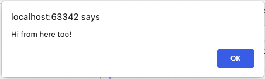
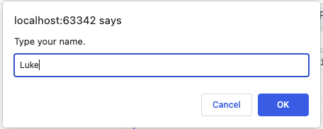

# JavaScript 1: Vuorovaikutteiset ohjelmat

Tässä moduulissa opit kirjoittamaan yksinkertaisia, vuorovaikutteisia JavaScript-ohjelmia, jotka toimivat selaimessa.

Koska Python on sinulle jo tuttu, voit tarkistaa kielten tärkeimmät erot täältä: [Javascript vs Python Syntax Cheatsheet](https://medium.com/geekculture/javascript-vs-python-syntax-cheatsheet-9bc7c59599c6).

Vuorovaikutteisuudella tarkoitetaan mallia, jossa ohjelma

1. lukee käyttäjältä syötteen (_input_)
2. käsittelee syötteen
3. tulostaa tuloksen tai päivittää käyttöliittymää.

Esimerkki tästä on ohjelma, jossa käyttäjä syöttää kaksi lukua ja ohjelma tulostaa niiden summan. Käyttäjä antaa kaksi syötettä eli ensimmäisen ja toisen luvun (vaihe 1), ohjelma laskee summan (vaihe 2) ja tulostaa sen (vaihe 3).

## JavaScriptin lisääminen HTML-dokumenttiin

Voit lisätä JavaScriptiä HTML-dokumenttiin `<script>`-elementillä kahdella tavalla: suoraan dokumenttiin (_inline_) tai lataamalla ulkoisen tiedoston.

### Suoraan dokumenttiin

```html
<!DOCTYPE html>
<html>
  <head>
    <meta charset="UTF-8" />
    <title>JavaScriptin testaus</title>
  </head>
  <body>
    <h1>Esimerkki</h1>
    <script>
      "use strict";
      console.log("Tämä teksti tulostetaan konsoliin.");
    </script>
  </body>
</html>
```

### Ulkoinen tiedosto

example.js:

```javascript
"use strict";
console.log("Tämä teksti tulostetaan konsoliin.");
```

example.html:

```html
<!DOCTYPE html>
<html>
  <head>
    <meta charset="UTF-8" />
    <title>JavaScriptin testaus</title>
    <script src="example.js" defer></script>
  </head>
  <body>
    <h1>Esimerkki</h1>
  </body>
</html>
```

Ulkoinen JavaScript-tiedosto on suositeltavampi tapa, koska se helpottaa koodin ylläpitoa todellisissa projekteissa. Huomaa `<script>`-elementin `defer`-attribuutti. Selain lukee HTML-koodin ja rakentaa siitä sivun elementit; tätä kutsutaan jäsentämiseksi. `defer`-attribuutti määrittää, että skripti ladataan jäsentämisen aikana mutta suoritetaan vasta, kun koko sivu on jäsennetty. Skriptit suoritetaan siis vasta, kun dokumentin kaikki HTML-elementit ovat valmiina. JavaScript ei voi käsitellä HTML-elementtejä, joita ei vielä ole olemassa, eikä sovellus silloin toimisi.

Ennen `defer`-attribuuttia sama saavutettiin sijoittamalla `<script>`-elementit dokumentin loppuun juuri ennen `</body>`-lopputagia.

## Tulostaminen

JavaScriptissä on kolme tapaa tulostaa:

1. tulostus konsoliin
2. ponnahdusikkuna
3. tulostus verkkosivulle.

Tarkastellaan seuraavaksi jokaista tulostustapaa. Jatkossa käytetään eniten konsoliin tulostamista, koska se sopii ohjelmoinnin opetteluun parhaiten: tulosteet näkyvät kerralla, eikä jokaista ikkunaa tarvitse kuitata erikseen.

### Konsoli

Konsoliin (_console_) tulostetaan `console.log()`-metodilla. Tuloste näkyy selaimen kehittäjätyökalujen (_developer tools_) Console-välilehdellä. Kehittäjätyökalut avautuvat useimmissa selaimissa F12-näppäimellä.

```javascript
console.log("Moikka, kaveri!");
```

Tuloste konsoli-ikkunassa:

```monospace
Moikka, kaveri!
```

### Ponnahdusikkuna

Ponnahdusikkuna luodaan `alert`-funktiolla:

```javascript
alert("Terveiset täältäkin!");
```

Selaimeen avautuva ponnahdusikkuna näyttää tältä:



### Tulostus verkkosivulle

JavaScript-ohjelma voi tulostaa HTML-sisältöä osaksi verkkosivua muokkaamalla DOMia (_Document Object Model_, dokumenttioliomalli). DOM on selaimen muistissa oleva olioiden rakenne, joka kuvaa sivun HTML-elementit. Esimerkiksi seuraavan HTML-sivun `<script>`-elementissä on JavaScript-koodi, joka tulostaa sisältöä kappale-elementtiin (`<p id="target"></p>`):

```html
<!DOCTYPE html>
<html>
  <head>
    <meta charset="UTF-8" />
    <title>JavaScriptin testaus</title>
  </head>
  <body>
    <h1>Tervehdys</h1>
    <p id="target"></p>
    <script>
      "use strict";
      const name = "Frank";
      document.querySelector("#target").innerHTML =
        "Hyvää huomenta, " + name + "!";
    </script>
  </body>
</html>
```

Avaamasi verkkosivu näyttää selaimessa tältä:


DOMin käsittelyä opetellaan tarkemmin myöhemmin. Toistaiseksi riittää ymmärtää, että koodi `document.querySelector('#target')` etsii kappale-elementin, jonka `id`-attribuutin arvo on ”target”. Sen jälkeen elementin `innerHTML`-ominaisuuden (_property_) arvoksi asetetaan tervehdyksen sisältävä merkkijono.

Käytännössä verkkosivulle tulostava koodi kirjoitetaan yleensä funktioihin, joita kutsutaan jonkin tapahtuman (_event_) seurauksena, esimerkiksi kun käyttäjä painaa sivun painiketta. Tämä edellyttää, että ymmärrät funktiot ja DOMin, joten sitä ei käsitellä tässä tarkemmin.

Tästä eteenpäin esimerkeissä käytetään enimmäkseen konsoliin tulostamista eli `console.log()`-metodia.

### Merkkijonoliteraalit

Edellä tulostetut merkkijonot, kuten `Moikka, kaveri!`, ovat esimerkkejä merkkijonoliteraaleista. Merkkijono (_string_) on jono merkkejä eli tekstiä. Literaali (_literal_) on arvo, joka kirjoitetaan ohjelmakoodiin sellaisenaan. Merkkijonoliteraalit kirjoitetaan aina lainausmerkkien sisään. JavaScriptissä käytetään yleensä yksinkertaisia lainausmerkkejä (`'`).

Esimerkkejä merkkijonoliteraaleista:

- `'Metropolia'`
- `'A2'`
- `'Tässä on tekstiä.'`

Lainausmerkeistä JavaScript-tulkki tunnistaa, että kyseessä on merkkijonoliteraali. Silloin tulkki käsittelee sen tekstinä eikä esimerkiksi yritä tulkita sitä muuttujan nimeksi.

## Muuttujat

Ohjelman tarvitsemat arvot voi tallentaa muuttujiin (_variable_). Muuttujaan tallennettua arvoa voi lukea ohjelman aikana monta kertaa, ja `let`-avainsanalla määritellyn muuttujan arvoa voi myös muuttaa.

JavaScriptin muuttujat määritellään `const`-, `let`- tai `var`-avainsanalla. Avainsanan valinta vaikuttaa muun muassa muuttujan näkyvyysalueeseen (_scope_) eli siihen, missä osassa ohjelmaa muuttujaa voi käyttää: koko funktiossa (`var`) vai vain siinä lohkossa (_block_), jossa se on määritelty (`let` ja `const`).

Lohkoja ja funktioita käsitellään myöhemmin. Tässä vaiheessa riittää, että opit määrittelemään muuttujia `const`- ja `let`-avainsanoilla.

Esimerkiksi muuttuja nimeltä `name` määritellään näin:

```javascript
let name;
```

Nyt muuttuja on määritelty eli se on ohjelman näkökulmasta olemassa: sille voi asettaa arvon ja sen arvon voi lukea kuinka monta kertaa tahansa. Muuttujalla on kuitenkin käyttökelpoinen arvo vasta, kun se on alustettu eli sille on asetettu arvo ensimmäisen kerran. Ennen alustamista muuttujan arvo on `undefined`.

Edellä määritelty muuttuja alustetaan näin:

```javascript
name = "Myles";
```

Muuttujan voi myös määritellä ja alustaa samalla kertaa, mikä on itse asiassa yleisempää:

```javascript
const name = "Myles";
```

JavaScript on Pythonin tavoin dynaamisesti tyypitetty kieli: muuttujaa määriteltäessä ei kerrota, millainen arvo siihen tallennetaan – onko se kokonaisluku (kuten 17), liukuluku (kuten 21,38) vai merkkijono (kuten ”tietokone”).

Muuttujien nimet ovat ohjelmoijan keksimiä tunnuksia. Nimissä saa olla kirjaimia, numeroita, alaviivoja ja dollarimerkkejä. Muuttujan nimi ei kuitenkaan saa alkaa numerolla. Esimerkiksi `number2` ja `kilograms` ovat kelvollisia muuttujien nimiä, mutta `7days` tai `super-high` eivät ole. Muuttujien nimissä saa käyttää skandinaavisia merkkejä (kuten ä ja ö), mutta niitä kannattaa välttää, koska ne voivat näkyä väärin, jos tiedoston tai selaimen merkistöasetukset poikkeavat toisistaan.

Esimerkiksi seuraava ohjelma määrittelee kaksi muuttujaa, joista ensimmäiseen tallennetaan kokonaisluku ja toiseen merkkijono. Sen jälkeen ohjelma tulostaa muuttujien arvot, korvaa ne uusilla arvoilla ja tulostaa muuttuneet arvot:

```javascript
let number, name;
number = 153;
name = "Anna";
console.log(number);
console.log(name);
number = -17;
name = "Pekka";
console.log(number);
console.log(name);
```

Ohjelman tuottama tuloste:

```monospace
153
Anna
-17
Pekka
```

### Muuttujien tyypit

Edellä käsiteltiin kahta tietotyyppiä: lukuja ja merkkijonoja. JavaScriptissä on seitsemän primitiivistä eli perustietotyyppiä:

- totuusarvo (_boolean_), joka voi olla `true` tai `false`
- luku (_number_), joka voi olla kokonaisluku tai liukuluku
- `bigint`, jolla voi esittää mielivaltaisen suuria kokonaislukuja
- merkkijono
- `null`, jolla ilmaistaan tarkoituksellisesti, että arvoa ei ole
- `undefined`, joka on esimerkiksi sellaisen muuttujan arvo, jota ei ole vielä alustettu
- symboli (_symbol_), jolla luodaan yksikäsitteisiä tunnisteita.

Perustietotyyppien lisäksi JavaScriptissä on olio (_object_), johon voi koota useita arvoja ja jolla voi siksi esittää monimutkaisia tietorakenteita.

Muuttujan arvon tyypin voi selvittää `typeof`-operaattorilla:

```javascript
const name = "Ahmed";
console.log(typeof name);
```

Ohjelma tulostaa ”string”.

### Tyypin muuttaminen

Luvun voi muuntaa merkkijonoksi `toString`-metodilla:

```javascript
const age = 23;
const ageStr = age.toString();
```

Merkkijonon voi muuntaa luvuksi `parseInt`-funktiolla (kokonaisluvuksi) tai `parseFloat`-funktiolla (liukuluvuksi):

```javascript
const ageStr = "23";
const moneyStr = "15.48";

const age = parseInt(ageStr);
const money = parseFloat(moneyStr);
```

Muunnoksen voi tehdä myös unaarisella `+`-operaattorilla. Unaarinen operaattori kohdistuu vain yhteen arvoon, ja se kirjoitetaan arvon eteen:

```javascript
const money = +moneyStr;
```

### Merkkijonojen yhdistäminen

Merkkijonot yhdistetään `+`-operaattorilla. Esimerkiksi seuraava lause muodostaa tulosteen kolmesta osamerkkijonosta:

```javascript
console.log("Hyvää" + " huomenta" + " kaikille.");
```

Tuloste:

```
Hyvää huomenta kaikille.
```

Osamerkkijonot voi myös tallentaa ensin muuttujiin, yhdistää ne uuteen muuttujaan ja tulostaa sen arvon:

```javascript
let first, second, third, all;
first = "Hyvää ";
second = "huomenta ";
third = "kaikille.";
all = first + second + third;
console.log(all);
```

## Mallimerkkijonot (template literals)

Mallimerkkijonot (_template literals_) ovat merkkijonoliteraaleja, jotka rajataan lainausmerkkien sijaan gravis-merkeillä (`). Niillä voi kirjoittaa monirivisiä merkkijonoja ja upottaa merkkijonon sisään lausekkeita eli koodia, jolla on arvo, kuten muuttujan nimiä tai laskutoimituksia (_string interpolation_). Lisäksi niillä voi tehdä niin sanottuja tagattuja malleja (_tagged templates_), joita ei käsitellä tässä.

```javascript
const someText = `Tässä on monirivistä tekstiä.
Tässä on toinen rivi`;
```

Mallimerkkijonon virallinen nimi on _template literal_, mutta niitä kutsutaan myös nimellä _template strings_. Niillä muodostetaan useimmiten merkkijonoja, joissa paikkamerkki `${...}` korvataan arvolla. Syntaksi muistuttaa Pythonin f-merkkijonoja:

```javascript
const name = "Mr. Skywalker";
const greeting = `Hei ${name}`;
```

## Syötteen lukeminen

Edellisissä esimerkeissä ohjelmien tuottamat tulosteet olivat aina samat, eikä käyttäjä voinut vaikuttaa niiden sisältöön mitenkään.

Tällaiset ohjelmat ovat harvinaisia. Yleensä halutaan, että käyttäjä voi antaa ohjelmalle syötteitä, jotka vaikuttavat ohjelman kulkuun.

Syöte luetaan [`prompt()`](08-js4-dom-ja-tapahtumat.md#prompt)-funktiolla. Funktiolle annetaan argumenttina (_argument_) merkkijono, joka näytetään käyttäjälle valintaikkunassa. Seuraava lause kysyy käyttäjän nimeä:

```javascript
prompt("Kirjoita nimesi.");
```

Selainikkunaan avautuu valintaikkuna:



Tuossa muodossa kysymys on kuitenkin melko hyödytön, koska käyttäjän antamaa nimeä ei tallenneta mihinkään. `prompt()`-funktion paluuarvo (_return value_) on käyttäjän kirjoittama teksti. Se tallennetaan lähes aina muuttujaan, jotta sitä voi käyttää myöhemmin ohjelmassa. Huomaa, että paluuarvo on aina merkkijono, vaikka käyttäjä kirjoittaisi luvun.

Seuraava esimerkkiohjelma kysyy käyttäjän nimen ja tervehtii häntä henkilökohtaisesti:

```javascript
const name = prompt("Kirjoita nimesi.");
console.log("Mukava tavata, " + name);
```

## Matemaattiset operaatiot

Luvuilla voi laskea: niitä voi esimerkiksi laskea yhteen, vähentää toisistaan ja pyöristää haluttuun tarkkuuteen. Lukuja voi myös tuottaa satunnaislukugeneraattorilla.

### Peruslaskutoimitukset

JavaScriptin peruslaskutoimitukset ovat:

- yhteenlasku (`+`)
- vähennyslasku (`-`)
- kertolasku (`*`)
- jakolasku (`/`)
- jakojäännös (`%`).

```javascript
let number = 3;
number = number * 7; // arvo on nyt 21
number = 1 + number / 2; // arvo on nyt 11.5
console.log(number);
```

Seuraavilla operaattoreilla voit muuttaa muuttujan arvoa yhdellä:

- kasvatus yhdellä (`++`)
- vähennys yhdellä (`--`).

```javascript
let number = 3;
number++; // arvo on nyt 4
number--; // arvo on taas 3
console.log(number);
```

Arvoa voi myös muuttaa annetulla luvulla, jolloin laskun tulos sijoitetaan samaan muuttujaan:

- kasvatus (`+=`)
- vähennys (`-=`)
- kertominen (`*=`)
- jakaminen (`/=`).

```javascript
let number = 3;
number *= 2; // arvo on nyt 6
number /= 3; // arvo on nyt 2
number += 7; // arvo on nyt 9
number -= 8; // arvo on nyt 1
console.log(number);
```

### Matemaattiset funktiot

Monet matemaattiset operaatiot, kuten kosinin laskeminen tai neliöjuuren ottaminen, tehdään `Math`-olion metodeilla. Esimerkiksi seuraava ohjelma tulostaa luvun 3 neliöjuuren (`Math.sqrt`) sekä satunnaisluvun (`Math.random`), joka on vähintään 0 ja pienempi kuin 1:

```javascript
console.log(Math.sqrt(3));
console.log(Math.random());
```

`Math`-olion metodeja ei tarvitse opetella ulkoa. Kun kirjoitat kehitysympäristössä (esimerkiksi WebStormissa) sanan `Math` ja sen perään pisteen, kehitysympäristö näyttää luettelon käytettävissä olevista metodeista ja vakioista. Luettelosta näet myös, mitä argumentteja kullekin metodille on annettava. Esimerkiksi neliöjuurimetodi `sqrt` tarvitsee argumentiksi luvun, josta juuri otetaan, kun taas satunnaislukumetodi ei tarvitse argumentteja.

Voit tutustua käytettävissä oleviin metodeihin myös virallisen JavaScript-määrittelyn kautta: <http://www.ecma-international.org/ecma-262/6.0/> (luku 20.2), tai voit käyttää jotakin internetin lukuisista JavaScript-lähteistä ja -oppimateriaaleista.

## Muuttujien automaattisen luonnin estäminen

JavaScript-ohjelmat suoritetaan oletuksena niin sanotussa löysässä tilassa (_sloppy mode_), jossa muuttujia ei ole pakko määritellä `let`- tai `const`-avainsanalla. Jos arvo sijoitetaan muuttujaan, jota ei ole määritelty, JavaScript luo automaattisesti globaalin eli koko ohjelmassa näkyvän muuttujan.

Esimerkiksi seuraava ohjelma näyttää päältäpäin toimivalta:

```javascript
let diameter = 0;
diametr = 2340;
console.log("Halkaisija on: " + diameter);
```

Ohjelma tulostaa kuitenkin halkaisijaksi nollan. Tämä johtuu ohjelmoijan kirjoitusvirheestä muuttujan nimessä. Ohjelma luo aluksi `let`-avainsanalla muuttujan nimeltä `diameter`. Toisella rivillä arvo kuitenkin sijoitetaan erinimiseen muuttujaan, joka on vahingossa kirjoitettu muotoon `diametr`. Tällöin JavaScript luo automaattisesti toisen muuttujan.

Lopulta ohjelmassa on kaksi eri muuttujaa. Oikea arvo `2340` sijoitettiin väärään muuttujaan, ja oikein kirjoitetun muuttujan `diameter` arvo jäi nollaksi. Siksi ohjelma tulostaa halkaisijaksi nollan.

Tällaiset tilanteet aiheuttavat vaikeasti löydettäviä loogisia virheitä: ohjelman suoritus ei pysähdy virheilmoitukseen, vaan ohjelma toimii väärin.

Siksi määrittelemättömien globaalien muuttujien automaattinen luonti kannattaa estää. Sen voi tehdä lisäämällä ohjelman alkuun `use strict` -määrityksen, joka kirjoitetaan lainausmerkkeihin alla olevan mukaisesti:

```javascript
"use strict";
```

Tällöin ohjelma suoritetaan tiukassa tilassa (_strict mode_). Tiukassa tilassa arvon sijoittaminen määrittelemättömään muuttujaan aiheuttaa virheen, ja konsoliin tulostuu virheilmoitus. Muuttujaa ei enää luoda automaattisesti, vaan se on määriteltävä `let`- tai `const`-avainsanalla. Näin muuten huomaamatta jäävät kirjoitusvirheet tulevat näkyviin, ja oikein toimivia ohjelmia on helpompi kirjoittaa.

Edellä kuvatusta syystä `use strict` -määritystä kannattaa käyttää jokaisessa ohjelmassa.

## Nimetyt vakiot

Edellisissä esimerkeissä käytettiin muuttujia, jotka oli määritelty pääosin `let`-avainsanalla. Muuttujien arvoja voi nimensä mukaisesti muuttaa ohjelman suorituksen aikana.

Joskus haluat tallentaa arvon, jota ei ole tarkoitus muuttaa ohjelman suorituksen aikana. Tällainen arvo on esimerkiksi kahden energiayksikön, kilokalorien ja kilojoulejen, välinen muuntokerroin 4,1868.

Tällaisen arvon tallentamiseen voi käyttää `const`-avainsanalla määriteltyä nimettyä vakiota (_constant_). Nimetylle vakiolle asetetaan arvo kerran, eikä sitä voi sen jälkeen muuttaa.

Seuraava ohjelma kysyy käyttäjältä kaksi energiamäärää kilokaloreina ja muuntaa ne kilojouleiksi:

```javascript
const multiplier = 4.1868;
const k1 = prompt("Anna lounaan energiamäärä (kcal).");
const k2 = prompt("Anna päivällisen energiamäärä (kcal).");

const j1 = multiplier * k1;
const j2 = multiplier * k2;

console.log(`Lounaalla sait ${j1} kJ ja päivällisellä ${j2} kJ.`);
```

Nimetty vakio `multiplier` varmistaa, että molemmissa kertolaskuissa käytetään samaa, oikeaa arvoa. Jos muuntokerroin kirjoitettaisiin ohjelmakoodiin kahteen kertaan, toisen kertoimen desimaaleihin voisi tulla kirjoitusvirhe. Se aiheuttaisi lopputulokseen pienen mutta vaikeasti havaittavan laskuvirheen.

Kertolaskussa JavaScript muuntaa `prompt()`-funktion palauttaman merkkijonon automaattisesti luvuksi. Yhteenlaskussa `+`-operaattori kuitenkin yhdistäisi merkkijonot, joten syöte kannattaa yleensä muuntaa luvuksi itse (ks. [Tyypin muuttaminen](#tyypin-muuttaminen)).

### Nimettyjen vakioiden käyttö JavaScriptissä ja muissa kielissä

Toisin kuin monissa muissa kielissä, JavaScriptissä lähes kaikki muuttujat määritellään yleensä nimettyinä vakioina. Ota siis tavaksi käyttää `const`-avainsanaa aina, kun luot uuden muuttujan. Tarvitset `let`-avainsanaa vain silloin, kun muuttujan arvoa on muutettava myöhemmin ohjelmassa.

---

<!-- add mermaid support for gh pages -->
<script type="module">
    Array.from(document.getElementsByClassName("language-mermaid")).forEach(element => {
      element.classList.add("mermaid");
    });
    import mermaid from 'https://cdn.jsdelivr.net/npm/mermaid@11/dist/mermaid.esm.min.mjs';
    mermaid.initialize({startOnLoad: true});
</script>
