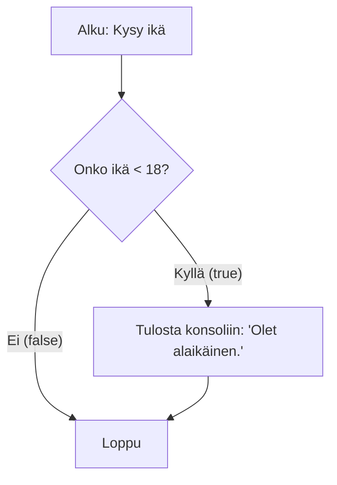
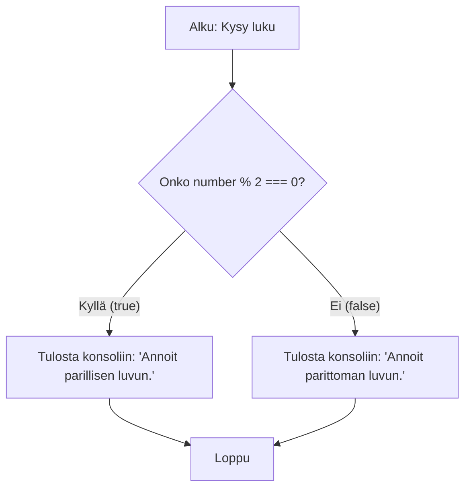
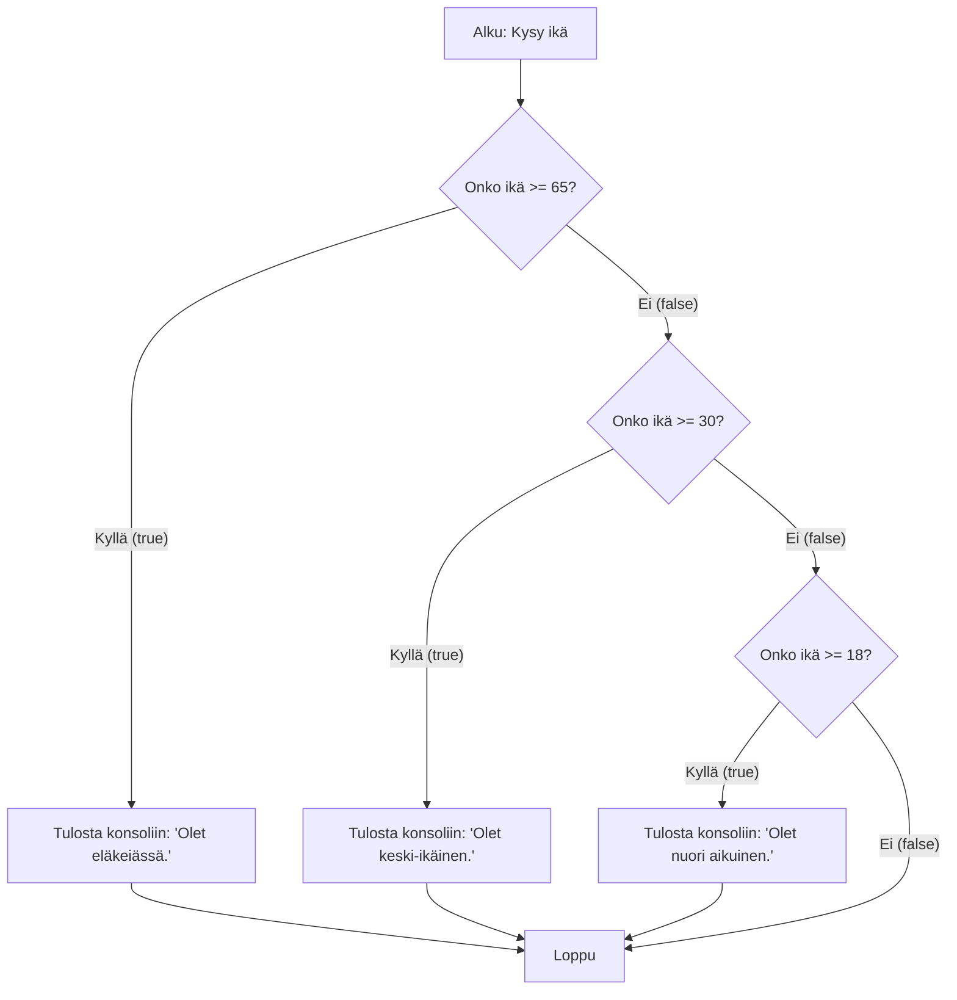
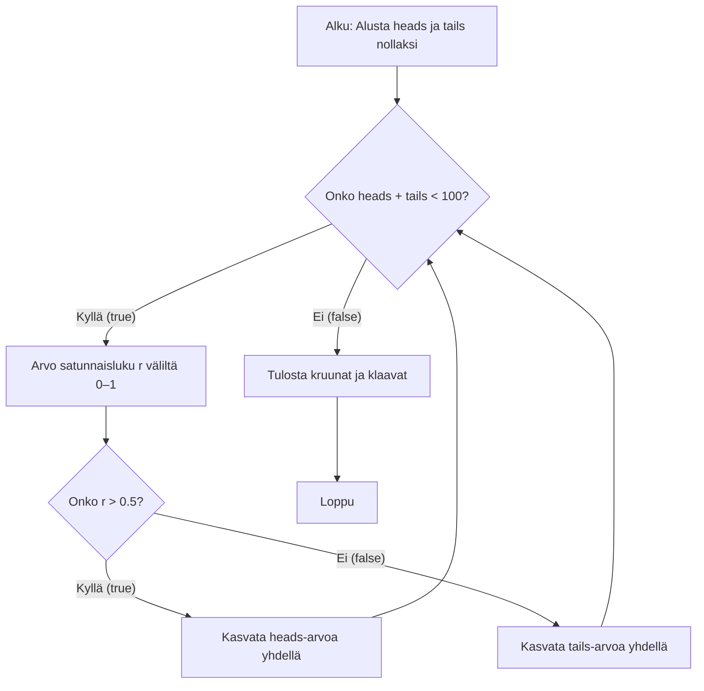

# JavaScript 2: Ohjausrakenteet

## Valintarakenteet

Valintarakenteella voit luoda ohjelmaan vaihtoehtoisia suorituspolkuja. Se, mikä polku valitaan, riippuu siitä, onko ohjelmoijan kirjoittama ehto tosi.

JavaScriptissä valintarakenne toteutetaan `if`-lauseella. Esimerkiksi seuraava ohjelma kysyy käyttäjän iän ja kertoo syötteen perusteella, onko käyttäjä alaikäinen:

```javascript
const age = prompt("Anna ikäsi.");
if (age < 18) {
  console.log("Olet alaikäinen.");
}
```

Ohjelman kulkua voi kuvata myös vuokaaviolla. Vuokaavio on graafinen esitys ohjelman suorituspolusta, ja se auttaa hahmottamaan ohjelman rakennetta. Alla on edellisen ohjelman vuokaavio:



Valintarakenteessa sanaa `if` seuraa sulkeiden sisällä ehto eli looginen lauseke. Tässä tapauksessa se on `age < 18`.

Loogisen lausekkeen arvo on totuusarvo `true` (tosi) tai `false` (epätosi).

Kirjoita ehto niin, että sen arvo on tosi täsmälleen silloin, kun haluat ehdollisen ohjelman osan suoritettavan.

Ehdollinen ohjelman osa eli lohko (_block_) rajataan aaltosulkeilla ja sisennetään vakiintuneen käytännön mukaisesti. Esimerkissä ehdollinen osa sisältää yhden lauseen, joka on `console.log()`-metodin kutsu.

Jos lohkossa on vain yksi lause, aaltosulkeita ei tarvita. Niitä on kuitenkin suositeltavaa käyttää aina, jotta vältät virheet, kun lisäät lohkoon myöhemmin lauseita.

Jos ehto on epätosi, ehdollista osaa ei suoriteta. Esimerkiksi syötteellä 18 ohjelman suoritus hyppää ehdollisen ohjelman osan yli.

### Vertailuoperaattorit

Valintarakenteen ehdon ilmaisemiseen tarvitaan yleensä vertailuoperaattoreita. JavaScriptissä käytetään seuraavia vertailuoperaattoreita:

- yhtä suuri kuin (`==`) tai (`===`)
- erisuuri kuin (`!=`) tai (`!==`)
- suurempi kuin (`>`)
- suurempi tai yhtä suuri kuin (`>=`)
- pienempi kuin (`<`)
- pienempi tai yhtä suuri kuin (`<=`).

Operaattorit `===` ja `!==` vertaavat sekä arvoa että tyyppiä, kun taas `==` ja `!=` muuntavat tarvittaessa arvot samaan tyyppiin ennen vertailua. Esimerkiksi `'5' == 5` on tosi, mutta `'5' === 5` on epätosi, joten käytä yleensä operaattoreita `===` ja `!==`.

#### Vaara: yhtäsuuruusehto vs. sijoituslause

Huomaa ero sijoitusoperaattorin (`=`) ja yhtäsuuruutta vertailevan operaattorin (`==` tai `===`) välillä. Seuraava esimerkki on virheellistä koodia:

```javascript
if ((first = second)) {
  console.log("Samat arvot.");
}
```

Sijoitus valintarakenteen ehdossa johtaa yleensä virheelliseen toimintaan. Ehto ei vertaa arvoja, vaan se sijoittaa muuttujan `second` arvon muuttujaan `first`. Sijoituksen arvo on sijoitettu arvo, ja JavaScript muuntaa sen automaattisesti totuusarvoksi: esimerkiksi luku 0 ja tyhjä merkkijono tulkitaan epätodeksi, muut luvut ja merkkijonot todeksi.

### Loogiset operaattorit

Loogisia lausekkeita voi yhdistää ja muokata loogisilla operaattoreilla:

- negaatio (`!`) kääntää lausekkeen totuusarvon päinvastaiseksi
- ja (`&&`) edellyttää, että molemmat puolet ovat tosia
- tai (`||`) edellyttää, että toinen tai molemmat puolet ovat tosia.

Esimerkiksi seuraava ohjelma kertoo, onko käyttäjän syöttämä kokonaisluku sekä parillinen että suurempi kuin 10:

```javascript
const number = prompt("Anna kokonaisluku");
if (number % 2 === 0 && number > 10) {
  console.log("Annoit parillisen luvun, joka on suurempi kuin 10");
}
```

### Kahden vaihtoehdon valintarakenne

Kahden vaihtoehdon valintarakenteessa eli `if-else`-rakenteessa on lisäksi `else`-lohko, joka suoritetaan, jos ehto on epätosi.

Vaihtoehtoiset lohkot ovat toisensa poissulkevia: niistä suoritetaan aina täsmälleen toinen.

Seuraava esimerkki kertoo, onko käyttäjän syöttämä kokonaisluku parillinen vai pariton:

```javascript
const number = prompt("Anna kokonaisluku");
if (number % 2 === 0) {
  console.log("Annoit parillisen luvun.");
} else {
  console.log("Annoit parittoman luvun.");
}
```

Edellisen ohjelman vuokaavio:



### Monen vaihtoehdon valintarakenne

Kun toisensa poissulkevia vaihtoehtoja on useita, lisää rakenteeseen tarvittava määrä `else if` -haaroja. Ehdot tarkistetaan järjestyksessä ylhäältä alas, ja suoritus etenee ensimmäiseen haaraan, jonka ehto on tosi. Muita haaroja ei sen jälkeen suoriteta. Seuraava ohjelma kommentoi täysi-ikäisen käyttäjän ikää:

```javascript
const age = prompt("Anna ikäsi");
if (age >= 65) {
  console.log("Olet eläkeiässä.");
} else if (age >= 30) {
  console.log("Olet keski-ikäinen.");
} else if (age >= 18) {
  console.log("Olet nuori aikuinen.");
}
```

Vuokaaviona edellinen ohjelma voidaan esittää näin:



Huomaa, että kunkin haaran loogisen lausekkeen arvo lasketaan vasta, kun yläpuolisten haarojen ehdot on jo todettu epätosiksi. Jos käyttäjä esimerkiksi syöttää iäksi 38, `if`-haaran ehto (ikä 65 tai yli) ei täyty, ja seuraavaksi lasketaan ensimmäisen `else if` -haaran ehdon arvo. Tässä vaiheessa riittää tarkistaa, onko ikä vähintään 30 vuotta, koska jo tiedetään, ettei se ole 65 vuotta tai enemmän.

Ohjelmassa ei ole `else`-haaraa. Jos käyttäjä syöttää iäksi 17 vuotta tai vähemmän, ohjelma ei tulosta mitään.

Jos haluat, että jokin vaihtoehto toteutuu aina, kirjoita viimeinen haara `else`-haaraksi. Seuraava ohjelma kertoo, onko käyttäjän syöttämä luku positiivinen, negatiivinen vai nolla:

```javascript
const number = prompt("Anna luku");
if (number > 0) {
  console.log("Luku on positiivinen.");
} else if (number < 0) {
  console.log("Luku on negatiivinen.");
} else {
  console.log("Luku on nolla.");
}
```

### Sisäkkäiset valintarakenteet

Valintarakenteita, kuten muitakin ohjausrakenteita, voi kirjoittaa sisäkkäin. Näin voit toteuttaa toimintalogiikaltaan monimutkaisia ohjelmia.

Tarkastellaan esimerkkinä kipulääkkeen annosteluohjetta ja kirjoitetaan ohjelma, joka määrittää oikean annoksen.

Annosteluohje on seuraava:

- 12-vuotiaiden ja sitä vanhempien potilaiden annos on 500 mikrogrammaa.
- 2–11-vuotiaiden potilaiden annos on 12,5 mikrogrammaa painokiloa kohden. Annos ei kuitenkaan saa ylittää aikuisen annosta.
- Lääkettä ei anneta alle kaksivuotiaille potilaille.

Lääkeannoksen määrittäminen voidaan kirjoittaa JavaScript-ohjelmaksi seuraavasti:

```javascript
let age, weight, dose; // let, koska muuttujille annetaan arvot myöhemmin
age = prompt("Anna potilaan ikä.");
if (age >= 12) {
  dose = 500;
} else if (age >= 2) {
  weight = prompt("Anna potilaan paino.");
  dose = weight * 12.5;
  if (dose > 500) {
    dose = 500;
  }
} else {
  dose = 0;
}
console.log("Annos on " + dose + " mikrogrammaa.");
```

Huomaa `else if` -haaran sisällä oleva uusi `if`-lause, joka suoritetaan vain, jos suoritus etenee kyseiseen haaraan.

### Lueteltujen vaihtoehtojen valintarakenne (switch)

Kaikki valintarakennetta käyttävät ohjelmat voi kirjoittaa `if`-rakenteella. JavaScript tarjoaa kuitenkin myös toisen valintarakenteen, `switch`-rakenteen, jossa haarautuminen perustuu lausekkeen mahdollisiin arvoihin.

Esimerkiksi seuraava ohjelma kysyy käyttäjältä laivan hyttiluokan (A, B tai C) ja tulostaa sitä vastaavan sanallisen kuvauksen:

```javascript
const cabinClass = prompt("Anna hyttiluokka (A/B/C).");
switch (cabinClass) {
  case "A":
    console.log("Yläkannen hytti, jossa on ikkuna.");
    break;
  case "B":
    console.log("Yläkannen hytti ilman ikkunaa.");
    break;
  case "C":
    console.log("Ikkunaton hytti autokannen alapuolella.");
    break;
  default:
    console.log("Virheellinen hyttiluokka.");
}
```

Sanan `switch` jälkeen sulkeissa oleva lauseke (tässä `cabinClass`) määrää arvollaan, mihin suoritushaaraan päädytään.

Kukin suoritushaara alkaa sanalla `case`, jota seuraavat vertailtava arvo ja kaksoispiste. Lausekkeen arvoa verrataan `case`-arvoihin `===`-operaattorin tavoin. Kaksoispisteen jälkeen kirjoitetaan haarassa suoritettavat lauseet, joita ei tarvitse koota aaltosulkeiden sisään.

Viimeiseen `default`-haaraan päädytään, jos lausekkeen arvo ei vastaa minkään `case`-haaran arvoa.

Jokainen haara (paitsi viimeinen `default`-haara) päättyy `break`-lauseeseen. Se lopettaa `switch`-rakenteen suorituksen välittömästi.

Ilman `break`-lausetta suoritus jatkuisi suoraan seuraavan `case`-haaran lauseisiin, vaikka lausekkeen arvo ei vastaisi sitä. Jos siis hyttiä A vastaavan haaran lopusta poistettaisiin `break`-lause, ohjelma tulostaisi hytille A kaksi kuvausta: `Yläkannen hytti, jossa on ikkuna.` ja `Yläkannen hytti ilman ikkunaa.`

## Toistorakenteet

Toistorakenteella (_loop_) eli silmukalla voit suorittaa ohjelman osaa useita kertoja. Toistokertojen määrä voi olla tiedossa etukäteen tai selvitä vasta suorituksen aikana.

JavaScriptin perustoistorakenteet ovat:

- `while`-rakenne, jossa toistoehto tarkistetaan ennen jokaista toistokertaa
- `do/while`-rakenne, jossa toistoehto tarkistetaan jokaisen toistokerran jälkeen
- `for`-rakenne, jossa toisto perustuu yleensä toistomuuttujaan.

Rakenteet ovat ilmaisuvoimaltaan samanarvoisia: minkä tahansa ohjelman voisi kirjoittaa käyttämällä vain yhtä niistä. Jotkin toistorakenteet sopivat kuitenkin tiettyihin tilanteisiin paremmin kuin toiset, joten ohjelmoija voi valita niistä sen, jolla ongelma ratkeaa helpoimmin.

### While

`while`-toistorakenteessa ohjelman osaa toistetaan niin kauan kuin ohjelmoijan kirjoittama toistoehto on tosi.

```javascript
while (condition) {
  // suoritettava koodilohko,
  // kun ehto on tosi
}
```

Alla oleva ohjelma heittää kolikkoa sata kertaa. Lopuksi ohjelma tulostaa, kuinka monta kruunaa ja klaavaa saatiin.

```javascript
let heads = 0,
  tails = 0; // let, koska muuttujien arvot muuttuvat myöhemmin
while (heads + tails < 100) {
  const r = Math.random();
  if (r > 0.5) heads++;
  else tails++;
}
console.log("Kruunat: " + heads + ", klaavat: " + tails);
```

Ohjelman tuloste on seuraava:

```
Kruunat: 53, klaavat: 47
```

Kaikki ohjausrakenteet voi esittää vuokaaviona. Seuraava vuokaavio kuvaa edellistä ohjelmaa, jossa `if-else`-rakenne on `while`-rakenteen sisällä:



Koska kolikonheiton tulokset määräytyvät satunnaisesti, tulosluvut vaihtelevat suorituskerrasta toiseen.

`while`-rakenteella voi reagoida käyttäjän virheelliseen syötteeseen ja vaatia käyttäjää antamaan syötteen uudelleen, kunnes se on kelvollinen. Esimerkiksi seuraava ohjelma tarkistaa, että käyttäjän syöttämä paino on positiivinen.

Ohjelman suoritus ei voi edetä, ennen kuin käyttäjä on syöttänyt kelvollisen painon.

```javascript
let weight = prompt("Anna paino (kg).");
while (weight <= 0) {
  weight = prompt("Painon on oltava positiivinen. Anna paino uudelleen (kg).");
}
console.log("Annoit painon: " + weight + " kg.");
```

### do/while

`do/while`-rakenteessa toistoehto tarkistetaan vasta kunkin toistokerran jälkeen. Toistettava ohjelman osa suoritetaan siis aina vähintään kerran.

Seuraava ohjelma heittää noppaa ja tulostaa saadut silmäluvut, kunnes nopan silmäluvuksi tulee kuusi:

```javascript
let result;
do {
  result = Math.floor(Math.random() * 6) + 1;
  console.log(result);
} while (result < 6);
```

### for

`for`-rakenne on tarkoitettu tilanteisiin, joissa toistokertojen määrä perustuu toistomuuttujaan. Toistomuuttuja pitää kirjaa toistokerroista: sen arvo on tyypillisesti aluksi 0 tai 1, ja sitä kasvatetaan jokaisen toistokerran jälkeen. Jossakin vaiheessa toistomuuttujan arvo kasvaa niin suureksi, että toisto päättyy. Toistoehto, joka määrää tämän rajan, kirjoitetaan `for`-lauseeseen.

Seuraava esimerkki tulostaa luvut yhdestä kymmeneen:

```javascript
for (let i = 1; i <= 10; i++) {
  console.log(i);
}
```

Esimerkistä näkyy, että `for`-sanan jälkeisten sulkeiden sisällä on kolme puolipisteillä erotettua osaa:

- alkutoimet (`let i = 1`)
- toistoehto (`i <= 10`)
- lopputoimet (`i++`).

Toistorakenteen suoritus etenee seuraavassa järjestyksessä:

1. Alkutoimet suoritetaan kerran rakenteeseen tultaessa.
2. Toistoehto tarkistetaan.
   - Jos sen arvo on `true`, toistettava lohko suoritetaan.
   - Jos sen arvo on `false`, toistorakenteesta poistutaan.
3. Lohkon jälkeen suoritetaan lopputoimet ja palataan vaiheeseen 2.

Esimerkiksi seuraava ohjelma kysyy käyttäjältä luvun ja tulostaa kaikki parilliset kokonaisluvut nollasta käyttäjän syöttämään lukuun asti:

```javascript
const number = prompt("Anna parillisten lukujen yläraja.");
for (let i = 0; i <= number; i += 2) {
  console.log(i);
}
```

Voit jäljitellä `while`-rakennetta `for`-rakenteella luomalla päättymättömän silmukan ja pysäyttämällä sen `break`-lauseella:

```javascript
// kysy nimeä, lopeta kun käyttäjä antaa tyhjän arvon
for (;;) {
  const name = prompt("Anna nimi");
  if (name === "") {
    break;
  }
  console.log(name);
}
```

Näin voi tehdä, mutta se ei ole suositeltavaa. Käytä tällaisissa tilanteissa mieluummin `while`-rakennetta.

### Sisäkkäiset toistorakenteet

Joskus on tarpeen käydä läpi kahden tai useamman muuttujan kaikki arvoyhdistelmät. Kun esimerkiksi tulostetaan lukujen 1–5 kertotaulu, sekä ensimmäisen että toisen kertoimen on saatava kaikki kokonaislukuarvot yhdestä viiteen.

Tällaisen ongelman voi ratkaista kahdella sisäkkäisellä toistorakenteella:

```javascript
let multiplication;
for (let i = 1; i <= 5; i++) {
  for (let j = 1; j <= 5; j++) {
    multiplication = i * j;
    console.log(i + " kertaa " + j + " on " + multiplication + ".");
  }
}
```

Huomaa kahden toistomuuttujan (`i` ja `j`) käyttö. Ulomman toistorakenteen toistomuuttuja `i` saa ensimmäisellä toistokerralla arvon yksi, minkä jälkeen sisemmän toistorakenteen toistomuuttuja `j` käy läpi kaikki arvot yhdestä viiteen.

Sen jälkeen ulomman toistorakenteen toistomuuttuja kasvaa kahteen, ja sisempi toistorakenne käydään taas kokonaan läpi. Näin jatketaan, kunnes ulomman rakenteen toistomuuttuja lopulta kasvaa kuuteen, jolloin sen toistoehto on muuttunut epätodeksi.

Ohjelma tuottaa seuraavan tulosteen:

```
1 kertaa 1 on 1.
1 kertaa 2 on 2.
1 kertaa 3 on 3.
1 kertaa 4 on 4.
1 kertaa 5 on 5.
2 kertaa 1 on 2.
2 kertaa 2 on 4.
...
5 kertaa 5 on 25.
```

---

<!-- add mermaid support for gh pages -->
<script type="module">
    Array.from(document.getElementsByClassName("language-mermaid")).forEach(element => {
      element.classList.add("mermaid");
    });
    import mermaid from 'https://cdn.jsdelivr.net/npm/mermaid@11/dist/mermaid.esm.min.mjs';
    mermaid.initialize({startOnLoad: true});
</script>
