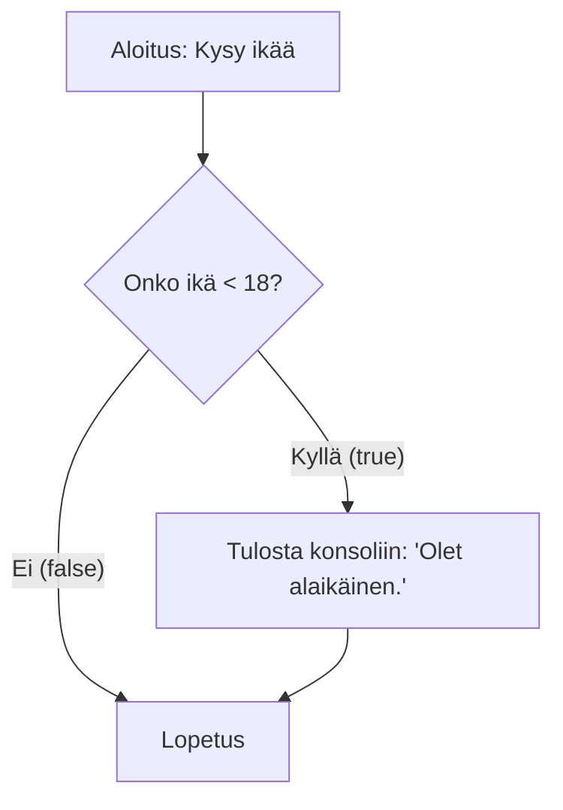
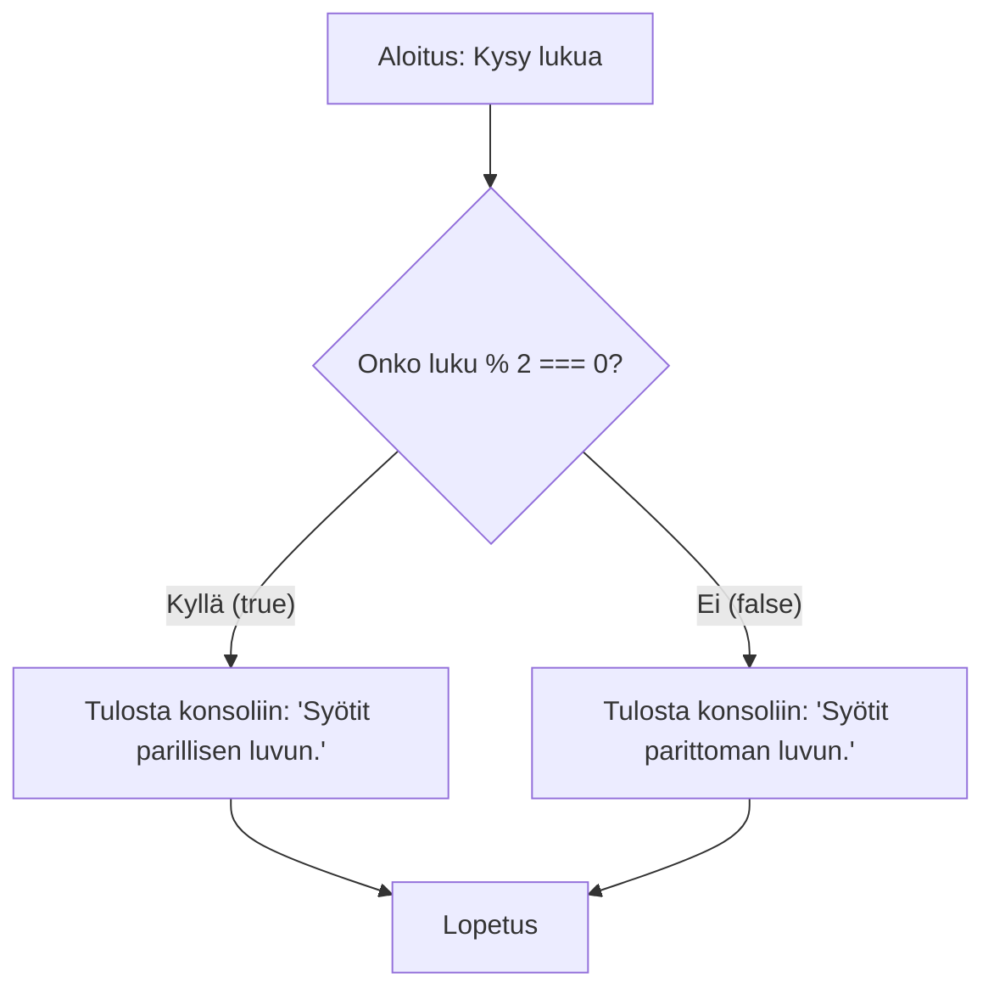
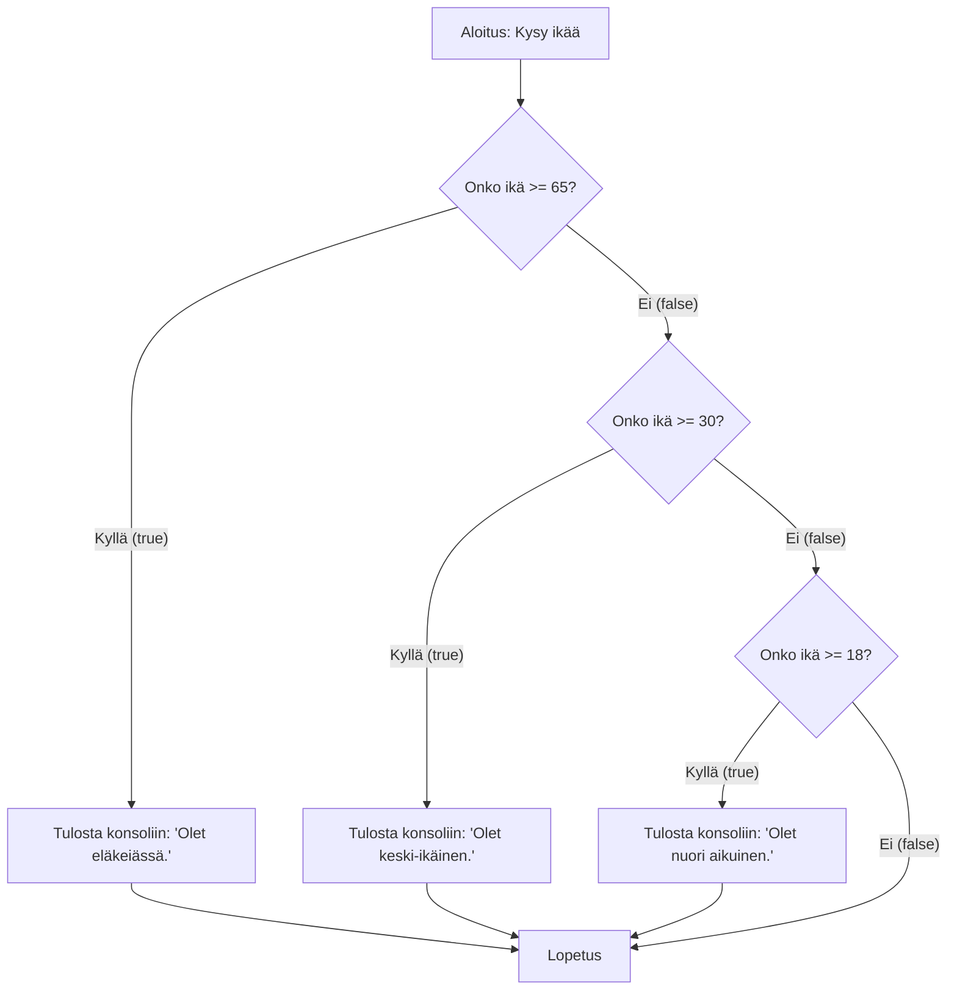
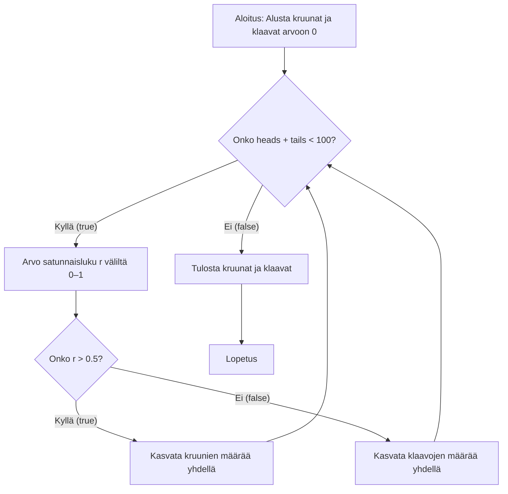

# JavaScript 2 - Ohjausrakenteet

## Ehtolausekkeet

Ehtolausekkeella voidaan luoda ohjelmaan vaihtoehtoisia suorituspolkuja. Valittava polku riippuu ohjelmoijan kirjoittaman ehdon totuusarvosta.

JavaScriptissä ehtolauseke toteutetaan `if`-lauseella. Esimerkiksi seuraava ohjelma kysyy käyttäjältä iän ja ilmoittaa syötteen perusteella, onko käyttäjä alaikäinen:

```javascript
const age = prompt("Anna ikäsi.");
if (age < 18) {
  console.log("Olet alaikäinen.");
}
```

Ohjelman kulku voidaan kuvata myös vuokaaviona. Vuokaavio on graafinen esitys ohjelman suorituspolusta. Se on hyödyllinen työkalu ohjelman rakenteen ymmärtämiseen. Seuraavassa esitetään edellä olevan ohjelman vuokaavio:



Ehtolauseessa sana `if` seuraa sulkeiden sisällä olevaa loogista lauseketta. Tässä tapauksessa se on `age < 18`.

Loogisen lausekkeen arvo on aina `true` tai `false`.

Ehto kirjoitetaan siten, että sen arvo on tosi täsmälleen silloin, kun ohjelman ehdollinen osa halutaan suorittaa.

Ohjelman ehdollinen osa eli lohko rajataan aaltosulkeilla ja sisennetään vakiintuneen käytännön mukaisesti. Esimerkissä ohjelman ehdollinen osa sisältää yhden lauseen, joka on kutsu `console.log()`-metodille.

Jos lohkossa on vain yksi lause, aaltosulkeita ei tarvita, mutta niitä suositellaan käytettäväksi aina, jotta vältetään virheet lisättäessä myöhemmin uusia lauseita.

Jos ehto on epätosi, ehdollista osaa ei suoriteta. Esimerkiksi syötteellä 18 ohjelman suoritus hyppää ehdollisen ohjelmaosion yli.

### Vertailuoperaattorit

Vertailuoperaattoreita tarvitaan yleensä ehdon ilmaisemiseen ehtolauseessa. JavaScriptissä käytetään seuraavia vertailuoperaattoreita:

- yhtä suuri kuin (`==`) tai (`===`)
- eri suuri kuin (`!=`) tai (`!==`)
- suurempi kuin (`>`)
- suurempi tai yhtä suuri kuin (`>=`)
- pienempi kuin (`<`)
- pienempi tai yhtä suuri kuin (`<=`)

#### Vaara: Yhtäsuuruusehto vs. sijoituslause

Huomaa ero sijoitusoperaattorin (`=`) ja yhtäsuuruuden vertailuoperaattorin (`==`) välillä. Seuraava esimerkki on virheellistä koodia:

```javascript
if ((first = second)) {
  console.log("Samat arvot.");
}
```

Sijoituslause ehtolauseen ehtona johtaa yleensä virheelliseen toimintaan. Teknisesti sijoituslauseen arvoksi tulee arvo, joka sijoitetaan sijoituslauseessa olevaan muuttujaan. Saatu numeerinen arvo muunnetaan automaattisesti boolean-arvoksi siten, että nollasta poikkeava luku on `true` ja nolla on `false`.

### Loogiset operaattorit

Loogisia lausekkeita voidaan yhdistää loogisten operaattoreiden avulla.

- negaatio (`!`) kääntää lausekkeen totuusarvon
- ja `&&` edellyttää, että molemmat puolet ovat tosia
- tai `||` edellyttää, että toinen tai molemmat osapuolet ovat tosia.

Esimerkiksi seuraava ohjelma ilmoittaa, onko käyttäjän syöttämä kokonaisluku sekä parillinen että suurempi kuin 10:

```javascript
const number = prompt("Anna kokonaisluku");
if (number % 2 === 0 && number > 10) {
  console.log("Syötit parillisen luvun, joka on suurempi kuin 10");
}
```

### Kahden vaihtoehdon ehtolauseke

Kahden toisensa poissulkevan vaihtoehdon ehtolausekkeessa eli `if-else`-rakenteessa annetaan myös vaihtoehtoinen lohko, joka suoritetaan, jos ehto on epätosi.

Kaksi vaihtoehtoista lohkoa ovat toisensa poissulkevia; jompikumpi suoritetaan aina.

Seuraava esimerkki ilmoittaa, onko käyttäjän syöttämä kokonaisluku parillinen vai pariton:

```javascript
const number = prompt("Anna kokonaisluku");
if (number % 2 === 0) {
  console.log("Syötit parillisen luvun");
} else {
  console.log("Syötit parittoman luvun.");
}
```

Edellä olevan ohjelman vuokaavio:



### Monivaihtoehtoinen ehtolauseke

Monien toisensa poissulkevien vaihtoehtojen ehtorakenteeseen liitetään tarvittava määrä `else if` -haaroja. Suorituksen aikana käsitellään ensin alkuperäinen `if`-haara tai, jos sen ehto on epätosi, ensimmäinen `else if` -haara, jonka valintaehto toteutuu. Seuraava ohjelma kommentoi aikuisen käyttäjän ikää:

```javascript
const age = prompt("Anna ikäsi");
if (age >= 65) {
  console.log("Olet eläkeiässä");
} else if (age >= 30) {
  console.log("Olet keski-ikäinen.");
} else if (age >= 18) {
  console.log("Olet nuori aikuinen");
}
```

Vuokaaviossa edellä oleva ohjelma voidaan esittää seuraavasti:



Huomaa, että kunkin haaran loogisen lausekkeen arvo lasketaan vasta, kun ylempien haarojen ehtojen on jo todettu olevan epätosia. Jos käyttäjä esimerkiksi syöttää iäkseen 38, `if`-haaran ehtoa (ikä 65 vuotta tai enemmän) ei täytetä, ja ylemmän `else if` -haaran ehdon arvo lasketaan. Tässä vaiheessa riittää testata, onko ikä vähintään 30 vuotta, koska jo tiedetään, ettei se ole 65 vuotta tai enemmän.

Ohjelmassa ei ole `else`-haaraa; jos käyttäjä syöttää iäkseen 17 vuotta tai vähemmän, ohjelma ei tulosta mitään.

Jos haluat aina päätyä johonkin lopputulokseen, kirjoita viimeinen haara `else`-haaraksi. Seuraava ohjelma ilmoittaa, onko käyttäjän syöttämä luku positiivinen, negatiivinen vai nolla:

```javascript
const number = prompt("Anna luku");
if (number > 0) {
  console.log("Luku on positiivinen.");
} else if (number < 0) {
  console.log("Luku on negatiivinen.");
} else {
  console.log("Luku on nolla.");
}
```

### Sisäkkäinen ehtolauseke

Ehtorakenteita, kuten muitakin ohjausrakenteita, voidaan sijoittaa sisäkkäin monimutkaisen toimintalogiikan sisältävien ohjelmien toteuttamiseksi.

Tarkastellaan esimerkkinä kipulääkkeen annostusta ja kirjoitetaan ohjelma oikean annoksen määrittämiseksi.

Annostusohjeet ovat seuraavat:

- Vähintään 12-vuotiaille potilaille annos on 500 mikrogrammaa.
- 2–11-vuotiaille potilaille annos on 12,5 mikrogrammaa painokiloa kohden. Annos ei kuitenkaan saa ylittää aikuisille tarkoitettua annosta.
- Alle kaksivuotiaille potilaille lääkettä ei saa antaa.

Lääkeannoksen määrittäminen voidaan kirjoittaa JavaScript-ohjelmana seuraavasti:

```javascript
let age, weight, dose; // let is used because the variables are given values later
age = prompt("Anna potilaan ikä.");
if (age >= 12) {
  dose = 500;
} else if (age >= 2) {
  weight = prompt("Anna potilaan paino.");
  dose = weight * 12.5;
  if (dose > 500) {
    dose = 500;
  }
} else {
  dose = 0;
}
console.log("Annos on " + dose + " mikrogrammaa.");
```

Huomaa uusi `if`-lause `else-if`-haaran sisällä. Se suoritetaan vain, jos kyseinen haara saavutetaan.

### Lueteltujen vaihtoehtojen ehtolauseke (switch)

Kaikki ehdollista lauseketta käyttävät ohjelmat voidaan kirjoittaa käyttämällä `if`-ehtolauseketta. JavaScript-kielessä on kuitenkin myös toinen `switch`-ehtolauseke, jossa haarautuminen tapahtuu lausekkeen arvojen perusteella.

Esimerkiksi seuraava ohjelma kysyy käyttäjältä laivan hyttiluokan (A, B tai C) ja tulostaa sitä vastaavan sanallisen kuvauksen:

```javascript
const cabinClass = prompt("Anna hyttiluokka (A/B/C).");
switch (cabinClass) {
  case "A":
    console.log("Yläkannen hytti ikkunalla.");
    break;
  case "B":
    console.log("Yläkannen hytti ilman ikkunaa.");
    break;
  case "C":
    console.log("Ikkunaton hytti autokannen alla.");
    break;
  default:
    console.log("Virheellinen hyttiluokka.");
}
```

Sanaa `switch` seuraava lauseke (tässä `class`) toimii valitsimena, jonka arvo määrittää, mihin suoritushaaraan päädytään.

Jokainen suoritushaara alkaa sanalla `case`, jota seuraavat valitsimen arvo ja kaksoispiste. Tämän jälkeen kirjoitetaan haarassa suoritettavat lauseet, joita ei tarvitse koota aaltosulkeiden sisään. Haara päättyy `break`-lauseeseen.

Viimeinen `default`-haara saavutetaan aina, jos käyttäjän valitsimen arvo ei vastaa minkään `case`-haaran arvoa.

Jokainen haara viimeistä `default`-haaraa lukuun ottamatta päättyy `break`-lauseeseen. Lause saa `switch`-valintarakenteen lopettamaan suorituksen välittömästi.

Ilman `break`-lausetta suoritus jatkuisi välittömästi seuraavana olevan `case`-haaran lauseista, vaikka valitsimen arvo ei vastaisi kyseistä haaraa. Jos esimerkiksi hyttiä A vastaavan haaran lopussa oleva `break`-lause poistettaisiin, ohjelma tulostaisi kaksi hyttiä A koskevaa kuvausta: `Top deck cabin with window` ja `Top deck cabin without window`.

## Silmukat

Silmukkarakenteen ansiosta ohjelman osan suoritus voidaan toistaa useita kertoja. Toistojen määrä voi olla tiedossa etukäteen tai se voidaan määrittää suorituksen aikana.

JavaScriptissä on kolme silmukkarakennetta:

- `while`-rakenne, jossa silmukan ehdon totuusarvo testataan ennen jokaista toistoa
- `do / while` -rakenne, jossa silmukan ehdon arvo testataan jokaisen toiston jälkeen
- `for`-rakenne, jossa toisto perustuu yleensä silmukkamuuttujan käsittelyyn

Rakenteet ovat semanttisesti samanarvoisia. Mikä tahansa ohjelma voitaisiin kirjoittaa käyttämällä vain yhtä edellä mainituista silmukkarakenteista. Jotkin silmukkarakenteet sopivat kuitenkin tiettyihin tilanteisiin paremmin kuin toiset: ohjelmoija voi valita sen, joka ratkaisee ongelman helpoimmin.

### While

While-silmukkarakenteessa ohjelman osaa toistetaan niin kauan kuin ohjelmassa kirjoitettu toistoehto pysyy totena.

```javascript
while (condition) {
  // block of code to be executed
  // when the condition is true
}
```

Alla oleva ohjelma heittää kolikkoa sata kertaa. Lopuksi ohjelma tulostaa, kuinka monta kruunaa ja klaavaa saatiin.

```javascript
let heads = 0,
  tails = 0; // let, because the values of the variables change later
while (heads + tails < 100) {
  const r = Math.random();
  if (r > 0.5) heads++;
  else tails++;
}
console.log("Kruunia: " + heads + ", klaavoja: " + tails);
```

Ohjelman tuloste on seuraavanlainen:

```
Kruunia: 53, klaavoja: 47
```

Kaikki ohjausrakenteet voidaan esittää vuokaavion avulla. Seuraava vuokaavio kuvaa edellä olevaa ohjelmaa, jossa `if-else` on sijoitettu while-silmukan sisään:



Koska kolikonheiton tulokset määräytyvät satunnaisesti, tulokset vaihtelevat suorituskerrasta toiseen.

While-rakennetta voidaan käyttää virheellisen käyttäjäsyötteen käsittelyyn ja vaatia käyttäjää syöttämään syöte uudelleen, kunnes se on kelvollinen. Esimerkiksi seuraava ohjelma tarkistaa, että käyttäjän syöttämä paino on positiivinen.

Ohjelman suoritus ei voi jatkua, ennen kuin käyttäjä on syöttänyt kelvollisen painon.

```javascript
let weight = prompt("Anna paino (kg).");
while (weight <= 0) {
  weight = prompt(
    "Painon täytyy olla positiivinen. Syötä paino uudelleen (kg).",
  );
}
console.log("Syötit painoksi: " + weight + " kg.");
```

### do/while

`do/while`-lauseessa toistoehdon totuusarvo testataan vasta rakenteesta poistuttaessa. Toistettava ohjelman osa suoritetaan siis aina vähintään kerran.

Seuraava ohjelma heittää noppaa ja tulostaa saadut silmäluvut, kunnes nopan silmäluvuksi tulee kuusi:

```javascript
let result;
do {
  result = Math.floor(Math.random() * 6) + 1;
  console.log(result);
} while (result < 6);
```

### for

For on suunniteltu tilanteisiin, joissa iteraatioiden määrä perustuu silmukkamuuttujaan. Silmukkamuuttujalla tarkoitetaan muuttujaa, jonka tehtävänä on pitää kirjaa toistojen määrästä: luku on aluksi nolla ja sitä kasvatetaan yhdellä jokaisen toiston lopussa. Jossain vaiheessa silmukkamuuttujan arvo kasvaa niin suureksi, että toisto päättyy. Sen määrittävä silmukkaehto ohjelmoidaan for-lauseeseen.

Seuraava esimerkki tulostaa luvut yhdestä kymmeneen:

```javascript
for (let i = 1; i <= 10; i++) {
  console.log(i);
}
```

Esimerkki osoittaa, että sanan `for` jälkeen olevien sulkeiden sisällä on kolme puolipisteillä erotettua osaa:

- Alkuvaiheet (`i = 1`)
- silmukan ehto (`i <= 10`)
- loppuvaiheet (`i++`)

Silmukan suoritus etenee seuraavassa järjestyksessä:

1. Alkuvaiheet suoritetaan kerran rakenteeseen saavuttaessa.
2. Silmukan ehdon arvo (`true` tai `false`) määritetään.
   - Jos arvo on `true`, suoritettava lohko suoritetaan.
   - Jos arvo on `false`, silmukkarakenteesta poistutaan.

3. Suoritetaan loppuvaiheet ja palataan vaiheeseen 2.

Esimerkiksi seuraava ohjelma kysyy käyttäjältä luvun ja tulostaa kaikki parilliset kokonaisluvut nollasta käyttäjän syöttämään lukuun asti:

```javascript
const number = prompt("Anna parillisten lukujen yläraja.");
for (let i = 0; i <= number; i += 2) {
  console.log(i);
}
```

While-silmukan voi jäljitellä for-silmukalla luomalla ikuisen silmukan ja lopettamalla sen sitten `break`-lauseella:

```javascript
// kysy nimeä, lopeta kun käyttäjä syöttää tyhjän arvon
for (;;) {
  const name = prompt("Anna nimi");
  if (name === "") {
    break;
  }
  console.log(name);
}
```

Tämän voi tehdä, mutta sitä ei suositella. Käytä sen sijaan varsinaista while-silmukkaa.

### Sisäkkäiset silmukkarakenteet

Joskus on tarpeen tuottaa kahden tai useamman muuttujan arvojen yhdistelmiä: esimerkiksi tulostettaessa lukujen yhdestä viiteen kertotaulua ensimmäisen kertojan on saatava kaikki kokonaislukuarvot yhdestä viiteen ja toisen kertojan samoin.

Tällainen ongelma voidaan ratkaista kahdella sisäkkäisellä silmukkarakenteella:

```javascript
let multiplication;
for (let i = 1; i <= 5; i++) {
  for (let j = 1; j <= 5; j++) {
    multiplication = i * j;
    console.log(i + " kertaa " + j + " on " + multiplication + ".");
  }
}
```

Huomaa kahden silmukkamuuttujan (`i` ja `j`) käyttö. Ulommassa silmukkarakenteessa silmukkamuuttuja `i` saa ensimmäisellä kierroksella arvon yksi, minkä jälkeen sisemmän silmukkarakenteen silmukkamuuttuja käy läpi kaikki arvot yhdestä viiteen.

Tämän jälkeen ulomman silmukkarakenteen silmukkamuuttuja kasvaa kahdeksi, ja sisempi silmukkarakenne käydään jälleen kokonaisuudessaan läpi. Tätä jatketaan, kunnes ulomman rakenteen silmukkamuuttuja kasvaa lopulta kuudeksi, jolloin sen silmukan ehto muuttuu epätodeksi.

Ohjelma tuottaa seuraavan tulosteen:

```
1 kertaa 1 on 1.
1 kertaa 2 on 2.
1 kertaa 3 on 3.
1 kertaa 4 on 4.
1 kertaa 5 on 5.
2 kertaa 1 on 2.
2 kertaa 2 on 4.
...
5 kertaa 5 on 25.
```

---

<!-- add mermaid support for gh pages -->
<script type="module">
    Array.from(document.getElementsByClassName("language-mermaid")).forEach(element => {
      element.classList.add("mermaid");
    });
    import mermaid from 'https://cdn.jsdelivr.net/npm/mermaid@11/dist/mermaid.esm.min.mjs';
    mermaid.initialize({startOnLoad: true});
</script>
