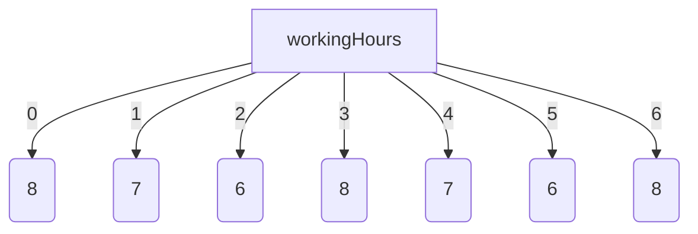

# JavaScript 3 - Taulukot ja funktiot

## Taulukko

[Taulukko]([https://developer.mozilla.org/en-US/docs/Web/JavaScript/Reference/Global_Objects/Array]%28https://developer.mozilla.org/en-US/docs/Web/JavaScript/Reference/Global_Objects/Array%29) on tietorakenne, joka koostuu joukosta alkioita. Taulukon käyttäminen ei edellytä suuren muuttujamäärän keksimistä, vaan kaikki taulukon arvot – eli taulukon alkiot – voidaan saavuttaa yhden muuttujan kautta.

Esimerkiksi seuraavat taulukot voitaisiin luoda:

- seitsemän alkion kokonaislukutaulukko, joka näyttää henkilön viikon jokaisena päivänä tekemät työtunnit.
- neljän alkion merkkijonotaulukko, joka sisältää neljän pelaajan nimet.
- 500 alkion liukulukutaulukko, joka sisältää viisisataa satunnaisesti valittua lukua.

Esimerkiksi työaikataulukko voitaisiin havainnollistaa seuraavasti:



Taulukon alkioihin viitataan taulukkomuuttujan nimellä ja indeksillä.

Esimerkissä `workingHours` on taulukkomuuttujan nimi ja numerot 0 ja 4 ovat indeksejä. Indeksit voivat esimerkissä vaihdella välillä 0..6.

Taulukon viidennen alkion työaikaan viitataan muodossa `workingHours[4]`. Numerointi alkaa nollasta, ja taulukon indeksi on aina yhtä pienempi kuin taulukon koko – eli taulukon alkioiden määrä.

JavaScript ei edellytä, että kaikki taulukon alkiot ovat samaa tyyppiä. Taulukko voidaan siis esimerkiksi luoda siten, että osa alkioista on kokonaislukuja ja osa merkkijonoja. Tämä on kuitenkin harvoin tarkoituksenmukaista.

## Taulukkomuuttujan määrittely ja taulukon luominen

Taulukon käyttöönotto koostuu taulukkomuuttujan määrittelystä ja taulukon luomisesta. Seuraava lause luo `numbers`-nimisen taulukkomuuttujan, jonka arvo on aluksi tyhjä taulukko.

```javascript
const numbers = [];
```

Lisätään sitten taulukkoon kolme alkiota:

```javascript
numbers[0] = 17;
numbers[1] = 2;
numbers[2] = 8;
```

Vaihtoehtoisesti taulukko voidaan luoda kirjoittamalla sen sisältö suoraan lauseeseen, jossa taulukkomuuttuja määritellään:

```javascript
const numbers = [17, 2, 8];
```

Huomaa, että taulukkoa luotaessa ei tarvitse tietää taulukon kokoa. Luomisen jälkeen taulukkoon voidaan lisätä haluttu määrä alkioita.

Taulukon koko määräytyy käytetyn suurimman indeksin perusteella. Koko on yhtä suurempi kuin suurin indeksi. `numbers`-taulukon koko saadaan tarvittaessa lausekkeella `numbers.length`.

## Taulukon läpikäynti

Taulukon voi käydä läpi `for`-lauseella ja [array.length]([https://developer.mozilla.org/en-US/docs/Web/JavaScript/Reference/Global_Objects/Array/length]%28https://developer.mozilla.org/en-US/docs/Web/JavaScript/Reference/Global_Objects/Array/length%29)-ominaisuudella.

```javascript
const names = ["Frank", "Scott", "Jasmine", "Don"];

for (let i = 0; i < names.length; i++) {
  console.log(`Nimi: ${names[i]}`);
}
```

Esimerkkituloste:

```monospace
Nimi: Frank
Nimi: Scott
Nimi: Jasmine
Nimi: Don
```

Voit käyttää läpikäyntiin myös [for...of-lauseketta]([https://developer.mozilla.org/en-US/docs/Web/JavaScript/Reference/Statements/for...of]%28https://developer.mozilla.org/en-US/docs/Web/JavaScript/Reference/Statements/for...of%29):

```javascript
const names = ["Frank", "Scott", "Jasmine", "Don"];

for (const name of names) {
  console.log(`Nimi: ${name}`);
}
```

## Taulukon metodit

Taulukkoon voidaan soveltaa valmiiksi ohjelmoituja metodeja sen muokkaamiseksi. Esimerkkejä näistä metodeista ovat:

- `sort()` järjestää taulukon aakkosjärjestykseen
- `reverse()` kääntää taulukon alkioiden järjestyksen päinvastaiseksi
- `shift()` poistaa ja palauttaa taulukon ensimmäisen alkion
- `pop()` poistaa ja palauttaa taulukon viimeisen alkion
- `push(value)` lisää arvon taulukon loppuun; useita arvoja voidaan antaa pilkuilla eroteltuina
- `includes(value)` tarkistaa, sisältääkö taulukko annetun arvon

Suosi [array.push(value)]([https://www.freecodecamp.org/news/javascript-append-to-array-a-js-guide-to-the-push-method-2/]%28https://www.freecodecamp.org/news/javascript-append-to-array-a-js-guide-to-the-push-method-2/%29)-metodia `array[] = value` -syntaksin sijaan arvojen lisäämisessä taulukkoon.

Metodeja kutsutaan kirjoittamalla ensin taulukkomuuttujan nimi, sitten piste ja lopuksi metodin nimi. Esimerkiksi `numbers`-niminen taulukko järjestetään kirjoittamalla `numbers.sort()`.

Huomaa, että edellä mainittu `sort()`-metodi järjestää taulukon aakkosjärjestykseen eikä numeeriseen järjestykseen. Tässä tapauksessa esimerkiksi arvot 100, 23 ja 15 järjestettäisiin aakkosjärjestykseen 100, 15, 23, mikä ei yleensä ole ohjelmoijan haluama järjestys. Tämä voidaan korjata antamalla haluttu järjestysfunktio `sort()`-metodikutsussa. Esimerkiksi `numbers`-taulukko järjestettäisiin numeeriseen järjestykseen seuraavasti:

```javascript
numbers.sort((a, b) => a - b);
```

Edellä olevassa esimerkissä käytetään niin sanottua nuolifunktiota lajittelufunktion kirjoittamiseen; nuolifunktioita käsitellään myöhemmin.

### Olioliteraalit

Olioliteraali määrittelee staattisesti ilmoitetun tietorakenteen. Olioliteraali on yksinkertaisesti pilkuilla eroteltu luettelo nimi-arvo-pareja aaltosulkeiden sisällä. Näitä "nimiä" kutsutaan ominaisuuksiksi. Olioliteraalia voidaan käyttää samalla tavalla kuin esimerkiksi sanakirjaa Pythonissa. Tyypillinen olioliteraali näyttää tältä:

```javascript
const student = {
  firstName: "Greg",
  lastName: "Focker",
  studentId: "234359",
  phone: "040 5902123",
};
```

Ominaisuuksiin voidaan viitata vaihtoehtoisilla merkintätavoilla. Esimerkiksi opiskelijan etunimi saadaan muodossa `student.firstName` tai `student["firstName"]`.

```javascript
const greeting = `Hei, nimeni on ${student.firstName} ${student.lastName}`;
const studentInfo = `opiskelijanumero: ${student["studentId"]}, puhelinnumero: ${student["phone"]}`;
```

Olioliteraalit ovat dynaamisia, joten ominaisuuksia voidaan lisätä ja poistaa milloin tahansa (vaikka käytettäisiin `const`-määrittelyä). Tätä kutsutaan olion muokkaamiseksi.

```javascript
student.address = "Schoolroad 7"; // lisää 'address'-ominaisuuden edelliseen esimerkkiin
delete student.phone; // poistaa 'phone'-ominaisuuden edellisestä esimerkistä
console.log(student);
```

Ominaisuuden avain voidaan myös tallentaa muuttujaan. Seuraava koodi tulostaa opiskelijan sukunimen:

```javascript
const chosenProperty = "lastName";
console.log(student[chosenProperty]);
```

Olioliteraalin määrittely voi sisältää myös funktioita. Alla oleva esimerkki luo olion, jolle lasketaan tutkintoon vaadittavien jäljellä olevien opintopisteiden määrä funktion avulla. Lopuksi kyseinen opintopistemäärä tulostetaan.

```javascript
const student2 = {
  firstName: "Ahmed",
  lastName: "Hussein",
  credits: 175,
  hasLeft: function () {
    return 240 - this.credits;
  },
};

console.log(
  "Opiskelijalta " +
    student2.firstName +
    " puuttuu " +
    student2.hasLeft() +
    " opintopistettä.",
);
```

Funktioita käsitellään tarkemmin alla.

Edellä olevia olioliteraaleja käytettiin tietorakenteena, johon voidaan tallentaa useita toisiinsa liittyviä arvoja yhden muuttujanimen "taakse". Vaikka olioiden ominaisuuksia ei käsitellä tässä tarkemmin, JavaScript on täysiverinen olio-ohjelmointikieli, jonka avulla voidaan määritellä luokkia konstruktoreineen ja metodeineen. Olioita voidaan luoda `new`-lauseella, ja luokkia voidaan määritellä ES6-kieliversiosta lähtien muiden luokkien aliluokiksi samalla tavalla kuin Java-ohjelmointikielessä.

## Funktiot

Funktio on ohjelman osa, joka suorittaa rajatun joukon toimintoja. Funktioiden taustalla on modulaarisuuden ajatus: koska samaa asiaa ei pitäisi tehdä monta kertaa, on hyvä kirjoittaa ohjelman yleiskäyttöiset osat funktioiksi, joita voidaan käyttää useita kertoja ohjelman sisällä.

Valmiiksi ohjelmoitua funktiota voidaan tällöin ajatella "mustana laatikkona". Sitä voidaan käyttää aina tarvittaessa, kun se on kerran ohjelmoitu ja testattu huolellisesti.

Funktiota kutsutaan eli käytetään pääohjelmasta, eli ohjelman funktioiden ulkopuolisesta osasta. Funktiot voivat myös kutsua toisiaan. Verkkosivulle upotettu painike voi myös käynnistää funktion.

JavaScript tukee kahta tapaa kirjoittaa funktioita:

- `function`-lausekkeilla kirjoitetut funktiot
- nuolifunktiot.

Ensimmäinen edustaa vakiintunutta tapaa kirjoittaa funktioita proseduraalisissa ohjelmointikielissä. Nuolifunktiot puolestaan edustavat uutta funktionaalisen ohjelmoinnin paradigmaa, jossa kirjoitetaan tilattomia ja sivuvaikutuksettomia funktioita.

Funktionaalisen ohjelmoinnin paradigman katsotaan olevan vaikeampi oppia, ja nuolifunktioilla tuotettu JavaScript-koodi on tiiviimpää ja ainakin aluksi haastavampaa kehittäjän ymmärtää ja tuottaa.

Tästä syystä tämän sivun pääpaino on `function`-lauseella kirjoitetuissa funktioissa. Sivun lopussa tarkastellaan kuitenkin myös nuolifunktioiden luomista.

## Parametriton ja palautusarvoton funktio

Tarkastellaan ensin esimerkkiä funktiosta, jolla ei ole parametria eikä paluuarvoa. Tällainen funktio tekee saman asian aina, kun sitä kutsutaan: sen toimintaa ei voida ohjata funktion ulkopuolelta, eikä funktio palauta tietoja sitä kutsuvalle ohjelman osalle.

Seuraava funktio tulostaa vakioarvoisen tervehdyksen:

```javascript
function greet() {
  console.log("No, terve!");
  return;
}
```

Funktio päättyy `return`-lauseeseen. `return`-lausetta käytetään myös paluuarvon palauttamiseen, mutta tässä tapauksessa paluuarvoa ei ole.

Edellä kirjoitettua funktiota ei suoriteta sen perusteella, että se on kirjoitettu ohjelmaan, vaan funktiota täytyy kutsua erikseen sen ulkopuolelta.

Lisää funktion määrittelyn alapuolelle pääohjelma, joka sisältää funktiokutsun:

```javascript
greet();
```

Nyt funktio suoritetaan ja ohjelma tulostaa tervehdystekstin.

Funktion käyttäminen parantaa modulaarisuutta: jos myöhemmin haluat muuttaa tapaa, jolla tervehditään, muutos tarvitsee tehdä vain yhdessä paikassa: funktion määrittelyssä.

## Parametrillinen funktio

Edellä kuvattua tervehdysfunktiota laajennetaan siten, että ohjelmoija voi määrittää tervehdystekstin ja tervehdysten määrän. Tätä kutsutaan funktion parametrisoimiseksi: tässä tapauksessa määritellään kaksi parametrimuuttujaa (`text` ja `times`), jotka kertovat tarkalleen, miten funktion tulee toimia:

```javascript
function greet(text, times) {
  for (let i = 1; i <= times; i++) {
    console.log(text + " " + i + ". kerta!");
  }
  return;
}
```

Parametrimuuttujat saavat arvonsa funktion kutsumisen yhteydessä. Funktiokutsussa annettuja arvoja kutsutaan funktion argumenteiksi.

Kun funktiota kutsutaan ja suoritus siirtyy funktioon, kutsussa olevien argumenttien arvot kopioidaan funktion määrittelyssä olevien parametrimuuttujien arvoiksi.

Kirjoita funktion määrittelyn alapuolelle funktiokutsu:

```javascript
greet("Hei", 4);
```

Ohjelma tuottaa seuraavan tulosteen:

```monospace
Hei 1. kerta!
Hei 2. kerta!
Hei 3. kerta!
Hei 4. kerta!
```

Funktiota kutsuttaessa ensimmäisen argumentin arvo (merkkijono `Hi`) kopioitiin ensimmäisen parametrimuuttujan `text` arvoksi. Vastaavasti toisen argumentin arvo `4` kopioidaan toisen parametrimuuttujan `times` arvoksi.

Tällä tavalla kirjoitettu funktio on yleiskäyttöisempi kuin aiemmin. Sitä voidaan käyttää erilaisten tervehdysten tuottamiseen pääohjelman eri osissa.

## Paluuarvon palauttava funktio

Parametreja voidaan käyttää tarvittavien syötetietojen antamiseen funktiolle ulkopuolelta, joiden perusteella funktio suorittaa tehtävänsä. Usein tämän toiminnon tuloksena syntyy tulos, joka täytyy välittää takaisin siihen ohjelman osaan (pääohjelmaan tai toiseen funktioon), joka alun perin kutsui funktiota. Palautettavaa tulosta kutsutaan funktion paluuarvoksi.

Esimerkiksi ohjelma voi laskea kahden luvun neliösumman. Lukujen 2 ja 5 neliösumma on 2 _ 2 + 5 _ 5 eli 29. Luvut, joiden neliösumma lasketaan (esimerkiksi 2 ja 5), ovat funktion parametreja. Vastaavasti laskennan tulos (esimerkiksi 29) on funktion paluuarvo eli tulos, joka välitetään funktion kutsuvalle ohjelman osalle.

Paluuarvo palautetaan `return`-lauseella. Esimerkiksi `result`-nimisen muuttujan arvo palautettaisiin seuraavalla lauseella:

```javascript
return result;
```

Alla olevan ohjelman funktio suorittaa neliösumman laskennan. Funktion jälkeen on pääohjelma, joka kutsuu `quadratic`-funktiota ja antaa sille parametriarvot. Lopuksi pääohjelma tulostaa `quadratic`-funktion palauttaman paluuarvon.

```javascript
function quadraticSum(first, second) {
  const result = first * first + second * second;
  return result;
}

const num1 = prompt("Anna 1. luku.");
const num2 = prompt("Anna 2. luku.");
const quad = quadraticSum(num1, num2);
console.log("Lukujen " + num1 + " ja " + num2 + " neliösumma on " + quad);
```

## Muuttujien näkyvyys

Funktioiden käyttöönoton myötä on tarpeen tarkastella muuttujien näkyvyyttä.

Aiemmissa esimerkeissä on käytetty `let`- ja `const`-avainsanoilla määriteltyjä muuttujia. Ne ovat käytettävissä eli näkyvissä siinä ohjelman osassa (koodilohkossa), jossa ne on määritelty, sekä sen sisällä olevissa koodilohkoissa. Kun sana `let` (tai `const`) määrittelee muuttujan pääohjelmassa (funktioiden ulkopuolella), siitä tulee globaali muuttuja, joka on käytettävissä koko ohjelmassa.

Globaali muuttuja voidaan määritellä funktioiden ulkopuolella myös `var`-lauseella.

Funktion sisällä `var`-lauseella määritellyt muuttujat ovat funktion paikallisia muuttujia. Funktion paikallinen muuttuja näkyy kaikkialla siinä funktiossa, jossa se on määritelty.

Tarkastellaan esimerkkiä, joka havainnollistaa `var`- ja `const`-lauseilla määriteltyjen muuttujien näkyvyyden eroja:

```javascript
const n1 = 3; // globaali muuttuja

function hello() {
  var n2 = 5; // funktion sisäinen muuttuja

  if (n2 > 0) {
    const n3 = 8; // lohkon sisäinen muuttuja
    var n4 = 9; // funktion sisäinen muuttuja
  }
  console.log(n1); // globaali muuttuja näkyy kaikkialla
  console.log(n2); // funktion sisäinen muuttuja on käytettävissä funktion sisällä
  //console.log(n3); -- lohkon sisäinen muuttuja ei ole käytettävissä funktion ulkopuolella
  console.log(n4); // funktion sisäinen muuttuja on käytettävissä funktion sisällä
}

hello();

console.log(n1); // globaali muuttuja näkyy kaikkialla
//console.log(n2); -- funktion sisäinen muuttuja ei näy funktion ulkopuolella
//console.log(n3); -- lohkon sisäinen muuttuja ei näy lohkon ulkopuolella
//console.log(n4); -- funktion sisäinen muuttuja ei näy funktion ulkopuolella
```

Jotkin tulostuslauseet on kommentoitu toimimattomiksi; kyseiset lauseet viittaavat muuttujaan, joka ei näy kyseisessä ohjelman osassa.

Jos esimerkiksi globaalilla muuttujalla ja funktion paikallisella muuttujalla olisi sama nimi, paikallinen muuttuja peittäisi globaalin muuttujan siinä funktiossa, jossa se on määritelty. Tällöin käytössä olisi kaksi eri muuttujaa, joilla on sama nimi mutta erilainen näkyvyys.

## Taulukko parametrina

Edellä todettiin, että funktion argumenttien arvot kopioidaan parametrimuuttujien arvoiksi, kun funktiota kutsutaan. Tarkastellaan seuraavaksi tilannetta, jossa parametrina välitetään taulukko.

Primitiivisten muuttujien tapauksessa parametrin arvo on muuttujan arvo (esimerkiksi 3). Taulukkomuuttujan arvo puolestaan ei ole itse taulukko vaan viittaus taulukkoon. Viittaus viittaa muistiosoitteeseen, johon taulukko on tallennettu suoritusympäristössä.

Kun funktiota kutsutaan ja taulukko välitetään parametrina, sen muistiosoite kopioidaan. Itse taulukkoa ei kopioida parametrimuuttujan arvoksi. Näin ollen funktiokutsussa oleva taulukkomuuttuja ja funktion sisäinen parametrimuuttuja viittaavat yhteen ja samaan taulukkoon. Tällaista parametrien välitystapaa kutsutaan viittauksena välittämiseksi (pass-by-reference). Ohjelmoijan tulee olla tietoinen tästä, jotta taulukoiden käsittely parametrina ei aiheuta yllätyksiä.

Tarkastellaan esimerkiksi alla olevaa ohjelmaa, jossa pääohjelma luo kolmen alkion taulukon, välittää sen funktiolle parametrina ja lopuksi tulostaa taulukon arvot.

```javascript
function grow(array) {
  for (let i = 0; i < array.length; i++) {
    array[i]++;
  }
  return;
}

const numbers = [5, 6, 7];
grow(numbers);
console.log(numbers[0] + " " + numbers[1] + " " + numbers[2]);
```

Ohjelma tulostaa:

```monospace
6 7 8
```

Mitä tapahtui?

1. Pääohjelma loi `numbers`-nimisen kolmen alkion taulukon, johon tallennettiin luvut 5, 6 ja 7. Taulukko sijaitsee yhdessä muistiosoitteessa X.
2. `grow()`-funktion kutsussa muistiosoite X kopioidaan parametrimuuttujan `array` arvoksi.
3. Parametria `array` käytetään taulukon hakemiseen ja kaikkia sen arvoja kasvatetaan yhdellä. Kyseessä on sama taulukko, jonka pääohjelma loi.
4. Funktio päättyy. Pääohjelmassa taulukon sisältö haetaan taulukkomuuttujan `numbers` kautta ja taulukon arvot tulostetaan.

Havaitaan, että kun pääohjelman parametrina välittämää taulukkoa muokataan `grow()`-funktiossa, muutos näkyy myös funktion kutsuvassa pääohjelmassa.

## Taulukko paluuarvona

Funktion paluuarvona voidaan palauttaa viittaus taulukkoon. Tarkastellaan alla olevaa ohjelmaa, joka palauttaa lottorivin arvot taulukkona:

```javascript
function doLottery(numbers, num) {
  const row = [];
  let r;
  for (let i = 0; i < num; i++) {
    let ok = false;

    while (!ok) {
      ok = true;
      r = Math.floor(Math.random() * numbers) + 1;
      for (let j = 0; j < i + 1; j++) {
        if (row[j] === r) {
          ok = false;
        }
      }
    }
    row[i] = r;
  }
  return row;
}

const lottery = doLottery(40, 7);
for (let i = 0; i < lottery.length; i++) {
  console.log(lottery[i]);
}
```

Huomaa, että lottolukutaulukko luotiin funktion sisällä. Luotuun taulukkoon viittaava viittaus palautetaan funktion paluuarvona (funktion sisäisen taulukkomuuttujan `row` arvona). Lottoriviin päästään funktion ulkopuolelta käsiksi taulukkomuuttujan `lottery` kautta; sen arvo on funktion paluuarvona saadun taulukon viittaus.

## Nuolifunktiot

Tämän sivun esimerkit on kirjoitettu käyttämällä JavaScriptin perinteistä `function`-lausetta. ES6-kielimääritys tarjoaa vaihtoehtoisen, tiiviimmän tavan kirjoittaa funktio. Tällä merkintätavalla kirjoitettuja funktioita kutsutaan nuolifunktioiksi tai lambda-funktioiksi.

Kirjoitetaan edellisessä esimerkissä ollut neliösumman laskeva funktio tällä kertaa nuolifunktiona:

```javascript
const quadraticSum = (a, b) => a * a + b * b;
```

Tässä esitysmuodossa nimettömän neliösumman laskevan funktion voidaan ajatella olevan `quadraticSum`-nimisen vakion arvona.

Parametrit (tässä tapauksessa `a` ja `b`) luetellaan nuolioperaattorin edellä, ja paluuarvo on lukujen neliösumma.

Nuolifunktiota kutsutaan samalla tavalla kuin `function`-avainsanalla kirjoitettua funktiota.

```javascript
console.log(quadraticSum(3, 5));
```

Tarkastellaan nyt koodilohkon liittämistä nuolifunktioon. Alla oleva `quadraticSum`-funktion versio sisältää myös tulostuslauseen, joten lauseen kirjoittamiseen tarvitaan koodilohko. Tässä merkintätavassa paluuarvo voidaan välittää `return`-lauseella.

```javascript
const quadraticSum = (a, b) => {
  console.log("quadraticSum-funktiota kutsuttiin.");
  return a * a + b * b;
};
```

Koodilohkon sisältävän funktion kutsuminen tapahtuu samalla tavalla kuin edellisessä esimerkissä:

```javascript
console.log(quadraticSum(3, 5));
```

---

<!-- add mermaid support for gh pages -->
<script type="module">
    Array.from(document.getElementsByClassName("language-mermaid")).forEach(element => {
      element.classList.add("mermaid");
    });
    import mermaid from 'https://cdn.jsdelivr.net/npm/mermaid@11/dist/mermaid.esm.min.mjs';
    mermaid.initialize({startOnLoad: true});
</script>
