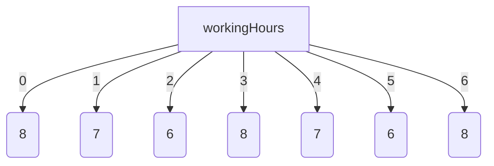

# JavaScript 3: Taulukot ja funktiot

## Taulukko

[Taulukko](https://developer.mozilla.org/en-US/docs/Web/JavaScript/Reference/Global_Objects/Array) (_array_) on tietorakenne, johon voi tallentaa useita arvoja peräkkäin. Taulukon ansiosta sinun ei tarvitse keksiä jokaiselle arvolle omaa muuttujan nimeä. Pääset kaikkiin taulukon arvoihin eli alkioihin (_element_) käsiksi yhden muuttujan kautta.

Voisit luoda esimerkiksi seuraavat taulukot:

- seitsemän alkion kokonaislukutaulukko, joka kertoo henkilön työtunnit viikon jokaiselta päivältä
- neljän alkion merkkijonotaulukko, joka sisältää neljän pelaajan nimet
- 500 alkion liukulukutaulukko, joka sisältää viisisataa satunnaislukua.

Työtuntitaulukkoa voisi havainnollistaa esimerkiksi seuraavasti:


```mermaid
graph TD;
    A[workingHours] -->|0| B(8);
    A -->|1| C(7);
    A -->|2| D(6);
    A -->|3| E(8);
    A -->|4| F(7);
    A -->|5| G(6);
    A -->|6| H(8);
```

Taulukon alkioon viitataan taulukkomuuttujan nimellä ja alkion indeksillä (_index_) eli järjestysnumerolla.

Esimerkissä `workingHours` on taulukkomuuttujan nimi, ja nuolten luvut 0–6 ovat indeksejä.

Viidennen päivän työtunteihin eli taulukon viidenteen alkioon viitataan merkinnällä `workingHours[4]`. Numerointi alkaa nollasta, joten suurin indeksi on aina yhtä pienempi kuin taulukon koko eli alkioiden määrä.

JavaScript ei vaadi, että taulukon kaikki alkiot ovat samaa tyyppiä. Voisit siis luoda esimerkiksi taulukon, jonka alkioista osa on kokonaislukuja ja osa merkkijonoja. Tämä on kuitenkin harvoin tarkoituksenmukaista.

## Taulukkomuuttujan määrittely ja taulukon luominen

Kun otat taulukon käyttöön, määrittelet taulukkomuuttujan ja luot taulukon. Seuraava lause määrittelee taulukkomuuttujan `numbers`, jonka arvo on aluksi tyhjä taulukko.

```javascript
const numbers = [];
```

Lisää sitten taulukkoon kolme alkiota:

```javascript
numbers[0] = 17;
numbers[1] = 2;
numbers[2] = 8;
```

Voit myös luoda taulukon ja antaa sen alkiot samassa lauseessa, jossa määrittelet taulukkomuuttujan:

```javascript
const numbers = [17, 2, 8];
```

Huomaa, että sinun ei tarvitse tietää taulukon kokoa, kun luot taulukon. Luotuun taulukkoon voit lisätä niin monta alkiota kuin haluat. Tämä onnistuu, vaikka muuttuja on määritelty `const`-avainsanalla: `const` estää vain sijoittamasta muuttujaan kokonaan uutta arvoa, ei muuttamasta taulukon sisältöä.

Taulukon koko on yhtä suurempi kuin suurin käytetty indeksi. Taulukon `numbers` koon saat tarvittaessa lausekkeella `numbers.length`.

## Taulukon läpikäynti

Voit käydä taulukon alkiot läpi toistorakenteella (_loop_). Seuraavassa esimerkissä käytetään `for`-lausetta ja taulukon ominaisuutta [array.length](https://developer.mozilla.org/en-US/docs/Web/JavaScript/Reference/Global_Objects/Array/length), joka kertoo alkioiden määrän.

```javascript
const names = ["Frank", "Scott", "Jasmine", "Don"];

for (let i = 0; i < names.length; i++) {
  console.log(`Nimi: ${names[i]}`);
}
```

Esimerkkituloste:

```monospace
Nimi: Frank
Nimi: Scott
Nimi: Jasmine
Nimi: Don
```

Voit käydä taulukon läpi myös [for...of-lauseella](https://developer.mozilla.org/en-US/docs/Web/JavaScript/Reference/Statements/for...of). Se sijoittaa jokaisella toistokerralla seuraavan alkion suoraan muuttujaan, kuten Pythonin `for`-lause:

```javascript
const names = ["Frank", "Scott", "Jasmine", "Don"];

for (const name of names) {
  console.log(`Nimi: ${name}`);
}
```

## Taulukon metodit

Taulukoilla on valmiita metodeja (_method_) eli taulukkoon liittyviä funktioita, joilla voit käsitellä taulukkoa. Esimerkkejä näistä metodeista:

- `sort()` lajittelee taulukon alkiot aakkosjärjestykseen
- `reverse()` kääntää taulukon alkiot päinvastaiseen järjestykseen
- `shift()` poistaa ja palauttaa taulukon ensimmäisen alkion
- `pop()` poistaa ja palauttaa taulukon viimeisen alkion
- `push(value)` lisää arvon taulukon loppuun (useita arvoja voi antaa pilkuilla erotettuina)
- `includes(value)` tarkistaa, sisältääkö taulukko annetun arvon

Kun lisäät arvoja taulukon loppuun, käytä metodia [array.push(value)](https://www.freecodecamp.org/news/javascript-append-to-array-a-js-guide-to-the-push-method-2/) mieluummin kuin indeksiin sijoittamista (`array[array.length] = value`). Silloin sinun ei tarvitse itse selvittää seuraavaa vapaata indeksiä.

Metodia kutsutaan kirjoittamalla ensin taulukkomuuttujan nimi, sitten piste ja lopuksi metodin nimi ja sulut. Esimerkiksi taulukko nimeltä `numbers` lajitellaan kirjoittamalla `numbers.sort()`.

Huomaa, että `sort()`-metodi lajittelee alkiot oletuksena merkkijonoina aakkosjärjestykseen eikä suuruusjärjestykseen. Esimerkiksi arvot 100, 23 ja 15 lajiteltaisiin järjestykseen 100, 15, 23, mikä ei yleensä ole ohjelmoijan haluama järjestys. Voit korjata tämän antamalla `sort()`-metodille vertailufunktion, joka kertoo, kumpi kahdesta alkiosta tulee ensin. Esimerkiksi taulukko `numbers` lajiteltaisiin suuruusjärjestykseen seuraavasti:

```javascript
numbers.sort((a, b) => a - b);
```

Yllä olevassa esimerkissä vertailufunktio on kirjoitettu nuolifunktiona (_arrow function_). Nuolifunktioita käsitellään tämän sivun lopussa.

### Olioliteraalit

Olioliteraali (_object literal_) on tapa luoda olio (_object_) kirjoittamalla sen sisältö suoraan koodiin. Olioliteraali on aaltosulkeiden sisällä oleva luettelo pilkuilla erotettuja nimi–arvo-pareja. Näitä nimiä kutsutaan olion ominaisuuksiksi (_property_). Oliota voi käyttää samaan tapaan kuin esimerkiksi Pythonin sanakirjaa. Tyypillinen olioliteraali näyttää tältä:

```javascript
const student = {
  firstName: "Greg",
  lastName: "Focker",
  studentId: "234359",
  phone: "040 5902123",
};
```

Ominaisuuteen voi viitata kahdella tavalla: pistemerkinnällä tai hakasulkeilla. Esimerkiksi opiskelijan etunimen saa merkinnällä `student.firstName` tai `student["firstName"]`.

```javascript
const greeting = `Hei, nimeni on ${student.firstName} ${student.lastName}`;
const studentInfo = `opiskelijanumero: ${student["studentId"]}, puhelinnumero: ${student["phone"]}`;
```

JavaScriptin oliot ovat dynaamisia: voit lisätä ja poistaa ominaisuuksia milloin tahansa, vaikka muuttuja olisi määritelty `const`-avainsanalla. Tätä kutsutaan olion muuttamiseksi (_mutating_).

```javascript
student.address = "Koulutie 7"; // lisää 'address'-ominaisuuden edellisen esimerkin olioon
delete student.phone; // poistaa 'phone'-ominaisuuden edellisen esimerkin oliosta
console.log(student);
```

Ominaisuuden nimen voi myös tallentaa muuttujaan ja käyttää muuttujaa hakasulkeiden sisällä. Seuraava koodi tulostaa opiskelijan sukunimen:

```javascript
const chosenProperty = "lastName";
console.log(student[chosenProperty]);
```

Ominaisuuden arvo voi olla myös funktio. Tällaista funktiota kutsutaan olion metodiksi. Alla oleva esimerkki luo opiskelijaolion, jonka metodi `hasLeft()` laskee, montako opintopistettä tutkinnosta vielä puuttuu. Metodin sisällä `this` viittaa olioon itseensä, joten `this.credits` tarkoittaa saman olion `credits`-ominaisuutta. Lopuksi puuttuvien opintopisteiden määrä tulostetaan.

```javascript
const student2 = {
  firstName: "Ahmed",
  lastName: "Hussein",
  credits: 175,
  hasLeft: function () {
    return 240 - this.credits;
  },
};

console.log(
  "Opiskelijalta " +
    student2.firstName +
    " puuttuu " +
    student2.hasLeft() +
    " opintopistettä.",
);
```

Funktioita käsitellään tarkemmin alempana.

Yllä olioita käytettiin tietorakenteena, johon voi tallentaa useita toisiinsa liittyviä arvoja yhden muuttujan nimen ”taakse”. Olio-ohjelmointia ei tässä käsitellä, mutta JavaScript on täysipainoinen olio-ohjelmointikieli, jossa voit määritellä luokkia konstruktoreineen ja metodeineen. Olioita voi luoda `new`-operaattorilla. ES6-kieliversiosta (ECMAScript 2015) lähtien luokkia voi määritellä `class`-avainsanalla ja toisten luokkien aliluokiksi pitkälti samaan tapaan kuin Java-ohjelmointikielessä.

## Funktiot

Funktio (_function_) on nimetty ohjelman osa, joka hoitaa tietyn rajatun tehtävän. Funktioiden taustalla on modulaarisuuden ajatus: samaa koodia ei kannata kirjoittaa moneen kertaan, joten ohjelman yleiskäyttöiset osat kannattaa kirjoittaa funktioiksi. Funktiota voi sitten käyttää ohjelmassa useita kertoja.

Kun funktio on kerran ohjelmoitu ja testattu huolellisesti, sitä voi ajatella ”mustana laatikkona”: voit käyttää sitä aina tarvittaessa miettimättä, miten se toimii sisältä.

Funktiota kutsutaan (eli käytetään) usein pääohjelmasta eli siitä ohjelman osasta, joka on funktioiden ulkopuolella. Funktiot voivat myös kutsua toisiaan. Myös verkkosivun painikkeen napsautus voi käynnistää funktion.

JavaScript tukee kahta tapaa kirjoittaa funktioita:

- `function`-lauseella kirjoitetut funktiot
- nuolifunktiot.

Ensin mainittu on perinteinen tapa, joka muistuttaa funktioiden määrittelyä useimmissa ohjelmointikielissä. Nuolifunktiot ovat uudempi ja tiiviimpi merkintätapa. Niitä käytetään paljon funktionaalisessa ohjelmointityylissä, jossa suositaan funktioita, jotka eivät muuta ohjelman tilaa eli joilla ei ole sivuvaikutuksia.

Funktionaalisen ohjelmoinnin oppimista pidetään vaikeampana. Nuolifunktioilla kirjoitettu JavaScript-koodi on myös tiiviimpää, joten sitä on ainakin aluksi vaikeampi lukea ja kirjoittaa.

Siksi tällä sivulla keskitytään `function`-lauseella kirjoitettuihin funktioihin. Sivun lopussa opit kuitenkin kirjoittamaan myös nuolifunktioita.

## Parametriton funktio ilman paluuarvoa

Tarkastellaan ensin funktiota, jolla ei ole parametreja (_parameter_) eikä paluuarvoa (_return value_). Tällainen funktio tekee saman asian joka kerta, kun sitä kutsutaan: sen toimintaa ei voi ohjata funktion ulkopuolelta, eikä funktio palauta mitään tietoa sitä kutsuvalle ohjelman osalle.

Seuraava funktio tulostaa aina saman tervehdystekstin:

```javascript
function greet() {
  console.log("No moi!");
  return;
}
```

Funktion suoritus päättyy `return`-lauseeseen. `return`-lauseella voi myös palauttaa paluuarvon, mutta tässä funktiossa paluuarvoa ei ole. Tällaisen `return`-lauseen voi jättää kokonaan pois, jolloin funktio päättyy viimeisen lauseensa jälkeen.

Pelkkä funktion määrittely ei vielä suorita funktiota. Funktio suoritetaan vasta, kun sitä kutsutaan.

Lisää funktion määrittelyn alle pääohjelma, joka sisältää funktion kutsun:

```javascript
greet();
```

Nyt funktio suoritetaan, ja ohjelma tulostaa tervehdystekstin.

Funktion käyttö parantaa modulaarisuutta: jos tervehtimistapaa täytyy myöhemmin muuttaa, riittää, että teet muutoksen yhteen paikkaan eli funktion määrittelyyn.

## Parametrillinen funktio

Laajennetaan seuraavaksi tervehdysfunktiota niin, että funktion kutsuja voi itse valita tervehdystekstin ja tervehdysten määrän. Tätä kutsutaan funktion parametroinniksi. Funktiolle määritellään kaksi parametrimuuttujaa, `text` ja `times`, joiden arvot ohjaavat funktion toimintaa:

```javascript
function greet(text, times) {
  for (let i = 1; i <= times; i++) {
    console.log(text + " " + i + ". kerran!");
  }
  return;
}
```

Parametrimuuttujat saavat arvonsa, kun funktiota kutsutaan. Funktion kutsussa annettavia arvoja sanotaan argumenteiksi (_argument_).

Kun funktiota kutsutaan ja suoritus siirtyy funktioon, kutsun argumenttien arvot kopioidaan funktion määrittelyssä olevien parametrimuuttujien arvoiksi.

Kirjoita funktion kutsu funktion määrittelyn alle:

```javascript
greet("Hei", 4);
```

Ohjelma tuottaa seuraavan tulosteen:

```monospace
Hei 1. kerran!
Hei 2. kerran!
Hei 3. kerran!
Hei 4. kerran!
```

Funktiota kutsuttaessa ensimmäisen argumentin arvo (merkkijono `Hei`) kopioitiin ensimmäisen parametrimuuttujan `text` arvoksi. Vastaavasti toisen argumentin arvo `4` kopioitiin toisen parametrimuuttujan `times` arvoksi.

Näin kirjoitettu funktio on yleiskäyttöisempi kuin aiempi. Sillä voi tuottaa erilaisia tervehdyksiä pääohjelman eri kohdissa.

## Paluuarvollinen funktio

Parametrien avulla annat funktiolle ulkopuolelta lähtötiedot, joiden perusteella funktio hoitaa tehtävänsä. Usein funktio tuottaa tuloksen, joka täytyy välittää takaisin sille ohjelman osalle (pääohjelmalle tai toiselle funktiolle), joka kutsui funktiota. Palautettavaa tulosta kutsutaan funktion paluuarvoksi.

Esimerkkinä on ohjelma, joka laskee kahden luvun neliösumman. Lukujen 2 ja 5 neliösumma on 2 · 2 + 5 · 5 eli 29. Luvut, joiden neliösumma lasketaan (esim. 2 ja 5), annetaan funktiolle argumentteina. Laskun tulos (esim. 29) on funktion paluuarvo eli tulos, joka välitetään funktiota kutsuvalle ohjelman osalle.

Paluuarvo palautetaan `return`-lauseella. Esimerkiksi muuttujan `result` arvo palautettaisiin seuraavalla lauseella:

```javascript
return result;
```

Alla olevan ohjelman funktio laskee neliösumman. Funktion jälkeen on pääohjelma, joka kutsuu `quadraticSum`-funktiota ja antaa sille argumentit. Lopuksi pääohjelma tulostaa `quadraticSum`-funktion palauttaman paluuarvon.

```javascript
function quadraticSum(first, second) {
  const result = first * first + second * second;
  return result;
}

const num1 = prompt("Anna 1. luku.");
const num2 = prompt("Anna 2. luku.");
const quad = quadraticSum(num1, num2);
console.log("Lukujen " + num1 + " ja " + num2 + " neliösumma on " + quad);
```

## Muuttujien näkyvyys

Kun ohjelmassa on funktioita, täytyy miettiä muuttujien näkyvyysaluetta (_scope_) eli sitä, missä ohjelman osissa muuttujaa voi käyttää.

Aiemmissa esimerkeissä on käytetty `let`- ja `const`-avainsanoilla määriteltyjä muuttujia. Ne ovat käytettävissä (eli näkyvissä) siinä lohkossa (_block_), jossa ne on määritelty, sekä sen sisällä olevissa lohkoissa. Lohko on aaltosulkeiden `{ }` rajaama koodin osa, esimerkiksi funktion runko tai `if`-lauseen runko. Kun muuttuja määritellään `let`- tai `const`-avainsanalla pääohjelmassa (funktioiden ulkopuolella), siitä tulee globaali muuttuja, joka on käytettävissä koko ohjelmassa.

Globaalin muuttujan voi määritellä funktioiden ulkopuolella myös `var`-avainsanalla. `var` on vanhempi tapa määritellä muuttujia; nykyään suositaan `let`- ja `const`-avainsanoja.

Funktion sisällä `var`-avainsanalla määritellyt muuttujat ovat funktion paikallisia muuttujia. Ne näkyvät kaikkialla siinä funktiossa, jossa ne on määritelty, myös sen lohkon ulkopuolella, jossa määrittely on.

Tarkastellaan esimerkkiä, joka havainnollistaa `var`- ja `const`-avainsanoilla määriteltyjen muuttujien näkyvyyseroja:

```javascript
const n1 = 3; // globaali muuttuja

function hello() {
  var n2 = 5; // funktion paikallinen muuttuja

  if (n2 > 0) {
    const n3 = 8; // lohkon paikallinen muuttuja
    var n4 = 9; // funktion paikallinen muuttuja
  }
  console.log(n1); // globaali muuttuja näkyy kaikkialla
  console.log(n2); // funktion paikallinen muuttuja on käytettävissä funktion sisällä
  //console.log(n3); -- lohkon paikallinen muuttuja ei ole käytettävissä lohkon ulkopuolella
  console.log(n4); // funktion paikallinen muuttuja on käytettävissä funktion sisällä
}

hello();

console.log(n1); // globaali muuttuja näkyy kaikkialla
//console.log(n2); -- funktion paikallinen muuttuja ei näy funktion ulkopuolelle
//console.log(n3); -- lohkon paikallinen muuttuja ei näy lohkon ulkopuolelle
//console.log(n4); -- funktion paikallinen muuttuja ei näy funktion ulkopuolelle
```

Osa tulostuslauseista on kommentoitu pois käytöstä, koska ne viittaavat muuttujaan, joka ei näy kyseisessä ohjelman osassa. Jos poistat niistä kommenttimerkit, ohjelma pysähtyy virheeseen (`ReferenceError`).

Jos globaalilla muuttujalla ja funktion paikallisella muuttujalla olisi sama nimi, paikallinen muuttuja peittäisi globaalin muuttujan siinä funktiossa, jossa se on määritelty. Tällöin käytössä olisi kaksi eri muuttujaa, joilla on sama nimi mutta eri näkyvyysalue.

## Taulukko parametrina

Edellä todettiin, että funktion argumenttien arvot kopioidaan parametrimuuttujien arvoiksi, kun funktiota kutsutaan. Tarkastellaan seuraavaksi tilannetta, jossa funktiolle välitetään argumenttina taulukko.

Kun argumentti on primitiiviarvo, kuten luku, merkkijono tai totuusarvo, parametrimuuttujaan kopioidaan itse arvo (esimerkiksi 3). Taulukkomuuttujan arvo taas ei ole itse taulukko vaan viittaus (_reference_) taulukkoon. Viittaus kertoo, mihin kohtaan muistia (mihin muistiosoitteeseen) taulukko on tallennettu.

Kun funktiolle välitetään argumenttina taulukko, parametrimuuttujaan kopioidaan viittaus taulukkoon. Itse taulukkoa ei kopioida. Funktion kutsussa oleva taulukkomuuttuja ja funktion parametrimuuttuja viittaavat siis yhteen ja samaan taulukkoon. Tätä kutsutaan arkikielessä usein viittausvälitykseksi (_pass-by-reference_). Tarkalleen ottaen JavaScript välittää argumentit aina arvoina, mutta taulukon tapauksessa välitettävä arvo on viittaus. Pidä tämä mielessä, jotta taulukoiden välittäminen funktioille ei aiheuta yllätyksiä.

Tarkastellaan esimerkiksi alla olevaa ohjelmaa. Pääohjelma luo kolmialkioisen taulukon, välittää sen funktiolle argumenttina ja lopuksi tulostaa taulukon arvot.

```javascript
function grow(array) {
  for (let i = 0; i < array.length; i++) {
    array[i]++;
  }
  return;
}

const numbers = [5, 6, 7];
grow(numbers);
console.log(numbers[0] + " " + numbers[1] + " " + numbers[2]);
```

Ohjelma tulostaa:

```monospace
6 7 8
```

Mitä tapahtui?

1. Pääohjelma luo kolmialkioisen taulukon nimeltä `numbers` ja tallentaa siihen luvut 5, 6 ja 7. Taulukko sijaitsee muistiosoitteessa X.
2. `grow()`-funktion kutsussa muistiosoite X kopioidaan parametrimuuttujan `array` arvoksi.
3. Funktio käsittelee taulukkoa parametrimuuttujan `array` kautta ja kasvattaa jokaista alkiota yhdellä. Kyseessä on sama taulukko, joka luotiin pääohjelmassa.
4. Funktio päättyy. Pääohjelma hakee taulukon sisällön taulukkomuuttujan `numbers` kautta ja tulostaa taulukon arvot.

Kun `grow()`-funktio muuttaa sille argumenttina välitettyä taulukkoa, muutos näkyy siis myös funktiota kutsuvassa pääohjelmassa.

## Taulukko paluuarvona

Funktio voi myös palauttaa paluuarvona viittauksen taulukkoon. Alla olevan ohjelman funktio arpoo lottorivin ja palauttaa sen numerot taulukkona:

```javascript
function doLottery(numbers, num) {
  const row = [];
  let r;
  for (let i = 0; i < num; i++) {
    let ok = false;

    while (!ok) {
      ok = true;
      r = Math.floor(Math.random() * numbers) + 1;
      for (let j = 0; j < i + 1; j++) {
        if (row[j] === r) {
          ok = false;
        }
      }
    }
    row[i] = r;
  }
  return row;
}

const lottery = doLottery(40, 7);
for (let i = 0; i < lottery.length; i++) {
  console.log(lottery[i]);
}
```

Huomaa, että lottonumerotaulukko luotiin funktion sisällä. Funktio palauttaa paluuarvona viittauksen tähän taulukkoon eli paikallisen taulukkomuuttujan `row` arvon. Funktion ulkopuolella lottoriviin pääsee käsiksi taulukkomuuttujan `lottery` kautta, koska sen arvoksi tallennettiin funktion palauttama viittaus.

## Nuolifunktiot

Tämän sivun esimerkit on kirjoitettu JavaScriptin perinteisellä `function`-lauseella. ES6-kieliversio tarjoaa vaihtoehtoisen, tiiviimmän tavan kirjoittaa funktio. Tämän merkintätavan mukaisia funktioita kutsutaan nuolifunktioiksi tai lambdafunktioiksi.

Kirjoitetaan aiemman esimerkin neliösummafunktio tällä kertaa nuolifunktiona:

```javascript
const quadraticSum = (a, b) => a * a + b * b;
```

Tässä neliösumman laskeva nimetön funktio sijoitetaan vakion (_constant_) `quadraticSum` arvoksi.

Parametrit (tässä `a` ja `b`) luetellaan sulkeissa ennen nuolta `=>`. Nuolen jälkeen tulevan lausekkeen arvo on funktion paluuarvo, tässä lukujen neliösumma.

Nuolifunktiota kutsutaan samalla tavalla kuin `function`-avainsanalla kirjoitettua funktiota.

```javascript
console.log(quadraticSum(3, 5));
```

Jos nuolifunktion täytyy suorittaa useampi lause, funktion runko kirjoitetaan lohkoksi aaltosulkeiden sisään. Alla olevassa `quadraticSum`-funktion versiossa on myös tulostuslause, joten se tarvitsee lohkon. Lohkon sisältävässä nuolifunktiossa paluuarvo täytyy palauttaa `return`-lauseella.

```javascript
const quadraticSum = (a, b) => {
  console.log("quadraticSum-funktiota kutsuttiin.");
  return a * a + b * b;
};
```

Lohkon sisältävää nuolifunktiota kutsutaan samalla tavalla kuin edellisessä esimerkissä:

```javascript
console.log(quadraticSum(3, 5));
```

---

<!-- add mermaid support for gh pages -->
<script type="module">
    Array.from(document.getElementsByClassName("language-mermaid")).forEach(element => {
      element.classList.add("mermaid");
    });
    import mermaid from 'https://cdn.jsdelivr.net/npm/mermaid@11/dist/mermaid.esm.min.mjs';
    mermaid.initialize({startOnLoad: true});
</script>
