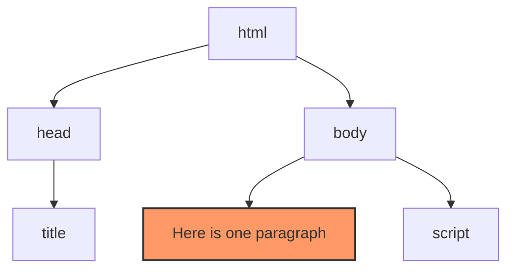

# JavaScript 4 - Document Object Model (DOM) ja tapahtumat

## BOM – Browser Object Model

Browser Object Model on kokoelma ominaisuuksia, jotka käsittelevät esimerkiksi selainikkunaa ja niiden välistä viestintää. BOM ei ole standardi, joten eri selainten välillä on pieniä eroja.

### [window]([https://developer.mozilla.org/en-US/docs/Web/API/Window]%28https://developer.mozilla.org/en-US/docs/Web/API/Window%29)

Window-rajapinta tarkoittaa selainikkunaa, ja sitä tuetaan kaikissa selaimissa. Kaikki globaalit JavaScript-oliot, funktiot ja muuttujat ovat automaattisesti window-rajapinnan jäseniä. Esimerkiksi:

```javascript
window.document.querySelector(".button");
```

on sama kuin:

```javascript
document.querySelector(".button");
```

Useimmat komennot voidaan siis kirjoittaa ilman sanaa `window`.

#### [alert]([https://developer.mozilla.org/en-US/docs/Web/API/Window/alert]%28https://developer.mozilla.org/en-US/docs/Web/API/Window/alert%29)

`alert()`-funktio avaa ponnahdusikkunan, jossa on teksti ja OK-painike. Tätä voidaan käyttää käyttäjän ilmoittamiseen esimerkiksi siitä, onnistuiko vai epäonnistuiko jokin toiminto. Ohjelman suoritus keskeytyy, kunnes käyttäjä painaa OK-painiketta.

```javascript
alert("Jotain tekstiä");
```

#### [confirm]([https://developer.mozilla.org/en-US/docs/Web/API/Window/confirm]%28https://developer.mozilla.org/en-US/docs/Web/API/Window/confirm%29)

`confirm()`-funktio avaa ponnahdusikkunan, jossa on teksti ja kaksi painiketta: OK ja Peruuta. Tämän avulla käyttäjältä voidaan kysyä, hyväksyykö vai hylkääkö hän toiminnon.

```javascript
const answer = confirm("Jokin kysymys");

// vastauksen tulostaminen konsoliin
console.log(answer);
```

Funktion palauttama arvo on totuusarvo, joka tallennetaan `answer`-muuttujaan: "OK" => `true` ja "Peruuta" => `false`.

#### [prompt]([https://developer.mozilla.org/en-US/docs/Web/API/Window/prompt]%28https://developer.mozilla.org/en-US/docs/Web/API/Window/prompt%29)

`prompt()`-funktio avaa ponnahdusikkunan, jossa on otsikko ja tekstikenttä, johon käyttäjä voi kirjoittaa.

```javascript
const answer = prompt("Otsikko", "Tekstikentän alkuperäinen sisältö");

// vastauksen tulostaminen konsoliin
console.log(answer);
```

`answer`-muuttujan arvo on merkkijono, johon käyttäjän vastaus tallennetaan. Jos tekstikenttä on tyhjä, arvoksi tulee **null**. Toinen parametri on valinnainen. Se näkyy automaattisesti tekstikentässä.

### [location-rajapinta]([https://developer.mozilla.org/en-US/docs/Web/API/location]%28https://developer.mozilla.org/en-US/docs/Web/API/location%29)

`location`-rajapinta kertoo dokumentin osoitetiedot. Sitä käytetään yleensä selaimen uudelleenohjaamiseen:

```javascript
location.href = "[http://metropolia.fi](http://metropolia.fi)";
```

## DOM – Document Object Model

Document Object Model on HTML-dokumentin puumainen kuvaus.

> "Lähde: w3schools.com")
**w3schools.com**

Yllä oleva kuva havainnollistaa seuraavaa HTML-koodia:

```html
<html>
  <head>
    <title>Oma otsikkoni</title>
  </head>
  <body>
    <h1>Oma pääotsikkoni</h1>
    <a href="#">Oma linkkini</a>
  </body>
</html>
```

HTML DOM on standardi, joka määrittelee, miten HTML-elementtejä valitaan, muokataan, lisätään ja poistetaan. Kaikkia elementtejä käsitellään olioina, ja jokaista elementtiä, attribuuttia ja elementin sisältöä (esimerkiksi tekstiä) kutsutaan solmuksi eli _nodeksi_.

```html
<html>
  <head>
    <title>Esimerkki</title>
  </head>
  <body>
    <p>Tässä on yksi kappale</p>
    <script>
      const paragraph = document.querySelector("p"); // valitsee dokumentin ensimmäisen p-elementin
      console.log(paragraph.innerText); // tulostaa p-elementin sisällä olevan tekstin konsoliin
    </script>
  </body>
</html>
```

Edellä olevassa esimerkissä valittu p-elementti tallennetaan elementtioliona (tai elementtisolmuna) `paragraph`-nimiseen muuttujaan. `paragraph`-oliota voidaan tämän jälkeen käsitellä [Document]([https://developer.mozilla.org/en-US/docs/Web/API/Document]%28https://developer.mozilla.org/en-US/docs/Web/API/Document%29)-rajapinnan ominaisuuksien ja metodien avulla.



### Isäntä/lapsi

Koska DOM kuvaa dokumentin puumaisena rakenteena, tässä yhteydessä käytetään termejä isäntä, lapsi ja sisarus. Esimerkiksi yllä olevassa kuvassa h1-elementti on body-elementin lapsi ja a-elementin sisarus. Vastaavasti body-elementti on sekä h1- että a-elementin isäntä.

### [Document]([https://developer.mozilla.org/en-US/docs/Web/API/Document]%28https://developer.mozilla.org/en-US/docs/Web/API/Document%29)-rajapinta

`document`-rajapinta edustaa verkkosivua ja sisältää kaikki muut dokumentin oliot. Minkä tahansa HTML-elementin valitseminen dokumentista täytyy aloittaa document-rajapinnasta. Esimerkiksi `document.getElementByID('logo')`

#### Keskeiset funktiot ja ominaisuudet

```javascript
document.querySelector("#logo"); // hakee dokumentista yhden elementin CSS-valitsimen avulla. Tässä tapauksessa tietyn id:n perusteella
document.querySelectorAll(".button"); // hakee dokumentista elementit CSS-luokan valitsimen avulla.
document.getElementById("logo"); // hakee dokumentista tietyn id:n omaavan elementin
document.createElement("p"); // luo uuden p-elementin, mutta sitä ei ole vielä lisätty dokumenttiin

// komentoja voidaan kohdistaa myös valittuun elementtiin:
element.getElementsByTagName("p"); // hakee kaikki p-elementit valitusta elementistä
element.appendChild(child); // lisää lapsisolmun elementtiin
element.removeChild(child); // poistaa lapsisolmun elementistä

element.innerHTML; // elementin sisältämä HTML-koodi
element.innerText; // elementin sisältämä teksti
```

### Esimerkkejä

1. Valitse dokumentista elementti, jonka id on `'news'`, ja tallenna elementtisolmu muuttujaan `'u'`. Valitse sitten kaikki p-elementit elementtisolmusta `'u'` ja tallenna elementtilista muuttujaan `'p'`:

   ```javascript
   const u = document.getElementById("news");
   const p = u.getElementsByTagName("p");

   // sama voidaan kirjoittaa myös ilman väliaikaista muuttujaa
   const p = document.getElementById("news").getElementsByTagName("p");

   // tai yhdellä komennolla käyttäen CSS-valitsinta
   const p = document.querySelectorAll("#news p");
   ```

2. Valitse listan `<ul>` toinen alkio (eli `<li>`):

   ```html
   <ul>
     <li>Ensimmäinen alkio</li>
     <li>Toinen alkio</li>
     <li>Kolmas alkio</li>
   </ul>
   ```

   ```javascript
   const second = document.getElementsByTagName("li")[1]; // getElementsByTagname palauttaa taulukon. Taulukon indeksit alkavat nollasta, joten 1 tarkoittaa toista <li>-elementtiä.
   const second = document.querySelectorAll("li")[1]; // sama querySelectorAll-funktiolla
   ```

3. Käy kaikki `<li>`-elementit läpi `forEach`-funktiolla ja tee tekstistä lihavoitua. ([forEach]([https://developer.mozilla.org/en-US/docs/Web/JavaScript/Reference/Global_Objects/Array/forEach]%28https://developer.mozilla.org/en-US/docs/Web/JavaScript/Reference/Global_Objects/Array/forEach%29) on moderni vaihtoehto `for...of`-rakenteelle)

   ```javascript
   const bullets = document.querySelectorAll("li");

   for (let bullet of bullets) {
     bullet.innerHTML = `<b>${bullet.innerHTML}</b>`;
   }

   // vaihtoehtoinen syntaksi käyttäen array.forEach()-metodia
   /*
   bullets.forEach(function (bullet) {
     bullet.innerHTML = `<b>${bullet.innerHTML}</b>`;
   })
   */
   ```

4. Lista kaikista p-elementeistä, joilla on `"bulletin"`-luokka:

   ```javascript
   const x = document.querySelectorAll("p.bulletin");
   ```

5. Muuta elementin sisältöä:

   ```html
   <p id="date"><span class="blue">Maanantai</span></p>

   <script>
     document.getElementById("date").innerHTML =
       '<span class="red">Tiistai</span>';
   </script>
   ```

6. Muuta attribuutin arvoa:

   ```html
   

   <script>
     document.getElementById("logo").src = "laurea.png"; // attribuutin nimeä käytetään ominaisuutena
     document.getElementById("logo").setAttribute("src", "laurea.png"); // tai setAttribute()-funktiota vanhemmille selaimille
   </script>
   ```

7. HTML:n lisääminen dokumenttiin:
   1. käyttäen innerHTML-ominaisuutta:

      ```html
      <div id="example"></div>

      <script>
        const div = document.querySelector("#example"); // hakee elementin, jonka id on 'example'
        const html =
          // monirivisen merkkijonon muodostamiseksi huomaa merkkijonon ympärillä olevat kenoviivat
          `<p>
                  Tässä on tekstiä ja kuva.
                  
               </p>`;
        div.innerHTML = html; // asettaa merkkijonon 'html' valitun elementin HTML-sisällöksi
      </script>
      ```

   2. Sama DOM-funktioilla

      ```html
      <div id="example"></div>

      <script>
        const div = document.querySelector("#example"); // hakee elementin, jonka id on 'example'

        const i = document.createElement("img"); // luo img-elementin
        i.src =
          "[https://via.placeholder.com/320](https://via.placeholder.com/320)"; // asettaa src-attribuutin
        i.alt = "Kissa"; // asettaa alt-attribuutin

        const t = document.createTextNode("Tässä on tekstiä ja kuva."); // luo tekstisolmun

        const p = document.createElement("p"); // luo p-elementin
        p.appendChild(t); // lisää tekstin p-elementtiin
        p.appendChild(i); // lisää kuvan p-elementtiin

        div.appendChild(p); // lisää p-elementin HTML-dokumentista valittuun elementtiin
        // tässä vaiheessa uusi HTML ilmestyy dokumenttiin.
      </script>
      ```

### CSS:n käsittely

JavaScriptiä voidaan käyttää myös elementtien ulkoasun muokkaamiseen. Tässä tapauksessa vaihtoehtoina on joko muuttaa style-attribuutin arvoja tai class-attribuutin arvoja, kuten HTML-dokumenteissa normaalisti tehdään.

Style-attribuutin muokkaaminen eli inline-menetelmä:

```html
<p style="background-color: #ccc; padding: 1rem;" id="paragraph">
  Jotain tekstiä
</p>

<script>
  document.querySelector("#paragraph").style =
    "color: #eee; background-color: #222; padding: 3rem;";
</script>
```

Class-attribuutin muokkaaminen:

```css
/* ulkoinen css-tiedosto */
.red {
  color: #f00;
}

.blue {
  color: #00f;
}
```

```html
<p class="red" id="paragraph">Jotain tekstiä</p>

<script>
  // Kytkee red-luokan päälle tai pois
  document.querySelector("#paragraph").classList.toggle("red");
  // Korvaa red-luokan blue-luokalla
  document.querySelector("#paragraph").classList.replace("red", "blue");
</script>
```

Lisätietoja class-attribuuttien käsittelyn metodeista on [classList-dokumentaatiossa]([https://developer.mozilla.org/en-US/docs/Web/API/Element/classList]%28https://developer.mozilla.org/en-US/docs/Web/API/Element/classList%29).

## Tapahtumat

Koska JavaScriptiä käytetään vuorovaikutteisuuden lisäämiseen verkkosivustolle, tarvitaan tapa reagoida käyttäjän suorittamiin toimintoihin ja järjestelmässä tapahtuviin tapahtumiin. Tätä menetelmää kutsutaan [tapahtumankäsittelyksi.]([https://developer.mozilla.org/en-US/docs/Learn/JavaScript/Building_blocks/Events]%28https://developer.mozilla.org/en-US/docs/Learn/JavaScript/Building_blocks/Events%29)

Jos käyttäjä esimerkiksi napsauttaa painiketta, voimme vastata näyttämällä tietoruudun:

```html
<button>Napsauta minua</button>
<script>
  const button = document.querySelector("button");
  button.addEventListener("click", function (evt) {
    alert("Elementti " + evt.currentTarget.tagName + " sai napsautuksen");
  });
</script>
```

Edellä olevassa koodissa `addEventListener`-metodin ensimmäinen parametri `'click'` on **tapahtuma**, ja toinen parametri on funktio, jota kutsutaan, kun `'click'` tapahtuu. Toinen parametri voi olla myös viittaus funktioon:

```html
<button>Napsauta minua</button>
<script>
  const button = document.querySelector("button");

  function popup(evt) {
    alert("Elementti " + evt.currentTarget.tagName + " sai napsautuksen");
  }

  button.addEventListener("click", popup);
</script>
```

Huomaa, että `addEventListener`-kutsussa `popup`-funktiosta puuttuvat sulkeet. Tämä johtuu siitä, että `popup`-funktiota käytetään tapahtumankäsittelijänä eikä sitä kutsuta välittömästi, vaan vasta kun `'click'` tapahtuu. Jos siinä olisi sulkeet, funktio käynnistettäisiin välittömästi.

Tapahtumankäsittelijää kutsutaan **callback-funktioksi**, mikä tarkoittaa funktiota, joka välitetään argumenttina toiselle funktiolle ja jota kutsutaan tietyn tapahtuman tapahtuessa. Callback-funktioita käytetään monissa JavaScriptin tilanteissa, ei vain tapahtumien käsittelyssä. Tätä käsitettä kutsutaan "asynkroniseksi ohjelmoinniksi", ja se on keskeinen osa JavaScriptiä. [Lue lisää callback-funktioista]([https://developer.mozilla.org/en-US/docs/Learn_web_development/Extensions/Async_JS/Introducing#callbacks]%28https://developer.mozilla.org/en-US/docs/Learn_web_development/Extensions/Async_JS/Introducing#callbacks%29).

Tapahtumankäsittelijä vastaanottaa [tapahtumaolion]([https://developer.mozilla.org/en-US/docs/Web/API/Event]%28https://developer.mozilla.org/en-US/docs/Web/API/Event%29) (`evt`), joka sisältää tietoa tapahtumasta, kuten tapahtuman tyypin ja sen kohteen. Esimerkiksi `evt.currentTarget` palauttaa elementin, joka on tapahtuman kohde. Edellä olevassa esimerkkikoodissa tämä kohde on `<button>`-elementti.

[Tutustu tähän tapahtumaluetteloon]([https://developer.mozilla.org/en-US/docs/Web/Events]%28https://developer.mozilla.org/en-US/docs/Web/Events%29). Tässä vaiheessa tärkeimpiä ovat [hiireen liittyvät tapahtumat]([https://developer.mozilla.org/en-US/docs/Web/API/Element#mouse_events]%28https://developer.mozilla.org/en-US/docs/Web/API/Element#mouse_events%29).

### Syntaksi

Tapahtumankäsittelyssä voidaan käyttää kolmea erilaista syntaksia.

#### Vanha (90-luku)

Inline-syntaksi, jossa tapahtumankäsittelijä määritellään HTML-koodissa. **Tätä menetelmää tulee välttää**. Tosin jotkin kehykset ja kirjastot, kuten Angular ja React, käyttävät tämän kaltaista syntaksia, mutta ne ovat erityistapauksia.

```html
<button>Napsauta minua</button>
<script>
  function popup(evt) {
    alert("Elementti" + evt.currentTarget + " sai napsautuksen");
  }
</script>
```

### Perinteinen (2000-luku)

[Onevent-ominaisuudet]([https://developer.mozilla.org/en-US/docs/Web/Events/Event_handlers#using_onevent_properties]%28https://developer.mozilla.org/en-US/docs/Web/Events/Event_handlers#using_onevent_properties%29) ovat kätevä tapa tapahtumien käsittelyyn. Niitä suositellaan käytettäväksi vain yksinkertaisimmissa sovelluksissa, mutta yleisesti ottaen **niitä ei suositella käytettäväksi modernissa web-kehityksessä**.

```html
<button>Napsauta minua</button>
<script>
  const button = document.querySelector("button");

  function popup(evt) {
    alert("Elementti" + evt.currentTarget + " sai napsautuksen");
  }

  button.onclick = popup;
</script>
```

### Moderni (nykyinen)

Kuten ensimmäisissä tapahtumaesimerkeissä käytettiin, [addEventListener]([https://developer.mozilla.org/en-US/docs/Web/API/EventTarget/addEventListener]%28https://developer.mozilla.org/en-US/docs/Web/API/EventTarget/addEventListener%29)-funktiota suositellaan useimmissa sovelluksissa. Sitä voidaan käyttää useamman kuin yhden tapahtumankäsittelijän lisäämiseen samaan tapahtumaan, tai tapahtuma voidaan peruuttaa sovelluksen eri vaiheissa tarpeen mukaan käyttämällä [removeEventListener]([https://developer.mozilla.org/en-US/docs/Web/API/EventTarget/removeEventListener]%28https://developer.mozilla.org/en-US/docs/Web/API/EventTarget/removeEventListener%29)-funktiota.

Tällainen toiminto voi olla tarpeen esimerkiksi silloin, kun haluat ensimmäisen painikkeen napsautuksen suorittavan funktion A ja toisen painikkeen napsautuksen funktion B:

```html
<button>Napsauta minua</button>
<script>
  const button = document.querySelector("button");

  function A(evt) {
    alert("Tämä on funktio A");
    button.removeEventListener("click", A);
    button.addEventListener("click", B);
  }

  function B(evt) {
    alert("Tämä on funktio B");
  }

  button.addEventListener("click", A);
</script>
```

## Syötearvojen lukeminen HTML-lomakkeilla

[HTML-lomakkeita]([https://developer.mozilla.org/en-US/docs/Web/HTML/Reference/Elements/form]%28https://developer.mozilla.org/en-US/docs/Web/HTML/Reference/Elements/form%29) käytetään käyttäjän syötteen keräämiseen. Ne tarjoavat kehittyneemmän tavan kerätä käyttäjän syötettä kuin pelkän `prompt()`-funktion käyttäminen. Lomakkeet voivat sisältää erilaisia syöteelementtejä, kuten tekstikenttiä, valintaruutuja, radiopainikkeita ja lähetyspainikkeita:

```html
<form action="#">
  <!-- action-attribuutti määrittää, minne lomakkeen tiedot lähetetään lomakkeen lähettämisen yhteydessä. Tässä tapauksessa arvoksi on asetettu "#", mikä tarkoittaa, ettei lomaketta lähetetä mihinkään. -->

  <!-- Tekstisyöte -->
  <label for="name">Nimi:</label><br />
  <input type="text" id="name" name="name" /><br /><br />

  <!-- Sähköpostisyöte -->
  <label for="email">Sähköposti:</label><br />
  <input type="email" id="email" name="email" /><br /><br />

  <!-- Salasanasyöte -->
  <label for="password">Salasana:</label><br />
  <input type="password" id="password" name="password" /><br /><br />

  <!-- Numerosyöte -->
  <label for="age">Ikä:</label><br />
  <input type="number" id="age" name="age" /><br /><br />

  <!-- Päivämääräsyöte -->
  <label for="date">Päivämäärä:</label><br />
  <input type="date" id="date" name="date" /><br /><br />

  <!-- Radiopainikkeet -->
  <p>Sukupuoli:</p>
  <input type="radio" id="male" name="gender" value="male" />
  <label for="male">Mies</label><br />
  <input type="radio" id="female" name="gender" value="female" />
  <label for="female">Nainen</label><br /><br />

  <!-- Valintaruutu -->
  <input type="checkbox" id="subscribe" name="subscribe" />
  <label for="subscribe">Tilaa uutiskirje</label><br /><br />

  <!-- Pudotusvalikko -->
  <label for="country">Maa:</label><br />
  <select id="country" name="country">
    <option value="fi">Suomi</option>
    <option value="pl">Puola</option>
    <option value="es">Espanja</option></select
  ><br /><br />

  <!-- Tekstialue -->
  <label for="message">Viesti:</label><br />
  <textarea id="message" name="message" rows="4" cols="30"></textarea
  ><br /><br />

  <!-- Lähetyspainike -->
  <input type="submit" value="Lähetä" />
</form>
```

Lomakkeen elementit voidaan valita, lukea ja käsitellä JavaScriptillä aivan kuten mitä tahansa muutakin HTML-elementtiä. Tällä kurssilla käytämme lomakkeita vain tekstisyötteen lukemiseen ja sen käyttämiseen JavaScript-koodissa.

### Tapahtuman oletustoiminnon estäminen

Joillakin elementeillä, kuten `<a>`- tai `<form>`-elementeillä, on tapahtumille oletustoimintoja. Esimerkiksi `<a>`-elementin napsauttaminen vie sinut `href`-attribuutissa määritettyyn osoitteeseen, tai `<form>`-elementti avaa `action`-attribuutissa määritetyn osoitteen, kun lomake lähetetään. Joissakin tapauksissa haluat keskeyttää nämä oletustoiminnot.

HTML-lomakkeet toimivat esimerkiksi siten, että käyttäjä täyttää lomakkeen ja painaa sen jälkeen lähetyspainiketta. Tässä vaiheessa selain lähettää tiedot action-attribuutissa määritettyyn osoitteeseen (eli lähettää HTTP-pyynnön) ja samalla avaa kyseisen osoitteen selainikkunassa (eli vastaanottaa HTTP-vastauksen). Nykyaikaiset verkkosovellukset haluavat estää tämän tapahtumisen, joten lomakkeen lähettäminen ei saa siirtää käyttäjää uudelle sivulle joka kerta. Esimerkkinä voidaan käyttää viestien lähettämistä Facebookissa. Elementin oletustapahtuman estämiseen käytetään [preventDefault]([https://developer.mozilla.org/en-US/docs/Web/API/Event/preventDefault]%28https://developer.mozilla.org/en-US/docs/Web/API/Event/preventDefault%29)-funktiota:

```html
<form>
  <div>
    <input name="fName" type="text" placeholder="etunimi" />
  </div>
  <div>
    <input name="lName" type="text" placeholder="sukunimi" />
  </div>
  <div>
    <input name="submit" type="submit" value="Lähetä" />
  </div>
</form>
<p></p>

<script>
  // valitse elementit
  const form = document.querySelector("form");
  const fname = document.querySelector("input[name=fName]");
  const lname = document.querySelector("input[name=lName]");
  const p = document.querySelector("p");

  // Kun lomake lähetetään...
  form.addEventListener("submit", function (evt) {
    // ... estä oletustoiminto.
    evt.preventDefault();
    // Tässä voit esimerkiksi tarkistaa, onko lomakkeen kentät täytetty oikein,
    // minkä jälkeen se voitaisiin lähettää esimerkiksi fetch-metodilla
    // Toistaiseksi tulostetaan kuitenkin käyttäjän syöte esimerkkinä.
    p.innerText = `Nimesi on ${fname.value} ${lname.value}`;
  });
</script>
```

---

<!-- add mermaid support for gh pages -->
<script type="module">
    Array.from(document.getElementsByClassName("language-mermaid")).forEach(element => {
      element.classList.add("mermaid");
    });
    import mermaid from 'https://cdn.jsdelivr.net/npm/mermaid@11/dist/mermaid.esm.min.mjs';
    mermaid.initialize({startOnLoad: true});
</script>
