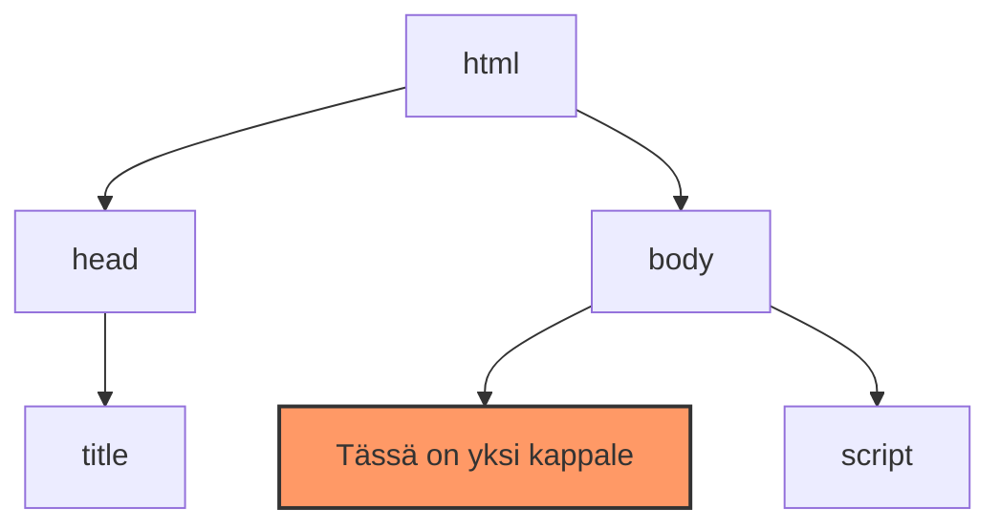

# JavaScript 4: Dokumenttioliomalli (DOM) ja tapahtumat

## BOM – selaimen oliomalli

Selaimen oliomalli (_Browser Object Model_, BOM) on kokoelma olioita, joiden avulla JavaScript-koodi voi käsitellä selainta, esimerkiksi selainikkunaa, sivun osoitetta ja ikkunoiden välistä viestintää. BOM ei ole yksi yhtenäinen standardi, joten selainten välillä voi olla pieniä eroja.

### [window](https://developer.mozilla.org/en-US/docs/Web/API/Window)

Window-rajapinta (_interface_) kuvaa selainikkunaa, ja kaikki selaimet tukevat sitä. Selaimessa on globaali olio `window`, joka edustaa selainikkunaa. Kaikki globaalit oliot ja funktiot sekä `var`-avainsanalla määritellyt globaalit muuttujat ovat automaattisesti `window`-olion ominaisuuksia. Esimerkiksi:

```javascript
window.document.querySelector(".button");
```

on sama kuin:

```javascript
document.querySelector(".button");
```

Alun `window.` voi siis yleensä jättää pois.

#### [alert](https://developer.mozilla.org/en-US/docs/Web/API/Window/alert)

`alert()`-funktio avaa ponnahdusikkunan, jossa on tekstiä ja OK-painike. Sillä voit kertoa käyttäjälle esimerkiksi, onnistuiko jokin toiminto. Ohjelman suoritus pysähtyy, kunnes käyttäjä painaa OK-painiketta.

```javascript
alert("Jotain tekstiä");
```

#### [confirm](https://developer.mozilla.org/en-US/docs/Web/API/Window/confirm)

`confirm()`-funktio avaa ponnahdusikkunan, jossa on tekstiä ja kaksi painiketta: OK ja Cancel (suomenkielisessä selaimessa Peruuta). Näin voit pyytää käyttäjää hyväksymään tai hylkäämään toiminnon.

```javascript
const answer = confirm("Jokin kysymys");

// vastauksen tulostus konsoliin
console.log(answer);
```

Funktion paluuarvo on totuusarvo, joka tallennetaan muuttujaan `answer`: OK-painike antaa arvon `true` ja Cancel-painike arvon `false`.

#### [prompt](https://developer.mozilla.org/en-US/docs/Web/API/Window/prompt)

`prompt()`-funktio avaa ponnahdusikkunan, jossa on teksti (esimerkiksi kysymys) ja tekstikenttä, johon käyttäjä voi kirjoittaa vastauksen.

```javascript
const answer = prompt("Kysymys käyttäjälle", "Tekstikentän oletussisältö");

// vastauksen tulostus konsoliin
console.log(answer);
```

Muuttujan `answer` arvo on merkkijono, joka sisältää käyttäjän vastauksen. Jos käyttäjä painaa OK-painiketta tyhjällä tekstikentällä, arvo on tyhjä merkkijono `''`. Jos käyttäjä painaa Cancel-painiketta, arvo on `null`. Toinen argumentti on valinnainen. Se on tekstikentän oletussisältö, joka näkyy kentässä valmiiksi.

### [location-rajapinta](https://developer.mozilla.org/en-US/docs/Web/API/location)

`location`-olion kautta saat nykyisen sivun osoitetiedot. Sen avulla voi myös ohjata selaimen toiseen osoitteeseen:

```javascript
location.href = "http://metropolia.fi";
```

## DOM – dokumenttioliomalli

Dokumenttioliomalli (_Document Object Model_, DOM) on selaimen muistissa oleva puumainen esitys HTML-dokumentista. JavaScript-koodi lukee ja muuttaa verkkosivua DOMin kautta.


_w3schools.com_

Yllä oleva kuva havainnollistaa seuraavaa HTML-koodia:

```html
<html>
  <head>
    <title>My title</title>
  </head>
  <body>
    <h1>My header</h1>
    <a href="#">My link</a>
  </body>
</html>
```

HTML DOM on standardi, joka määrittelee, miten HTML-elementtejä valitaan, muutetaan, lisätään ja poistetaan. DOMissa jokainen elementti on olio. Puun osia kutsutaan solmuiksi (_node_): solmuja ovat esimerkiksi elementit, attribuutit ja elementtien sisältämä teksti.

```html
<html>
  <head>
    <title>Esimerkki</title>
  </head>
  <body>
    <p>Tässä on yksi kappale</p>
    <script>
      const paragraph = document.querySelector("p"); // valitsee dokumentin ensimmäisen p-elementin
      console.log(paragraph.innerText); // tulostaa p-elementin sisällä olevan tekstin konsoliin
    </script>
  </body>
</html>
```

Yllä olevassa esimerkissä p-elementti valitaan [Document](https://developer.mozilla.org/en-US/docs/Web/API/Document)-rajapinnan `querySelector()`-metodilla. Valittu elementti tallennetaan elementtioliona (eli elementtisolmuna) muuttujaan `paragraph`. Tämän jälkeen elementtiä voi käsitellä olion ominaisuuksien ja metodien avulla, esimerkiksi lukemalla sen tekstin `innerText`-ominaisuudesta.


```mermaid
graph TD;
    html-->head;
    html-->body;
    head-->title;
    body-->p;
    body-->script;

    p[<p> Tässä on yksi kappale </p>]:::selected;

    classDef selected fill:#f96,stroke:#333,stroke-width:2px;
```

### Vanhempi ja lapsi

Koska DOM on puurakenne, solmujen suhteita kuvataan termeillä vanhempi (_parent_), lapsi (_child_) ja sisarus (_sibling_). Esimerkiksi yllä olevassa ensimmäisessä kuvassa h1-elementti on body-elementin lapsi ja a-elementin sisarus. Vastaavasti body-elementti on sekä h1- että a-elementin vanhempi.

### [Document](https://developer.mozilla.org/en-US/docs/Web/API/Document)-rajapinta

`document`-olio edustaa koko verkkosivua, ja sen kautta pääset käsiksi kaikkiin sivun solmuihin. Kun haluat valita sivulta HTML-elementin, aloitat yleensä `document`-oliosta, esimerkiksi `document.getElementById('logo')`.

#### Keskeiset funktiot ja ominaisuudet

```javascript
document.querySelector("#logo"); // hakee dokumentista ensimmäisen CSS-valitsinta vastaavan elementin, tässä tietyllä id:llä
document.querySelectorAll(".button"); // hakee dokumentista kaikki CSS-valitsinta vastaavat elementit, tässä luokkavalitsimella
document.getElementById("logo"); // hakee dokumentista elementin, jolla on tietty id
document.createElement("p"); // luo uuden p-elementin, mutta sitä ei vielä lisätä dokumenttiin

// osaa metodeista voi kutsua myös valitulle elementille:
element.getElementsByTagName("p"); // hakee valitun elementin sisältä kaikki p-elementit
element.appendChild(child); // lisää elementtiin lapsisolmun
element.removeChild(child); // poistaa elementistä lapsisolmun

element.innerHTML; // elementin sisältämä HTML-koodi
element.innerText; // elementin sisältämä teksti
```

### Esimerkkejä

1. Valitse dokumentista elementti, jonka id on `news`, ja tallenna se muuttujaan `u`. Valitse sitten elementin `u` sisältä kaikki p-elementit ja tallenna niiden kokoelma muuttujaan `p`:

   ```javascript
   const u = document.getElementById("news");
   const p = u.getElementsByTagName("p");

   // saman voi kirjoittaa myös ilman välimuuttujaa
   const p = document.getElementById("news").getElementsByTagName("p");

   // tai yhdellä komennolla CSS-valitsinta käyttäen
   const p = document.querySelectorAll("#news p");
   ```

2. Valitse listan `<ul>` toinen kohta (eli toinen `<li>`-elementti):

   ```html
   <ul>
     <li>Ensimmäinen alkio</li>
     <li>Toinen alkio</li>
     <li>Kolmas alkio</li>
   </ul>
   ```

   ```javascript
   const second = document.getElementsByTagName("li")[1]; // getElementsByTagName palauttaa taulukkomaisen kokoelman. Indeksit alkavat nollasta, joten 1 tarkoittaa toista <li>-elementtiä.
   const second = document.querySelectorAll("li")[1]; // sama querySelectorAll-funktiolla
   ```

3. Käy läpi kaikki `<li>`-elementit `for...of`-lauseella ja lihavoi niiden teksti. Vaihtoehtona on [forEach](https://developer.mozilla.org/en-US/docs/Web/JavaScript/Reference/Global_Objects/Array/forEach)-metodi, joka on esitetty koodissa kommenttina.

   ```javascript
   const bullets = document.querySelectorAll("li");

   for (let bullet of bullets) {
     bullet.innerHTML = `<b>${bullet.innerHTML}</b>`;
   }

   // vaihtoehtoinen syntaksi forEach()-metodilla
   /*
   bullets.forEach(function (bullet) {
     bullet.innerHTML = `<b>${bullet.innerHTML}</b>`;
   })
   */
   ```

4. Valitse kaikki p-elementit, joilla on luokka `bulletin`:

   ```javascript
   const x = document.querySelectorAll("p.bulletin");
   ```

5. Muuta elementin sisältöä:

   ```html
   <p id="date"><span class="blue">Maanantai</span></p>

   <script>
     document.getElementById("date").innerHTML =
       '<span class="red">Tiistai</span>';
   </script>
   ```

6. Muuta attribuutin arvoa:

   ```html
   

   <script>
     document.getElementById("logo").src = "laurea.png"; // attribuutin nimeä käytetään ominaisuutena
     document.getElementById("logo").setAttribute("src", "laurea.png"); // tai setAttribute()-metodilla
   </script>
   ```

7. Lisää dokumenttiin HTML-koodia:
   1. innerHTML-ominaisuudella:

      ```html
      <div id="example"></div>

      <script>
        const div = document.querySelector("#example"); // hae elementti, jonka id on 'example'
        const html =
          // monirivinen merkkijono; huomaa merkkijonon ympärillä olevat gravis-merkit (`)
          `<p>
                  Tässä on tekstiä ja kuva.
                  
               </p>`;
        div.innerHTML = html; // asettaa merkkijonon 'html' valitun elementin HTML-sisällöksi
      </script>
      ```

   1. Sama DOM-metodeilla:

      ```html
      <div id="example"></div>

      <script>
        const div = document.querySelector("#example"); // hae elementti, jonka id on 'example'

        const i = document.createElement("img"); // luo img-elementti
        i.src = "https://via.placeholder.com/320"; // aseta src-attribuutti
        i.alt = "Kissa"; // aseta alt-attribuutti

        const t = document.createTextNode("Tässä on tekstiä ja kuva."); // luo tekstisolmu

        const p = document.createElement("p"); // luo p-elementti
        p.appendChild(t); // lisää teksti p-elementtiin
        p.appendChild(i); // lisää kuva p-elementtiin

        div.appendChild(p); // lisää p-elementti HTML-dokumentista valittuun elementtiin
        // tässä vaiheessa uusi HTML tulee näkyviin dokumenttiin.
      </script>
      ```

### CSS:n käsittely

JavaScriptillä voit myös muuttaa elementtien ulkoasua. Voit muuttaa joko elementin `style`-attribuuttia tai sen `class`-attribuutin luokkia, samaan tapaan kuin HTML-koodissa.

`style`-attribuutin muokkaus, jossa tyylit kirjoitetaan suoraan elementtiin (_inline style_):

```html
<p style="background-color: #ccc; padding: 1rem;" id="paragraph">
  Jotain tekstiä
</p>

<script>
  document.querySelector("#paragraph").style =
    "color: #eee; background-color: #222; padding: 3rem;";
</script>
```

`class`-attribuutin muokkaus:

```css
/* ulkoinen CSS-tiedosto */
.red {
  color: #f00;
}

.blue {
  color: #00f;
}
```

```html
<p class="red" id="paragraph">Jotain tekstiä</p>

<script>
  // Kytke red-luokka päälle tai pois
  document.querySelector("#paragraph").classList.toggle("red");
  // Korvaa red-luokka blue-luokalla
  document.querySelector("#paragraph").classList.replace("red", "blue");
</script>
```

Lisää luokkien käsittelyyn tarkoitettuja metodeja löydät [classList-dokumentaatiosta](https://developer.mozilla.org/en-US/docs/Web/API/Element/classList).

## Tapahtumat

JavaScriptillä tehdään verkkosivuista vuorovaikutteisia. Siksi tarvitaan tapa reagoida tapahtumiin (_event_). Tapahtuma voi olla käyttäjän toiminto, kuten napsautus tai näppäimen painallus, tai selaimen oma tapahtuma, kuten sivun latautuminen. Tapahtumiin reagoimista kutsutaan [tapahtumankäsittelyksi](https://developer.mozilla.org/en-US/docs/Learn/JavaScript/Building_blocks/Events) (_event handling_).

Jos käyttäjä esimerkiksi napsauttaa painiketta, voit reagoida näyttämällä ilmoitusikkunan:

```html
<button>Napsauta minua</button>
<script>
  const button = document.querySelector("button");
  button.addEventListener("click", function (evt) {
    alert("Elementtiä " + evt.currentTarget.tagName + " napsautettiin");
  });
</script>
```

Yllä oleva `addEventListener`-metodi lisää painikkeelle tapahtumankuuntelijan (_event listener_). Metodin ensimmäinen argumentti `'click'` on **tapahtuman** tyyppi, ja toinen argumentti on funktio, jota kutsutaan, kun painiketta napsautetaan. Tässä funktio on kirjoitettu nimettömänä suoraan metodikutsun sisään. Toinen argumentti voi olla myös viittaus erikseen määriteltyyn funktioon:

```html
<button>Napsauta minua</button>
<script>
  const button = document.querySelector("button");

  function popup(evt) {
    alert("Elementtiä " + evt.currentTarget.tagName + " napsautettiin");
  }

  button.addEventListener("click", popup);
</script>
```

Huomaa, että `addEventListener`-kutsussa `popup`-funktion perästä puuttuvat sulkeet. Tämä johtuu siitä, että `popup`-funktiota käytetään tapahtumankäsittelijänä (_event handler_): sitä ei kutsuta heti vaan vasta, kun painiketta napsautetaan. Jos sulkeet olisivat mukana, funktio suoritettaisiin heti, ja `addEventListener` saisi argumentikseen funktion paluuarvon eikä itse funktiota.

Tapahtumankäsittelijä on **takaisinkutsufunktio** (_callback function_) eli funktio, joka välitetään argumenttina toiselle funktiolle ja jota kutsutaan myöhemmin, esimerkiksi kun tietty tapahtuma sattuu. Takaisinkutsufunktioita käytetään JavaScriptissä monessa paikassa, ei pelkästään tapahtumankäsittelyssä. Ne liittyvät asynkroniseen (_asynchronous_) ohjelmointiin, joka on JavaScriptin keskeinen osa: ohjelma ei jää odottamaan tapahtumaa, vaan takaisinkutsufunktio suoritetaan vasta, kun tapahtuma sattuu. [Lue lisää takaisinkutsufunktioista](https://developer.mozilla.org/en-US/docs/Learn_web_development/Extensions/Async_JS/Introducing#callbacks).

Tapahtumankäsittelijä saa argumenttina [tapahtumaolion](https://developer.mozilla.org/en-US/docs/Web/API/Event) (esimerkeissä parametri `evt`), joka sisältää tietoa tapahtumasta, kuten tapahtuman tyypin ja kohteen. Esimerkiksi `evt.currentTarget` on se elementti, johon tapahtumankäsittelijä on liitetty.
Yllä olevassa esimerkkikoodissa tämä elementti on `<button>`-elementti.

[Tutustu tähän tapahtumaluetteloon](https://developer.mozilla.org/en-US/docs/Web/Events). Tässä vaiheessa tärkeimpiä ovat [hiireen liittyvät tapahtumat](https://developer.mozilla.org/en-US/docs/Web/API/Element#mouse_events).

### Syntaksi

Tapahtumankäsittelijän voi liittää elementtiin kolmella eri tavalla.

#### Vanha (1990-luku)

Inline-syntaksissa tapahtumankäsittelijä määritellään suoraan HTML-elementin attribuutissa (esimerkiksi `onclick`). **Vältä tätä tapaa**, koska se sekoittaa HTML- ja JavaScript-koodin. Jotkin sovelluskehykset (_framework_) ja kirjastot (_library_), kuten Angular ja React, käyttävät samannäköistä syntaksia, mutta ne ovat erikoistapauksia.

```html
<button onclick="popup()">Napsauta minua</button>
<script>
  function popup(evt) {
    alert("Elementtiä" + evt.currentTarget + " napsautettiin");
  }
</script>
```

#### Perinteinen (2000-luku)

[Onevent-ominaisuudet](https://developer.mozilla.org/en-US/docs/Web/Events/Event_handlers#using_onevent_properties), kuten `onclick`, ovat kätevä tapa liittää tapahtumankäsittelijä elementtiin. Niillä elementille voi kuitenkin asettaa kullekin tapahtumalle vain yhden käsittelijän. Siksi niitä kannattaa käyttää korkeintaan kaikkein yksinkertaisimmissa sovelluksissa, ja yleisesti ottaen **niitä ei suositella nykyaikaisessa web-kehityksessä**.

```html
<button>Napsauta minua</button>
<script>
  const button = document.querySelector("button");

  function popup(evt) {
    alert("Elementtiä" + evt.currentTarget + " napsautettiin");
  }

  button.onclick = popup;
</script>
```

#### Moderni (nykyinen)

Useimmissa sovelluksissa suositellaan [addEventListener](https://developer.mozilla.org/en-US/docs/Web/API/EventTarget/addEventListener)-metodia, jota käytettiin myös tämän osion ensimmäisissä esimerkeissä. Sillä voi liittää samaan tapahtumaan useamman kuin yhden tapahtumankäsittelijän. Tapahtumankäsittelijän voi tarvittaessa myös poistaa [removeEventListener](https://developer.mozilla.org/en-US/docs/Web/API/EventTarget/removeEventListener)-metodilla.
Poistamista tarvitaan esimerkiksi silloin, kun haluat, että painikkeen ensimmäinen napsautus suorittaa funktion A ja seuraavat napsautukset funktion B:

```html
<button>Napsauta minua</button>
<script>
  const button = document.querySelector("button");

  function A(evt) {
    alert("Tämä on funktio A");
    button.removeEventListener("click", A);
    button.addEventListener("click", B);
  }

  function B(evt) {
    alert("Tämä on funktio B");
  }

  button.addEventListener("click", A);
</script>
```

## Syötteiden lukeminen HTML-lomakkeilla

[HTML-lomakkeilla](https://developer.mozilla.org/en-US/docs/Web/HTML/Reference/Elements/form) (_form_) kerätään käyttäjän syötteitä (_input_). Ne ovat monipuolisempi tapa kerätä syötteitä kuin pelkkä `prompt()`-funktio. Lomakkeessa voi olla erilaisia syötekenttiä (_input field_), kuten tekstikenttiä, valintaruutuja ja valintanappeja, sekä lähetyspainike:

```html
<form action="#">
  <!-- action-attribuutti määrittää, minne lomakkeen tiedot lähetetään, kun lomake lähetetään. Tässä arvo on "#" eli nykyinen sivu, joten tietoja ei käsitellä missään. -->

  <!-- Tekstikenttä -->
  <label for="name">Nimi:</label><br />
  <input type="text" id="name" name="name" /><br /><br />

  <!-- Sähköpostikenttä -->
  <label for="email">Sähköposti:</label><br />
  <input type="email" id="email" name="email" /><br /><br />

  <!-- Salasanakenttä -->
  <label for="password">Salasana:</label><br />
  <input type="password" id="password" name="password" /><br /><br />

  <!-- Lukukenttä -->
  <label for="age">Ikä:</label><br />
  <input type="number" id="age" name="age" /><br /><br />

  <!-- Päivämääräkenttä -->
  <label for="date">Päivämäärä:</label><br />
  <input type="date" id="date" name="date" /><br /><br />

  <!-- Valintanapit -->
  <p>Sukupuoli:</p>
  <input type="radio" id="male" name="gender" value="male" />
  <label for="male">Mies</label><br />
  <input type="radio" id="female" name="gender" value="female" />
  <label for="female">Nainen</label><br /><br />

  <!-- Valintaruutu -->
  <input type="checkbox" id="subscribe" name="subscribe" />
  <label for="subscribe">Tilaa uutiskirje</label><br /><br />

  <!-- Pudotusvalikko -->
  <label for="country">Maa:</label><br />
  <select id="country" name="country">
    <option value="fi">Suomi</option>
    <option value="pl">Puola</option>
    <option value="es">Espanja</option></select
  ><br /><br />

  <!-- Tekstialue -->
  <label for="message">Viesti:</label><br />
  <textarea id="message" name="message" rows="4" cols="30"></textarea
  ><br /><br />

  <!-- Lähetyspainike -->
  <input type="submit" value="Lähetä" />
</form>
```

Lomakkeen elementtejä voi valita ja käsitellä JavaScriptillä samaan tapaan kuin muitakin HTML-elementtejä. Syötekenttään kirjoitetun tekstin saat kentän `value`-ominaisuudesta. Tällä kurssilla lomakkeita käytetään vain tekstisyötteen lukemiseen JavaScript-koodissa.

### Tapahtuman oletustoiminnon estäminen

Joillakin elementeillä, kuten `<a>`- ja `<form>`-elementeillä, on tiettyyn tapahtumaan liittyvä oletustoiminto, jonka selain suorittaa automaattisesti. Esimerkiksi `<a>`-elementin napsauttaminen vie `href`-attribuutissa määriteltyyn osoitteeseen, ja lomakkeen (`<form>`) lähettäminen avaa `action`-attribuutissa määritellyn osoitteen. Joskus haluat estää nämä oletustoiminnot.

HTML-lomakkeet toimivat esimerkiksi niin, että käyttäjä täyttää lomakkeen ja painaa sen jälkeen lähetyspainiketta. Tällöin selain lähettää tiedot `action`-attribuutissa määriteltyyn osoitteeseen HTTP-pyyntönä (_request_) ja näyttää palvelimen palauttaman HTTP-vastauksen (_response_) uutena sivuna. Nykyaikaisissa verkkosovelluksissa tämä usein estetään, jotta sivu ei vaihdu jokaisen lomakkeen lähetyksen jälkeen. Kun lähetät esimerkiksi viestin Facebookissa, sivu ei lataudu uudelleen. Oletustoiminnon voi estää tapahtumaolion [preventDefault](https://developer.mozilla.org/en-US/docs/Web/API/Event/preventDefault)-metodilla:

```html
<form>
  <div>
    <input name="fName" type="text" placeholder="etunimi" />
  </div>
  <div>
    <input name="lName" type="text" placeholder="sukunimi" />
  </div>
  <div>
    <input name="submit" type="submit" value="Lähetä" />
  </div>
</form>
<p></p>

<script>
  // valitaan elementit
  const form = document.querySelector("form");
  const fname = document.querySelector("input[name=fName]");
  const lname = document.querySelector("input[name=lName]");
  const p = document.querySelector("p");

  // Kun lomake lähetetään...
  form.addEventListener("submit", function (evt) {
    // ... estetään oletustoiminto.
    evt.preventDefault();
    // Tässä voisi tarkistaa esimerkiksi, ovatko lomakkeen kentät täytetty oikein,
    // minkä jälkeen tiedot voisi lähettää esimerkiksi fetch-funktiolla.
    // Tulostetaan kuitenkin nyt esimerkkinä käyttäjän syöte.
    p.innerText = `Nimesi on ${fname.value} ${lname.value}`;
  });
</script>
```

---

<!-- add mermaid support for gh pages -->
<script type="module">
    Array.from(document.getElementsByClassName("language-mermaid")).forEach(element => {
      element.classList.add("mermaid");
    });
    import mermaid from 'https://cdn.jsdelivr.net/npm/mermaid@11/dist/mermaid.esm.min.mjs';
    mermaid.initialize({startOnLoad: true});
</script>
