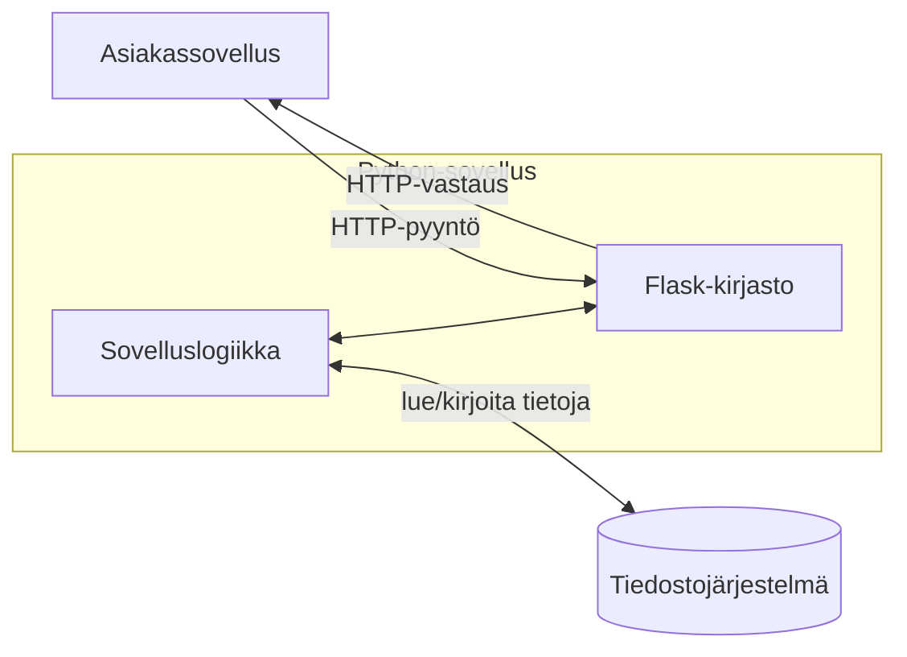

# Web-palvelimen rakentaminen Pythonilla

## Taustapalvelun määrittäminen rajapinnalla

Tässä moduulissa opit toteuttamaan Pythonilla taustapalvelimen. Tällä tavalla voit rakentaa verkkopalvelun siten, että HTML-, CSS- tai JavaScript-käyttöliittymä (UI) kommunikoi Pythonilla kirjoitetun taustapalvelun tarjoamien HTTP-päätepisteiden kanssa.

Taustapalvelun käyttäjän ei välttämättä tarvitse olla selain. Tässä esitetyllä lähestymistavalla taustapalvelua voidaan käyttää ohjelmallisesti mistä tahansa palvelusta millä tahansa ohjelmointikielellä HTTP-yhteysprotokollan ansiosta.

Moduulin tehtävissä toteutetaan yksinkertainen Python-taustapalvelu, joka hakee (ja tallentaa) tietoja tiedostoista. Taustapalvelu tarjoaa HTTP-päätepisteen/-päätepisteitä, joita verkkosovelluksen käyttöliittymä voi käyttää tietojen hakemiseen tai tallentamiseen. Palvelu toteutetaan käyttämällä [Flask](<[https://flask.palletsprojects.com/en/stable/](https://flask.palletsprojects.com/en/stable/)>) -kirjastoa.



## Flask-kirjaston asentaminen

Python-ohjelmasta tehdään taustapalvelu Flask-kirjaston avulla. Flask mahdollistaa päätepisteiden ohjelmoinnin. Ulkoinen ohjelma (kuten verkkoselain) voi käyttää näitä päätepisteitä suorittaakseen taustapalveluun ohjelmoituja toimintoja.

Tarkastellaan esimerkkiä, jossa luomme taustapalvelun, joka vastaanottaa kaksi lukua ja laskee ne yhteen. Tällainen toiminto ei tietenkään tarvitsisi taustapalvelua. Tätä yksinkertaista esimerkkiä käytetään kuitenkin vain tarvittavan teknologian esittelemiseen.

Aloitamme asentamalla Flask-kirjaston. VS Codessa asennus voidaan tehdä avaamalla pääte ja suorittamalla komento `python -m pip install flask` päätteessä. Komento asentaa Flask-kirjaston ja sen riippuvuudet. Asennuksen jälkeen Flask-kirjasto on valmis käytettäväksi.

## Päätepisteiden ohjelmointi

Kun Flask on asennettu, voimme kirjoittaa ohjelmamme ensimmäisen version tiedostoon nimeltä `sum_service.py`:

```python
from flask import Flask, request

app = Flask(__name__)
@app.route('/sum')
def calculate_sum():
    args = request.args
    number1 = float(args.get("number1"))
    number2 = float(args.get("number2"))
    total_sum = number1+number2
    return str(total_sum)

if __name__ == '__main__':
    app.run(host='127.0.0.1', port=3000, use_reloader=True)
```

Katsotaan, miten ohjelma toimii aloittamalla viimeiseltä riviltä. `app.run`-metodin kutsuminen käynnistää taustapalvelun. Palvelu avataan IP-osoitteessa 127.0.0.1, joka on niin sanottu loopback-osoite (tai localhost-osoite), joka viittaa oman tietokoneesi IP-osoitteeseen. Tämä tarkoittaa, että yhteys tähän IP-osoitteeseen voidaan muodostaa vain samalta tietokoneelta, jolla ohjelma on käynnissä. Porttinumero 3000 kertoo, että taustapalvelin kuuntelee porttia 3000 samalta tietokoneelta tulevaa viestintää varten. Verkko-osoitteita ja porttinumeroita käsitellään tarkemmin myöhemmillä kursseilla.

`use_reloader=True` tarkoittaa, että taustapalvelu käynnistetään automaattisesti uudelleen, kun ohjelman lähdekoodia muutetaan. Tällä tavalla voimme testata ohjelmaan tehtyjä muutoksia ilman, että meidän tarvitsee pysäyttää ja käynnistää taustapalvelua manuaalisesti.

`if`-lausetta käytetään tarkistamaan, että ohjelma suoritetaan pääohjelmana. Tämä on yleinen käytäntö Python-ohjelmoinnissa. `if`-lauseen sisällä oleva koodi suoritetaan vain, jos tämä ohjelma käynnistetään suoraan pääohjelmana. Jos ohjelma tuodaan moduulina toiseen ohjelmaan, `if`-lauseen sisällä olevaa koodia ei suoriteta.

Rivi `@app.route('sum')` määrittelee niin sanotun päätepisteen. Se tarkoittaa, että seuraavalla rivillä oleva funktio `calculate_sum` suoritetaan, kun taustapalvelun käyttäjä lähettää pyynnön IP-osoitteeseen, jota seuraa merkkijono `/sum`. Tämä tarkoittaa, että funktiota voidaan kutsua selaimesta kirjoittamalla `http://127.0.0.1:3000/sum` verkko-osoitteeksi. Teknisesti selain lähettää tällöin HTTP-protokollan GET-pyynnön, johon Flaskilla rakennettu taustapalvelu vastaa.

Edellä kuvattu pyyntö ei vielä riitä summan laskemiseen, koska myös summan laskemiseen tarvittavat luvut on määriteltävä pyynnössä. Luvut voidaan välittää GET-pyynnön parametreina ja käsitellä sitten `request`-kirjaston `args.get`-metodin avulla.

Tällä tavalla taustapalvelua voitaisiin kutsua kirjoittamalla selaimeen esimerkiksi osoite `http://127.0.0.1:3000/sum?number1=13&number2=28`. Ensimmäinen parametri, joka on muunnettu liukuluvuksi `"13"`, asetetaan muuttujan `number1` arvoksi. Vastaavasti toinen parametri, merkkijono `"28"`, muunnetaan liukuluvuksi ja asetetaan muuttujan `number2` arvoksi. Summa lasketaan, muunnetaan merkkijonoksi ja palautetaan sitten funktion paluuarvona.

Kun taustapalvelua kutsutaan selaimesta, tuloksena oleva luku näkyy selainikkunassa:


Tässä vaiheessa taustapalvelu toimii teknisesti, mutta tuloksen muoto ei ole optimaalinen ohjelmallista käsittelyä varten.

## JSON-vastauksen muodostaminen

Kun taustapalvelu lähettää vastauksen selaimelle, paras muoto vastaukselle on yleensä JSON. JSON (_JavaScript Object Notation_) on esitysmuoto, joka noudattaa JavaScript-olioiden rakennetta. Onneksi rakenne on myös intuitiivinen Python-kielen olioihin tottuneille kehittäjille.

Muokataan esimerkin `sum`-funktiota siten, että se ei enää palauta merkkijonoa, vaan tuottaa vastauksen JSON-muodossa. Tämä tehdään automaattisesti Pythonin sanakirjarakenteesta:

```python
from flask import Flask, request

app = Flask(__name__)
@app.route('/sum')
def calculate_sum():
    args = request.args
    number1 = float(args.get("number1"))
    number2 = float(args.get("number2"))
    total_sum = number1+number2

    response = {
        "number1" : number1,
        "number2" : number2,
        "total_sum" : total_sum
    }

    return response

if __name__ == '__main__':
    app.run(use_reloader=True, host='127.0.0.1', port=5000)
```

Nyt ohjelma tuottaa JSON-vastauksen, jota on helppo käsitellä esimerkiksi suorittamalla JavaScript-koodia selaimessa:


Tässä esitettyä yksinkertaista taustapalvelua voidaan käyttää monipuolisemman taustapalvelun rakentamiseen tarvittavalla määrällä päätepisteitä.

## Pyynnön jäsentäminen

Aiemmissa esimerkeissä parametriarvot annettiin HTTP-pyynnön parametreina, jotka erotettiin verkkotunnuksesta ja maatunnuksesta kysymysmerkillä (`?`). Tämä on perinteinen tapa lähettää parametreja HTTP-pyynnöissä.

Vaihtoehtoinen tapa on määrittää pyynnön kohteena oleva resurssi verkko-osoitteen rungossa. Seuraavassa yksinkertaisessa esimerkissä toteutetaan "kaikupalvelu", joka toistaa eli kaksinkertaistaa asiakkaan antaman merkkijonon. Esimerkissä merkkijonoa ei anneta parametrina, vaan varsinaisen verkko-osoitteen osana.

Flask tarjoaa helpon tavan käsitellä verkko-osoitteen osia:

```python
from flask import Flask

app = Flask(__name__)
@app.route('/echo/<text>')
def echo(text):
    response = {
        "echo" : text + " " + text
    }
    return response

if __name__ == '__main__':
    app.run(use_reloader=True, host='127.0.0.1', port=3000)
```

Palvelu näyttää tältä, kun sitä tarkastellaan verkkoselaimella:


Taustapalvelun kehittäjä voi vapaasti valita, miten verkkotunnuksen ja maatunnuksen jälkeistä verkko-osoitteen osaa käsitellään. Erityisesti REST-arkkitehtuurityyli kannustaa jälkimmäiseen lähestymistapaan, jossa kohteena oleva resurssi annetaan osana varsinaista verkko-osoitetta sen sijaan, että se annettaisiin parametriarvona.

## Virheenkäsittely

Palataan aiempaan esimerkkiin kahden luvun summan laskemisesta. Oletamme, että ohjelmaa on muutettu siten, että kaksi lukua annetaan osana verkko-osoitteen runkoa. Kelvollinen pyyntö näyttää siis tältä: `http://127.0.0.1:3000/sum/42/117`.

Aiemmassa esimerkissä oletimme, että pyyntö on aina virheetön.

Kuitenkin vähintään seuraavat virheet ovat mahdollisia, ja ne tulisi käsitellä:

1. Käyttäjä yrittää kutsua virheellistä päätepistettä: `http://127.0.0.1:3000/dum/42/117`
2. Oikeaa päätepistettä kutsutaan, mutta summaa ei voida laskea, koska syötteenä annettu luku on virheellinen:
   `http://127.0.0.1:3000/sum/4t23/117`

Ensimmäisessä tapauksessa Flask-taustapalvelu palauttaa automaattisesti virhekoodin 404 (Not found). Jälkimmäisessä tapauksessa palautetaan tilakoodi 500 (Internal server error). Pyynnön lähettäjä voi käsitellä virhetilanteet ohjelmallisesti. Taustapalvelun tekijöinä meillä on kuitenkin mahdollisuus käsitellä virhetilanteet niiden ilmetessä ja antaa pyynnön lähettäjälle tarkempia tietoja virheen mahdollisesta syystä.

Seuraava ohjelma käsittelee virhetilanteet tyylikkäämmällä tavalla:

1. Pyyntö virheelliseen päätepisteeseen tuottaa tilakoodin 404 ja JSON-vastauksen:
   `{"status": 404, "message": "Invalid endpoint"}`.
2. Jos parametrin muuntaminen float-tyyppiin epäonnistuu, lähetetään seuraava JSON:
   `{"status": 400, "text": "Invalid number as added"}`. Taustapalvelu palauttaa nyt sopivamman HTTP-tilakoodin 400 (Bad Request) oletuskoodin 500 (Internal server error) sijaan.

Lisäksi ohjelma lisää tilakoodin JSON-vastauksen runkoon. Rungossa oleva koodi lähetetään vain lisätietona asiakkaalle. "Todellinen" HTTP-tilakoodi annetaan Response-olion tilakoodiparametrina.

Response-olio täytyy luoda aina, kun haluamme lähettää jotain muuta kuin sanakirjasta automaattisesti muunnetun JSONin oletusvirhekoodilla 200 (OK).

Valitettavasti emme voi tässä tapauksessa hyödyntää sanakirjan automaattista muuntamista JSONiksi, vaan meidän täytyy käyttää `json.dumps`-metodia.

Kun Response-olio luodaan, meidän täytyy määrittää niin sanottu MIME-tyyppi. MIME-tyyppi kertoo asiakkaalle, miten sisältö tulisi tulkita. Tässä tapauksessa MIME-tyypiksi asetetaan `"application/json"`.

Laajennettu ohjelma on seuraava:

```python
import json

from flask import Flask, Response

app = Flask(__name__)
@app.route('/sum/<number1>/<number2>')
def calculate_sum(number1, number2):
    try:
        number1 = float(number1)
        number2 = float(number2)
        total_sum = number1+number2
        response = {
            "number1" : number1,
            "number2" : number2,
            "total_sum" : total_sum,
            "status" : 200
        }
        return response

    except ValueError:
        response = {
            "message": "Invalid number as addend",
            "status": 400
        }
        json_response = json.dumps(response)
        http_response = Response(response=json_response, status=400, mimetype="application/json")
        return http_response

@app.errorhandler(404)
def page_not_found(error_code):
    response = {
        "message": "Invalid endpoint",
        "status": 404
    }
    json_response = json.dumps(response)
    http_response = Response(response=json_response, status=404, mimetype="application/json")
    return http_response

if __name__ == '__main__':
    app.run(use_reloader=True, host='127.0.0.1', port=3000)
```

---

## Staattisten tiedostojen tarjoaminen

Flask-kirjastoa voidaan käyttää myös staattisten tiedostojen tarjoamiseen. Tämä tarkoittaa, että taustapalvelua voidaan käyttää verkkosovelluksen HTML-, CSS- ja JavaScript-tiedostojen tarjoamiseen. Tällä tavalla taustapalvelua voidaan käyttää tarjoamaan sekä verkkosovelluksen käyttöliittymä että taustalogiikka.

Esimerkki:

```python
from flask import Flask, send_from_directory

app = Flask(__name__)

@app.route('/static/<path:filename>')
def serve_static(filename):
    return send_from_directory('static', filename)

```

Nyt, jos taustapalvelu on käynnissä, projektin `static`-hakemistoon tallennettuja staattisia tiedostoja voidaan käyttää kirjoittamalla selaimeen `http://127.0.0.1:3000/static/<filename>`. Jos esimerkiksi `static`-hakemistossa on tiedosto nimeltä `index.html`, siihen voidaan päästä kirjoittamalla selaimeen `http://127.0.0.1:3000/static/index.html`.

---

<!-- add mermaid support for gh pages -->
<script type="module">
    Array.from(document.getElementsByClassName("language-mermaid")).forEach(element => {
      element.classList.add("mermaid");
    });
    import mermaid from '[https://cdn.jsdelivr.net/npm/mermaid@11/dist/mermaid.esm.min.mjs](https://cdn.jsdelivr.net/npm/mermaid@11/dist/mermaid.esm.min.mjs)';
    mermaid.initialize({ startOnLoad: true });
</script>
