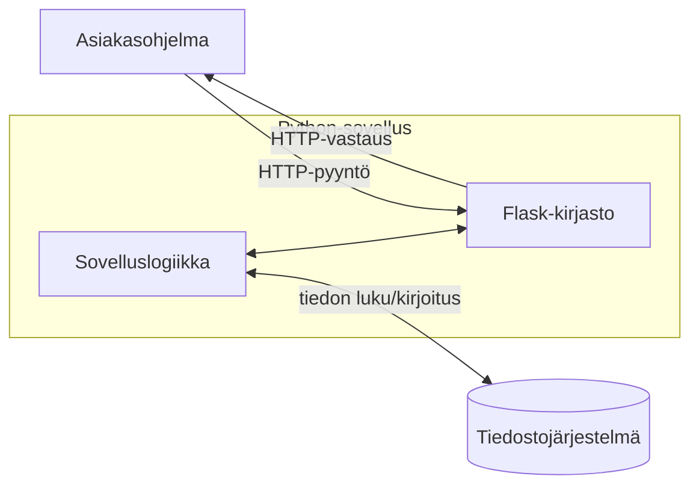
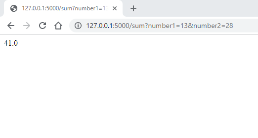
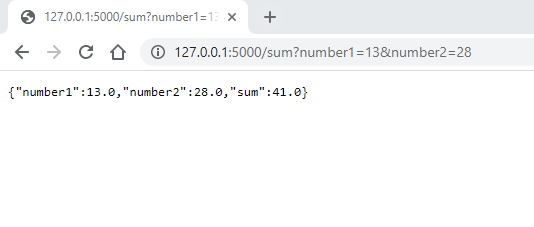
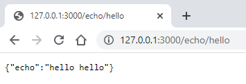

# Verkkopalvelimen rakentaminen Pythonilla

## Rajapinnalla varustetun taustapalvelun rakentaminen

Tässä moduulissa opit toteuttamaan taustapalvelun (_backend_) Pythonilla. Taustapalvelu on palvelimella toimiva ohjelma, joka käsittelee ja tallentaa tietoa. Sen avulla voit rakentaa verkkopalvelun, jossa HTML-, CSS- ja JavaScript-käyttöliittymä (_user interface_, UI) kommunikoi Pythonilla kirjoitetun taustapalvelun HTTP-päätepisteiden (_endpoint_) kanssa.

Taustapalvelun käyttäjän ei tarvitse olla selain. Koska yhteys perustuu HTTP-protokollaan, taustapalvelua voi käyttää ohjelmallisesti mistä tahansa ohjelmasta millä tahansa ohjelmointikielellä.

Moduulin tehtävissä toteutat yksinkertaisen Python-taustapalvelun, joka lukee tietoa tiedostoista (ja tallentaa sitä niihin). Taustapalvelu tarjoaa yhden tai useamman HTTP-päätepisteen, joiden kautta verkkosovelluksen käyttöliittymä voi hakea tai tallentaa tietoa. Palvelu toteutetaan [Flask](https://flask.palletsprojects.com/en/stable/)-kirjaston (_library_) avulla.


```mermaid
flowchart LR

    Client[Asiakasohjelma]

    subgraph Python_app [Python-sovellus]
        PY[Sovelluslogiikka]
        Flask[Flask-kirjasto]
        PY <--> Flask
    end

    FS[(Tiedostojärjestelmä)]

    Client -- HTTP-pyyntö --> Flask
    Flask -- HTTP-vastaus --> Client

    PY <-- tiedon luku/kirjoitus --> FS
```

## Flask-kirjaston asentaminen

Flask-kirjaston avulla Python-ohjelmasta tulee taustapalvelu. Flaskilla ohjelmoit päätepisteitä. Päätepiste on taustapalvelun verkko-osoite, johon lähetetty pyyntö käynnistää tietyn toiminnon. Ulkoinen ohjelma (esimerkiksi selain) voi siis päätepisteiden kautta suorittaa taustapalveluun ohjelmoituja toimintoja.

Tarkastellaan esimerkkiä, jossa luodaan taustapalvelu, joka vastaanottaa kaksi lukua ja laskee ne yhteen. Tällainen laskutoimitus ei tietenkään tarvitsisi taustapalvelua. Yksinkertainen esimerkki vain havainnollistaa tarvittavaa tekniikkaa.

Asenna ensin Flask-kirjasto. Avaa VS Codessa terminaali ja suorita komento `python -m pip install flask`. Komento asentaa Flask-kirjaston ja sen riippuvuudet eli muut kirjastot, joita Flask tarvitsee toimiakseen. Asennuksen jälkeen Flask on valmis käytettäväksi.

## Päätepisteiden ohjelmointi

Kun Flask on asennettu, voit kirjoittaa ohjelman ensimmäisen version tiedostoon `sum_service.py`:

```python
from flask import Flask, request

app = Flask(__name__)
@app.route('/sum')
def calculate_sum():
    args = request.args
    number1 = float(args.get("number1"))
    number2 = float(args.get("number2"))
    total_sum = number1+number2
    return str(total_sum)

if __name__ == '__main__':
    app.run(host='127.0.0.1', port=3000, use_reloader=True)
```

Katsotaan, miten ohjelma toimii. Aloitetaan viimeiseltä riviltä. Metodin `app.run` kutsu käynnistää taustapalvelun. Palvelu kuuntelee IP-osoitetta 127.0.0.1, joka on niin sanottu silmukkaosoite (_loopback_, myös _localhost_). Silmukkaosoite tarkoittaa aina omaa tietokonettasi. Siihen voi siis ottaa yhteyden vain samalta tietokoneelta, jolla ohjelma on käynnissä. Porttinumero 3000 kertoo, missä portissa palvelu kuuntelee pyyntöjä. Porttien avulla samalla tietokoneella voi toimia useita palvelimia yhtä aikaa. Verkko-osoitteita ja porttinumeroita käsitellään tarkemmin myöhemmillä kursseilla.

Argumentti `use_reloader=True` tarkoittaa, että taustapalvelu käynnistyy automaattisesti uudelleen, kun muutat ohjelman lähdekoodia. Näin voit testata muutoksiasi ilman, että sinun tarvitsee pysäyttää ja käynnistää taustapalvelua käsin.

`if`-lause tarkistaa, suoritetaanko tiedosto pääohjelmana. Tämä on Python-ohjelmoinnissa yleinen käytäntö. `if`-lauseen sisällä oleva koodi suoritetaan vain, jos tiedosto käynnistetään suoraan pääohjelmana. Jos tiedosto tuodaan (`import`) moduulina toiseen ohjelmaan, `if`-lauseen sisällä olevaa koodia ei suoriteta.

Rivi `@app.route('/sum')` määrittelee päätepisteen. Kun taustapalvelun käyttäjä lähettää pyynnön osoitteeseen, jossa IP-osoitteen ja porttinumeron jälkeen tulee polku (_path_) `/sum`, Flask suorittaa seuraavalla rivillä olevan funktion `calculate_sum`. Funktiota voi siis kutsua selaimesta kirjoittamalla verkko-osoitteeksi `http://127.0.0.1:3000/sum`. Teknisesti selain lähettää tällöin HTTP-protokollan GET-pyynnön, johon Flaskilla rakennettu taustapalvelu vastaa.

Edellä kuvattu pyyntö ei vielä riitä summan laskemiseen, koska pyynnössä on annettava myös yhteenlaskettavat luvut. Luvut voi välittää pyynnön kyselyparametreina (_query parameters_). Flaskissa ne luetaan `request`-olion `args`-ominaisuudesta sen `get`-metodilla.

Taustapalvelua voi siis kutsua kirjoittamalla selaimeen esimerkiksi osoitteen `http://127.0.0.1:3000/sum?number1=13&number2=28`. Ensimmäisen parametrin arvo, merkkijono ”13”, muunnetaan liukuluvuksi ja sijoitetaan muuttujaan `number1`. Vastaavasti toisen parametrin arvo, merkkijono ”28”, muunnetaan liukuluvuksi ja sijoitetaan muuttujaan `number2`. Funktio laskee summan, muuntaa sen merkkijonoksi ja palauttaa sen paluuarvonaan.

Kun kutsut taustapalvelua selaimesta, tuloksena saatu luku näkyy selainikkunassa:



Tässä vaiheessa taustapalvelu toimii teknisesti, mutta pelkkä luku tekstinä ei ole kätevä muoto, jos vastausta käsitellään ohjelmallisesti.

## JSON-vastauksen tuottaminen

Kun taustapalvelu lähettää vastauksen selaimelle, paras vastausmuoto on yleensä JSON. JSON (_JavaScript Object Notation_) on tekstimuotoinen tiedon esitysmuoto, jonka kirjoitustapa perustuu JavaScriptin olioihin. Se muistuttaa paljon Pythonin sanakirjoja ja listoja, joten rakenne on sinulle jo valmiiksi tuttu.

Muokataan esimerkin `calculate_sum`-funktiota niin, että se ei enää palauta merkkijonoa vaan JSON-muotoisen vastauksen. Kun funktio palauttaa Pythonin sanakirjan, Flask muuntaa sen automaattisesti JSON-muotoon:

```python
from flask import Flask, request

app = Flask(__name__)
@app.route('/sum')
def calculate_sum():
    args = request.args
    number1 = float(args.get("number1"))
    number2 = float(args.get("number2"))
    total_sum = number1+number2

    response = {
        "number1" : number1,
        "number2" : number2,
        "total_sum" : total_sum
    }

    return response

if __name__ == '__main__':
    app.run(use_reloader=True, host='127.0.0.1', port=5000)
```

Nyt ohjelma tuottaa JSON-vastauksen, jota on helppo käsitellä esimerkiksi selaimessa suoritettavalla JavaScript-koodilla:



Samalla periaatteella voit rakentaa monipuolisemman taustapalvelun, jossa on niin monta päätepistettä kuin tarvitset.

## Pyynnön jäsentäminen

Edellisissä esimerkeissä luvut annettiin kyselyparametreina, jotka erotetaan verkko-osoitteen polusta kysymysmerkillä (`?`). Tämä on perinteinen tapa välittää parametreja HTTP-pyynnöissä.

Vaihtoehtoinen tapa on antaa pyynnön kohteena oleva resurssi (esimerkiksi tietty käyttäjä tai tuote) osana verkko-osoitteen polkua. Seuraava yksinkertainen esimerkki toteuttaa ”kaikupalvelun”, joka kaiuttaa eli toistaa kahdesti asiakasohjelman (_client_) antaman merkkijonon. Asiakasohjelma on ohjelma, joka lähettää pyynnön palvelulle, esimerkiksi selain. Esimerkissä merkkijonoa ei anneta kyselyparametrina vaan osana polkua.

Flaskissa polun osia on helppo käsitellä. Kulmasulkeissa oleva osa, kuten `<text>`, välitetään funktion samannimiselle parametrille:

```python
from flask import Flask

app = Flask(__name__)
@app.route('/echo/<text>')
def echo(text):
    response = {
        "echo" : text + " " + text
    }
    return response

if __name__ == '__main__':
    app.run(use_reloader=True, host='127.0.0.1', port=3000)
```

Selaimella tarkasteltuna palvelu näyttää tältä:



Taustapalvelun kehittäjä voi vapaasti valita, miten verkko-osoitteen polku eli palvelimen nimen (tai IP-osoitteen) ja porttinumeron jälkeinen osa käsitellään. Esimerkiksi REST-arkkitehtuurityyli suosii jälkimmäistä tapaa, jossa kohteena oleva resurssi annetaan osana polkua eikä kyselyparametrina.

## Virheenkäsittely

Palataan aiempaan esimerkkiin, jossa laskettiin kahden luvun summa. Oletetaan, että ohjelmaa on muutettu niin, että luvut annetaan osana verkko-osoitteen polkua. Kelvollinen pyyntö näyttää siis tältä: `http://127.0.0.1:3000/sum/42/117`.

Aiemmassa esimerkissä oletettiin, että pyyntö on aina virheetön.

Ainakin seuraavat virheet ovat kuitenkin mahdollisia, ja ne pitäisi käsitellä:

1. Käyttäjä kutsuu päätepistettä, jota ei ole olemassa: `http://127.0.0.1:3000/dum/42/117`
2. Käyttäjä kutsuu oikeaa päätepistettä, mutta summaa ei voi laskea, koska syötteenä on virheellinen luku:
   `http://127.0.0.1:3000/sum/4t23/117`

Taustapalvelu kertoo pyynnön lopputuloksen tilakoodilla (_status code_). Tilakoodi on HTTP-vastaukseen liitetty luku, esimerkiksi 200 (OK) tai 404 (Not Found). Ensimmäisessä tapauksessa Flask-taustapalvelu palauttaa automaattisesti tilakoodin 404 (Not Found). Jälkimmäisessä tapauksessa liukulukumuunnos aiheuttaa poikkeuksen, ja Flask palauttaa tilakoodin 500 (Internal Server Error). Pyynnön lähettäjä voi käsitellä virhetilanteet ohjelmallisesti tilakoodin perusteella. Taustapalvelun tekijänä voit kuitenkin käsitellä virheet jo palvelussa ja kertoa pyynnön lähettäjälle tarkemmin, mistä virhe todennäköisesti johtui.

Seuraava ohjelma käsittelee virhetilanteet hallitummin:

1. Pyyntö olemattomaan päätepisteeseen tuottaa tilakoodin 404 ja JSON-vastauksen:
   `{"status": 404, "message": "Invalid endpoint"}`.
2. Jos parametrin muuntaminen liukuluvuksi epäonnistuu, palvelu lähettää seuraavan JSON-vastauksen:
   `{"status": 400, "message": "Invalid number as addend"}`. Taustapalvelu palauttaa nyt oletustilakoodin 500 (Internal Server Error) sijaan paremmin sopivan tilakoodin 400 (Bad Request).

Lisäksi ohjelma lisää tilakoodin JSON-vastauksen runkoon (_body_) eli vastauksen varsinaiseen sisältöön. Rungossa oleva tilakoodi on asiakasohjelmalle vain lisätietoa. Varsinainen HTTP-tilakoodi annetaan `Response`-oliolle `status`-argumenttina.

Kun haluat lähettää jotain muuta kuin sanakirjasta automaattisesti muunnetun JSON-vastauksen oletustilakoodilla 200 (OK), voit muodostaa vastauksen itse `Response`-oliona.
Tällöin Flask ei muunna sanakirjaa automaattisesti JSON-muotoon, vaan muunnat sen JSON-merkkijonoksi itse `json.dumps`-funktiolla.

`Response`-oliolle annetaan myös MIME-tyyppi (_MIME type_). MIME-tyyppi kertoo asiakasohjelmalle, minkätyyppistä sisältöä vastaus sisältää ja miten se pitää tulkita. Tässä tapauksessa MIME-tyypiksi asetetaan `"application/json"`.

Laajennettu ohjelma on seuraava:

```python
import json

from flask import Flask, Response

app = Flask(__name__)
@app.route('/sum/<number1>/<number2>')
def calculate_sum(number1, number2):
    try:
        number1 = float(number1)
        number2 = float(number2)
        total_sum = number1+number2
        response = {
            "number1" : number1,
            "number2" : number2,
            "total_sum" : total_sum,
            "status" : 200
        }
        return response

    except ValueError:
        response = {
            "message": "Invalid number as addend",
            "status": 400
        }
        json_response = json.dumps(response)
        http_response = Response(response=json_response, status=400, mimetype="application/json")
        return http_response

@app.errorhandler(404)
def page_not_found(error_code):
    response = {
        "message": "Invalid endpoint",
        "status": 404
    }
    json_response = json.dumps(response)
    http_response = Response(response=json_response, status=404, mimetype="application/json")
    return http_response

if __name__ == '__main__':
    app.run(use_reloader=True, host='127.0.0.1', port=3000)
```

---

## Staattisten tiedostojen tarjoaminen

Flask-kirjastolla voi tarjota myös staattisia tiedostoja eli tiedostoja, jotka palvelin lähettää selaimelle sellaisinaan. Taustapalvelu voi siis tarjota verkkosovelluksen HTML-, CSS- ja JavaScript-tiedostot. Näin sama taustapalvelu voi tarjota verkkosovellukselle sekä käyttöliittymän että taustalogiikan.

Esimerkki:

```python
from flask import Flask, send_from_directory

app = Flask(__name__)

@app.route('/static/<path:filename>')
def serve_static(filename):
    return send_from_directory('static', filename)

```

Kun taustapalvelu on käynnissä, voit avata projektin `static`-kansioon tallennettuja staattisia tiedostoja kirjoittamalla selaimeen `http://127.0.0.1:3000/static/<filename>`. Jos esimerkiksi `static`-kansiossa on tiedosto `index.html`, sen voi avata kirjoittamalla selaimeen `http://127.0.0.1:3000/static/index.html`.

---

<!-- add mermaid support for gh pages -->
<script type="module">
    Array.from(document.getElementsByClassName("language-mermaid")).forEach(element => {
      element.classList.add("mermaid");
    });
    import mermaid from 'https://cdn.jsdelivr.net/npm/mermaid@11/dist/mermaid.esm.min.mjs';
    mermaid.initialize({ startOnLoad: true });
</script>
