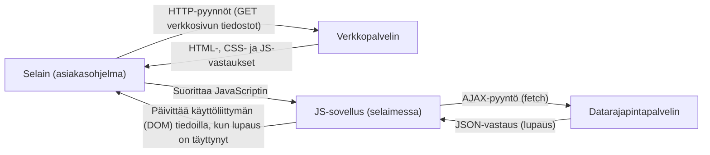
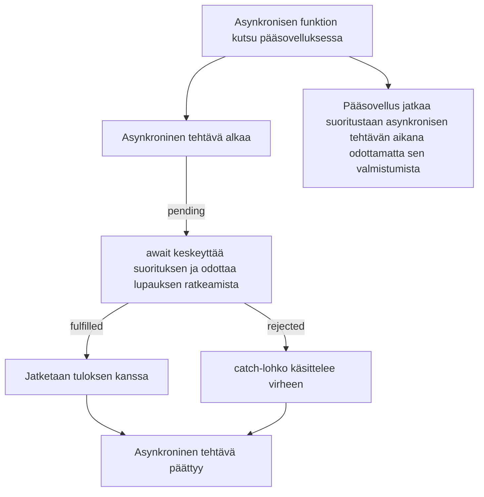

# JavaScript 5: Asynkroninen ohjelmointi, AJAX ja avoimet rajapinnat

## Asynkroninen JavaScript

Aiemmilla JavaScript-oppitunneilla olet kirjoittanut enimmäkseen synkronista (_synchronous_) koodia. Se tarkoittaa, että koodi suoritetaan rivi kerrallaan eikä seuraavaa riviä suoriteta ennen kuin edellinen on suoritettu loppuun. _Tapahtumien_ yhteydessä käytit takaisinkutsufunktioita (_callback_), joita kutsutaan vasta tapahtuman sattuessa eikä heti koodia suoritettaessa. Tämä on esimerkki asynkronisesta (_asynchronous_) ohjelmoinnista. Asynkronisessa ohjelmoinnissa aikaa vievä operaatio, esimerkiksi verkkopyyntö, käynnistetään, ja muu koodi jatkaa suoritustaan sillä välin. Kun operaatio valmistuu, sen tulos käsitellään.

Ajastimet ovat toinen esimerkki asynkronisesta ohjelmoinnista. Funktiolla [`setTimeout`](https://www.geeksforgeeks.org/javascript/settimeout-in-javascript/) voit ajastaa koodin suoritettavaksi kerran tietyn ajan kuluttua. Funktiolla [`setInterval`](https://www.geeksforgeeks.org/javascript/javascript-setinterval-method/) voit suorittaa koodia toistuvasti säännöllisin väliajoin. Myös ajastimien kanssa käytetään takaisinkutsufunktioita. Takaisinkutsufunktiota kutsutaan, kun ajastin laukeaa:

```javascript
setTimeout(function () {
  console.log("Tämä viesti tulostetaan kerran 2,5 sekunnin kuluttua");
}, 2500);

setInterval(function () {
  console.log("Tämä viesti tulostetaan 5 sekunnin välein");
}, 5000);
```

JavaScriptin suoritusympäristö on yksisäikeinen eli se suorittaa koodia vain yhdessä säikeessä (_thread_), yksi käsky kerrallaan. Jos aikaa vievää operaatiota odotettaisiin synkronisesti, ohjelma ei tekisi odotuksen aikana mitään muuta eikä reagoisi käyttäjän toimiin. Tämä olisi huono käyttökokemus. Siksi JavaScriptissä monet asiat, kuten verkkopyynnöt ja tiedostojen käsittely, tehdään asynkronisesti.

## AJAX – Asynchronous JavaScript and XML

AJAX on tekniikka, jolla verkkosivulta tehdään asynkronisia verkkopyyntöjä. Sen avulla voit hakea tietoa palvelimelta ilman, että sivua tarvitsee ladata uudelleen. Nykyään tähän käytetään [`fetch`](https://developer.mozilla.org/en-US/docs/Web/API/Fetch_API/Using_Fetch)-funktiota, joka on JavaScriptin moderni tapa tehdä verkkopyyntöjä. `fetch`-funktio palauttaa lupauksen (_Promise_). Lupaus on olio, joka edustaa vielä kesken olevaa asynkronista operaatiota. Kun operaatio valmistuu, lupaus saa sen tuottaman arvon. Jos operaatio epäonnistuu, lupaus saa tiedon epäonnistumisen syystä.



Perinteisesti AJAX-pyyntöjen tietomuotona käytettiin [XML](https://www.w3schools.com/xml/xml_whatis.asp)-kieltä, mutta nykyään JSON on yleisempi.

[JSON](https://www.w3schools.com/whatis/whatis_json.asp) on kevyt, tekstimuotoinen tietomuoto. Sitä on helppo lukea ja kirjoittaa, ja useimmat ohjelmointikielet tukevat sitä. JSON on lyhenne sanoista JavaScript Object Notation, ja sen kirjoitustapa perustuu JavaScriptin olioihin. Esimerkiksi seuraava JSON-data kuvaa henkilöä:

```json
{
  "name": "John Doe",
  "age": 30,
  "email": "john.doe@example.com"
}
```

Lupaukset ovat JavaScriptin tapa käsitellä asynkronisia operaatioita. Lupaus voi olla yhdessä kolmesta tilasta: odottava (_pending_), täyttynyt (_fulfilled_) tai hylätty (_rejected_). Kun lupaus on täyttynyt, asynkroninen operaatio on onnistunut ja lupauksella on arvo. Kun lupaus on hylätty, asynkroninen operaatio on epäonnistunut ja lupaus sisältää epäonnistumisen syyn (yleensä virheolion).



Voit esimerkiksi hakea tietoa palvelimelta asynkronisella funktiolla näin:

```javascript
async function fetchData() {
  try {
    const response = await fetch(
      "https://api.tvmaze.com/search/shows?q=emmerdale",
    );
    if (!response.ok) {
      // Tarkistetaan, onnistuiko pyyntö (tilakoodi 200–299)
      throw new Error("HTTP-virhe! Tilakoodi: " + response.status);
    }
    const data = await response.json();
    console.log("Haettu data:", data);
    return data; // Palauttaa lupauksen, joka ratkeaa dataksi
  } catch (error) {
    console.error("Virhe datan haussa:", error);
  }
}
fetchData();
console.log("Tämä viesti tulostetaan ennen kuin data on haettu");
```

Funktio tekee HTTP-pyynnön annettuun URL-osoitteeseen, joka tässä tapauksessa on `https://api.tvmaze.com/search/shows?q=emmerdale`. Se hakee hakusanaa ”emmerdale” vastaavien TV-sarjojen tiedot TV-sarjatietokannan [TVMaze](https://www.tvmaze.com/api) avoimesta rajapinnasta (_API_). Lue lisää rajapinnoista [alempaa](#sovellusohjelmointirajapinta-api).

Avainsanalla `await` odotetaan, että `fetch`-funktion palauttama lupaus ratkeaa. `await`-avainsanaa voi käyttää `async`-avainsanalla määritellyn funktion sisällä. Kun lupaus on ratkennut, voit käsitellä vastausta. Metodi `response.json()` jäsentää vastauksen rungon eli muuntaa JSON-tekstin JavaScript-olioksi, ja myös se palauttaa lupauksen. Avainsanalla `await` odotetaan uudelleen, että muunnos valmistuu, ennen kuin data tulostetaan konsoliin.

Esimerkki näyttää myös, miten `try...catch`-lohkolla käsitellään asynkronisen operaation aikana mahdollisesti syntyviä virheitä. Jos `fetch`-pyyntö epäonnistuu esimerkiksi verkkovirheen vuoksi, virhe otetaan kiinni `catch`-lohkossa ja tulostetaan konsoliin. `fetch` ei kuitenkaan pidä virheenä sitä, että palvelin vastaa virhettä ilmaisevalla tilakoodilla (esim. 404 tai 500). Siksi koodi tarkistaa vastauksen `ok`-ominaisuuden ja tarvittaessa heittää (`throw`) itse virheen, joka otetaan kiinni `catch`-lohkossa.

Asynkroninen funktio palauttaa aina lupauksen. Jos funktio palauttaa arvon, lupaus ratkeaa tähän arvoon. Voit siis odottaa asynkronisen funktion tulosta `await`-avainsanalla (esimerkki käyttää edellä määriteltyä `fetchData()`-funktiota):

```javascript
async function main() {
  const data = await fetchData(); // Odotetaan, että fetchData-funktion palauttama lupaus ratkeaa
  console.log("Data fetchData-funktiolta:", data);
}
main();
```

Lupauksia voi käsitellä myös toisella (perinteisellä) tavalla ilman modernia `async/await`-syntaksia. Lupauksen `then`-metodilla käsitellään ratkennut arvo ja `catch`-metodilla mahdolliset virheet:

```javascript
fetch("https://api.tvmaze.com/search/shows?q=emmerdale")
  .then((response) => response.json()) // Jäsennetään vastaus JSON-muodosta
  .then((data) => {
    console.log("Haettu data:", data); // Tulostetaan haettu data
  })
  .catch((error) => {
    console.error("Virhe datan haussa:", error); // Käsitellään haun aikana syntyneet virheet
  });
```

`async/await`-syntaksia suositaan, koska sillä kirjoitettua koodia on helpompi lukea ja kirjoittaa etenkin silloin, kun asynkronisia operaatioita on useita.

---

## Sovellusohjelmointirajapinta (API)

Sovellusohjelmointirajapinta eli lyhyesti rajapinta (_Application Programming Interface_, API) määrittelee, miten ohjelmat voivat pyytää toisiltaan palveluja ja vaihtaa tietoa keskenään. Rajapinta on ikään kuin tulkki kahden eri järjestelmän välillä. Esimerkiksi JavaScriptin [Geolocation API](https://developer.mozilla.org/en-US/docs/Web/API/Geolocation/Using_geolocation) hakee laitteen sijaintitiedot käyttöjärjestelmältä ja muuntaa ne JavaScriptille sopivaan muotoon.

### Avoimet rajapinnat

Avoin rajapinta on julkisesti kenen tahansa käytettävissä oleva rajapinta, jonka kautta voi käyttää palvelun tietoja internetin kautta. Avoin rajapinta voi olla pelkkä datarajapinta, josta voi vain lukea tietoa (esim. [OpenWeatherMap](https://openweathermap.org/current)), tai toiminnallinen rajapinta, jonka kautta voi myös tallentaa ja muokata tietoa (esim. [X API](https://docs.x.com/x-api/)). Verkkosovellukset hakevat tietoa avoimista rajapinnoista yleensä HTTP-pyynnöillä, mutta rajapintoja käytetään myös muihin tarkoituksiin, kuten koneoppimiseen ja data-analyysiin.

- [Luettelo avoimista rajapinnoista](https://rapidapi.com/hub)
- [Luettelo suomalaisista avoimista rajapinnoista](https://www.avoindata.fi/en)

Avoimia rajapintoja on runsaasti, ja useimmat niistä on nykyään dokumentoitu hyvin. Monet rajapinnat vaativat rekisteröitymisen ennen käyttöä. Rajapintaa kannattaa testata ennen kuin otat sen käyttöön omassa sovelluksessasi.

Kätevä testaustyökalu on [Postman](https://www.postman.com/downloads/). Sillä voit testata internetissä olevia rajapintoja kirjoittamatta riviäkään koodia.

Lisätietoa avoimista rajapinnoista saat [tästä videosta](https://www.youtube.com/watch?v=dStT9v5y6Tc).

### Esimerkkisovellus, joka käyttää OpenChargeMap-rajapintaa

- [Lähdekoodi](https://github.com/ilkkamtk/sahkoauto)
- [Linkki sovellukseen](https://users.metropolia.fi/~ilkkamtk/sahkoauto/)

### Esimerkkejä rajapintojen käytöstä

- [Linkki](../api-examples/README.md)

# AJAX – Asynchronous JavaScript and XML

## Tyypillinen AJAX-sovellus

AJAX-sovellus päivittää verkkosivun sisältöä ilman, että sivua ladataan uudelleen tai käyttäjä siirtyy sivulta toiselle. Siksi verkkosovellus, kuten Google Docs, voi toimia tavallisen työpöytäohjelman tapaan. Myös Facebook on hyvä esimerkki AJAX-sovelluksesta.

### A = Asynchronous (asynkroninen)

Koska JavaScriptin suoritusympäristö on yksisäikeinen, aikaa vieviä operaatioita ei voi odottaa synkronisesti: ohjelma ei silloin voisi tehdä odotuksen aikana mitään muuta.
Siksi JavaScriptissä monet asiat, kuten AJAX-pyynnöt ja tiedostojen käsittely, tehdään asynkronisesti.

#### Asynkroninen AJAX-pyyntö

```javascript
"use strict";
console.log("the script starts");

function synchronousFunction() {
  let number = 1;
  for (let i = 1; i < 100000; i++) {
    number += i;
    console.log("synchronousFunction running");
  }
  console.log("regular function complete", number);
}

async function asynchronousFunction() {
  // asynkroninen funktio määritellään async-avainsanalla
  console.log("asynchronous download begins");
  try {
    // virheenkäsittely: try/catch/finally
    const response = await fetch("http://127.0.0.1:3000/airport/00A"); // aloitetaan datan lataus; fetch palauttaa lupauksen, joka ratkeaa Response-olioksi
    const jsonData = await response.json(); // muunnetaan vastauksen JSON-data JavaScript-olioksi json()-metodilla
    console.log(jsonData.ICAO, jsonData.Name); // tulostetaan tulos konsoliin
  } catch (error) {
    console.log(error.message);
  } finally {
    // finally = suoritetaan joka tapauksessa, onnistui suoritus tai ei
    console.log("asynchronous load complete");
  }
}

synchronousFunction();
asynchronousFunction();

console.log("the script ends");
```

##### Tehtävä: Kokeile yllä olevaa skriptiä. Käytä Python-moduulin 13 tehtävän 2 URL-osoitetta ([suomeksi](https://github.com/vesavvo/Python_Ohjelmistoteema/blob/main/Teht%C3%A4v%C3%A4t.md#13-taustapalvelun-ja-rajapinnan-rakentaminen) tai [englanniksi](https://github.com/vesavvo/Python_Ohjelmistoteema/blob/main/English/Exercises.md#13-setting-up-a-backend-service-with-an-interface)).

- Asenna ensin Python-sovellukseesi Flask-CORS-laajennus. Selain sallii oletuksena JavaScriptin hakea tietoa vain samasta alkuperästä (sama protokolla, palvelin ja portti), josta sivu ladattiin. Flask-CORS-laajennus lisää palvelimen vastauksiin tiedon, joka sallii pyynnöt myös muista alkuperistä (CORS, _Cross-Origin Resource Sharing_).
- Esimerkki: https://gist.github.com/ilkkamtk/26ba4289a3b1bb26b3ff002570c79ec5
- Yllä olevan koodin pitäisi tulostaa konsoliin:

```text
 the script starts
 regular function complete 49999999990067860000
 asynchronous download begins
 the script ends
 00A Total Rf Heliport
 asynchronous load complete
```

- Avaa myös kehittäjätyökalujen Network-välilehti ja lataa sivu uudelleen. Huomaat, että pyyntö URL-osoitteeseen lähtee vasta, kun synkroninen funktio on suoritettu loppuun.

#### Tässä sama esimerkki, mutta nyt lentokentän koodi syötetään lomakkeella.

```html
<form id="airport-form">
  <input name="icao" type="text" placeholder="Syötä lentokentän ICAO-koodi" />
  <input name="submit" type="submit" value="Lähetä" />
</form>

<script>
  "use strict";

  // Kun lomake lähetetään...
  const airportForm = document.querySelector("#airport-form");
  airportForm.addEventListener("submit", async function (evt) {
    // ... estetään lomakkeen oletustoiminto (sivun uudelleenlataus).
    evt.preventDefault();
    // haetaan input-elementin arvo
    const code = document.querySelector("input[name=icao]").value;
    try {
      // virheenkäsittely: try/catch/finally
      const response = await fetch(`http://127.0.0.1:3000/airport/${code}`); // aloitetaan datan lataus; fetch palauttaa lupauksen, joka ratkeaa Response-olioksi
      const jsonData = await response.json(); // muunnetaan vastauksen JSON-data JavaScript-olioksi json()-metodilla
      console.log(jsonData.ICAO, jsonData.Name); // tulostetaan tulos konsoliin
    } catch (error) {
      console.log(error.message);
    }
  });
</script>
```

## J = JavaScript

AJAXissa JavaScript näyttää ladatun datan HTML-dokumentissa muokkaamalla sivun DOM-rakennetta.

## X = XML, eXtensible Markup Language

XML on HTML:n tapaan merkintäkieli (_markup language_). Se on tarkoitettu tiedon tallentamiseen ja siirtämiseen. Tyypillinen XML-dokumentti näyttää tältä:

```xml
<?xml version="1.0" encoding="UTF-8"?>
<images>
    <picture>
        <name> Nukkuva kissa </name>
        <description> Tässä kuvassa kissa nukkuu. </description>
        <address> http://placecats.com/321/241 </address>
    </picture>
    <picture>
        <name> Makaava kissa </name>
        <Description> Tässä kuvassa kissa makaa. </Description>
        <address> http://placecats.com/421/251 </address>
    </picture>
</images>
```

Kun AJAX-tekniikka yleistyi 2000-luvun puolivälissä, XML oli luonteva vaihtoehto tiedonsiirtoon.
XML-dokumenttien luominen palvelimella ja varsinkin niiden lukeminen eli jäsentäminen asiakaspäässä (selaimessa) JavaScriptillä on kuitenkin melko työlästä nykyisiin tekniikoihin verrattuna.

## [JSON](http://json.org), JavaScript Object Notation

JSON (JavaScript Object Notation) on suosittu merkintätapa, jota käytetään yleisesti selainten ja palvelinten väliseen tiedonsiirtoon ja erityisesti AJAX-sovelluksissa. Nykyään AJAX-sovellukset käyttävät enimmäkseen JSONia XML:n sijaan. Vaikka JSONin kirjoitustapa perustuu JavaScriptin tietorakenteisiin, sitä voi käsitellä lähes millä tahansa ohjelmointikielellä. JSONin käyttö sekä palvelin- että selainohjelmoinnissa on yleensä paljon yksinkertaisempaa kuin XML:n. Esimerkiksi:

```json
[
  {
    "name": "Nukkuva kissa",
    "description": "Tässä kuvassa kissa nukkuu.",
    "address": "http://placecats.com/321/241"
  },
  {
    "name": "Makaava kissa",
    "description": "Tässä kuvassa kissa makaa.",
    "address": "http://placecats.com/421/251"
  }
]
```

Yllä oleva esimerkki kuvaa taulukkoa (hakasulkeet []), joka sisältää kaksi oliota (aaltosulkeet {}). Seuraava esimerkki hakee toisen kuvan tiedot ja näyttää ne HTML-dokumentissa:

```html
<figure>
  
  <figcaption></figcaption>
</figure>

<script>
  // yksinkertaistettu esimerkki ilman virheenkäsittelyä
  async function showPics() {
    const response = await fetch("pics.json"); // aloittaa latauksen
    const images = await response.json(); // muunnetaan ladattu JSON-teksti JavaScript-olioksi / -taulukoksi

    const name = images[1].name; // 'images'-taulukon toisen olion 'name'-ominaisuus
    const description = images[1].description; // 'images'-taulukon toisen olion 'description'-ominaisuus
    const address = images[1].address; // 'images'-taulukon toisen olion 'address'-ominaisuus

    document.querySelector("img").src = address;
    document.querySelector("img").alt = name;
    document.querySelector("figcaption").innerText = description;
  }

  showPics(); // kutsutaan funktiota latauksen aloittamiseksi
</script>
```

## [Lupaus](https://developer.mozilla.org/en-US/docs/Web/JavaScript/Reference/Global_Objects/Promise) (_Promise_)

Lupaus on olio, joka tuottaa yhden tuloksen myöhemmin: joko onnistuneen operaation arvon tai syyn, miksi operaatio epäonnistui (esim. verkkovirhe). Lupaus voi olla yhdessä kolmesta mahdollisesta tilasta: täyttynyt (_fulfilled_), hylätty (_rejected_) tai odottava (_pending_).


JavaScriptin uudemmissa versioissa lupauksia käytetään yhä enemmän [takaisinkutsufunktioiden](lisamateriaali.md#takaisinkutsufunktiot-ja-takaisinkutsuhelvetti) sijaan. Nimensä mukaisesti lupaus ”lupaa” tuottaa arvon myöhemmin.
Lupausten etuja ovat esimerkiksi yksinkertaisempi syntaksi ja helpompi virheenkäsittely. Seuraavassa esimerkissä lomakkeen tiedot lähetetään palvelimelle `fetch`-funktiolla:

```html
<form>
  <div>
    <input name="fName" type="text" placeholder="etunimi" />
  </div>
  <div>
    <input name="lName" type="text" placeholder="sukunimi" />
  </div>
  <div>
    <input name="submit" type="submit" value="Lähetä" />
  </div>
</form>
<script>
  // Kun lomake lähetetään...
  document.addEventListener("submit", async function (evt) {
    // ... estetään lomakkeen oletustoiminto (sivun uudelleenlataus).
    evt.preventDefault();
    // luodaan olio 'data', johon lisätään käyttäjän lomakkeelle syöttämät tiedot ja jonka HTTP-metodiksi asetetaan POST
    const data = {
      body: JSON.stringify({
        fname: document.querySelector("input[name=fName]").value,
        lname: document.querySelector("input[name=lName]").value,
      }),
      method: "POST",
      headers: {
        "Content-type": "application/json",
      },
    };
    // lähetetään data
    try {
      const response = await fetch("/someAddressWhereDataIsSent", data); // lähetetään data palvelimelle ja vastaanotetaan palvelimen vastaus
      if (!response.ok) throw new Error("Virheellinen syöte!"); // jos palvelin vastaa virhetilakoodilla, heitetään virhe
      const json = await response.json(); // muunnetaan ladattu JSON-teksti JavaScript-olioksi / -taulukoksi
      console.log("result", json); // tulostetaan tulos konsoliin
    } catch (e) {
      console.log("error", e);
    }
  });
</script>
```

Funktio `fetch()` ja metodi `json()` palauttavat kumpikin lupauksen. Siksi niiden tulosta odotetaan `await`-avainsanalla. Tässä tapauksessa lupauksen täyttyminen tarkoittaa, että data on ladattu.

## [Fetch API](https://developer.mozilla.org/en-US/docs/Web/API/Fetch_API/Using_Fetch)

Fetch API on lupauksiin perustuva tapa tehdä AJAX-pyyntöjä. Vanhempaan [XMLHttpRequest-olioon](https://developer.mozilla.org/en-US/docs/Web/API/XMLHttpRequest) verrattuna Fetch on monipuolisempi ja joustavampi. Suuremmissa sovelluksissa se on myös yksinkertaisempi, koska sisäkkäisiä takaisinkutsufunktioita eli niin sanottua takaisinkutsuhelvettiä (_callback hell_) ei synny ja virheenkäsittely on helpompaa.

JavaScriptin ES8-versio (ES2017) toi mukanaan [async / await](https://developer.mozilla.org/en-US/docs/Web/JavaScript/Reference/Statements/async_function) -syntaksin, joka helpottaa lupausten käyttöä ja erityisesti virheenkäsittelyä. Async / await -syntaksilla lupauksen palauttavia funktioita kutsutaan pitkälti samalla tavalla kuin muitakin funktioita. Erona on, että funktiokutsun eteen kirjoitetaan `await` ja että `await`-avainsanaa voi käyttää vain asynkronisen (`async`) funktion sisällä (poikkeuksena JavaScript-moduulien ylin taso). Tässä on aiempi kuvaesimerkki, nyt [try...catch](https://developer.mozilla.org/en-US/docs/Web/JavaScript/Reference/Statements/try...catch)-virheenkäsittelyn kanssa.

```html
<figure>
  
  <figcaption></figcaption>
</figure>

<script>
  async function showPics() {
    try {
      const response = await fetch("pics.json"); // aloitetaan lataus
      if (!response.ok) throw new Error("Virheellinen syöte!"); // jos palvelin vastaa virhetilakoodilla, heitetään virhe
      const images = await response.json(); // muunnetaan ladattu JSON-teksti JavaScript-olioksi / -taulukoksi
      const name = images[1].name; // 'images'-taulukon toisen olion 'name'-ominaisuus
      const description = images[1].description; // 'images'-taulukon toisen olion 'description'-ominaisuus
      const address = images[1].address; // 'images'-taulukon toisen olion 'address'-ominaisuus

      document.querySelector("img").src = address;
      document.querySelector("img").alt = name;
      document.querySelector("figcaption").innerText = description;
    } catch (error) {
      // otetaan heitetty virhe kiinni
      console.log(error.message);
    }
  }

  showPics();
</script>
```
