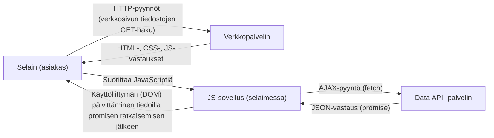
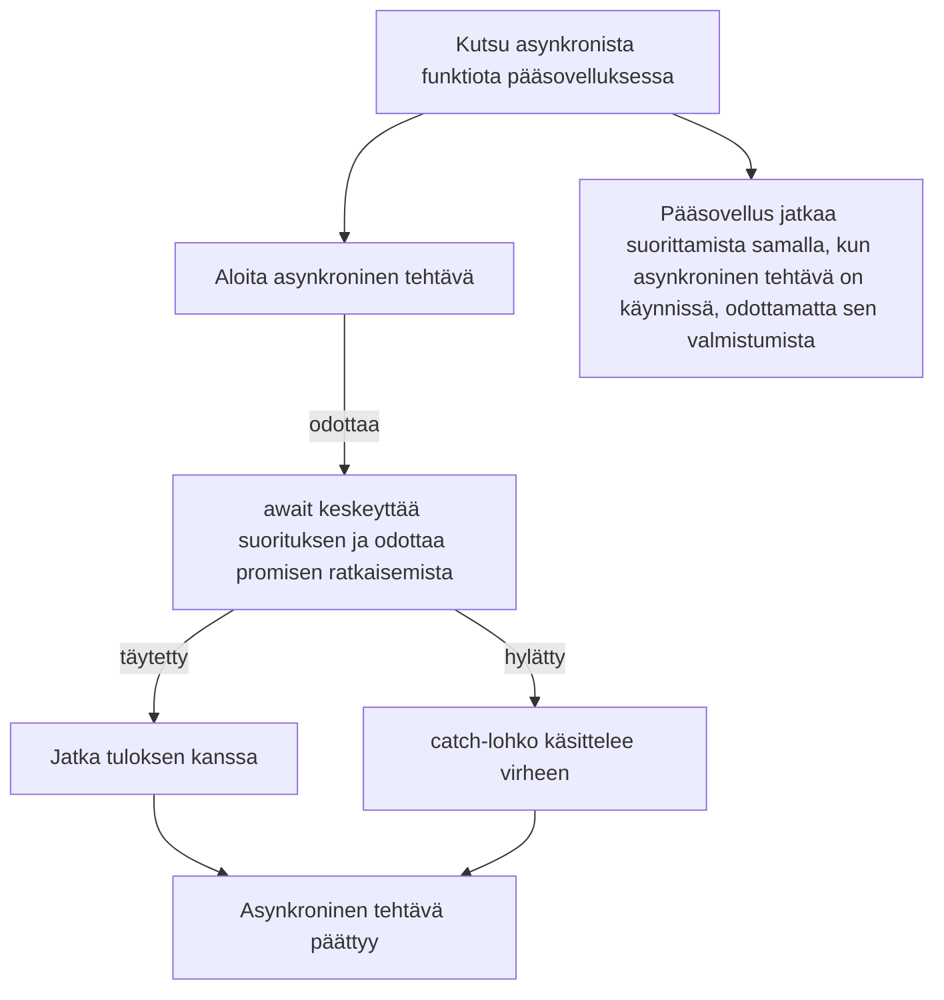

# JavaScript 5 - Asynkroninen ohjelmointi, AJAX ja avoimet sovellusohjelmointirajapinnat

## Asynkroninen JavaScript

Aiemmilla JavaScript-tunneilla olemme kirjoittaneet pääasiassa synkronista koodia. Tämä tarkoittaa, että koodi suoritetaan rivi riviltä, eikä seuraavaa koodiriviä suoriteta ennen kuin edellisen rivin suoritus on päättynyt. _Tapahtumien_ yhteydessä käytimme _callback_-funktioita, joita kutsutaan tapahtuman tapahtuessa eikä välittömästi koodin suorittamisen yhteydessä. Tämä on esimerkki asynkronisesta ohjelmoinnista. Asynkronisen ohjelmoinnin avulla voimme kirjoittaa koodia, joka voi suorittaa toimintoja taustalla samalla, kun muu koodi jatkaa normaalia suorittamistaan.

Muita esimerkkejä asynkronisesta ohjelmoinnista ovat ajastimet. [`setTimeout`](https://www.geeksforgeeks.org/javascript/settimeout-in-javascript/) ja [`setInterval`](https://www.geeksforgeeks.org/javascript/javascript-setinterval-method/) -funktioiden avulla voimme ajoittaa koodin suoritettavaksi tietyn ajan kuluttua. Tämän avulla voimme suorittaa koodia säännöllisin väliajoin. Myös ajastimien kanssa käytetään callback-funktioita. Callback-funktiota kutsutaan, kun ajastin päättyy:

```javascript
setTimeout(function () {
  console.log("This message is printed once after 2.5 seconds");
}, 2500);

setInterval(function () {
  console.log("This message is printed every 5 seconds");
}, 5000);
```

Koska JavaScriptin suoritusympäristö on yksisäikeinen, aikaa vieviä operaatioita ei voida odottaa synkronisesti eli siten, että yksi säie odottaa kutsun suorittamista, jolloin ohjelma ei tee mitään muuta ja lakkaa vastaamasta. Tämä olisi huono käyttökokemus. Tästä syystä JavaScriptissä monet asiat, kuten verkkopyynnöt ja tiedostojen käsittely, tehdään asynkronisesti.

## AJAX - Asynchronous JavaScript and XML

Ajax on tekniikka, jolla verkkosivulta tehdään asynkronisia verkkopyyntöjä. Tämän avulla voimme hakea tietoja palvelimelta ilman, että sivu täytyy ladata uudelleen. Tämä tehdään [`fetch`](https://developer.mozilla.org/en-US/docs/Web/API/Fetch_API/Using_Fetch)-funktiolla, joka on nykyaikainen tapa tehdä verkkopyyntöjä JavaScriptissä. `fetch`-funktio palauttaa promisen, joka on olio, joka edustaa asynkronisen operaation lopullista valmistumista (tai epäonnistumista) ja sen tuloksena saatavaa arvoa.



Perinteisesti [XML](https://www.w3schools.com/xml/xml_whatis.asp)-muotoa käytettiin AJAX-pyyntöjen tiedostomuotona, mutta nykyään JSONia käytetään yleisemmin.

[JSON](https://www.w3schools.com/whatis/whatis_json.asp) on kevyt tietomuoto, jota on helppo lukea ja kirjoittaa ja jota useimmat ohjelmointikielet tukevat. JSON tulee sanoista JavaScript Object Notation, ja se on tapa esittää tietoja JavaScript-oliona. Esimerkiksi seuraava JSON-data esittää henkilöä:

```json
{
  "name": "John Doe",
  "age": 30,
  "email": "john.doe@example.com"
}
```

Promiset ovat tapa käsitellä asynkronisia operaatioita JavaScriptissä. Promise voi olla yhdessä kolmesta tilasta: odottava, täytetty tai hylätty. Kun promise on täytetty, se tarkoittaa, että asynkroninen operaatio on suoritettu onnistuneesti ja promisella on arvo. Kun promise on hylätty, se tarkoittaa, että asynkroninen operaatio on epäonnistunut ja promisella on epäonnistumisen syy.



Esimerkiksi voimme hakea tietoja palvelimelta tällä tavalla käyttämällä asynkronista funktiota:

```javascript
async function fetchData() {
  try {
    const response = await fetch(
      "https://api.tvmaze.com/search/shows?q=emmerdale",
    );
    if (!response.ok) {
      // Check if the response is successful (status code 200-299)
      throw new Error("HTTP error! status: " + response.status);
    }
    const data = await response.json();
    console.log("Fetched data:", data);
    return data; // This will return a promise that resolves to the data
  } catch (error) {
    console.error("Error fetching data:", error);
  }
}
fetchData();
console.log("This message is printed before the data is fetched");
```

Funktio tekee HTTP-pyynnön määritettyyn URL-osoitteeseen, joka tässä tapauksessa on `https://api.tvmaze.com/search/shows?q=emmerdale`. Se hakee tietoja televisiosarjoista, jotka vastaavat hakutermiä "emmerdale", avoimesta TV-sarjojen tietokannan rajapinnasta nimeltä [TVMaze](https://www.tvmaze.com/api). Lue lisää API-rajapinnoista [alla](#application-programming-interface-api).

`await`-avainsanaa käytetään odottamaan, että `fetch`-funktion palauttama promise ratkaistaan. Kun promise on ratkaistu, voimme käsitellä vastausta ja lukea sen JSON-muodossa. `response.json()`-metodia käytetään vastauksen jäsentämiseen JSONiksi, ja se palauttaa myös promisen. Käytämme jälleen `await`-avainsanaa odottamaan, että JSON-muunnos valmistuu, ennen kuin tulostamme datan JavaScript-oliona konsoliin.

Tämä esimerkki havainnollistaa myös `try...catch`-lohkon käyttöä asynkronisen operaation aikana mahdollisesti syntyvien virheiden käsittelyssä. Jos fetch-pyyntö epäonnistuu, virhe otetaan kiinni ja kirjataan konsoliin. Jos verkkopyyntö onnistuu, mutta vastauksen tilakoodi ilmaisee virheen (esimerkiksi 404 tai 500), `throw`-lauseella heitetään virhe, joka otetaan kiinni catch-lohkossa.

Jos asynkroninen funktio palauttaa arvon, se kääritään promiseen. Tämä tarkoittaa, että voimme käyttää `await`-avainsanaa odottamaan arvon palautumista asynkronisesta funktiosta (tässä esimerkissä käytetään aiemmin määriteltyä `fetchData()`-funktiota):

```javascript
async function main() {
  const data = await fetchData(); // Wait for the promise returned by fetchData to resolve
  console.log("Data from fetchData function:", data);
}
main();
```

On myös toinen (perinteinen) tapa käsitellä promiseja ilman nykyaikaista `async/await`-syntaksia. Voimme käyttää promisen `then`-metodia ratkaistun arvon käsittelyyn ja `catch`-metodia virheiden käsittelyyn:

```javascript
fetch("https://api.tvmaze.com/search/shows?q=emmerdale")
  .then((response) => response.json()) // Parse the response as JSON
  .then((data) => {
    console.log("Fetched data:", data); // Log the fetched data
  })
  .catch((error) => {
    console.error("Error fetching data:", error); // Handle any errors that occur during the fetch
  });
```

`async/await`-syntaksia suositaan sen luettavuuden ja helppokäyttöisyyden vuoksi, erityisesti silloin, kun käsitellään useita asynkronisia operaatioita.

---

## Sovellusohjelmointirajapinta (API)

Sovellusohjelmointirajapinta on määritelmä, jonka mukaisesti eri ohjelmat voivat tehdä pyyntöjä ja vaihtaa tietoja eli kommunikoida keskenään. API on eräänlainen tulkki kahden eri järjestelmän välillä. Esimerkiksi JavaScriptin [Geolocation API](https://developer.mozilla.org/en-US/docs/Web/API/Geolocation/Using_geolocation) hakee laitteen sijaintitiedot käyttöjärjestelmästä ja muuntaa ne JavaScriptille sopivaan muotoon.

### Avoimet API-rajapinnat

Avoin sovellusohjelmointirajapinta on eräänlainen tietovarasto, jota voidaan lukea Internetin kautta. Avoin sovellusohjelmointirajapinta voi olla vain dataa tarjoava rajapinta, josta voidaan ainoastaan lukea tietoja (esimerkiksi [OpenWeatherMap](https://openweathermap.org/current)), tai toiminnallinen rajapinta, jota voidaan käyttää myös tietojen tallentamiseen ja muokkaamiseen (esimerkiksi [X API](https://docs.x.com/x-api/)). Avoimia API-rajapintoja käytetään usein verkkosovellusten tietojen tarjoamiseen HTTP-pyyntöjen avulla, mutta niitä voidaan käyttää myös muihin tarkoituksiin, kuten koneoppimiseen ja data-analyysiin.

- [Luettelo avoimista sovellusohjelmointirajapinnoista](https://rapidapi.com/hub)
- [Luettelo suomalaisista avoimista sovellusohjelmointirajapinnoista](https://www.avoindata.fi/en)

Avoimia sovellusohjelmointirajapintoja on runsaasti, ja useimmat niistä ovat nykyään hyvin dokumentoituja. Monet rajapinnoista edellyttävät jonkinlaista rekisteröitymistä ennen kuin niitä voidaan käyttää. Lisäksi niitä voidaan testata ennen käyttöönottoa.

Erittäin kätevä työkalu testaamiseen on [Postman](https://www.postman.com/downloads/). Sen avulla Internetissä olevia rajapintoja voidaan testata kirjoittamatta yhtäkään koodiriviä.

Lisätietoja avoimista API-rajapinnoista saat [katsomalla tämän videon](https://www.youtube.com/watch?v=dStT9v5y6Tc).

### Esimerkkisovellus, joka käyttää OpenChargeMap-rajapintaa

- [Lähdekoodi](https://github.com/ilkkamtk/sahkoauto)
- [Linkki sovellukseen](https://users.metropolia.fi/~ilkkamtk/sahkoauto/)

### Esimerkkejä API-rajapintojen käytöstä

- [Linkki](api-examples/README.md)

# AJAX - Asynchronous JavaScript and XML

## Tyypillinen AJAX-sovellus

Koska Ajax-sovellus muokkaa verkkosivuja dynaamisesti ilman, että käyttäjän tarvitsee siirtyä sivulta toiselle, verkkosovelluksen toiminta voidaan saada muistuttamaan tavallisten työpöytäsovellusten, kuten Google Docsin, toimintaa. Myös Facebook on hyvä esimerkki AJAX-sovelluksesta.

### A = Asynkroninen

Koska JavaScriptin suoritusympäristö on yksisäikeinen, aikaa vieviä operaatioita ei voida odottaa synkronisesti eli siten, että yksi säie odottaa kutsun suorittamista, jolloin ohjelma ei tee mitään muuta.
Tästä syystä JavaScriptissä monet asiat, kuten AJAX-kutsut ja tiedostojen käsittely, tehdään asynkronisesti.

#### Asynkroninen AJAX-pyyntö

```javascript
"use strict";
console.log("the script starts");

function synchronousFunction() {
  let number = 1;
  for (let i = 1; i < 100000; i++) {
    number += i;
    console.log("synchronousFunction running");
  }
  console.log("regular function complete", number);
}

async function asynchronousFunction() {
  // asynchronous function is defined by the async keyword
  console.log("asynchronous download begins");
  try {
    // error handling: try/catch/finally
    const response = await fetch("http://127.0.0.1:3000/airport/00A"); // starting data download, fetch returns a promise which contains an object of type 'response'
    const jsonData = await response.json(); // retrieving the data retrieved from the response object using the json() function
    console.log(jsonData.ICAO, jsonData.Name); // log the result to the console
  } catch (error) {
    console.log(error.message);
  } finally {
    // finally = this is executed anyway, whether the execution was successful or not
    console.log("asynchronous load complete");
  }
}

synchronousFunction();
asynchronousFunction();

console.log("the script ends");
```

##### Tehtävä: Kokeile yllä olevaa skriptiä. Käytä Python-moduulin 13 tehtävän 2 URL-osoitetta ([suomeksi](https://github.com/vesavvo/Python_Ohjelmistoteema/blob/main/Teht%C3%A4v%C3%A4t.md#13-taustapalvelun-ja-rajapinnan-rakentaminen) tai [englanniksi](https://github.com/vesavvo/Python_Ohjelmistoteema/blob/main/English/Exercises.md#13-setting-up-a-backend-service-with-an-interface)).

- Asenna ensin Flask-CORS-laajennus Python-sovellukseesi.
- Esimerkki: [https://gist.github.com/ilkkamtk/26ba4289a3b1bb26b3ff002570c79ec5](https://gist.github.com/ilkkamtk/26ba4289a3b1bb26b3ff002570c79ec5)
- Yllä olevan koodin pitäisi kirjata konsoliin:

```text
 the script starts
 regular function complete 49999999990067860000
 asynchronous download begins
 the script ends
 00A Total Rf Heliport
 asynchronous download complete
```

- Katso myös kehittäjätyökalujen Network-välilehteä ja lataa sivu uudelleen. Huomaat, että URL-osoitteen lataaminen ei ala ennen kuin tavallinen funktio on suorittanut loppuun.

#### Tässä on sama esimerkki, mutta tällä kertaa lentoaseman koodi syötetään lomakkeen avulla.

```html
<form id="airport-form">
  <input name="icao" type="text" placeholder="Enter airport icao code" />
  <input name="submit" type="submit" value="Send" />
</form>

<script>
  "use strict";

  // When the form is submitted...
  const airportForm = document.querySelector("#airport-form");
  airportForm.addEventListener("submit", async function (evt) {
    // ... prevent the default action.
    evt.preventDefault();
    // get value of input element
    const code = document.querySelector("input[name=icao]").value;
    try {
      // error handling: try/catch/finally
      const response = await fetch(`http://127.0.0.1:3000/airport/${code}`); // starting data download, fetch returns a promise which contains an object of type 'response'
      const jsonData = await response.json(); // retrieving the data retrieved from the response object using the json() function
      console.log(jsonData.ICAO, jsonData.Name); // log the result to the console
    } catch (error) {
      console.log(error.message);
    }
  });
</script>
```

## J = JavaScript

AJAXissa JavaScriptiä käytetään ladattujen tietojen näyttämiseen HTML-dokumentissa.

## X = XML, eXtensible Markup Language

XML on HTML:n kaltainen merkintäkieli. Se on tarkoitettu tietojen tallentamiseen ja siirtämiseen. Tyypillinen XML-dokumentti näyttää tältä:

```xml
<?xml version="1.0" encoding="UTF-8"?>
<images>
    <picture>
        <name> Sleeping cat </name>
        <description> In this picture, the cat is sleeping. </description>
        <address> http://placecats.com/321/241 </address>
    </picture>
    <picture>
        <name> Lying cat </name>
        <Description> In this picture, the cat is lying. </Description>
        <address> http://placecats.com/421/251 </address>
    </picture>
</images>
```

2000-luvun puolivälin tienoilla, kun AJAX-toiminnallisuus lisättiin JavaScriptiin, XML oli luonnollinen vaihtoehto käytettäväksi tiedonsiirtoon.
XML-dokumenttien luominen palvelimella ja erityisesti niiden lukeminen / jäsentäminen asiakaspuolella JavaScriptillä on nykyteknologioihin verrattuna melko hankalaa.

## [JSON](http://json.org), JavaScript Object Notation

JSON eli JavaScript Object Notation on suosittu merkintäkieli, jota käytetään yleisesti selainten ja palvelinten väliseen viestintään ja erityisesti Ajax-sovelluksissa. Nykyään Ajax-sovellukset käyttävät useimmiten JSONia XML:n sijaan. Vaikka JSON käyttää JavaScriptin tietorakenteita tietojen esittämiseen, se on silti yhteensopiva muiden kielten kanssa. JSONin käyttäminen sekä palvelin- että selainohjelmoinnissa on yleensä paljon yksinkertaisempaa kuin XML:n. Esimerkiksi:

```json
[
  {
    "name": "Sleeping cat",
    "description": "In this picture the cat is sleeping.",
    "address": "http://placecats.com/321/241"
  },
  {
    "name": "Sleeping cat",
    "description": "In this picture the cat is lying.",
    "address": "http://placecats.com/421/251"
  }
]
```

Yllä oleva esimerkki kuvaa taulukkoa (hakasulkeet [])-taulukkoa, joka sisältää kaksi oliota (aaltosulkeet {}). Tässä esimerkissä toisen kuvan tiedot haetaan ja näytetään HTML-dokumentissa:

```html
<figure>
  
  <figcaption></figcaption>
</figure>

<script>
  // simplified example without error handling
  async function showPics() {
    const response = await fetch("pics.json"); // starts the download.
    const images = await response.json(); // convert the loaded text JSON into a JavaScript object / array

    const name = images[1].name; // the 'name' property of the second object in the 'images' array
    const description = images[1].description; // 'description' property of the second object object in the 'images' array
    const address = images[1].address; // 'address' property of the second object object in the 'images' array

    document.querySelector("img").src = address;
    document.querySelector("img").alt = name;
    document.querySelector("figcaption").innerText = description;
  }

  showPics(); // call function to start download
</script>
```

## [promise](https://developer.mozilla.org/en-US/docs/Web/JavaScript/Reference/Global_Objects/Promise)

Promise on olio, joka voi tuottaa yhden arvon jossain vaiheessa tulevaisuudessa: joko ratkaistun arvon tai syyn siihen, miksi sitä ei ole ratkaistu (esimerkiksi verkkovirhe tapahtui). Promise voi olla yhdessä kolmesta mahdollisesta tilasta: täytetty, hylätty tai odottava.

JavaScriptin uudemmissa versioissa promisea käytetään yhä enemmän [callback-funktioiden](extras.md#callback-functions-and-callback-hell) sijaan. Promise on olio, joka "lupaa" palauttaa arvon.
Promisen etuja ovat esimerkiksi yksinkertaisempi syntaksi ja helpompi virheenkäsittely. Esimerkiksi lomakkeen lähettäminen fetch-metodilla:

```html
<form>
  <div>
    <input name="fName" type="text" placeholder="first name" />
  </div>
  <div>
    <input name="lName" type="text" placeholder="last name" />
  </div>
  <div>
    <input name="submit" type="submit" value="Send" />
  </div>
</form>
<script>
  // When the form is submitted...
  document.addEventListener("submit", async function (evt) {
    // ... prevent the default action.
    evt.preventDefault();
    // create an object 'data' to which user input from the form is added and the http method is set to POST
    const data = {
      body: JSON.stringify({
        fname: document.querySelector("input[name=fName]").value,
        lname: document.querySelector("input[name=lName]").value,
      }),
      method: "POST",
      headers: {
        "Content-type": "application/json",
      },
    };
    // send the data
    try {
      const response = await fetch("/someAddressWhereDataIsSent", data); // Send data to server and receive a server response
      if (!response.ok) throw new Error("Invalid input!"); // If an error occurs, an error message is thrown
      const json = await response.json(); // convert the loaded text JSON to a JavaScript object / array
      console.log("result", json); // print the result to the console
    } catch (e) {
      console.log("error", e);
    }
  });
</script>
```

Sekä `fetch()`- että `json()`-funktiot palauttavat promisen. Siksi sinun täytyy käyttää await-avainsanaa odottamaan promisen täyttymistä. Tässä tapauksessa se tarkoittaa, että data on ladattu.

## [Fetch API](https://developer.mozilla.org/en-US/docs/Web/API/Fetch_API/Using_Fetch)

Fetch on promise-pohjainen tapa tehdä Ajax-sovelluksia. Alkuperäiseen [XMLHTTPRequest-olioon](https://developer.mozilla.org/en-US/docs/Web/API/XMLHttpRequest) verrattuna Fetch on tehokkaampi, joustavampi ja suuremmissa sovelluksissa yksinkertaisempi, koska sen ei tarvitse käsitellä niin sanottua callback-helvettiä ja virheiden käsittely on helpompaa.

JavaScriptin ES8-versio esitteli [async / await](https://developer.mozilla.org/en-US/docs/Web/JavaScript/Reference/Statements/async_function)-syntaksin promisejen ja erityisesti virheenkäsittelyn käytön yksinkertaistamiseksi. Async / await -syntaksin avulla promisea palauttavia funktioita käsitellään samalla tavalla kuin muitakin funktioita. Erona on, että promisen palauttava funktio täytyy kirjoittaa toisen asynkronisen (`async`) funktion sisälle. Lisäksi `await` kirjoitetaan funktiokutsun eteen. Tässä on edellä oleva esimerkki async / await -syntaksilla, mutta tällä kertaa [try...catch](https://developer.mozilla.org/en-US/docs/Web/JavaScript/Reference/Statements/try...catch)-virheenkäsittelyllä.

```html
<figure>
  
  <figcaption></figcaption>
</figure>

<script>
  async function showPics() {
    try {
      const response = await fetch("pics.json"); // The download is started.
      if (!response.ok) throw new Error("Invalid input!"); // If an error occurs, an error message is thrown
      const images = await response.json(); // convert the loaded text JSON to a JavaScript object / array
      const name = images[1].name; // the 'name' property of the second object in the 'images' array
      const description = images[1].description; // 'description' property of the second object object in the 'images' array
      const address = images[1].address; // 'address' property of the second object object in the 'images' array

      document.querySelector("img").src = address;
      document.querySelector("img").alt = name;
      document.querySelector("figcaption").innerText = description;
    } catch (error) {
      // catch the thrown error message
      console.log(error.message);
    }
  }

  showPics();
</script>
```

---

<!-- add mermaid support for gh pages -->
<script type="module">
    Array.from(document.getElementsByClassName("language-mermaid")).forEach(element => {
      element.classList.add("mermaid");
    });
    import mermaid from 'https://cdn.jsdelivr.net/npm/mermaid@11/dist/mermaid.esm.min.mjs';
    mermaid.initialize({ startOnLoad: true });
</script>
