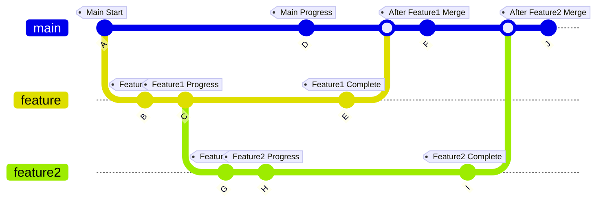
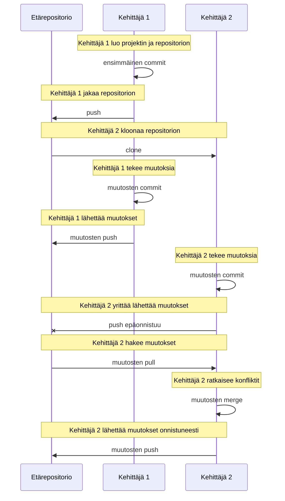

# Gitin käyttöohjeet ja hyvät käytännöt tiimiprojekteissa

Kertaus: [Ohjelmisto 1 – Versionhallinta ja Git](https://metropolia-sw.github.io/sw1-python/en/02a_version_control_and_git.html)

Tiimityössä Gitin (ja versionhallinnan ylipäätään) hyödyt korostuvat entisestään. Sen avulla useat kehittäjät voivat työskennellä samassa projektissa samanaikaisesti kirjoittamatta toistensa muutosten päälle. Tässä osiossa käydään läpi hyviä käytäntöjä ja ohjeita Gitin käyttöön tiimityössä.

Jokaisella tiimin jäsenellä on oltava oma paikallinen kopio (_clone_) repositoriosta (_repository_). Näin jokainen voi työskennellä itsenäisesti ja tehdä committeja vaikuttamatta muihin. Kun tiimin jäsen on valmis jakamaan muutoksensa, hän lähettää (_push_) ne etärepositorioon (_remote repository_) eli palvelimella olevaan yhteiseen repositorioon. Meidän tapauksessamme etärepositoriona toimii GitHub, joka tarjoaa tiimille keskitetyn paikan yhteistyölle ja projektin hallinnalle.

## Haarat

Haara (_branch_) on pohjimmiltaan erillinen kehityslinja Git-repositoriossa. Sen avulla kehittäjät voivat työstää uusia ominaisuuksia tai virhekorjauksia vaikuttamatta päähaaran koodiin. Tiimityössä on tavallista, että käytössä on päähaara, jonka nimi on usein `main` (tai aiemmin `master`), ja että jokaiselle ominaisuudelle tai tehtävälle luodaan oma haaransa.

Haaroja voidaan käyttää (ja usein käytetäänkin) paikallisesti kehittäjän omalla koneella. Niiden avulla kehittäjä voi työstää uutta ominaisuutta tai virhekorjausta vaikuttamatta päähaaran koodiin, kunnes muutokset ovat valmiita yhdistettäviksi päähaaraan.



Jokainen haara on oma kehityksen aikajanansa, jossa työstetään tiettyä ominaisuutta tai tehtävää. Kehittäjät voivat vaihtaa haarasta toiseen ja työstää eri ominaisuuksia häiritsemättä päähaaraa. Kun ominaisuus on valmis ja testattu, se voidaan yhdistää takaisin päähaaraan.

Esimerkkejä haarojen kanssa työskentelyssä käytettävistä Git-komennoista ja -toiminnoista:

```sh
git branch  # Listaa repositorion paikalliset haarat
git branch --all   # Listaa kaikki haarat, myös etärepositorion haarat
git branch new-feature  # Luo uuden haaran nimeltä 'new-feature'
git checkout new-feature  # Vaihtaa haaraan 'new-feature'
git checkout -b bug-fix  # Luo uuden haaran nimeltä 'bug-fix' ja vaihtaa siihen
git branch -d bug-fix  # Poistaa haaran 'bug-fix' (jos se on yhdistetty kokonaan)
git branch -D bug-fix  # Poistaa haaran 'bug-fix' pakotetusti (vaikka sitä ei olisi yhdistetty kokonaan)
git branch -m new-name  # Muuttaa nykyisen haaran nimeksi 'new-name'
git log new-feature  # Näyttää haaran 'new-feature' commit-historian
git diff new-feature main  # Näyttää haarojen 'new-feature' ja 'main' erot
```

### Uuden haaran luominen

Uuden haaran voit luoda komennolla `git branch`, jonka perään kirjoitat haaran nimen. Esimerkiksi haaran `feature` luot näin:

```sh
git branch feature
```

Komento ei vaihda uuteen haaraan. Haaraan vaihdetaan komennolla `git checkout`.

### Muutosten yhdistäminen

Yhdistämisessä (_merge_) yhden haaran muutokset tuodaan toiseen haaraan. Yleensä tämä tehdään, kun ominaisuus tai virhekorjaus on valmis ja se täytyy liittää toiseen kehityshaaraan tai `main`-haaraan.

1. Yhdistä toisen haaran muutokset nykyiseen haaraan: `git merge <OTHER-BRANCH>`.
2. Jos kohdehaaraan (haaraan, jossa olet) ei ole tehty uusia committeja sen jälkeen, kun lähdehaara (yhdistettävä haara) haarautui siitä, Git tekee pikakelausyhdistämisen (_fast-forward merge_). Tällöin yhdistämiscommittia ei luoda, vaan haaran osoitin siirtyy eteenpäin lähdehaaran viimeisimpään committiin. Committia ei tarvitse tehdä käsin.
3. Jos molempiin haaroihin on tehty uusia committeja, Git tekee kolmisuuntaisen yhdistämisen (_three-way merge_). Se luo yhdistämiscommitin, joka sisältää molempien haarojen muutokset. Jos samoihin koodiriveihin on tehty ristiriitaisia muutoksia, Git ei pysty yhdistämään niitä automaattisesti. Silloin sinun täytyy [ratkaista konfliktit](#konfliktien-ratkaiseminen) käsin ennen kuin yhdistäminen voidaan viimeistellä.
4. Jos yhdistämisen aikana tulee ongelmia ja haluat keskeyttää sen, käytä komentoa `git merge --abort`.
5. Kun konfliktit on ratkaistu, viimeistele yhdistäminen lisäämällä tiedostot valmistelualueelle (_staging area_) komennolla `git add` ja commitoimalla ne: `git commit -m "Merge branch 'source-branch' into 'target-branch'"`

Muutoksia voi yhdistää myös komennolla `git rebase`, mutta sitä ei käsitellä tässä. Se on edistyneempi aihe. Komento on hyödyllinen tietyissä tilanteissa, mutta se kirjoittaa versiohistoriaa uudelleen, joten väärin käytettynä se voi aiheuttaa vakavia ongelmia. Keskitymme toistaiseksi yhdistämisen perusteisiin.

### Konfliktien ratkaiseminen

1. Tunnista konfliktit
   - Kun yhdistät haaroja (`git merge` tai `git rebase`) ja niissä on ristiriitaisia muutoksia, Git ilmoittaa konfliktista (_conflict_) terminaalissa.
2. Avaa konfliktin sisältävä tiedosto koodieditorissa
   - Git merkitsee ristiriitaiset kohdat näin:

     ```plaintext
     <<<<<<< HEAD
     // Sinun muutoksesi
     =======
     // Toisen haaran muutokset
     >>>>>>> branch-name
     ```

   - Merkintä `<<<<<<< HEAD` osoittaa nykyisen haaran eli sinun muutostesi alun.
   - Merkintä `=======` erottaa sinun muutoksesi toisen haaran muutoksista.
   - Merkintä `>>>>>>> branch-name` osoittaa toisen haaran muutosten lopun.
   - Monissa editoreissa ja kehitysympäristöissä on työkaluja, jotka helpottavat konfliktien ratkaisemista.

3. Ratkaise konflikti muokkaamalla tiedostoa
   - Käy tiedosto läpi ja päätä, mitkä rivit säilytetään ja miten muutokset yhdistetään.
   - Käytä editorin konfliktinratkaisutyökaluja, jos niitä on saatavilla.
   - Poista lopuksi konfliktimerkinnät (`<<<<<<<`, `=======` ja `>>>>>>>`) ja mahdolliset ylimääräiset tyhjät rivit. Editorin työkalut tekevät tämän puolestasi, mutta käsin muokatessa ne on poistettava itse.
4. Tallenna tiedosto muutoksineen.
5. Jos konflikteja on useissa tiedostoissa, ratkaise konfliktit jokaisesta tiedostosta.
6. Lisää ja commitoi päivitetyt tiedostot
   - Kun olet ratkaissut kaikki konfliktit, lisää tiedostot valmistelualueelle komennolla `git add <list of files or .>`.
   - Commitoi muutokset komennolla `git commit -m "commit message"`. Git luo uuden yhdistämiscommitin.
7. Testaa muutokset
   - Konfliktien ratkaisemisen jälkeen on tärkeää testata koodi ja varmistaa, että muutokset ovat oikein ja toimivat.

Muista, että konfliktit ovat luonnollinen osa yhteistä kehitystyötä. Kun tiimi viestii hyvin, muutokset on helpompi sovittaa yhteen ja konflikteja syntyy vähemmän. Lisäksi versionhallinnan hyvät käytännöt, kuten haarojen pitäminen ajan tasalla ja ominaisuushaarojen (_feature branch_) käyttäminen, voivat vähentää konfliktien määrää.

---

## Git-työnkulku tiimityössä

### Etärepositoriot ja palveluntarjoajat yhteistyön tukena

Tiimit käyttävät yhteistyön tukena yleensä palvelua, joka ylläpitää etärepositorioita. Nämä palvelut tarjoavat tiimille keskitetyn paikan koodin jakamiseen, tehtävien ja vikojen (_issues_) seurantaan ja projektin työnkulkujen hallintaan.

#### [GitHub](https://github.com)

- **GitHub != Git**: Git on versionhallintaohjelma, GitHub taas yritys ja verkkopalvelu, joka hyödyntää Gitiä ja tarjoaa paljon muutakin kuin versioiden seurannan.
- Kaupallinen palvelu, joka tarjoaa etärepositoriopalvelimen, projektinhallintatyökaluja, wikin, vianseurannan, verkkosivujen julkaisun jne.
- Laaja käyttäjäyhteisö
- **Fork**: kopioi toisen käyttäjän repositorion omaksi repositorioksesi GitHubiin. Voit muokata kopiota vaikuttamatta alkuperäiseen repositorioon.
- Käytännössä vakiintunut (_de facto_) ylläpitopalvelu avoimen lähdekoodin projekteille
- Repositoriot (projektit) ovat oletuksena julkisia. Yksityisiä repositorioita voivat käyttää vain kutsutut yhteistyökumppanit (_collaborators_).
  - Huom.: yhteistyökumppaneilla on aina kirjoitusoikeus repositorioon.
- **Pull request**: pyyntö yhdistää yhden haaran muutokset toiseen haaraan. Tiimin jäsenet voivat tarkistaa muutokset ennen yhdistämistä.

#### Muita etärepositoriopalveluiden tarjoajia

- [Bitbucket](https://bitbucket.org) on toinen suosittu Git-repositorioiden ylläpitopalvelu, joka tarjoaa ilmaisia yksityisiä repositorioita pienille tiimeille.
- [GitLab](https://about.gitlab.com/install/) tarjoaa kaupallisen palvelun tai ilmaisen avoimen lähdekoodin yhteisöversion, jonka voi asentaa omalle palvelimelle.

### Työskentely etärepositorioiden kanssa

- `git clone <URI>`: kloonaa olemassa olevan repositorion eli luo siitä paikallisen kopion
- `git remote`: hallitsee yhteyksiä etärepositorioihin
- `git push`: lähettää paikallisen haaran uudet commitit valittuun etärepositorioon
- `git pull`: hakee etähaaran uudet commitit etärepositoriosta ja yhdistää ne nykyiseen haaraasi
- `git fetch`: hakee muutokset etärepositoriosta, mutta ei yhdistä niitä automaattisesti paikalliseen työhaaraasi

`git pull`, `git push` ja `git fetch` ovat keskeisiä Git-komentoja etärepositorioiden kanssa työskentelyyn. Niiden avulla voit synkronoida paikallisen repositoriosi etärepositorion kanssa, vaihtaa muutoksia muiden kehittäjien kanssa ja pitää koodikantasi ajan tasalla.

Visual Studio Codessa voit tehdä nämä toiminnot sisäänrakennetuilla Git-ominaisuuksilla Source Control -paneelin kautta. Voit myös suorittaa komennot suoraan terminaalissa komentorivikäyttöliittymän (CLI) avulla. **Sync** on kätevä tapa tehdä sekä `git pull` että `git push` yhdellä kertaa, mutta on tärkeää ymmärtää, mitä komentoja se suorittaa ja mitä ne tekevät.

Jos etähaarassa on muutoksia, joita sinulla ei ole, synkronointi yhdistää ne paikallisiin muutoksiisi. Jos muutokset ovat ristiriidassa keskenään, sinun on ratkaistava konfliktit ennen kuin synkronointi voidaan viedä loppuun.

#### Git pull

Komento `git pull` hakee muutokset etärepositoriosta ja yhdistää ne nykyiseen haaraan. Se on komentojen `git fetch` ja `git merge` yhdistelmä.

```bash
# <remote> on etärepositorion nimi (esim. origin on etärepositorion oletusnimi).
# <branch> on etärepositorion haara, jonka haluat hakea ja yhdistää nykyiseen haaraasi.
git pull <remote> <branch>

# Esimerkki
git pull origin main
```

#### Git push

Komento `git push` lähettää paikalliset commitit etärepositorioon, jolloin muutoksesi päivittyvät myös sinne.

```bash
# <remote> on etärepositorion nimi.
# <branch> on haara, jonka haluat lähettää.
git push <remote> <branch>

# Esimerkki
git push origin feature-branch
```

Jos etähaarassa on muutoksia, joita sinulla ei ole, Git hylkää lähetyksen. Hae silloin ensin muutokset ja ratkaise mahdolliset konfliktit. Lähetä paikallinen haarasi vasta sen jälkeen.

#### Git fetch

Komento `git fetch` hakee muutokset etärepositoriosta ja tallentaa ne paikallisesti. Toisin kuin `git pull`, se ei yhdistä muutoksia automaattisesti nykyiseen haaraasi. Se on hyödyllinen, kun haluat tarkastella muutoksia ennen yhdistämistä.

```sh
git fetch <remote>

# Esimerkkejä
git fetch origin  # hakee viimeisimmät muutokset etärepositoriosta origin, mutta ei yhdistä niitä nykyiseen haaraasi
git fetch --all  # hakee kaikki haarat kaikista etärepositorioista
```

#### Esimerkkityönkulku

Seuraava sekvenssikaavio havainnollistaa tyypillistä yksinkertaista työnkulkua, kun kaksi tai useampi kehittäjä työskentelee samassa projektissa Gitin avulla:



1. Sekä kehittäjä 1 että kehittäjä 2 työskentelevät samassa projektissa (etärepositoriossa) omilla koneillaan.
2. Kehittäjä 1 tekee muutoksia paikallisesti, commitoi ne ja lähettää muutokset etärepositorioon.
3. Samaan aikaan myös kehittäjä 2 tekee muutoksia. Kun kehittäjä 2 yrittää lähettää muutoksensa, toiminto kuitenkin epäonnistuu, koska etärepositoriossa on committeja, joita kehittäjällä 2 ei vielä ole.
4. Kehittäjä 2 hakee tämän jälkeen uusimmat muutokset etärepositoriosta. Tässä vaiheessa voi olla tarpeen yhdistää muutoksia ja ratkaista konflikteja.
5. Kun uudet muutokset on yhdistetty onnistuneesti, kehittäjä 2 lähettää omat muutoksensa etärepositorioon.

---

## Käytännön aloitus

Tämän harjoituksen tavoitteena on tutustua Gitin käyttöön tiimityössä.

Jokaisen tiimin jäsenen on pystyttävä työskentelemään omassa haarassaan, tekemään muutoksia ja yhdistämään ne päähaaraan. Päähaaraan yhdistämisen voi tehdä yksi tiimin jäsen tai kaikki yhdessä, mutta se vaatii jonkin verran koordinointia ja viestintää, jotta konflikteja vältetään ja kaikki tietävät, mitä muutoksia tehdään.

1. Luo projektitiimillesi yhteinen repositorio GitHubiin.
   - Yksi tiimin jäsenistä luo repositorion ja lisää muut tiimin jäsenet yhteistyökumppaneiksi (_collaborators_).
2. Jokainen tiimin jäsen kloonaa repositorion omalle koneelleen komennolla `git clone <repo-URL>` tai VS Coden Git-työkaluilla.
3. Jokainen tiimin jäsen luo työtään varten uuden haaran komennolla `git branch <branch-name>` ja vaihtaa siihen komennolla `git checkout <branch-name>` (tai käyttää VS Coden Git-työkaluja).
4. Jokainen tiimin jäsen tekee omassa haarassaan kokeeksi muutoksia, lisää projektiin tiedostoja ja commitoi ne. Lopuksi hän lähettää haaransa GitHubiin.
5. Yhdistäkää tiiminä kaikkien tiimin jäsenten muutokset GitHubin päähaaraan.
   - Tämä vaatii jonkin verran koordinointia ja viestintää tiimin jäsenten välillä, jotta konflikteja vältetään tai ne saadaan ratkaistua ja kaikki tietävät, mitä muutoksia tehdään.
6. Jokainen tiimin jäsen hakee päähaaran uusimmat muutokset omaan paikalliseen haaraansa, jolloin hänen koneellaan on sama koodikanta kuin GitHubin päähaarassa.

Harjoituksen jälkeen jokaisen tiimin jäsenen pitäisi osata lähettää muutoksensa etärepositorioon ja hakea muiden tiimin jäsenten uusimmat muutokset. Tiimin pitäisi myös sopia, miten Gitiä käytetään tiimityössä, mukaan lukien haarastrategiat, commit-viestit ja konfliktien ratkaiseminen.

Palauta tiimisi GitHub-linkki OMA-palautustehtävään ohjeiden mukaisesti.

---

## Vinkkejä

- Tarkista työhakemistosi ja valmistelualueesi tila usein komennolla `git status`. Sen avulla näet, mitä muutoksia on tehty, mitkä tiedostot on lisätty valmistelualueelle seuraavaa committia varten ja onko hakemistossa tiedostoja, joita Git ei vielä seuraa.
- Kokoa toisiinsa liittyvät muutokset samaan committiin sen sijaan, että lisäisit kaikki muutokset kerralla. Näin jokaisen commitin muutokset on helpompi ymmärtää.
- Kun teet uusia committeja, kirjoita selkeitä ja kuvaavia commit-viestejä. Näin on helpompi ymmärtää, mitä muutoksia tehtiin ja miksi.
- Komennolla `git log` voit tarkastella commit-historiaa ja nähdä, mitä muutoksia repositorioon on tehty.
- Komennolla `git diff` näet erot työhakemiston ja valmistelualueen välillä tai kahden commitin välillä.

---

---

<!-- add mermaid support for gh pages. Just ignore this when displayed on github. -->
<script type="module">
    Array.from(document.getElementsByClassName("language-mermaid")).forEach(element => {
      element.classList.add("mermaid");
    });
    import mermaid from 'https://cdn.jsdelivr.net/npm/mermaid@11/dist/mermaid.esm.min.mjs';
    mermaid.initialize({ startOnLoad: true });
</script>
